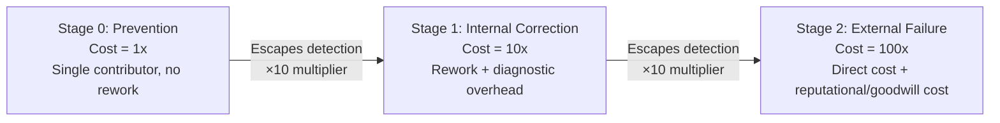

## Core Principle of Exponential Cost Escalation

### Definition

The core principle of exponential cost escalation is the mathematical and economic logic underlying the 1-10-100 Rule: the cost of correcting a quality defect does not increase linearly as it moves through successive stages of a process — it increases **multiplicatively**, roughly by an order of magnitude, at each stage the defect goes undetected. This distinguishes the rule from a simple additive cost model and is the source of its practical significance for prioritizing quality investment.

### Linear vs. Exponential Cost Models

**Key Points**

- A **linear cost model** would assume that a defect discovered later costs a fixed additional increment more than one discovered earlier (e.g., each stage adds a constant $X). Under this assumption, the difference between preventing a defect and fixing it after release would be modest and predictable.
- An **exponential (multiplicative) cost model** — the actual behavior the 1-10-100 Rule describes — assumes each stage multiplies the cost of the previous stage by a roughly constant factor (commonly approximated as 10x), producing a geometric progression rather than an arithmetic one.
- The distinction matters practically: under a linear model, the case for early investment in prevention is modest; under an exponential model, the case becomes overwhelming, because the cost of neglect compounds rather than merely accumulates.

### The Mathematical Structure

The general form of the escalation can be expressed as:

$$C_n = C_0 \times k^n$$

Where $C_0$ is the base cost of addressing a defect at the earliest stage (prevention), $k$ is the escalation multiplier (commonly approximated as 10), and $n$ is the number of stages the defect has progressed through undetected.

**Example**

Using the canonical three-stage framing with $C_0 = 1$ and $k = 10$:

$$C_0 = 1 \times 10^0 = 1$$

$$C_1 = 1 \times 10^1 = 10$$

$$C_2 = 1 \times 10^2 = 100$$

This produces the familiar $1, $10, $100 sequence. The critical insight is not the specific numbers but the **exponent** — each additional stage of delay does not add a fixed cost, it multiplies the existing cost.

### Why Costs Compound Rather Than Simply Accumulate

**Key Points**

- **Rework compounds on top of original work** — fixing a defect after it has been built upon (e.g., additional code written on top of a flawed component, or a business decision made using bad data) requires undoing and redoing not just the original error but everything built on top of it.
- **Detection cost rises with distance from origin** — the further a defect travels from its point of origin, the harder it becomes to trace its root cause, adding diagnostic overhead on top of the correction cost itself.
- **Stakeholder involvement multiplies** — a defect caught by a developer involves one person; a defect caught in QA involves a tester and a developer; a defect that reaches a customer can involve support staff, account managers, engineering, and potentially legal or PR functions — each additional stakeholder group adds coordination and communication overhead on top of the direct fix.
- **Indirect costs activate at later stages** — as covered in the External Failure Costs chapters of this curriculum, costs like reputational damage and lost customer goodwill are largely absent at the prevention and internal-correction stages but become active once a defect reaches the customer, contributing a qualitatively new category of cost rather than merely a larger version of the same cost.
- **Irreversibility increases with propagation** — an error caught before a decision is made based on it can simply be corrected; an error that has already influenced a business decision, a shipped product, or a public-facing incident cannot be fully undone, only mitigated, which is inherently more expensive than prevention.

### Visualizing the Escalation Curve

A simplified exponential growth curve (svg_diagram):

<svg xmlns="http://www.w3.org/2000/svg" viewBox="0 0 500 320">
<line x1="60" y1="270" x2="460" y2="270" stroke="currentColor" stroke-width="2" />
<line x1="60" y1="270" x2="60" y2="30" stroke="currentColor" stroke-width="2" />
<text x="260" y="305" text-anchor="middle" font-size="14">Stage of Detection (svg_diagram)</text>
<text x="20" y="150" text-anchor="middle" font-size="14" transform="rotate(-90 20 150)">Relative Cost</text>
<circle cx="100" cy="260" r="5" fill="currentColor" />
<text x="100" y="285" text-anchor="middle" font-size="12">Prevention (1x)</text>
<circle cx="260" cy="190" r="5" fill="currentColor" />
<text x="260" y="285" text-anchor="middle" font-size="12">Internal (10x)</text>
<circle cx="420" cy="50" r="5" fill="currentColor" />
<text x="420" y="285" text-anchor="middle" font-size="12">External (100x)</text>
<path d="M 100 260 Q 200 250 260 190 T 420 50" stroke="currentColor" stroke-width="2" fill="none" />
</svg>

### Why the Multiplier Is Approximate, Not Precise

**Key Points**

- The commonly cited 10x multiplier per stage is a **heuristic approximation** rather than a derived constant; actual cost ratios vary substantially by industry, defect type, and organizational context.
- [Inference] The precise multiplier at each stage is likely influenced by factors such as the complexity of the system involved, the degree of interdependency between components, and the maturity of the organization's diagnostic and rollback tooling — meaning a 10x approximation should be treated as directionally illustrative rather than as a figure to be applied literally in financial modeling without organization-specific validation.
- Some formulations of the rule use different or non-uniform multipliers between stages (for example, some sources describe a 1-10-100-1,000-10,000 extension across five stages rather than three), reflecting that real-world processes often have more than three meaningfully distinct detection points.
- The core principle that matters for decision-making is not the exact numeric ratio but the **qualitative shape** of the curve: cost escalation is convex and accelerating, not flat or linear, which is sufficient to justify prioritizing upstream investment even without precise multiplier data.

### Economic Implication: Diminishing Marginal Cost of Prevention Investment

**Key Points**

- Because failure costs escalate multiplicatively while prevention costs escalate only linearly (each additional unit of review or testing effort tends to cost roughly the same as the last, rather than compounding), the **marginal return on prevention investment increases** the further downstream the alternative failure cost would otherwise occur.
- This creates a strong economic argument, independent of any specific numeric multiplier, for weighting quality investment toward the earliest stages of a process: even a modest reduction in the probability of a defect reaching the external-failure stage yields an expected-cost reduction disproportionate to the prevention investment required.
- This principle directly underlies the "shift-left" philosophy referenced in the discussion of the rule's software development adaptation: moving detection and correction activities as early as possible is not merely a process preference but a direct consequence of the exponential cost structure.

### Relationship to the Cost of Quality Categories

The exponential escalation principle is the quantitative logic connecting the four PAF categories covered throughout this curriculum:

| PAF Category | Position on Escalation Curve | Relative Cost Characteristic |
| --- | --- | --- |
| Prevention | Stage 0 (pre-defect) | Lowest cost; linear scaling with effort |
| Appraisal | Stage 0–1 boundary | Low-to-moderate cost; detects before propagation |
| Internal Failure | Stage 1 | Moderate cost; rework plus diagnostic overhead |
| External Failure | Stage 2 | Highest cost; direct cost plus compounding indirect costs (reputational, goodwill) |

**Next Steps**

- Mathematical modeling of multi-stage defect escalation with non-uniform multipliers
- Marginal cost-benefit analysis for prevention investment decisions
- Industry-specific empirical validation of escalation multipliers
- Extending the escalation curve beyond three stages (five-stage and continuous models)
- Connecting exponential escalation to shift-left testing strategy design