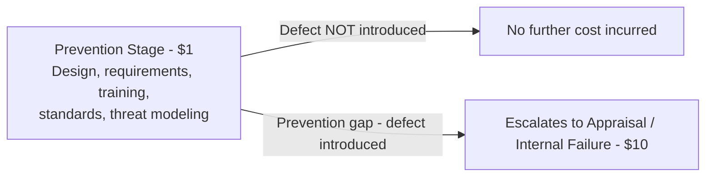

## The Prevention Stage and the $1 Cost

### Definition and Position in the Escalation Model

The Prevention Stage represents the earliest point at which quality can be influenced — before a defect is created — and corresponds to the baseline $1 unit in the 1-10-100 Rule's escalation model. As established in the preceding topic on exponential cost escalation, this stage is not merely "cheap" in absolute terms; it is the reference point against which the 10x and 100x multipliers of later stages are measured.

### What Constitutes the Prevention Stage

**Key Points**

- The Prevention Stage encompasses all activities undertaken **before** a defect is introduced into a product, process, or dataset — it is proactive by definition, not reactive.
- In the PAF (Prevention-Appraisal-Failure) cost model referenced throughout this curriculum, Prevention costs are explicitly the investments made to keep defects from occurring in the first place, distinct from Appraisal costs (finding defects that have already occurred) and Failure costs (fixing defects already found).
- The stage covers activities across the full lifecycle of planning and design — requirements gathering, architecture decisions, coding standards, training, and process design — rather than a single discrete step.

### Representative Prevention Activities in Software Development

| Activity | Purpose |
| --- | --- |
| Requirements review and clarification | Ensures the problem being solved is correctly understood before design begins |
| Design and architecture review | Catches structural flaws before implementation effort is invested |
| Coding standards and style guides | Reduces the likelihood of common error classes through consistent practice |
| Developer training (secure coding, domain knowledge) | Builds the underlying skill and awareness that prevents defects at the source |
| Static analysis tool configuration | Establishes automated guardrails that catch certain error classes as code is written |
| Pair programming | Introduces real-time review during code creation itself, prior to any formal review stage |
| Threat modeling and risk assessment | Identifies potential failure modes before they are built into the system |
| Process and workflow design | Establishes development practices (e.g., branching strategy, review requirements) that structurally reduce defect introduction |

### Why This Stage Anchors the Lowest Cost

**Key Points**

- **Single point of correction** — at the prevention stage, an error exists only as a decision, a requirement, or an unwritten line of code; correcting it means changing a plan or a design document, not undoing built work.
- **No downstream propagation** — because nothing has yet been built on top of the potential defect, there is nothing to unwind; the correction is isolated and self-contained.
- **Minimal stakeholder involvement** — as discussed in the exponential cost escalation topic, prevention-stage corrections typically involve the individual or small team doing the design/planning work, without requiring QA, support, or incident response involvement.
- **No indirect costs activated** — reputational damage and opportunity cost of lost customer goodwill (covered in the External Failure Costs chapters of this curriculum) are structurally impossible at this stage, since no external party has yet been exposed to anything.
- **Linear rather than compounding cost** — as established in the exponential cost escalation topic, prevention-stage costs scale roughly linearly with effort (an additional hour of design review costs about the same as the previous hour), rather than compounding the way failure costs do.

### The $1 as a Relative Baseline, Not a Literal Figure

**Key Points**

- The "$1" designation is illustrative shorthand for the **baseline unit cost**, not a literal dollar amount; in the mathematical formulation from the prior topic, it corresponds to $C_0$, against which later-stage costs are expressed as multiples.
- [Inference] The actual absolute cost of prevention activities varies enormously by context (a five-minute design clarification versus a multi-week architecture review), but what the 1-10-100 framing asserts is the *relative* relationship: whatever the prevention-stage cost is, correction after the fact will be a multiple of it, not a comparable or lesser amount.
- This relative framing is what makes the rule portable across domains — manufacturing, data quality, and software development (as covered in the origin and history topic) — despite vastly different absolute cost structures, because each domain's own baseline "$1" scales its own "$10" and "$100" accordingly.

### Illustrative Example

**Example**

A developer is writing a function that will validate user input for a civic records submission form. At the prevention stage, the choices available include:

- Spending 15 minutes reviewing the relevant validation requirements with a teammate before writing any code.
- Writing a short design comment clarifying edge cases (empty fields, malformed dates, special characters) before implementation.
- Configuring a static analysis rule that will flag unvalidated input patterns automatically.

Each of these actions is low-cost, isolated to the individual or pair involved, and requires no coordination beyond the immediate task. If skipped, the same missing validation logic might instead be discovered during QA testing (Appraisal/Internal Failure stage, $10-equivalent) or, worse, after a malformed submission causes a downstream data integrity issue in a live civic records system (External Failure stage, $100-equivalent, potentially compounding into the reputational and goodwill costs covered in earlier chapters).

### Prevention Stage Within the Escalation Flow

### Investment Characteristics of the Prevention Stage

**Key Points**

- **Fixed, budgetable cost** — unlike failure costs, which are inherently unpredictable (an organization cannot know in advance which defects will occur or how severe they will be), prevention costs are plannable line items: training budgets, review time allocations, tooling licenses.
- **Compounding return over the artifact's lifetime** — a prevention investment made once (e.g., establishing a coding standard) continues to reduce defect introduction across every subsequent use of that standard, unlike a one-time failure correction which addresses only the single instance found.
- **Underinvestment risk due to invisibility** — because successful prevention produces an *absence* of defects rather than a visible event, its value is harder to demonstrate to stakeholders than the visible cost of a failure, creating an organizational bias toward underinvesting in this stage despite its favorable cost profile. This connects to the interpretation bias and coverage bias pitfalls discussed in the Measuring and Reporting Quality Costs chapter — successful prevention activity is precisely the kind of cost that is easy to track, but its *avoided* downstream costs are structurally invisible without deliberate counterfactual estimation.

### Application to Civic/Government Software Development

For a project such as a Local Government Unit document management system, prevention-stage investment carries particular importance given the constraints discussed in earlier chapters of this curriculum:

- **Smaller teams amplify the value of prevention** — given the limited dedicated QA and support infrastructure typical of civic software projects (as noted in the cross-functional collaboration and data collection topics), catching issues at the design stage is disproportionately valuable when downstream appraisal capacity is limited.
- **Requirements clarity is especially high-leverage** — because civic software often encodes specific legal, procedural, or jurisdictional requirements (e.g., document retention rules, approval workflows specific to an LGU's processes), requirements-stage review that confirms correct understanding of these rules prevents defects that would otherwise only surface once real government records are processed incorrectly.
- **Training and documentation as force multipliers** — with smaller teams and potentially higher contributor turnover (e.g., student developers), investment in onboarding documentation and coding standards functions as prevention-stage cost that reduces the likelihood of defects introduced by contributors unfamiliar with the system's civic-specific constraints.

**Next Steps**

- The Appraisal Stage and the $10 Cost
- Techniques for cost-effective requirements and design review
- Building organizational buy-in for prevention investment despite its invisibility
- Coding standards and static analysis tooling as prevention mechanisms
- Training program design for reducing defect introduction in small development teams