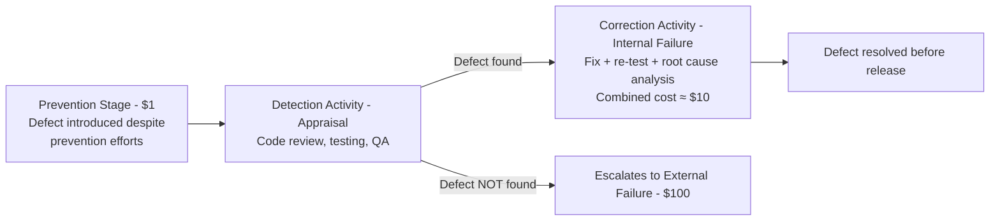

## The Correction and Detection Stage and the $10 Cost

### Definition and Position in the Escalation Model

The Correction and Detection Stage represents the second point on the 1-10-100 Rule's escalation curve, corresponding to the $10 unit cost. It occurs after a defect has already been introduced (the Prevention Stage has been bypassed or failed) but before that defect has reached an external customer or end user. This is the stage where the Appraisal cost category (from the PAF model referenced throughout this curriculum) does its work — actively searching for defects that already exist — and where any defects found generate Internal Failure costs to correct.

### Relationship to the Appraisal and Internal Failure Categories

**Key Points**

- This stage combines two PAF categories that operate together: **Appraisal** (the cost of the detection activity itself — testing, review, inspection) and **Internal Failure** (the cost of correcting whatever the appraisal activity finds).
- Unlike the Prevention Stage, which aims to avoid defects entirely, this stage assumes a defect already exists and focuses on two sequential tasks: finding it and fixing it before it escapes further.
- The $10 figure in the rule represents the **combined** cost of detection plus correction at this stage — not detection alone or correction alone — since in practice these two activities are inseparable components of the same escalation point.

### Representative Detection and Correction Activities in Software Development

| Activity | Category | Purpose |
| --- | --- | --- |
| Code review (pull request review) | Appraisal | Human inspection of code before merge |
| Automated unit and integration testing | Appraisal | Systematic, repeatable defect detection |
| Manual QA / exploratory testing | Appraisal | Human-driven exploration for edge cases automation misses |
| Static analysis and linting | Appraisal | Automated pattern-based defect detection |
| Bug fixing (defect found pre-release) | Internal Failure | Correcting an identified defect |
| Re-testing after a fix | Internal Failure | Verifying the correction and checking for regressions |
| Root cause analysis for internally caught defects | Internal Failure | Understanding why the defect occurred, to inform future prevention |

### Why This Stage Costs Roughly 10x the Prevention Stage

**Key Points**

- **Work has already been built on the defect** — unlike the Prevention Stage, where a flawed design exists only as a plan, at this stage the defect is embedded in actual code, data, or process artifacts, meaning correction requires undoing and redoing real work rather than adjusting an unbuilt plan.
- **Detection itself has a cost distinct from correction** — the defect does not announce itself; dedicated time and tooling (test execution, review effort, QA cycles) must be spent finding it before any fix can begin, adding a cost layer absent at the Prevention Stage.
- **Broader stakeholder involvement** — as discussed in the exponential cost escalation topic, this stage typically involves both the original developer and a reviewer or tester, plus potentially a second round of verification (re-testing), compared to the single-contributor nature of most prevention activities.
- **Diagnostic overhead** — determining the root cause of a defect discovered during QA or review often requires more investigative effort than the original design decision that introduced it, since the defect must be traced backward from its symptom to its source.
- **Still bounded, though** — critically, this stage's cost remains an order of magnitude *below* the External Failure stage precisely because no external party has yet been affected; no reputational damage, customer support burden, or opportunity cost of lost goodwill (covered in the External Failure Costs chapters) has been activated.

### Escalation Flow at This Stage

### Illustrative Example

**Example**

Returning to the civic records input validation scenario from the Prevention Stage topic: suppose the prevention-stage design review was skipped, and a developer writes the validation logic without clarifying edge cases. The missing validation is not caught before commit.

At the Correction and Detection Stage, the following sequence typically occurs:

1. A **code reviewer** examines the pull request and notices the validation logic does not handle a malformed date format (Appraisal — detection cost).
2. The reviewer requests changes, requiring the **original developer** to re-investigate the requirement, write the missing validation, and resubmit (Internal Failure — correction cost).
3. The **automated test suite** re-runs to confirm the fix and check for regressions elsewhere in the form-handling logic (Appraisal — verification cost).
4. If the fix introduces a secondary issue, a **second review cycle** may be required, further compounding the cost.

Compared to the Prevention Stage's 15-minute design clarification, this sequence involves at least two people, multiple work cycles, and re-verification effort — illustrating the roughly order-of-magnitude cost increase the rule describes, without yet involving any external party.

### Distinguishing This Stage from External Failure

**Key Points**

- The defining boundary of this stage is that **the defect has not yet reached an external customer or end user** — it remains entirely within the organization's internal development and QA processes.
- This is a meaningful distinction from the External Failure Stage (covered separately in this chapter) because none of the indirect, compounding costs discussed in the External Failure Costs chapters — reputational damage, opportunity cost of lost customer goodwill — are active here; the cost remains confined to internal labor and process overhead.
- [Inference] This boundary is also why organizations with mature QA/appraisal processes tend to show a cost profile concentrated in this $10-equivalent stage rather than the $100-equivalent stage, consistent with the quality maturity model discussed in the benchmarking topic of the Measuring and Reporting Quality Costs chapter — a higher proportion of total CoQ sitting in Internal Failure rather than External Failure is a directional signal of a more mature appraisal process, even before considering the absolute totals.

### Investment Characteristics of This Stage

**Key Points**

- **More variable cost than Prevention, but still bounded** — unlike Prevention costs, which are highly plannable, Correction and Detection costs vary depending on how many defects are actually found, making them harder to budget precisely, though still far more predictable than External Failure costs.
- **Diminishing returns on appraisal intensity** — while more testing and review generally catches more defects, each additional unit of appraisal effort (an additional review pass, an additional test suite) tends to catch progressively fewer new defects, meaning appraisal investment has its own internal optimization curve distinct from the escalation logic between stages.
- **Feedback value beyond the immediate fix** — root cause analysis performed at this stage, while itself a cost, generates information that can inform future Prevention Stage improvements (e.g., a coding standard addition, a new static analysis rule), meaning some of this stage's cost functions as an indirect investment in reducing future $1-stage gaps.

### Application to Civic/Government Software Development

For a project such as a Local Government Unit document management system, the Correction and Detection Stage carries specific considerations given the resource constraints discussed in earlier chapters of this curriculum:

- **Limited dedicated QA capacity increases reliance on code review and automated testing** — smaller civic software teams typically lack dedicated QA staff, making peer code review and CI-based automated testing (as discussed in the data collection methods topic) the primary appraisal mechanisms rather than a formal separate QA function.
- **Domain-specific defects require domain-aware reviewers** — because civic software encodes jurisdiction-specific rules (document retention requirements, approval workflows particular to the LGU's processes, as noted in the Prevention Stage topic), effective detection at this stage depends on reviewers who understand these civic-specific constraints, not just general software correctness.
- **Cost visibility supports the case for investment** — tracking this stage's cost explicitly (using the activity-based costing methods covered in the Measuring and Reporting Quality Costs chapter) helps make the argument, to resource-constrained project sponsors, that investment in review tooling or additional review capacity is justified by the alternative: defects escaping to the substantially more expensive External Failure stage, where they affect actual government record integrity or public-facing service reliability.

**Next Steps**

- The External Failure Stage and the $100 Cost
- Optimizing code review and automated testing coverage for resource-constrained teams
- Root cause analysis techniques and feeding findings back into Prevention Stage practices
- Balancing appraisal intensity against diminishing returns
- Domain-specific review checklists for civic/government software correctness