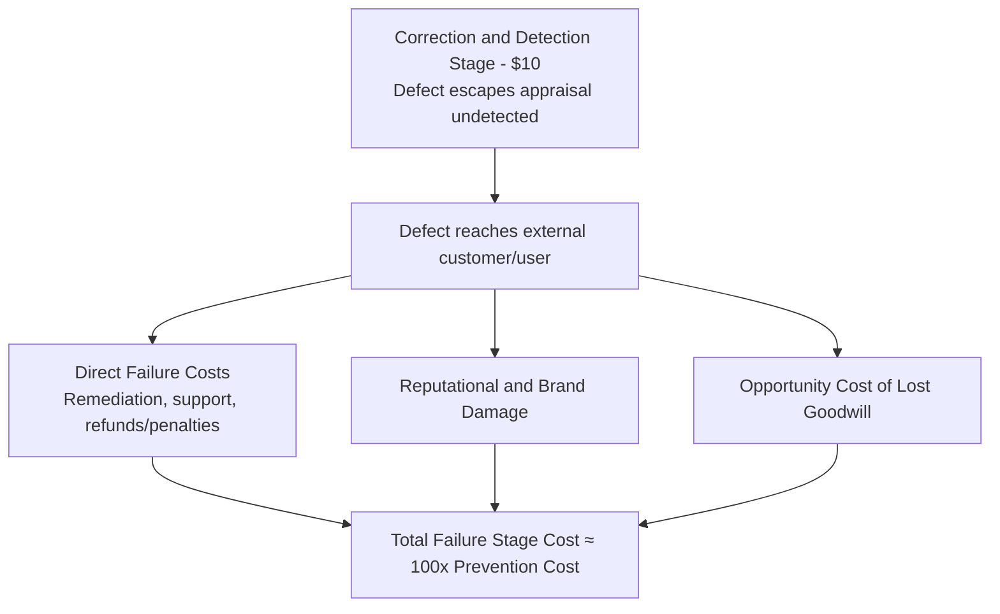

## The Failure Stage and the $100 Cost

### Definition and Position in the Escalation Model

The Failure Stage represents the terminal point on the 1-10-100 Rule's escalation curve, corresponding to the $100 unit cost. It occurs when a defect has escaped both the Prevention Stage and the Correction and Detection Stage and has reached an external customer, end user, or the public. This is the stage where the External Failure cost category (from the PAF model referenced throughout this curriculum) becomes active, and where the compounding indirect costs covered in earlier chapters — reputational and brand damage, opportunity cost of lost customer goodwill — are triggered alongside direct correction costs.

### Defining Characteristic: External Exposure

**Key Points**

- The single defining boundary that separates this stage from the Correction and Detection Stage is **external exposure** — the defect has left the organization's internal processes and been encountered by someone outside the development/QA function.
- This boundary is what activates an entirely different class of cost. At the two prior stages, cost was confined to internal labor and process overhead; at this stage, cost extends to categories that did not exist previously: customer support burden, refunds or SLA penalties, reputational damage, and lost future revenue.
- Because this stage is where the defect's consequences become visible to parties outside the organization's control, it is also the stage with the least cost predictability — the eventual total cost depends on factors (media attention, customer reaction, severity of impact) that are not fully within the organization's control, unlike the largely internal, plannable costs of the two earlier stages.

### Composition of the $100 Figure

**Key Points**

The Failure Stage cost is not a single expense but an aggregate of several distinct cost streams, most of which have been covered individually in earlier chapters of this curriculum:

| Cost Component | Description | Covered In |
| --- | --- | --- |
| Direct remediation | Emergency fix development, hotfix deployment, rollback | This stage |
| Customer support burden | Ticket handling, escalations, communication | This stage |
| Refunds, credits, SLA penalties | Direct financial compensation to affected customers | This stage |
| Incident response and root cause analysis | Cross-functional investigation of the failure | This stage |
| Reputational and brand damage | Erosion of public/customer trust, negative media/social coverage | External Failure Costs in Depth chapter |
| Opportunity cost of lost customer goodwill | Foregone renewals, expansions, and referrals | External Failure Costs in Depth chapter |
| Regulatory/compliance fallout | Audits, sanctions, disclosure obligations (context-dependent) | External Failure Costs in Depth chapter |

**Example**

A simplified aggregate view of the $100-stage cost, building on the earlier chapters' cost components:

$$\text{Total Failure Stage Cost} = \text{Direct Remediation} + \text{Support Burden} + \text{Refunds/Penalties} + \text{Reputational Cost} + \text{Lost Goodwill Cost}$$

This is precisely why the "100" in the rule's name should be understood as a **floor, not a ceiling** — the direct, easily-measured components (remediation, support, refunds) are often the smallest portion of total cost once the harder-to-measure reputational and goodwill components (covered in depth in the earlier External Failure Costs chapter) are included.

### Why This Stage Compounds Rather Than Simply Adding

**Key Points**

- **Irreversibility** — as discussed in the exponential cost escalation topic, a defect that has already influenced a customer's experience, a public record, or a business decision cannot be fully undone; the organization can only mitigate the consequences, which is inherently more expensive than prevention or internal correction.
- **Multiplying stakeholder involvement** — where the Correction and Detection Stage typically involves a developer and reviewer, the Failure Stage can involve customer support, incident response teams, product management, communications/PR, legal, and executive leadership simultaneously, each adding coordination overhead.
- **Indirect costs activate and compound** — as established in the Reputational and Brand Damage and Opportunity Cost of Lost Customer Goodwill topics, these costs are not merely additional line items but multipliers on the base failure cost: a single publicized incident can produce churn, reduced referrals, and reduced willingness to pay a premium, all stemming from one underlying defect.
- **Time horizon extends far beyond the incident itself** — unlike the Correction and Detection Stage, where cost is realized and closed within the development cycle, Failure Stage costs (particularly lost goodwill) can continue to accrue for months or years after the technical issue is resolved, as covered in the opportunity cost topic's discussion of delayed realization.

### Escalation Flow: Arrival at the Failure Stage

### Illustrative Example

**Example**

Continuing the civic records input validation scenario used in the two preceding topics: suppose the missing date validation logic also escaped code review and automated testing (the Correction and Detection Stage failed to catch it). A citizen submits a document request form with a malformed date, and the system either silently corrupts the submitted record or crashes during processing.

At the Failure Stage, the consequence chain might include:

1. **Direct remediation** — an emergency fix is developed and deployed outside the normal release cycle, often under time pressure that itself increases the risk of introducing a new defect.
2. **Support/administrative burden** — LGU office staff must field the citizen's complaint, and the development team must investigate which other submissions may have been affected by the same bug.
3. **Reputational exposure** — as discussed in the civic-context sections of the Reputational and Brand Damage topic, this kind of failure affects not just the vendor's reputation but public confidence in the LGU's digital services, potentially reported through local channels.
4. **Opportunity cost** — as discussed in the civic-context sections of the Opportunity Cost of Lost Customer Goodwill topic, affected departments or oversight bodies may become more hesitant to expand or advocate for the system, a cost that may not materialize until a future budget or contract renewal decision.

Compared to the Correction and Detection Stage's contained, internal cost, this sequence spans multiple stakeholder groups, extends over an uncertain time horizon, and includes cost components (reputational, opportunity cost) that have no analog at the earlier stages — illustrating why the escalation from $10 to $100 represents a qualitative shift, not merely a larger version of the same cost.

### Why Precise Measurement Is Hardest at This Stage

**Key Points**

- As established in the Pitfalls and Biases in Quality Cost Data topic, coverage bias is most severe at this stage: reputational damage and lost goodwill rely on proxy metrics and counterfactual modeling rather than direct measurement, meaning the true $100 figure is frequently understated in organizational reporting.
- Silent, unreported failures (discussed in the same topic) are also concentrated at this stage — a citizen or customer who quietly disengages without filing a complaint leaves no data trail, meaning the measured portion of Failure Stage cost may represent only a fraction of its true total.
- [Inference] Because of this systematic undercounting, organizations that rely solely on directly measured Failure Stage costs (support tickets, refunds) when making the business case for upstream prevention investment are likely understating the true return on that investment, reinforcing the case made in the Prevention Stage topic for treating prevention's value as, if anything, conservatively estimated by the 1-10-100 framing.

### Application to Civic/Government Software Development

For a project such as a Local Government Unit document management system, the Failure Stage carries distinctive characteristics established across earlier chapters of this curriculum:

- **No "customer churn" escape valve** — as discussed in the civic-context section of the Reputational and Brand Damage topic, citizens cannot switch providers, so Failure Stage costs manifest as political friction, complaints, and reduced public trust rather than lost sales, but remain real operational costs.
- **Audit and compliance exposure** — failures discovered during a public audit (e.g., by a national audit body, as noted in the reporting system design topic) compound Failure Stage cost with formal accountability consequences extending beyond the technical team.
- **Informal reporting channels obscure true scope** — as discussed in the cross-functional collaboration and pitfalls/biases topics, failures reported through phone calls or in-person visits to an LGU office rather than structured tickets make it especially likely that the measured Failure Stage cost undercounts the true total, reinforcing the case for the lightweight incident logging practices recommended in those earlier topics.

**Next Steps**

- Aggregate modeling of total Failure Stage cost including reputational and goodwill components
- Incident response process design to minimize Failure Stage cost once a defect has escaped
- Proxy metric estimation techniques for the harder-to-measure components of this stage
- Building the business case for Prevention Stage investment using Failure Stage cost data
- Cross-chapter synthesis: the full 1-10-100 escalation applied end-to-end in a single case study