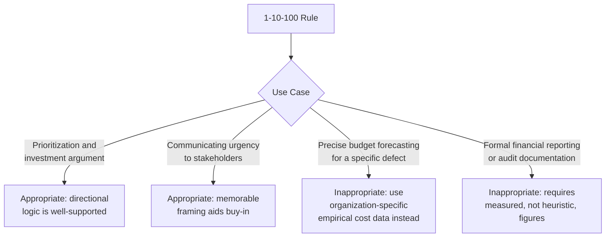

## Illustrative Heuristic versus Literal Cost Multiplier

### Definition and Purpose

This topic addresses a critical epistemic question that runs beneath every prior topic in this chapter: is the 1-10-100 Rule a precise, empirically derived cost formula, or is it a simplified mnemonic intended to convey a directional truth? The distinction matters enormously for how the rule should be used in practice — as a literal budgeting input versus as a qualitative decision-making aid.

### The Case for Treating It as an Illustrative Heuristic

**Key Points**

- As noted in the Origin and History topic, sources explicitly describe the rule as allowing organizations to "quickly guesstimate" or "quickly estimate" the impact of quality costs — language that signals approximation, not precision, from the rule's own popularizers.
- The rule is also explicitly described in that same literature as certainly not an exact measurement, but rather one that is easy to remember and keep in mind — an intentional trade-off of precision for memorability and actionability.
- As established in the Core Principle of Exponential Cost Escalation topic, the specific 10x multiplier is a heuristic approximation, with the qualitative shape of the curve (convex, accelerating) mattering more than the literal numeric ratio.
- The rule's successful generalization across manufacturing, data quality, and software development contexts (covered in the Origin and History topic) is itself evidence that it functions as a portable heuristic rather than a domain-specific empirical constant — the same "10x" cannot literally hold with equal precision across such different cost structures.

### The Case for Some Literal Grounding

**Key Points**

- The rule is not arbitrary; as discussed throughout this chapter's stage-by-stage topics, each escalation point corresponds to real, identifiable cost drivers — rework, diagnostic overhead, expanding stakeholder involvement, and (at the Failure Stage) entirely new cost categories like reputational damage and lost goodwill.
- Organizations that apply activity-based costing (covered in the Measuring and Reporting Quality Costs chapter) to their own defect data can, and do, derive empirically grounded multipliers specific to their own context — meaning the rule's underlying logic is testable and has been validated directionally, even where the specific "10" is not universal.
- [Inference] The persistence of a roughly order-of-magnitude relationship across multiple independent industries and studies suggests the underlying phenomenon — that cost escalates substantially, and specifically in a multiplicative rather than additive fashion, with detection delay — is a real and recurring pattern, even if the precise multiplier is context-dependent rather than a universal constant.

### Resolving the Tension: A Directional Truth Wrapped in a Precise-Sounding Package

**Key Points**

- The apparent contradiction resolves once the rule's two components are separated: the **qualitative claim** (cost escalation is multiplicative and accelerating, not linear) is robust and well-supported across domains and evidence sources; the **quantitative claim** (specifically 10x per stage) is an illustrative approximation whose precision varies by context.
- This mirrors a common pattern in management heuristics generally: memorable, round-number framings (1-10-100, the 80/20 rule, and similar) tend to overstate their own numeric precision in service of being memorable and actionable, while still capturing a genuine underlying pattern.
- The practical implication is that the rule should be trusted for **prioritization decisions** (where should we invest, prevention or failure remediation?) far more than for **precise financial forecasting** (exactly how much will this specific defect cost if it escapes to production?).

### A Framework for Appropriate Use

**Key Points**

- **Appropriate uses**: motivating investment in Prevention and Appraisal stages (as discussed in those respective topics); communicating the urgency of early defect detection to non-technical stakeholders; providing a first-pass mental model for new team members encountering the Cost of Quality framework for the first time.
- **Inappropriate uses**: calculating the exact expected cost of a specific defect for a budget line item; substituting for the activity-based costing and empirical benchmarking methods covered in the Measuring and Reporting Quality Costs chapter when precise figures are required; presenting the "10x" or "100x" figures in formal financial or audit documentation without organization-specific validation.

### Risks of Over-Literal Application

**Key Points**

- **False precision undermines credibility** — presenting "$100" as a literal, defensible cost figure to skeptical stakeholders (e.g., a finance team or auditor) invites scrutiny the heuristic cannot withstand, potentially discrediting the broader (and valid) argument for prevention investment.
- **Masking genuine variation** — treating the multiplier as fixed obscures real differences in escalation severity across defect types; a minor cosmetic bug and a data-corruption bug both "escaping to production" do not carry remotely similar costs, even though both would nominally fall into the same "$100" bucket under a literal reading.
- **Complacency about measurement** — an organization that treats the 1-10-100 figures as already-known facts has less incentive to invest in the actual quality cost data collection and reporting infrastructure covered earlier in this curriculum, potentially forgoing the more accurate, organization-specific insight that measurement would provide.
- This connects directly to the Pitfalls and Biases in Quality Cost Data topic's discussion of interpretation bias: treating a heuristic as though it were measured data is itself a form of the false-precision error that topic warned against.

### Risks of Over-Dismissing the Heuristic

**Key Points**

- Conversely, dismissing the rule entirely as "just a saying" risks discarding a genuinely useful and empirically-grounded directional insight, particularly for organizations without existing CoQ measurement infrastructure who need a starting mental model before they can build one.
- [Speculation] Teams newly introduced to Cost of Quality concepts may find that an overly skeptical framing of the rule ("it's not real data, ignore it") removes a useful on-ramp to engaging with quality economics at all, before more rigorous organization-specific data collection (as covered in the Measuring and Reporting Quality Costs chapter) can be established.
- The appropriate stance is calibrated: treat the rule as a **starting hypothesis** worth taking seriously enough to motivate investment and measurement, while remaining ready to replace its generic multiplier with organization-specific figures once real data becomes available.

### Practical Guidance for Applying the Rule Correctly

**Key Points**

1. **Use the rule to open the conversation, not close it** — invoke it to justify why prevention investment deserves consideration, then transition to organization-specific data (via the activity-based costing and reporting methods from earlier chapters) to determine actual investment levels.
2. **Replace generic multipliers with measured ones as data accumulates** — once an organization has tracked its own PAF category costs over several periods (as discussed in the reporting system design topic), its own empirically derived escalation ratio should supersede the generic "10x" heuristic in internal decision-making.
3. **Preserve the heuristic for external/non-technical communication** — even after an organization has its own precise figures, the simple 1-10-100 framing often remains the more effective tool for communicating urgency to stakeholders unfamiliar with the underlying data, as discussed in the reporting system's guidance on audience-appropriate reporting formats.
4. **Explicitly flag when citing the generic figure versus measured data** — consistent with the epistemic labeling practice used throughout this curriculum, communications should distinguish between "the 1-10-100 rule suggests..." (heuristic) and "our data shows..." (measured), avoiding the false-precision risk described above.

### Application to Civic/Government Software Development

For a project such as a Local Government Unit document management system, this distinction carries specific practical weight given the resource constraints discussed throughout this curriculum:

- **The heuristic is likely to be the primary available tool early on** — given the smaller-scale, less-instrumented environment typical of civic software projects (as noted in the Measuring and Reporting Quality Costs chapter), the generic 1-10-100 framing may be the most readily available argument for prevention investment before sufficient organization-specific data has been collected.
- **Caution is warranted when presenting figures to oversight bodies** — given the audit-readiness and accountability considerations discussed in the reporting system design topic, presenting the literal "$100" figure to a council or audit body without appropriate caveats risks the credibility problem described above; framing the rule's directional logic explicitly as a heuristic, while citing the project's own incident data where available, is the more defensible approach.
- **Growing into measured figures over the project lifecycle** — as the lightweight incident logging and cross-functional data gathering practices discussed in earlier chapters mature, the project can progressively shift from relying on the generic heuristic toward citing its own historical cost patterns, consistent with the practical guidance outlined above.

**Next Steps**

- Deriving organization-specific escalation multipliers from historical defect cost data
- Communicating quality economics to non-technical stakeholders and oversight bodies
- Common misapplications and misconceptions of the 1-10-100 Rule in practice
- Comparative analysis: 1-10-100 Rule alongside other management heuristics (80/20 rule, and similar)
- Transitioning a project from heuristic-based to data-driven quality cost decision-making