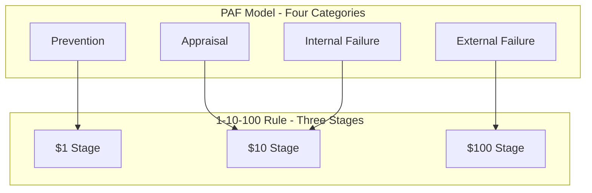

## Relationship Between the 1-10-100 Rule and the PAF Model

### Definition and Purpose

The PAF model (Prevention-Appraisal-Failure) is the foundational categorization framework of the Cost of Quality (CoQ) discipline, dividing all quality-related costs into four categories: Prevention, Appraisal, Internal Failure, and External Failure. The 1-10-100 Rule is a simplified, three-stage escalation heuristic layered on top of this same underlying phenomenon. This topic makes explicit the mapping between the two frameworks — one comprehensive and categorical, the other compressed and illustrative — and clarifies how they function together rather than as competing models.

### The Core Structural Mapping

**Key Points**

- The PAF model's four categories collapse into the 1-10-100 Rule's three stages as follows: **Prevention** maps directly to the $1 stage; **Appraisal** and **Internal Failure** together map to the $10 stage; **External Failure** maps to the $100 stage.
- This is not a coincidental resemblance — the 1-10-100 Rule can be understood as a numeric shorthand for the same cost categories the PAF model defines in greater analytical detail, compressed into a memorable escalation narrative.
- The compression that occurs at the $10 stage (combining Appraisal and Internal Failure into a single number) is the most significant structural simplification the rule makes relative to the PAF model, as detailed further below.

| PAF Category | 1-10-100 Stage | Chapter Reference |
| --- | --- | --- |
| Prevention | $1 | The Prevention Stage and the $1 Cost |
| Appraisal | $10 (detection component) | The Correction and Detection Stage and the $10 Cost |
| Internal Failure | $10 (correction component) | The Correction and Detection Stage and the $10 Cost |
| External Failure | $100 | The Failure Stage and the $100 Cost |

### Why Appraisal and Internal Failure Are Merged in the Rule

**Key Points**

- The PAF model treats Appraisal (the cost of *looking for* defects — testing, review, inspection) and Internal Failure (the cost of *fixing* defects once found) as analytically distinct categories, because they represent different activities with different cost drivers and different optimization levers.
- As established in the Correction and Detection Stage topic, the 1-10-100 Rule's $10 figure represents the *combined* cost of both detection and correction activity at this stage, treating them as a single escalation point rather than two separate ones.
- This merging is a deliberate simplification for memorability, consistent with the broader distinction covered in the Illustrative Heuristic versus Literal Cost Multiplier topic: the rule optimizes for a memorable three-stage narrative over the PAF model's more granular four-category analytical precision.
- [Inference] This merging means that an organization using the 1-10-100 Rule alone, without also applying the PAF model's finer categorization, would be unable to distinguish whether its $10-stage costs are driven more by expensive detection processes (e.g., extensive manual QA) or by expensive correction processes (e.g., frequent, costly rework) — a distinction that matters significantly for deciding where to target process improvement.

### Why External Failure Maps Cleanly to a Single Stage

**Key Points**

- Unlike the $10 stage's merger of two PAF categories, the $100 stage maps to External Failure without any equivalent compression, because External Failure is already, within the PAF model, a single unified category encompassing all costs arising once a defect reaches an external party.
- This clean mapping is part of why the Failure Stage topic could directly incorporate the detailed External Failure cost components — reputational and brand damage, opportunity cost of lost customer goodwill — covered in the earlier External Failure Costs in Depth chapter, without needing to reconcile any additional categorical split.

### Structural Diagram: PAF Model Compressed into 1-10-100

### Complementary Roles: Analytical Depth versus Communicative Simplicity

**Key Points**

- The PAF model serves the **analytical and measurement** function within the Cost of Quality discipline — it is the categorization scheme underlying the data collection methods, activity-based costing, and reporting systems covered in the Measuring and Reporting Quality Costs chapter of this curriculum.
- The 1-10-100 Rule serves the **communicative and motivational** function — it compresses the PAF model's output into a narrative simple enough to justify investment decisions to stakeholders unfamiliar with formal quality cost accounting, as discussed in the reporting system design topic's treatment of audience-appropriate formats.
- Neither model supersedes the other; they operate at different levels of the same overall CoQ practice. An organization's underlying cost tracking infrastructure should be built on the PAF model's four-category granularity (to support the activity-based costing and cross-functional data gathering practices covered earlier), while the 1-10-100 Rule remains available as a simplified narrative layer for communicating that data's implications.

### Practical Implications of Using Both Models Together

**Key Points**

- **Internal tracking and reporting**: use the full PAF categorization, consistent with the CoQ Summary Table and category mix ratio metrics covered in the Designing a Quality Cost Reporting System topic, to preserve the analytical granularity needed for process improvement decisions.
- **External and executive communication**: use the 1-10-100 framing to convey urgency and justify investment, consistent with the reporting cadence guidance from the same topic distinguishing engineering-level detail from executive-level summaries.
- **Diagnosing which PAF category drives a given 1-10-100 stage's cost**: when the $10 stage shows elevated cost, disaggregate back into its PAF components (Appraisal versus Internal Failure) to determine whether the issue is detection capacity (insufficient testing/review) or correction efficiency (high rework cost per defect) — a diagnostic step the compressed rule alone cannot perform.
- **Benchmarking**: the category mix ratio and Prevention/Appraisal-to-Failure ratio metrics discussed in the Benchmarking Quality Costs Across Industries topic are themselves PAF-model-based refinements of the same underlying logic the 1-10-100 Rule expresses more simply — both are measuring the same directional phenomenon at different levels of granularity.

### A Worked Reconciliation Example

**Example**

Using the activity-based costing example from the Activity Based Costing Applied to Quality topic (Prevention: $1,700; Appraisal: $5,950; Internal Failure: $2,550; External Failure: $3,400), the same data expressed in 1-10-100 terms would be:

$$\text{\$1 Stage (Prevention)} = 1700$$

$$\text{\$10 Stage (Appraisal + Internal Failure)} = 5950 + 2550 = 8500$$

$$\text{\$100 Stage (External Failure)} = 3400$$

Notably, in this particular dataset the ratio between stages does **not** literally approximate 1:10:100 (it is closer to roughly 1:5:2) — a useful illustration of the Illustrative Heuristic versus Literal Cost Multiplier topic's core point: the rule's qualitative direction (cost exists at every stage, and failure costs carry compounding indirect components not present at earlier stages) remains instructive even when the literal ratio in real data diverges substantially from the named figures.

### Application to Civic/Government Software Development

For a project such as a Local Government Unit document management system, the relationship between these two models has practical implications consistent with earlier chapters:

- **Internal data collection should use PAF granularity** — as discussed in the Cross Functional Collaboration and Methods for Collecting Quality Cost Data topics, even a lightweight civic software tracking practice benefits from distinguishing Appraisal from Internal Failure activity, since this distinction clarifies whether limited review/testing capacity or high rework cost is the more pressing constraint.
- **Stakeholder communication should use the compressed rule** — as discussed in the civic-context section of the Illustrative Heuristic versus Literal Cost Multiplier topic, presenting the simple 1-10-100 narrative to an LGU sponsor or council is likely more persuasive and accessible than presenting the full four-category PAF breakdown, reserving the detailed categorization for internal engineering use.
- **Both models reinforce the same investment case** — whether framed through the PAF model's Prevention/Appraisal-to-Failure ratio (from the Benchmarking topic) or the simpler 1-10-100 narrative, the underlying argument for prioritizing upstream investment in a resource-constrained civic software project remains consistent across both framings.

**Next Steps**

- Disaggregating 1-10-100 stage costs back into PAF categories for root-cause diagnosis
- Building dual-format reporting: PAF-based internal dashboards paired with 1-10-100 executive summaries
- Historical case studies where measured PAF data diverged significantly from the 1:10:100 ratio
- Extending the PAF-to-rule mapping to five-stage or continuous escalation models
- Chapter synthesis: applying the full 1-10-100 framework to a complete civic software defect lifecycle