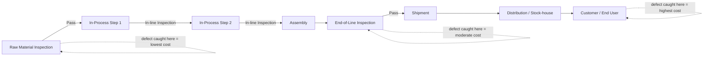

## Defect Detection Timing Along the Production Line

### Definition and Purpose

Defect detection timing along the production line refers to the specific points within a manufacturing process at which quality inspection occurs, and the direct relationship between the position of that inspection point and the cost of any defect it uncovers. This topic grounds the 1-10-100 Rule's escalation logic — established abstractly in the preceding chapter — in the concrete, physical stages of a manufacturing production line, where the rule's manufacturing origins (covered in the Origin and History of the 1-10-100 Rule topic) are most directly visible.

### The Physical Stages of a Production Line and Their Detection Points

**Key Points**

- **Raw material inspection** — occurs before any processing begins; defective or out-of-specification raw materials are identified and rejected before value is added to them.
- **In-process inspection (in-line/on-line inspection)** — occurs at intermediate points during fabrication, assembly, or processing, catching defects introduced by a specific process step before subsequent steps compound them.
- **End-of-line inspection (final inspection)** — occurs after the product is fully assembled but before it leaves the production facility, catching defects that escaped all prior in-process checks.
- **Post-shipment / field detection** — occurs after the product has left the facility, whether at a distribution point, retailer, or the end customer, and corresponds to the Failure Stage covered in the preceding chapter.

### Mapping Detection Points to the 1-10-100 Escalation

**Key Points**

- Detecting a quality problem during raw materials inspection costs less than detecting a quality problem when the product arrives at the customer's site, illustrating that the rule's escalation applies not just abstractly but to the literal physical distance and processing investment a defective unit has accumulated.
- The stage 1 framing of the rule corresponds to a defect detected during production, where corrective actions such as changes in process parameters, changes in operating procedures, changes in inspection and testing practices, or adjustments in the quality of input materials can be taken at relatively low cost.
- The stage 10 framing corresponds to a defective product that is not noticed at the place of production and is dispatched from the plant, with the defect instead noticed further along the supply chain, such as in a stock-house — at this point, the costs involved in product rejection, downgrading, or rectification are substantially higher than at stage 1.
- The stage 100 framing corresponds to a defective product reaching the customer or end user, who is then dissatisfied with the product — the terminal, highest-cost point on the escalation curve, paralleling the Failure Stage topic from the preceding chapter.

### Why Timing Along the Line Drives Cost So Directly

**Key Points**

- **Accumulated value-added cost** — each processing step adds labor, materials, and machine time to a unit; a defect caught before a step is applied costs only the correction itself, while a defect caught after several subsequent steps have been applied requires either reworking or scrapping all of that accumulated value, not just the original flaw.
- **Batch exposure risk** — a defect detected late in a production run may indicate that an entire batch or lot produced under the same conditions is affected, meaning detection timing determines not just the cost of a single unit's correction but the scope of units potentially requiring the same correction.
- **Traceability degradation over time and distance** — as a defective unit moves further from its point of origin (through subsequent production steps, into inventory, through distribution), identifying the specific root cause becomes progressively harder, adding diagnostic cost on top of correction cost — directly paralleling the diagnostic overhead discussed in the Core Principle of Exponential Cost Escalation topic.
- **Logistics and recall costs scale with distance traveled** — a defect caught at end-of-line inspection requires only internal handling to correct; a defect caught after shipment can require reverse logistics, recall coordination, and redistribution, adding an entirely new cost category absent at earlier detection points.

### Production Line Detection Timeline

### Detection Point Comparison Table

| Detection Point | Value Already Added | Typical Corrective Action | Relative Cost |
| --- | --- | --- | --- |
| Raw material inspection | None | Reject/return material before processing | Lowest |
| In-process inspection | Partial (one or more process steps) | Adjust process parameters, rework in-progress unit | Low-moderate |
| End-of-line inspection | Full (all processing complete) | Rework, scrap, or downgrade finished unit | Moderate |
| Post-shipment/field detection | Full plus logistics/distribution | Recall, field repair, replacement, customer compensation | Highest |

### Process Adjustments Enabled by Early Detection

**Key Points**

- When a defect is caught during production, corrective actions available include changes in the process parameters, changes in the operating procedures, changes in the inspection and testing practices, or adjustments in the quality of the input materials — all of which are systemic improvements that prevent recurrence, not just corrections to the single defective unit.
- This connects directly to the Prevention Stage topic's discussion of root cause analysis feeding back into future prevention: early-line detection is uniquely positioned to generate actionable process-level feedback because the defect's context (which machine, which operator, which material batch) is still immediately available and has not been obscured by subsequent handling.
- By contrast, defects caught only at post-shipment stages often arrive with degraded diagnostic context (the specific production conditions may no longer be reconstructable), making the correction more likely to address only the immediate symptom rather than the systemic cause.

### Designing Inspection Point Placement

**Key Points**

- **Cost-of-inspection versus cost-of-escape tradeoff** — adding inspection points increases Appraisal cost (as covered in the PAF model relationship topic) but reduces the probability and cost of defects escaping to later, more expensive stages; optimal placement balances these two costs rather than maximizing either.
- **Placement after high-risk process steps** — inspection points are typically most valuable immediately following process steps with historically higher defect introduction rates, since this maximizes the probability of catching a defect before further value is added on top of it.
- **Statistical process control (SPC) as continuous in-line detection** — rather than discrete inspection points alone, many production lines employ continuous monitoring of process parameters (as opposed to only inspecting finished units), catching process drift before it produces defective units at all — functioning closer to the Prevention Stage than the Appraisal/Correction stage, since it can intervene before a defect is even created.
- [Inference] Because inspection point placement involves this cost tradeoff rather than a simple "more inspection is always better" rule, organizations likely benefit from periodically re-evaluating inspection placement against actual defect escape data (an application of the activity-based costing and benchmarking practices covered in the earlier chapter) rather than treating initial placement decisions as permanent.

### Relationship to Software Development's Shift-Left Principle

**Key Points**

- The manufacturing concept of moving inspection points earlier along the production line is the direct conceptual ancestor of the "shift-left" testing philosophy referenced in the Origin and History topic's discussion of software development adaptation — both share the same underlying logic that detection timing, not just detection thoroughness, drives cost.
- Where a manufacturing line has physically sequential stages (raw material, in-process, end-of-line, shipped), a software development pipeline has analogous sequential stages (design, code review, automated testing, staging/UAT, production) — the timing principle transfers directly even though the physical/digital contexts differ substantially.

### Application to Civic/Government Software Development

<syllabot_broad_topic/>

While a document management system does not have a physical production line, the underlying timing principle transfers directly to its development pipeline:

- **"Raw material inspection" equivalent** — validating requirements and input specifications before development begins, analogous to rejecting defective raw materials before processing, as discussed in the Prevention Stage topic.
- **"In-process inspection" equivalent** — code review and continuous integration checks performed as features are built, analogous to in-line inspection catching defects introduced by a specific process step before subsequent work compounds them.
- **"End-of-line inspection" equivalent** — staging/UAT testing performed on a complete feature or release before deployment, analogous to end-of-line inspection catching defects that escaped all prior in-process checks.
- **"Post-shipment" equivalent** — production incidents affecting live LGU users, analogous to field detection, carrying the compounding reputational and goodwill costs discussed in the Failure Stage topic.
- [Inference] Given the resource constraints discussed throughout this curriculum for civic software teams, prioritizing the equivalent of "in-process inspection" (code review, CI checks) over exhaustive "end-of-line" staging testing alone is likely a more cost-effective allocation of limited appraisal capacity, since it catches defects before they compound across multiple subsequent development steps, consistent with the value-added-cost logic described above for physical production lines.

**Next Steps**

- Statistical Process Control (SPC) methods for continuous defect prevention
- Inspection point placement optimization using historical defect escape data
- Recall and field-repair cost structures in manufacturing supply chains
- Applying production-line detection timing principles to software CI/CD pipeline design
- Batch/lot traceability systems and their role in limiting defect escape scope