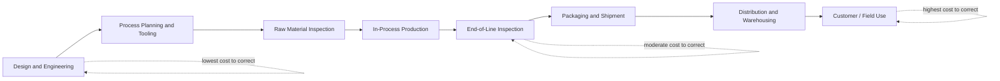

## Cost Escalation from Design Through Shipment

### Definition and Purpose

Cost escalation from design through shipment traces the 1-10-100 Rule's cost progression across the *full* manufacturing lifecycle — extending backward from the production-line stages covered in the preceding topic to include the pre-production design phase, and forward to the shipment and distribution stages. Where the previous topic focused on detection timing *within* the physical production line, this topic maps the escalation curve across the complete value chain, from the earliest design decisions to the point a product leaves the manufacturer's control.

### The Full Lifecycle Stages

**Key Points**

- **Design and engineering** — the earliest stage, where product specifications, tolerances, material choices, and manufacturing processes are defined before any physical production occurs.
- **Process planning and tooling** — translating the design into manufacturable instructions, including tooling design, fixture creation, and process parameter definition.
- **Production (raw material through in-process)** — the physical fabrication and assembly stages covered in detail in the preceding topic on detection timing along the production line.
- **End-of-line and final inspection** — the last internal checkpoint before a product is released for shipment, also covered in the preceding topic.
- **Packaging and shipment** — preparing and dispatching the product, after which it passes outside the manufacturer's direct physical control.
- **Distribution and warehousing** — the product moves through intermediate points (distribution centers, stock-houses, retailers) before reaching the end customer.
- **Customer use / field** — the terminal stage, corresponding to the Failure Stage covered in the preceding chapter.

### Why Design Sits at the True Origin of the Cost Curve

**Key Points**

- A defect is frequently not introduced during physical production at all, but rather is *designed in* — an incorrect tolerance specification, an unsuitable material choice, or a manufacturability oversight made during the design stage will reliably produce defective output regardless of how well the subsequent production process executes.
- Correcting a design flaw before tooling and process planning begin costs only the engineering effort to revise the specification — no tooling, no material, and no labor investment has yet been committed.
- Correcting the same flaw after tooling has been built and production has begun requires not only redesigning but also retooling, re-validating the process, and potentially reworking or scrapping units already produced — illustrating that the true $1 point of the escalation curve sits even earlier than the production-line entry point discussed in the preceding topic.
- [Inference] Because design decisions constrain everything downstream, a disproportionate share of a product's eventual quality cost is likely determined at the design stage even though the *visible* cost of failure typically manifests much later — meaning design-stage review deserves outsized attention relative to its own modest direct cost, consistent with the Prevention Stage topic's broader argument about prevention's favorable cost profile.

### Full Lifecycle Escalation Diagram

### Cost Drivers Added at Each Transition Point

| Transition | New Cost Driver Introduced |
| --- | --- |
| Design → Process Planning | Tooling investment becomes committed; design changes now require retooling |
| Process Planning → Production | Material and labor investment begins accumulating per unit |
| Production → Shipment | Units leave direct manufacturer control; correction now requires retrieval |
| Shipment → Distribution | Logistics and handling costs layer on top of correction cost; multiple units in transit may be affected |
| Distribution → Customer Use | Reputational and goodwill costs activate (as covered in the External Failure Costs in Depth chapter); recall/field-service costs apply |

### Worked Example Across the Full Lifecycle

**Example**

Consider a defect stemming from an incorrect material tolerance specification:

- **At Design**: correcting the tolerance specification before tooling begins costs only engineering review time — comparable to the $1 stage.
- **At Process Planning**: if caught after tooling has been designed but before production begins, correction requires tooling rework in addition to the specification change — already more costly than the design-stage correction, though still contained.
- **At Production (in-process)**: if the flawed tolerance causes visible defects during fabrication, correction requires scrapping or reworking in-progress units in addition to the tooling and specification fixes — approaching the $10 stage described in the preceding topic.
- **At Shipment/Distribution**: if the defect escapes end-of-line inspection and is only discovered after units have shipped, correction now requires a recall or field retrofit across potentially many units already distributed — approaching or exceeding the $100 stage, consistent with the Failure Stage topic's description of logistics and reputational costs compounding at this point.

This sequence illustrates that the escalation is continuous across the full lifecycle, not confined only to the production-floor stages covered in the preceding topic — each transition point from design onward adds its own cost layer.

### Design for Manufacturability (DFM) as an Escalation-Curve Intervention

**Key Points**

- Design for Manufacturability is a design-stage discipline explicitly aimed at catching manufacturability problems — tolerances that are difficult to achieve reliably, material choices poorly suited to the intended process, assembly sequences prone to error — before they are locked in through tooling and process planning.
- DFM functions as a structural implementation of the Prevention Stage principle from the preceding chapter: it moves detection of an entire class of potential defects to the earliest possible point on the full lifecycle curve, before any of the downstream cost layers described above can accumulate.
- This mirrors the shift-left principle referenced in the preceding topic's discussion of software development: just as shift-left testing moves defect detection earlier in a software pipeline, DFM moves defect *prevention* earlier in a manufacturing lifecycle, addressing the design stage specifically rather than only the production stages.

### Cross-Functional Coordination Requirements

**Key Points**

- Because design decisions determine so much of the downstream cost trajectory, minimizing lifecycle-wide cost escalation requires coordination between design engineering, manufacturing/process engineering, and quality functions from the earliest stage — a manufacturing-context parallel to the cross-functional collaboration principles covered in the Measuring and Reporting Quality Costs chapter.
- Design decisions made without manufacturing input risk specifying tolerances or features that are difficult or costly to produce reliably, even if the design itself is otherwise sound — meaning the design stage's low cost of correction is only realized in practice if manufacturability concerns are actually surfaced at that stage, not merely theoretically possible to surface.

### Application to Civic/Government Software Development

For a project such as a Local Government Unit document management system, the "design through shipment" lifecycle maps onto the software development lifecycle in a way that extends the mapping introduced in the preceding topic's civic-context section:

- **"Design and engineering" equivalent** — architectural decisions made before any feature-specific requirements work begins, such as the overall data model or workflow engine design underlying the document management system; a flaw at this level (e.g., a data model that cannot represent a legally required approval sequence) is analogous to a design-stage manufacturing flaw, correctable cheaply only if caught before dependent features are built on top of it.
- **"Process planning and tooling" equivalent** — establishing the development team's tooling, CI/CD pipeline, and coding conventions before feature work begins; changing these after significant code has been written against them carries a cost premium analogous to retooling after production has started.
- **"Distribution and warehousing" equivalent** — the period between a release being deployed and being actively used across all relevant LGU offices; a defect discovered during this rollout window, before full adoption, may still be correctable with lower exposure than one discovered after the system is fully relied upon.
- [Inference] Given the outsized influence of early architectural decisions on downstream cost described above, civic software teams operating with limited resources likely benefit disproportionately from investing review effort in foundational data model and workflow design decisions early in the batac-dms-type project lifecycle, even at the expense of somewhat lighter review on individual feature implementations later, since the former constrains the cost profile of everything built afterward.

**Next Steps**

- Design for Manufacturability (DFM) principles and checklists
- Cross-functional design review processes bridging engineering, manufacturing, and quality
- Recall logistics and field-service cost structures in distributed supply chains
- Applying full-lifecycle cost escalation thinking to software architecture decisions
- Case study: tracing a single defect's cost trajectory from design through customer use