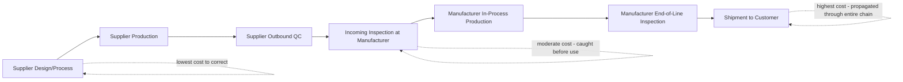

## Supplier Level Defect Prevention

### Definition and Purpose

Supplier level defect prevention extends the 1-10-100 Rule's escalation logic upstream of the manufacturer's own facility, to the raw materials, components, and subassemblies provided by external suppliers. As established in the preceding topic's full-lifecycle mapping, the true origin of the cost curve often sits even earlier than a manufacturer's own design stage — a defective input from a supplier, if undetected, propagates through every subsequent stage of the manufacturer's own process, compounding the escalation before the manufacturer's internal prevention efforts even have a chance to act.

### Why Supplier-Level Prevention Extends the Escalation Curve Backward

**Key Points**

- If a defective raw material or component enters a manufacturer's production line, the manufacturer's own raw material inspection (the earliest internal detection point covered in the Defect Detection Timing topic) becomes the *latest* possible point at which the defect could have been caught relative to its true origin at the supplier.
- A defect originating at a supplier that escapes the manufacturer's raw material inspection inherits the full internal escalation curve on top of whatever cost the supplier itself would have incurred to prevent it — meaning supplier-originated defects can, in aggregate, be more costly than internally originated ones of equivalent severity, since they start the clock earlier in the value chain.
- This logic extends the design-through-shipment lifecycle mapping from the preceding topic one step further upstream: just as a design flaw is cheaper to correct than a production-stage flaw, a supplier-stage flaw is cheaper to correct at the supplier than after it has been incorporated into the manufacturer's own product.

### The Extended Multi-Tier Escalation Curve

**Key Points**

- Each additional tier a defect travels through before detection adds its own multiplicative cost layer, consistent with the exponential rather than additive escalation principle established earlier in this curriculum — a supplier defect caught at the supplier's own outbound QC is analogous to that supplier's own $1-to-$10 boundary, while the same defect caught only after the manufacturer has built it into a finished, shipped product has effectively passed through two full escalation curves stacked on top of each other.
- This tiered structure is why supplier quality management is treated as a distinct discipline within manufacturing quality practice rather than simply an extension of a manufacturer's own incoming inspection process — the goal is to prevent defects at their true point of origin, not merely to catch them slightly earlier in the manufacturer's own process.

### Core Supplier-Level Prevention Mechanisms

**Key Points**

- **Supplier qualification and auditing** — evaluating a supplier's own quality management processes, certifications (e.g., ISO 9001 or industry-specific equivalents), and production capability before establishing a sourcing relationship, functioning as a prevention-stage activity analogous to the design-stage review covered in the preceding topic, but applied to the selection of the supplier itself.
- **Supplier scorecards and performance monitoring** — ongoing tracking of a supplier's defect rates, on-time delivery, and corrective action responsiveness, allowing early identification of a supplier whose quality is deteriorating before that deterioration produces defective shipments.
- **Advanced Product Quality Planning (APQP) and Production Part Approval Process (PPAP)** — structured processes, common in automotive and other precision manufacturing sectors, requiring a supplier to demonstrate process capability and part conformance before full-volume production begins, functioning as a design-stage-equivalent gate applied to the supplier relationship.
- **Statistical process control at the supplier's facility** — extending the continuous in-line monitoring concept discussed in the preceding topic to the supplier's own production process, catching process drift at the supplier before defective parts are even produced, rather than relying solely on the manufacturer's incoming inspection to catch them after the fact.
- **Collaborative design input** — involving key suppliers in the manufacturer's own design-for-manufacturability process (introduced in the preceding topic), since a supplier's process constraints and capabilities are directly relevant to whether a design specification can be reliably met.

### Incoming Inspection as the Last Line of Defense, Not the First

**Key Points**

- Incoming inspection at the manufacturer's own facility — checking supplied materials or components upon arrival — functions as a necessary but comparatively costly backstop, since a defect caught here has already traveled through the supplier's entire production and outbound logistics process.
- [Inference] Manufacturers relying primarily on incoming inspection, rather than investing in the supplier-level prevention mechanisms listed above, likely bear a higher aggregate cost of poor quality than manufacturers who invest in supplier qualification and monitoring, because incoming inspection alone cannot influence the supplier's process capability — it can only sort acceptable from unacceptable units after the fact, consistent with the general principle that appraisal alone, without upstream prevention, caps the achievable defect rate at whatever the underlying process is capable of producing.
- Incoming inspection also cannot economically catch every defect type; sampling-based inspection (as opposed to 100% inspection) inherently accepts some probability of defective units passing through undetected, meaning supplier-level prevention reduces the base defect rate that incoming inspection must otherwise catch.

### Supplier Tier Structure and Escalating Prevention Complexity

| Supplier Tier | Relationship to Manufacturer | Prevention Complexity |
| --- | --- | --- |
| Tier 1 (direct supplier) | Supplies components/assemblies directly to the manufacturer | Manageable through direct qualification, auditing, and scorecards |
| Tier 2 and beyond (sub-tier suppliers) | Supplies materials/components to Tier 1 suppliers, not directly visible to the manufacturer | Requires either supplier-flow-down requirements or direct sub-tier visibility programs |

**Key Points**

- A defect originating at a Tier 2 or deeper sub-tier supplier is typically the hardest and most expensive to trace and prevent, since the manufacturer has no direct relationship with that supplier and must rely on its Tier 1 supplier to manage sub-tier quality on its behalf.
- Flow-down requirements — contractual obligations requiring a Tier 1 supplier to impose equivalent quality standards on its own sub-tier suppliers — are a common mechanism for extending prevention-stage discipline through multiple supplier tiers without requiring the manufacturer to directly manage every tier itself.

### Cost-Benefit Rationale for Supplier-Level Investment

**Key Points**

- The same exponential escalation logic established in the Core Principle of Exponential Cost Escalation topic applies directly: investment in supplier qualification and monitoring is a Prevention-stage cost, while incoming inspection is an Appraisal-stage cost, and a supplier defect that escapes both and reaches the manufacturer's own customer becomes an External Failure cost carrying the full reputational and goodwill consequences covered in the earlier External Failure Costs in Depth chapter — even though the manufacturer, not the supplier, may bear the majority of that reputational exposure, since the end customer typically associates the defect with the manufacturer's brand rather than an upstream supplier they may be unaware of.
- This asymmetry — the manufacturer bearing reputational cost for a supplier-originated defect — is itself a strong argument for manufacturers to invest more heavily in supplier-level prevention than a narrow cost-accounting view (which might attribute the defect's "true" origin cost to the supplier) would suggest, since the manufacturer's own brand exposure does not diminish simply because the root cause was upstream.

### Application to Civic/Government Software Development

While a document management system does not have physical material suppliers, the underlying principle transfers to the software supply chain — third-party libraries, frameworks, and services the system depends on:

- **"Supplier" equivalent** — third-party npm packages, frameworks, or external services (e.g., authentication providers, document storage services) that a TypeScript monorepo system incorporates as dependencies, analogous to components sourced from an external supplier.
- **"Supplier qualification" equivalent** — evaluating a dependency's maintenance activity, security track record, and community trust before adopting it, analogous to supplier auditing; this connects to the general software supply chain security practice of dependency vetting.
- **"Incoming inspection" equivalent** — automated dependency vulnerability scanning and version pinning performed when dependencies are added or updated, functioning as the incoming-inspection backstop described above.
- **"Sub-tier supplier" equivalent** — transitive dependencies (dependencies of dependencies) that a project does not directly choose but inherits, analogous to Tier 2+ sub-tier suppliers, where direct visibility and control are more limited and flow-down-equivalent practices (such as lockfile integrity checks) serve a similar risk-mitigation role.
- [Inference] Given that a defect or vulnerability originating in a third-party dependency would still reflect on the batac-dms project's own reliability and the LGU's trust in the system regardless of its true origin, the reputational-asymmetry argument made above for physical suppliers applies with similar force to software dependency choices — favoring conservative, well-vetted dependency selection over the cost of that vetting process alone.

**Next Steps**

- Software supply chain security and dependency vetting practices
- Advanced Product Quality Planning (APQP) and Production Part Approval Process (PPAP) in detail
- Multi-tier supplier visibility programs and flow-down requirement design
- Supplier scorecard design and performance monitoring metrics
- Statistical process control implementation at supplier facilities