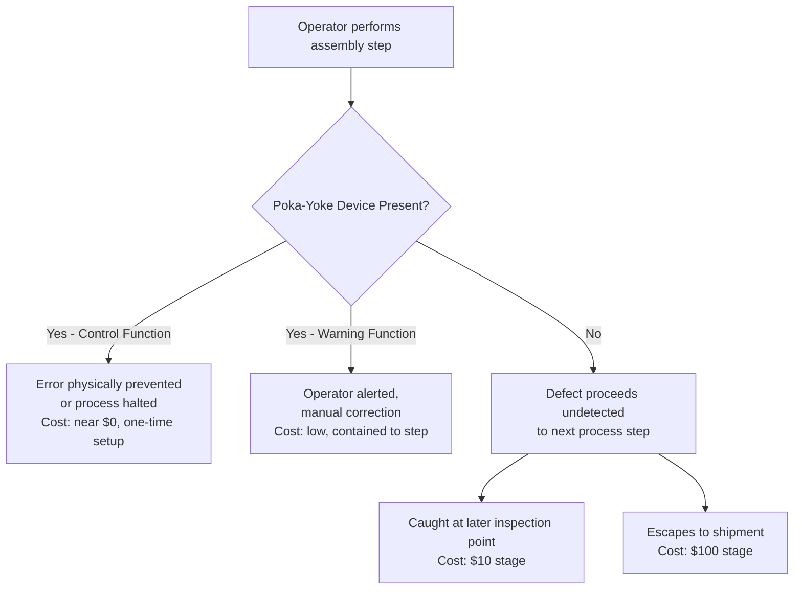

## Poka Yoke and Error Proofing Techniques

### Definition and Purpose

Poka-yoke (ポカヨケ, from the Japanese for "mistake-proofing" or "inadvertent error avoidance") is a manufacturing technique that uses physical, procedural, or design mechanisms to make it impossible, or immediately obvious, for a defect or error to occur. Where supplier-level prevention (covered in the preceding topic) addresses defects originating outside the manufacturer's own facility, poka-yoke addresses defect prevention at the most granular level within the manufacturer's own process — the individual operation or assembly step — representing the purest practical expression of the Prevention Stage principle established earlier in this curriculum.

### Origin and Core Concept

**Key Points**

- Poka-yoke was developed and popularized by Shigeo Shingo as part of the Toyota Production System, growing out of the broader Japanese quality management tradition that also produced statistical process control practices referenced in the Defect Detection Timing topic.
- The core concept distinguishes poka-yoke from ordinary inspection: rather than detecting a defect after it has occurred (an Appraisal-stage activity), poka-yoke devices and procedures prevent the defect from occurring at all, or prevent a defective unit from proceeding to the next process step — placing it squarely at the $1 stage of the escalation curve rather than the $10 stage.
- The technique is grounded in the recognition that human operators inevitably make inadvertent errors — poka-yoke does not attempt to eliminate human error through training or vigilance alone, but instead designs the physical or procedural environment so that such errors cannot produce a defective outcome.

### The Three Functional Categories of Poka-Yoke

**Key Points**

**1. Contact Method**

Uses the physical shape, size, or other physical attributes of a part to detect whether contact has been made correctly, such as a fixture designed so that a misoriented part physically cannot fit into place.

**2. Fixed-Value (Constant Number) Method**

Ensures a specified number of movements or actions are completed, using a counter or sensor that signals or halts the process if the expected count is not met — for example, a parts-picking tray with sensors confirming all required components were removed before assembly proceeds.

**3. Motion-Step (Sequence) Method**

Verifies that the correct sequence of steps or motions was followed, using sensors or interlocks that prevent a subsequent step from beginning until the required predecessor step has been completed and confirmed.

### Poka-Yoke's Two Regulatory Functions

**Key Points**

- **Control function (shutdown)** — the poka-yoke device stops the process entirely when an error is detected, preventing any defective unit from being produced or from proceeding further; this is the stricter of the two functions and is generally preferred where defect consequences are severe.
- **Warning function (signal)** — the poka-yoke device alerts the operator to an error condition (via a light, sound, or other signal) without automatically halting the process, relying on the operator to take corrective action; this is used where a full automatic shutdown would be impractical or where the error rate and consequence severity do not warrant it.
- [Inference] The choice between control and warning functions likely reflects the same cost-of-detection-timing logic established in the Defect Detection Timing topic: a control function costs more to implement (in engineering and potential throughput impact) but guarantees the defect is caught at the earliest possible point, while a warning function is cheaper to implement but depends on reliable human response, introducing residual risk that the error escapes to the next stage anyway.

### Why Poka-Yoke Sits at the Extreme Low-Cost End of the Escalation Curve

**Key Points**

- Because poka-yoke devices prevent a defect from being physically possible to create (or prevent a defective unit from physically advancing), they eliminate not only the cost of correcting the defect but also the cost of *detecting* it — there is no appraisal activity required if the error was never allowed to occur.
- This distinguishes poka-yoke from the in-line inspection points discussed in the Defect Detection Timing topic: inspection catches a defect after it has occurred, incurring both a detection cost and a correction cost (the $10 stage), whereas poka-yoke prevents the occurrence itself, incurring only the one-time engineering cost of designing and implementing the mechanism.
- Once implemented, a poka-yoke mechanism operates continuously at near-zero marginal cost per unit produced, in contrast to inspection activities which typically incur a recurring cost proportional to production volume — meaning the relative cost advantage of poka-yoke over inspection-based detection compounds further as production volume increases.

### Poka-Yoke Within the Escalation Framework

### Common Poka-Yoke Examples

| Example | Category | Mechanism |
| --- | --- | --- |
| Asymmetric connector/plug design | Contact method | Physically impossible to insert incorrectly |
| Parts tray with individual compartments and sensors | Fixed-value method | Confirms all required parts were used before proceeding |
| Interlocking assembly fixtures | Motion-step method | Next station will not activate until prior station confirms completion |
| Checklists with mandatory sign-off fields | Motion-step method (procedural) | Prevents proceeding to the next phase without confirming each prior step |
| Color-coded components | Contact method | Visually prevents mismatched assembly |
| Weight or torque sensors with automatic reject | Fixed-value method (control function) | Automatically removes units outside specification without relying on operator judgment |

### Poka-Yoke as a Refinement Beyond General Prevention Investment

**Key Points**

- The Prevention Stage topic in the preceding chapter discussed prevention broadly — training, design review, requirements clarity. Poka-yoke represents a more specific and mechanistic subset of prevention: rather than relying on human diligence (which, as noted above, is assumed to be inherently fallible), it engineers the possibility of error out of the process entirely.
- This distinction matters because training-based prevention degrades over time (skills fade, new operators are onboarded without full context) while a well-designed poka-yoke mechanism's effectiveness does not depend on sustained human vigilance, making it a more durable form of prevention investment once implemented.
- [Inference] Given this durability advantage, poka-yoke mechanisms likely offer a higher long-run return on prevention investment than training alone for defect types that are physically or procedurally mistake-proofable, though training remains necessary for defect types (such as judgment-based quality decisions) that cannot be reduced to a simple physical or sequential check.

### Implementation Considerations

**Key Points**

- **Root cause analysis precedes design** — effective poka-yoke implementation requires first identifying the specific failure mode being prevented, often through the same root cause analysis discussed in the Correction and Detection Stage topic as a byproduct of internal failure correction, meaning poka-yoke and appraisal/correction activities feed into each other over time.
- **Simplicity is preferred** — the most durable and cost-effective poka-yoke solutions tend to be simple, low-maintenance mechanisms (a physical shape constraint) rather than complex sensor-and-software systems, since complexity introduces its own new failure modes to prevent.
- **Not a substitute for design-stage prevention** — poka-yoke mistake-proofs a given process step but cannot correct a fundamentally flawed design or specification; it operates most effectively in combination with the design-through-shipment lifecycle thinking covered in the preceding topic, not as a replacement for it.

### Application to Civic/Government Software Development

The poka-yoke concept translates directly into software engineering practice, often under different terminology:

- **Type systems as contact-method poka-yoke** — in a TypeScript monorepo such as batac-dms, the type system itself functions as a poka-yoke mechanism: it makes certain classes of error (passing a string where a structured document ID is expected, for instance) physically impossible to compile, rather than merely detectable through later testing.
- **Required form fields and input constraints as fixed-value poka-yoke** — form validation that prevents submission of an incomplete civic records request, analogous to the parts-tray sensor example, ensures all required information is present before the process can proceed, rather than allowing an incomplete submission to be caught only later.
- **Workflow state machines as motion-step poka-yoke** — enforcing that a document cannot move to an "approved" state without first passing through required review states mirrors the interlocking-fixture example, structurally preventing an out-of-sequence action rather than relying on procedural discipline alone.
- **Pre-commit hooks and CI gate checks as control-function poka-yoke** — automatically blocking a code merge that fails linting, type-checking, or tests is a direct software analog to the automatic-reject sensor example, removing reliance on a reviewer's vigilance alone.
- [Inference] Given the smaller team size and potential contributor turnover discussed in earlier civic-software-context sections of this curriculum, investing in these mistake-proofing mechanisms (strong typing, validation, workflow constraints, CI gates) likely offers a higher return than an equivalent investment in training alone, since — consistent with the durability argument made above — these mechanisms continue protecting against errors even as individual contributors change over the project's lifetime.

**Next Steps**

- Type-system-driven error prevention patterns in TypeScript and similar languages
- Workflow state machine design for document approval processes
- CI/CD gate configuration as software poka-yoke implementation
- Root cause analysis techniques for identifying poka-yoke candidates
- Toyota Production System principles beyond poka-yoke (jidoka, kaizen, and related concepts)