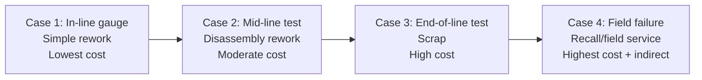

## Manufacturing Rework and Scrap Case Examples

### Definition and Purpose

Rework and scrap are the two possible dispositions for a defective unit once it has been identified within a manufacturing process, and they represent the concrete, unit-level cost outcomes that the abstract escalation curve discussed throughout this chapter ultimately produces. This topic works through illustrative case examples showing how rework and scrap costs manifest and scale across different detection points, connecting the theoretical framework established in the preceding topics to tangible cost scenarios.

### Defining Rework Versus Scrap

**Key Points**

- **Rework** refers to reprocessing a defective unit to bring it into conformance with specifications, recovering the value already invested in that unit rather than discarding it.
- **Scrap** refers to discarding a defective unit entirely because it cannot be economically or technically brought into conformance, resulting in total loss of the value invested in that unit up to the point of detection.
- The choice between rework and scrap is itself a cost-driven decision: a unit is reworked when the cost of reprocessing is lower than the value already invested plus the cost of producing a replacement unit from scratch; it is scrapped when reprocessing cost would exceed that threshold, or when the defect is not correctable at all (e.g., a structural flaw in a cast or molded part).

### How Detection Timing Determines the Rework-vs-Scrap Threshold

**Key Points**

- As established in the Defect Detection Timing Along the Production Line topic, the amount of value already invested in a unit increases as it progresses further through the production line — this directly affects whether rework remains economically viable at a given detection point.
- A defect caught early, with minimal value invested, is more likely to be economically reworkable, or simply discarded at negligible loss if not, because little value has been committed.
- A defect caught late, after most or all processing has been completed, is more likely to require scrapping if it cannot be reworked, because the alternative — extensive reprocessing — may approach or exceed the cost of the value already invested, making the loss calculus far less forgiving.

### Case Example 1: Early-Stage Detection with Low-Cost Rework

**Example**

A metal stamping operation produces a bracket with an out-of-tolerance hole diameter, caught immediately by an in-line poka-yoke gauge (as discussed in the preceding topic) before the part proceeds to the next station.

- **Value invested at detection**: minimal — only the initial stamping operation has been performed.
- **Disposition**: rework — the hole is re-drilled to the correct diameter using a simple secondary operation.
- **Cost components**: machine time for the rework operation, minor labor, no scrap material loss.
- **Escalation position**: this scenario sits close to the $1-to-$10 boundary described in the Correction and Detection Stage topic — detected and corrected essentially at the point of origin, with negligible compounding cost.

### Case Example 2: Mid-Process Detection Requiring Disassembly Rework

**Example**

An electronics assembly operation discovers, during a mid-line functional test, that a subassembly was populated with an incorrect component value, but this is only detected after two subsequent assembly steps have been performed on top of it.

- **Value invested at detection**: moderate — the original component placement plus two additional assembly operations have already been performed.
- **Disposition**: rework, but with added complexity — correcting the defect requires partially disassembling the two subsequent steps to access and replace the incorrect component, then redoing those steps.
- **Cost components**: labor for disassembly, replacement component cost, labor for reassembly, re-testing to confirm the fix and check for damage introduced during disassembly.
- **Escalation position**: this scenario illustrates the $10 stage's combined detection-plus-correction cost described in the Correction and Detection Stage topic, with the added complication that correction cost here exceeds a simple single-step fix because of the accumulated subsequent work that must be undone and redone.

### Case Example 3: End-of-Line Detection Resulting in Scrap

**Example**

A plastic injection molding operation produces a housing with an internal structural crack, undetectable until an end-of-line stress test is performed on the fully molded and finished part.

- **Value invested at detection**: high — full molding, finishing, and assembly-preparation steps have all been completed.
- **Disposition**: scrap — a structural crack in a molded part is generally not economically or technically correctable; the part must be discarded and replaced with a new unit produced from scratch.
- **Cost components**: full loss of all material and labor invested in the unit, plus the cost of producing a full replacement unit (repeating the entire process from raw material), plus the cost of the end-of-line test itself.
- **Escalation position**: this scenario approaches the upper end of the $10 stage or the boundary with the $100 stage — while still caught before shipment (avoiding the reputational and logistics costs discussed in the Failure Stage topic), the total loss is substantially higher than either of the two preceding examples, since scrap forfeits the entire value invested rather than only the cost of correction.

### Case Example 4: Post-Shipment Detection Requiring Field Rework or Recall

**Example**

A batch of assembled units passes end-of-line inspection but a supplier-originated defect (as discussed in the Supplier Level Defect Prevention topic) in a fastener component is only discovered after several units have shipped and one fails in the field.

- **Value invested at detection**: complete — full production, packaging, shipment, and (for the failed unit) field use.
- **Disposition**: depends on defect scope and severity — options range from field rework (a technician replaces the faulty fastener on-site) to a full recall (all units from the affected batch are retrieved and reworked or replaced).
- **Cost components**: field service labor and travel, replacement parts, logistics for retrieval and return if a recall is required, customer communication and potential compensation, plus the reputational and opportunity-cost-of-lost-goodwill components covered in depth in the External Failure Costs in Depth chapter.
- **Escalation position**: this scenario represents the $100 stage described in the Failure Stage topic, and notably illustrates why that stage's cost is described as a floor rather than a ceiling — the directly measurable costs (field labor, parts, logistics) are often smaller than the harder-to-measure reputational and goodwill costs that this same scenario triggers.

### Comparative Summary of the Four Cases

| Case | Detection Point | Disposition | Relative Cost | Escalation Position |
| --- | --- | --- | --- | --- |
| 1: Early in-line gauge | Immediately after first operation | Simple rework | Lowest | Near $1 boundary |
| 2: Mid-line functional test | After several assembly steps | Rework with disassembly | Moderate | $10 stage |
| 3: End-of-line stress test | After full processing | Scrap | High | Upper $10 / $100 boundary |
| 4: Field failure | After shipment | Field rework or recall | Highest | $100 stage plus indirect costs |

### Case Comparison Visualization

### Broader Lessons from the Case Examples

**Key Points**

- The rework-versus-scrap decision itself is a useful diagnostic for where a defect sits on the escalation curve: cases resolved through simple rework generally indicate early detection with low accumulated value at risk, while cases requiring scrap or field action generally indicate late detection with high accumulated value at risk.
- [Inference] Tracking the ratio of rework-to-scrap outcomes over time, as part of the activity-based costing practices covered in the Measuring and Reporting Quality Costs chapter, likely provides a useful leading indicator of whether an organization's detection points are positioned early enough in the process — a rising scrap ratio relative to rework may signal that defects are being caught later than they should be, warranting review of inspection point placement as discussed in the Defect Detection Timing topic.
- Case 3's outcome also illustrates the value of poka-yoke mechanisms (covered in the preceding topic): had a mistake-proofing device caught the structural weakness at an earlier molding-parameter-verification step, the full-value scrap loss in that case would likely have been avoided entirely.

### Application to Civic/Government Software Development

The rework-versus-scrap distinction has a direct, if less physically tangible, software development analog:

- **"Rework" equivalent** — a defect caught and corrected within the existing codebase (a bug fix, a refactor of a flawed function), analogous to Case 1 and Case 2, where the underlying code structure is preserved and only the specific defect is corrected.
- **"Scrap" equivalent** — a feature or module that must be discarded and rebuilt from a different design approach because the underlying architecture cannot support the required functionality, analogous to Case 3's structural-flaw scrap scenario; this is comparatively rare but carries a cost premium similar to physical scrap, since all development effort invested in the discarded approach is lost.
- **"Field failure" equivalent** — a defect discovered only after deployment to live LGU users, analogous to Case 4, carrying the same compounding reputational and trust costs discussed throughout the civic-context sections of this curriculum, even though no physical recall logistics apply.
- [Inference] Given that software "scrap" (discarding and rebuilding a flawed architectural approach) is comparatively rare but costly when it occurs, the design-stage and architectural review investment discussed in the Cost Escalation from Design Through Shipment topic's civic-context section remains the most direct lever available to a resource-constrained team like batac-dms for avoiding this case's software equivalent.

**Next Steps**

- Cost accounting methods for tracking rework versus scrap ratios over time
- Recall management processes and logistics coordination
- Structural/architectural "scrap" scenarios in software and how to avoid them
- Statistical analysis of detection-point placement using historical rework/scrap data
- Chapter synthesis: applying manufacturing case-example thinking to a software defect retrospective