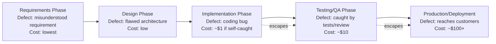

## Cost of Defects Across the Software Development Lifecycle

### Definition and Purpose

This topic transitions the 1-10-100 Rule's escalation logic from its manufacturing origins, covered in depth throughout the preceding chapter, into its direct application within the Software Development Lifecycle (SDLC). Where the manufacturing chapter traced physical production stages, this topic maps the same underlying cost-escalation principle onto the discrete phases of software development — requirements, design, implementation, testing, and production — establishing the foundational structure that subsequent topics in this chapter will build upon.

### The SDLC Phases as Escalation Stages

**Key Points**

- **Requirements phase** — defining what the software should do; a defect here is a misunderstood, missing, or incorrect requirement.
- **Design phase** — architecting how the software will meet those requirements; a defect here is a flawed architectural or design decision.
- **Implementation (coding) phase** — writing the actual code; a defect here is a bug introduced during development.
- **Testing/QA phase** — verifying the software behaves as intended before release; this phase's purpose is defect *detection*, not introduction.
- **Production/deployment phase** — the software is live and in use by real users; a defect discovered here has reached external exposure.

This structure directly parallels the design-through-shipment lifecycle mapping established in the manufacturing chapter, with requirements and design corresponding to the manufacturing design stage, implementation corresponding to production, testing corresponding to end-of-line inspection, and the production/deployment phase corresponding to shipment and field use.

### Mapping SDLC Phases to the 1-10-100 Escalation

**Key Points**

- Preventing a bug by catching it while writing code costs little to nothing, thus the $1 designation; if it gets caught in QA, it costs $10 to fix; and if customers are impacted by it, the cost raises to $100 or more.
- This framing directly parallels the Prevention Stage, Correction and Detection Stage, and Failure Stage topics from the "1-10-100 Rule Explained" chapter, but grounds them specifically in the SDLC's own phase terminology rather than the generic three-stage abstraction used there.
- Critically, and consistent with the Cost Escalation from Design Through Shipment topic's argument that the true origin of cost often sits earlier than production itself, a requirements-phase defect is even cheaper to correct than an implementation-phase defect — correcting a misunderstood requirement before any code is written costs only the clarification conversation, while the same misunderstanding discovered after implementation requires discarding and rewriting actual code.

### SDLC Escalation Flow

### Cost Drivers at Each SDLC Phase Transition

| Phase Transition | New Cost Driver Introduced |
| --- | --- |
| Requirements → Design | Design decisions become committed around a misunderstood requirement |
| Design → Implementation | Actual code is written against a flawed design; rework requires discarding code |
| Implementation → Testing | Code has been integrated with other components; fixing may require touching dependent code |
| Testing → Production | Deployment pipeline has run; rollback, hotfix, or incident response processes activate |
| Production → Customer Impact | External exposure activates reputational and support costs, as detailed in the External Failure Costs in Depth chapter |

### Why Software Defects Compound Similarly to Manufacturing Defects

**Key Points**

- **Code built on top of a defect** — directly analogous to the manufacturing case examples in the preceding chapter's rework-and-scrap topic, a bug in a foundational function that other code depends on requires not just fixing the function but potentially reworking every piece of dependent code that assumed the buggy behavior.
- **Integration complexity increases with lifecycle stage** — a bug caught during implementation, before the code has been integrated with the rest of the system, is isolated; the same bug caught during testing (after integration) may require tracing through multiple interacting components to identify the root cause, paralleling the diagnostic overhead discussed in the Core Principle of Exponential Cost Escalation topic.
- **Deployment and rollback overhead** — a defect caught in production requires not just a code fix but a full deployment cycle (build, test, deploy, verify) to release the correction, plus potentially a rollback of the defective version in the interim — overhead entirely absent at earlier phases.
- **Indirect costs activate identically to the manufacturing case** — once a software defect reaches production and affects real users, the same reputational and opportunity-cost-of-lost-goodwill dynamics covered in the External Failure Costs in Depth chapter apply, just as they did for the field-failure case example in the preceding manufacturing chapter.

### Illustrative Example Across the Full SDLC

**Example**

Consider a defect in a permission-checking function used to control who can approve a document in a civic records system:

- **At Requirements**: if the requirement for "who can approve" is ambiguous or incomplete, clarifying it in a conversation before design begins costs a brief discussion — negligible cost.
- **At Design**: if the ambiguity survives into the design phase, it may result in an architecture that does not cleanly support the correct permission model, requiring a design revision before implementation — still low cost, but higher than requirements-phase correction.
- **At Implementation**: if the flawed design is coded, and the bug is caught by the developer via self-review or a failing local test before commit, the cost remains close to the $1 baseline described in the Prevention Stage topic.
- **At Testing/QA**: if the bug escapes self-review and is instead caught by code review or automated testing, correction now requires the reviewer's time, the developer's rework time, and re-verification — the $10 stage described in the Correction and Detection Stage topic.
- **At Production**: if the bug escapes all prior phases and an unauthorized user is able to approve a document they should not have access to, the consequence extends beyond a simple bug fix to include incident investigation, potential audit exposure (given the civic records context), and the reputational and trust costs covered in the External Failure Costs in Depth chapter — the $100 stage.

### Distinguishing Defect Origin Phase from Defect Discovery Phase

**Key Points**

- As emphasized in the Pitfalls and Biases in Quality Cost Data topic's discussion of temporal misclassification, it is important to distinguish the SDLC phase in which a defect **originates** from the phase in which it is **discovered** — the permission-checking example above originated at the requirements phase but might not be discovered until production.
- This distinction matters for accurate cost attribution and process improvement: the corrective lesson from the example above is not "improve testing" alone, but specifically "improve requirements clarity for permission logic," since testing alone, without addressing the root requirements ambiguity, would only move the discovery point earlier without preventing similar defects in future features.
- This directly reinforces the Relationship Between the 1-10-100 Rule and the PAF Model topic's point that diagnosing which underlying category drives a cost is more actionable than observing the escalated cost alone.

### Why This Mapping Matters for Modern Development Practice

**Key Points**

- This SDLC-specific framing is the direct conceptual foundation for practices explored in later topics of this chapter, including shift-left testing strategies (introduced in the Origin and History and Defect Detection Timing topics of earlier chapters) and modern CI/CD-based defect prevention.
- [Inference] Because software, unlike physical manufacturing, allows near-zero-cost duplication of a corrected artifact once fixed (a corrected function can be deployed everywhere it's used without re-manufacturing each instance), the *relative* cost advantage of early-phase correction in software may be even more pronounced than in physical manufacturing, since a manufacturing correction only prevents the defect in future units, while a software correction retroactively fixes every existing deployment simultaneously upon release.

### Application to Civic/Government Software Development

Given that this curriculum's ongoing civic-context thread already centers on a software project, this topic's SDLC framing is the most direct restatement yet of the recurring batac-dms-relevant guidance from earlier chapters: the Prevention Stage's emphasis on requirements clarity, the Correction and Detection Stage's emphasis on code review and CI-based testing, and the Failure Stage's emphasis on the compounding costs of production incidents in a civic trust context all map directly onto the five SDLC phases established here, providing the structural foundation that subsequent topics in this chapter (covering specific modern practices such as shift-left testing, CI/CD pipeline design, and technical debt) will build upon in more depth.

**Next Steps**

- Shift-left testing strategy design across the SDLC
- CI/CD pipeline architecture for early defect detection
- Requirements engineering techniques for ambiguity reduction
- Technical debt as a distinct but related cost-escalation phenomenon
- Root cause versus discovery phase tracking in software defect management systems