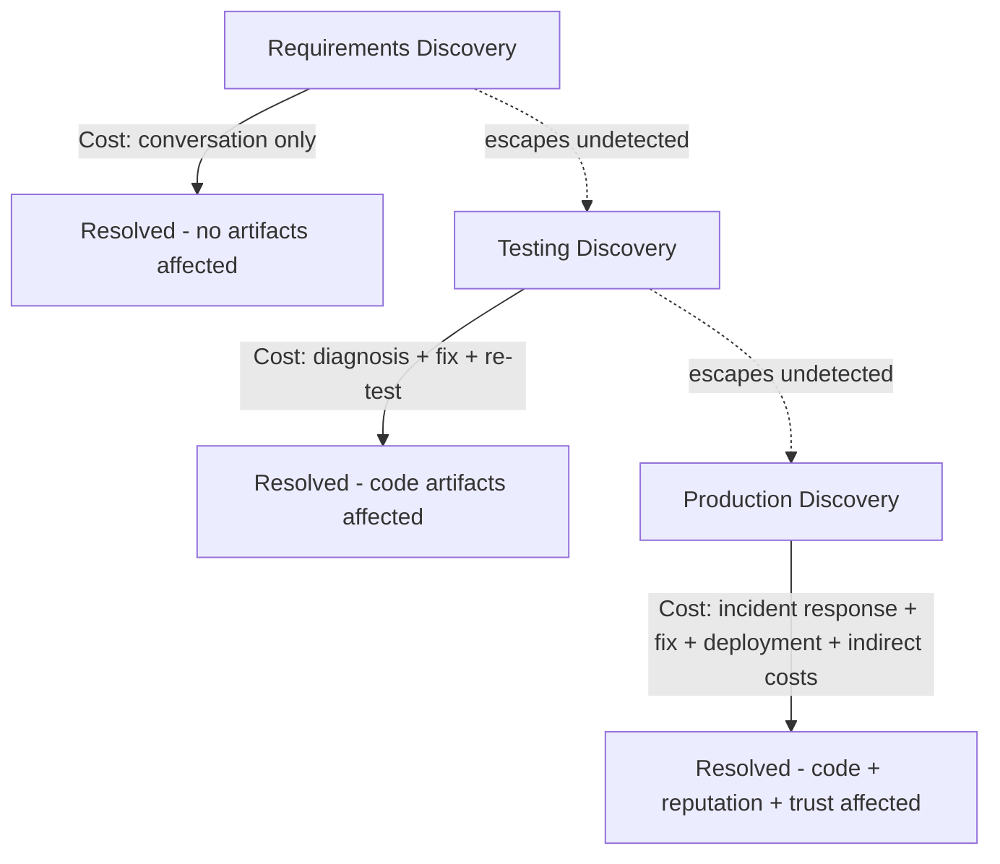

## Cost of Bugs Found in Requirements versus Testing versus Production

### Definition and Purpose

This topic performs a focused, comparative deep-dive on three specific discovery points introduced in the preceding topic's SDLC mapping — requirements, testing, and production — isolating them from the full five-phase lifecycle to examine in detail *why* the cost differential between these three particular points is so pronounced, and what specifically changes at each transition. Where the preceding topic established the overall SDLC escalation curve, this topic focuses squarely on the comparative anatomy of these three critical discovery points.

### Why These Three Points Specifically

**Key Points**

- Requirements, testing, and production represent the three discovery points most commonly referenced in software engineering discussions of the 1-10-100 Rule, corresponding respectively to the earliest possible defect discovery point, the primary internal quality gate, and the point of external exposure.
- These three points also correspond most directly to distinct organizational functions with different data visibility, as discussed in the Cross Functional Collaboration in Cost Data Gathering topic — product/business analysts typically own requirements, QA/engineering owns testing, and customer support/incident response owns production — making this three-way comparison a natural lens for cross-functional cost communication.

### Bugs Found in Requirements

**Key Points**

- A "bug" at the requirements stage is not yet a coding error at all — it is a misunderstanding, ambiguity, omission, or contradiction in the specification of what the software should do, discovered before any design or implementation work has begun.
- **Detection mechanism**: requirements review sessions, stakeholder walkthroughs, acceptance criteria definition, and structured questioning techniques (e.g., asking "what should happen if X edge case occurs?" before any code exists).
- **Correction cost components**: primarily the time of the people involved in the clarifying conversation — a business analyst, a product owner, a developer — with no code, design artifact, or test asset yet created that would need to be discarded or reworked.
- **Why this is the cheapest discovery point**: as established in the Cost of Defects Across the Software Development Lifecycle topic, correcting a misunderstood requirement before any code is written costs only the clarification conversation itself, with zero downstream artifacts requiring rework.
- **Illustrative example**: a requirement stating "users can edit their submitted documents" is ambiguous about whether editing is permitted after a document has entered an approval workflow; catching this ambiguity during a requirements review session, before any design decisions are made, costs only the clarifying conversation needed to specify the intended behavior.

### Bugs Found in Testing

**Key Points**

- A bug found in testing is a defect that has already been implemented in code — the requirements and design were followed (correctly or not), and the resulting implementation contains an error that automated tests, code review, or manual QA activity identifies before release.
- **Detection mechanism**: automated unit and integration tests, code review, static analysis, manual QA/exploratory testing — the Appraisal-category activities detailed in the Correction and Detection Stage and Correction and Detection Stage and the $10 Cost topics from earlier chapters.
- **Correction cost components**: developer time to diagnose and fix the code, potential rework of dependent code if the bug is in a widely-used function (as discussed in the preceding topic's compounding-cost discussion), re-testing to verify the fix and check for regressions, and reviewer time for a second review pass.
- **Why this costs more than requirements-stage discovery**: unlike a requirements clarification, this stage's correction requires modifying actual, already-written code — potentially code that other parts of the system already depend on — introducing the rework and re-verification overhead absent at the requirements stage.
- **Illustrative example**: continuing the document-editing scenario, if the ambiguity was not caught at requirements and the implementation incorrectly allows editing after approval has begun, a QA tester discovering this during exploratory testing triggers a bug report, developer investigation, a code fix, and re-testing — substantially more total effort than the requirements-stage clarifying conversation would have required.

### Bugs Found in Production

**Key Points**

- A bug found in production has escaped both the requirements-review and testing safety nets and has reached real users, activating the External Failure cost category and its associated indirect costs covered extensively in the External Failure Costs in Depth chapter.
- **Detection mechanism**: user-reported issues, customer support tickets, production monitoring/alerting systems, or (in less favorable cases) public reports via social media or press before the organization's own monitoring detects the issue.
- **Correction cost components**: incident response and root cause investigation (often more difficult than at the testing stage, since production environments involve real data, real load, and real integration conditions that may not be reproducible in a test environment), emergency fix development and expedited deployment, customer communication, and — critically — the reputational and opportunity-cost-of-lost-goodwill components detailed in the earlier chapter.
- **Why this costs dramatically more than testing-stage discovery**: beyond the direct technical correction cost, production discovery activates entirely new cost categories absent at the testing stage — customer support burden, potential SLA penalties, and the compounding trust erosion discussed in the Reputational and Brand Damage and Opportunity Cost of Lost Customer Goodwill topics.
- **Illustrative example**: if the document-editing ambiguity escapes both requirements review and testing, and a citizen successfully edits a document after it has entered a legally significant approval workflow, the consequence extends beyond a bug fix to include potential compromise of a government record's integrity, an incident investigation into which other submissions may be affected, and the civic-context reputational exposure discussed throughout this curriculum's earlier chapters.

### Three-Point Comparison Table

| Dimension | Requirements | Testing | Production |
| --- | --- | --- | --- |
| Artifact state at discovery | No code or design yet | Code exists, not yet released | Code exists and is live |
| Primary correction cost | Conversation/clarification time | Diagnosis + code fix + re-test | Incident response + fix + deployment |
| Stakeholders typically involved | Analyst, product owner, developer | Developer, reviewer, QA | Developer, support, incident response, possibly leadership |
| Rework of existing artifacts | None | Code and possibly dependent code | Code, plus potential data correction |
| Indirect costs activated | None | None | Reputational, goodwill, possible compliance exposure |
| Reproducibility of root cause | N/A — nothing built yet | High — controlled test environment | Often lower — real-world conditions harder to reproduce |

### Visualizing the Three-Point Comparison

### The Reproducibility Factor as an Underappreciated Cost Driver

**Key Points**

- A factor distinguishing testing-stage from production-stage correction cost that is easy to overlook: bugs caught in testing are typically reproducible in a controlled environment, allowing systematic diagnosis, whereas production bugs frequently involve conditions (specific user data, concurrent load, integration with external systems) that are difficult or impossible to fully replicate outside the live environment.
- [Inference] This reproducibility gap likely adds a meaningful, often underestimated cost layer to production-stage correction beyond what the reputational and support-cost factors alone would suggest — diagnostic time itself is frequently longer for production incidents even before considering the indirect costs, because engineers must reason about conditions they cannot directly observe or recreate.

### Practical Implication: Where to Concentrate Limited Review Effort

**Key Points**

- Given the stark cost differential illustrated by the three-point comparison, and consistent with the Prevention Stage topic's broader argument, an organization with limited quality assurance resources should weight review effort toward requirements clarity disproportionately relative to its modest direct cost, since this is the point at which correction remains nearly free.
- However, requirements review cannot catch every defect type — some errors (subtle logic bugs, integration issues, performance problems) are not detectable through requirements review at all and can only be found through testing-stage activity, meaning the practical guidance is not to abandon testing investment but to ensure requirements-stage review is not skipped or under-resourced relative to testing, given its dramatically lower cost-per-defect-caught.

### Application to Civic/Government Software Development

For a project such as a Local Government Unit document management system, this three-point comparison carries particular weight given considerations established throughout this curriculum:

- **Requirements-stage discovery is especially valuable given limited testing capacity** — as discussed in the Correction and Detection Stage and the $10 Cost topic's civic-context section, smaller civic software teams typically lack dedicated QA staff, meaning the testing-stage safety net is comparatively thinner than in larger commercial organizations, further increasing the relative value of catching issues at the requirements stage before they ever depend on that thinner testing net.
- **Production-stage discovery carries civic-specific severity** — as established in the Failure Stage topic's civic-context section, a production bug affecting government record integrity (such as the document-editing example used throughout this topic) carries audit and public-trust consequences beyond what an equivalent commercial software bug would trigger, reinforcing the case for weighting effort toward the requirements and testing stages specifically to avoid production-stage discovery in this domain.
- **Requirements clarity is complicated by jurisdiction-specific rules** — as noted in the Prevention Stage topic's civic-context section, civic software often encodes specific legal or procedural requirements particular to the LGU's own processes, meaning requirements-stage review in this context specifically benefits from involving someone with direct knowledge of Batac City's actual approval workflows and document retention rules, not just general software requirements-gathering skill.

**Next Steps**

- Requirements review and acceptance criteria design techniques
- Reproducibility challenges in production incident diagnosis
- Balancing requirements-stage and testing-stage investment given limited resources
- Structured requirements elicitation for jurisdiction-specific civic software rules
- Case study: tracing a single ambiguous requirement through all three discovery points