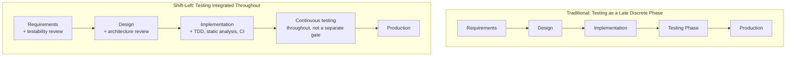

## The Shift Left Testing Philosophy

### Definition and Purpose

Shift-left testing is a software development philosophy that advocates moving quality assurance and defect-detection activities as early as possible in the development lifecycle — "left" referring to the earlier position on a typical left-to-right SDLC timeline diagram, as introduced in the Cost of Defects Across the Software Development Lifecycle topic. Rather than treating testing as a discrete phase that occurs after implementation is complete, shift-left integrates testing-like activities throughout requirements, design, and coding, directly operationalizing the cost-escalation logic established throughout this curriculum.

### Direct Lineage from the 1-10-100 Rule

**Key Points**

- Shift-left testing is the direct practical response to the cost comparison established in the preceding topic: since a bug found in requirements costs a conversation, a bug found in testing costs a diagnosis-and-fix cycle, and a bug found in production costs an incident response plus indirect costs, shift-left is simply the organizational strategy of deliberately moving detection activity toward the cheapest end of that spectrum.
- This connects directly to the manufacturing chapter's Defect Detection Timing Along the Production Line topic — shift-left is the software-development expression of the same principle that motivated moving manufacturing inspection points earlier in the production line, and the Poka Yoke and Error Proofing Techniques topic's mistake-proofing philosophy, which similarly aims to prevent or catch defects at the earliest possible point.
- The concepts underlying the 1-10-100 rule, while more traditionally applicable to waterfall-style development, still apply today to Agile methodology — shift-left testing is one of the primary mechanisms through which this generalization is realized in modern development practice.

### Core Practices of Shift-Left Testing

**Key Points**

**1. Requirements-Level Testability Review**

Evaluating requirements and acceptance criteria for clarity and testability before design begins, directly extending the requirements-stage discovery discussed in the preceding topic — if a requirement cannot be clearly tested, it is likely ambiguous in a way that will eventually surface as a costlier defect downstream.

**2. Test-Driven Development (TDD)**

Writing automated tests before writing the implementation code, ensuring that testing criteria are defined and validated at the moment of implementation rather than afterward — this collapses the traditional gap between the implementation and testing phases described in the preceding topic's SDLC mapping.

**3. Static Analysis and Linting in the Development Environment**

Running automated code-quality and error-detection tools directly within the developer's editor or pre-commit hooks, catching certain defect classes at the moment of writing rather than at a later, separate review stage — functioning as a software-specific parallel to the poka-yoke control-function mechanisms covered in the manufacturing chapter.

**4. Continuous Integration (CI) with Early and Frequent Test Execution**

Running automated test suites on every code change, rather than only at scheduled testing milestones, ensuring that any defect introduced is detected within a single development cycle rather than accumulating undetected across multiple cycles.

**5. Design and Architecture Review Before Implementation**

Formal or informal review of design decisions before coding begins, directly paralleling the design-review prevention activity discussed in the Prevention Stage topic, catching structural flaws before implementation effort compounds them.

**6. Security and Performance Testing Integrated Early**

Rather than treating security scanning or performance testing as a final pre-release gate, shift-left incorporates these considerations into design and implementation directly, since security and performance defects tend to be particularly expensive to retrofit after architectural decisions have been made.

### Shift-Left Compared to Traditional (Waterfall-Style) Testing Placement

### Why Shift-Left Reduces Total Cost of Quality, Not Just Defect Count

**Key Points**

- Shift-left does not necessarily reduce the *number* of defects introduced (developers remain fallible, as established in the Poka Yoke topic's discussion of inherent human error), but it substantially reduces the *cost per defect* by ensuring more defects are caught at the cheaper, earlier discovery points described in the preceding topic rather than accumulating undetected until a later, more expensive stage.
- This distinction matters for interpreting quality metrics: an organization successfully implementing shift-left practices might show a *higher* number of defects caught at the requirements and implementation stages (because more are being caught earlier) alongside a *lower* number of defects reaching production — both trends indicating success, even though the total defect count might appear unchanged or even increased if only counted in aggregate without stage attribution.
- This connects directly to the category mix ratio concept introduced in the Benchmarking Quality Costs Across Industries topic: a shift-left-successful organization should show its cost mix shifting toward Prevention and early Appraisal activity and away from Internal and External Failure, even before total CoQ as a percentage of budget necessarily declines.

### Organizational and Cultural Requirements for Shift-Left Success

**Key Points**

- **Developer ownership of quality** — shift-left requires developers themselves to take on testing-adjacent responsibilities (writing tests, running static analysis, reviewing design) that might traditionally have been the sole responsibility of a separate QA function, requiring a cultural shift in how quality responsibility is distributed.
- **Tooling investment** — effective shift-left practice depends on CI infrastructure, static analysis tooling, and fast local test execution; without this tooling investment, shift-left principles remain aspirational rather than practically achievable.
- **Fast feedback loops** — the value of shift-left is substantially diminished if tests or static analysis take too long to run, since developers will be less likely to run them frequently; this creates a design constraint on the shift-left tooling itself, favoring fast, incremental checks over slow, comprehensive ones for the innermost feedback loop.
- **Cross-functional collaboration parallels** — as discussed in the Cross Functional Collaboration in Cost Data Gathering topic, effective requirements-stage testability review requires input from both the people who understand the business/domain requirements and the people who will implement and test the resulting code, meaning shift-left is as much a collaboration practice as a technical one.

### Common Pitfalls in Shift-Left Implementation

| Pitfall | Description | Mitigation |
| --- | --- | --- |
| Shifting testing left without shifting testing culture left | Adding TDD or CI tooling without corresponding developer buy-in or training | Pair tooling rollout with training and incentive alignment, as discussed in the Pitfalls and Biases in Quality Cost Data topic's incentive-alignment guidance |
| Over-indexing on unit-level shift-left while neglecting integration/system-level testing | Excellent unit test coverage but integration bugs still reach production because integration testing is not similarly prioritized | Balance shift-left investment across test levels, not only the earliest/cheapest-to-write test type |
| Treating shift-left as eliminating the need for any later-stage testing | Assuming early detection makes later QA/staging testing redundant | Recognize that shift-left reduces reliance on later stages but does not eliminate the value of a final integration/staging check, since some defect classes (environment-specific issues, complex integration interactions) are not reliably caught by earlier-stage checks alone |
| Slow or flaky automated checks eroding developer trust | Developers begin ignoring or bypassing CI failures because checks are unreliable or too slow | Invest in CI reliability and speed as a prerequisite for shift-left adoption, not an afterthought |

### Application to Civic/Government Software Development

For a project such as a Local Government Unit document management system, shift-left testing principles connect directly to guidance established throughout this curriculum's civic-context sections:

- **Requirements testability review addresses jurisdiction-specific ambiguity** — as discussed in the preceding topic's civic-context section, civic software requirements often encode Batac City-specific procedural rules; explicitly reviewing these requirements for testability before design begins is a direct, low-cost mechanism for surfacing jurisdiction-specific ambiguity before it becomes a costlier defect.
- **CI and static analysis compensate for limited dedicated QA capacity** — as discussed in the Correction and Detection Stage and the $10 Cost topic's civic-context section, smaller civic software teams typically lack dedicated QA staff; shift-left practices (automated testing, static analysis, TypeScript's type system as discussed in the Poka Yoke topic's civic-context section) are especially valuable in this context because they substitute automated, low-marginal-cost detection for the dedicated human QA capacity that a resource-constrained team lacks.
- **TDD and design review as high-leverage practices for small teams** — given the resource constraints discussed throughout this curriculum, a small team like the one developing batac-dms likely benefits disproportionately from the requirements- and design-stage shift-left practices specifically, since these carry the lowest tooling investment cost while addressing the highest-leverage discovery point established in the preceding topic.

**Next Steps**

- Test-Driven Development (TDD) practice and adoption strategies
- CI/CD pipeline design for fast, reliable automated feedback
- Static analysis and linting tool configuration for early defect detection
- Balancing shift-left investment across unit, integration, and system testing levels
- Building organizational buy-in for a quality-ownership culture shift among developers