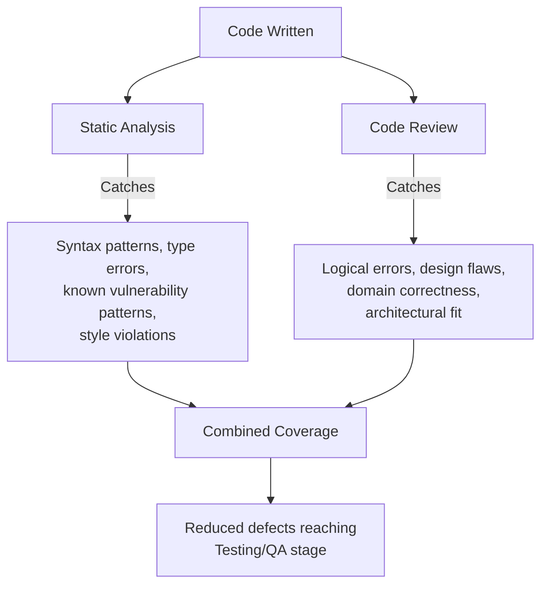

## Static Analysis and Code Review as Prevention

### Definition and Purpose

Static analysis and code review are two of the most widely adopted shift-left practices, introduced briefly in the preceding topic, and this topic examines each in depth as concrete prevention mechanisms. Both operate on code that has already been written but before it has been merged, deployed, or executed against real data — positioning them at a specific point on the escalation curve that this topic will carefully distinguish from both the Prevention Stage (design/requirements) and the Correction and Detection Stage (testing/QA) covered earlier in this curriculum.

### Clarifying the Categorical Position: Prevention or Appraisal?

**Key Points**

- Despite this topic's title, static analysis and code review sit at an interesting categorical boundary within the PAF model discussed in the Relationship Between the 1-10-100 Rule and the PAF Model topic: they are technically **Appraisal** activities (they detect defects that already exist in written code) but function with enough immediacy and low overhead that they behave, in practice, much closer to Prevention in their cost profile.
- This is consistent with the Poka Yoke and Error Proofing Techniques topic's broader point that some detection mechanisms are cheap enough, and close enough to the point of defect introduction, that they blur the line between preventing an error and catching it immediately after it occurs — static analysis run automatically as code is typed, and code review conducted before any integration has occurred, both exemplify this blurred boundary.
- [Inference] The practical justification for grouping them under "prevention" in common usage, despite their formal Appraisal classification, is that a defect caught by these mechanisms never survives to become an Internal Failure cost in the traditional sense — no separate bug report, no later diagnostic cycle, no rework of dependent code — making their cost profile empirically closer to the $1 stage than the $10 stage described in earlier topics, even though categorically they perform a detection function.

### Static Analysis

**Key Points**

- Static analysis examines source code without executing it, using automated tools to identify patterns associated with bugs, security vulnerabilities, style violations, or maintainability problems.
- **Categories of static analysis**:
  - **Linting** — enforces style and basic correctness rules (unused variables, inconsistent formatting, unreachable code).
  - **Type checking** — in typed languages, verifies that values are used consistently with their declared types, directly functioning as the type-system poka-yoke mechanism discussed in the Poka Yoke and Error Proofing Techniques topic's civic-context section.
  - **Security-focused static analysis (SAST)** — identifies patterns associated with known vulnerability classes (injection risks, insecure data handling) before code is ever executed.
  - **Complexity and maintainability analysis** — flags code that exceeds complexity thresholds likely to harbor defects or be difficult to correctly modify in the future.
- **Integration points**: static analysis can run in a developer's editor in real time (fastest feedback, closest to true prevention), as a pre-commit hook (blocking a commit that fails checks), or as a CI pipeline step (blocking a merge), with each successive point trading faster feedback for broader team-wide enforcement.
- **Cost profile**: extremely low marginal cost per execution once configured — the primary cost is the one-time setup and tuning of rules, after which the tool runs automatically at near-zero incremental cost per check, mirroring the poka-yoke cost-durability argument made in the earlier chapter.

### Code Review

**Key Points**

- Code review is the human examination of proposed code changes (typically via a pull/merge request) by someone other than the original author, before those changes are integrated into the shared codebase.
- **What code review catches that static analysis cannot**: logical errors that are syntactically valid but semantically wrong, design and architectural concerns, domain-specific correctness (does this code actually implement the intended business/civic requirement correctly), and readability/maintainability judgments that require human contextual understanding rather than pattern matching.
- **Review depth spectrum**: ranges from lightweight review (a quick sanity check focused on obvious issues) to deep review (line-by-line examination of logic, edge cases, and architectural fit), with the appropriate depth depending on the criticality and complexity of the change.
- **Cost profile**: higher marginal cost per instance than static analysis, since it requires a human reviewer's time and attention for each review, but still substantially cheaper than the diagnostic-and-fix cycle described for testing-stage discovery in the Cost of Bugs Found in Requirements versus Testing versus Production topic, because the code has not yet been integrated, deployed, or built upon by other work.

### Complementary Coverage: Why Both Are Needed Together

**Key Points**

- Static analysis and code review are complementary rather than substitutable: static analysis is exhaustive and consistent but limited to patterns it has been explicitly configured to detect, while code review is flexible and contextually aware but limited by reviewer attention, expertise, and time.
- An organization relying solely on static analysis will miss logical and domain-correctness errors that require human judgment; an organization relying solely on code review will miss the categories of mechanical error that automated tools catch more reliably and consistently than human reviewers, who are subject to fatigue and attention limits, especially on large changes.
- [Inference] Given this complementarity, an organization seeking to maximize prevention-adjacent coverage at this stage of the SDLC likely benefits more from investing in both mechanisms together, even modestly, than from investing heavily in only one — since each addresses a defect class largely orthogonal to what the other catches.

### Why This Stage Offers an Especially High Return on Investment

**Key Points**

- Referring back to the Cost of Bugs Found in Requirements versus Testing versus Production topic's comparison table, code at this stage exists but has not yet been integrated with other components, has not yet been deployed, and has not yet accumulated the dependent-code compounding cost described in the Cost of Defects Across the Software Development Lifecycle topic.
- This means the marginal cost of catching a defect at this stage, rather than one step later (integration testing or QA), remains comparatively very low — the defect is corrected by the original author, who still has full context on the change, without requiring the broader diagnostic effort a later-stage discovery would demand.
- The near-zero marginal cost of static analysis checks once configured, combined with the still-low cost of code review relative to later stages, together make this stage one of the highest-leverage points on the entire SDLC escalation curve introduced in this chapter's opening topic.

### Implementation Considerations for Effective Use

**Key Points**

- **Calibrating static analysis rule strictness** — overly strict or noisy rule sets generate false positives that erode developer trust and lead to checks being ignored or bypassed, echoing the "slow or flaky automated checks" pitfall discussed in the preceding topic's shift-left pitfalls table; rules should be tuned to catch genuine issues without excessive noise.
- **Review scope and reviewer selection** — assigning review of civic-domain-specific logic (such as approval workflow changes) to reviewers with direct familiarity with the relevant jurisdictional rules, consistent with the domain-aware reviewer guidance discussed in the Correction and Detection Stage and the $10 Cost topic's civic-context section, increases the likelihood that domain-correctness issues are actually caught rather than merely checked for surface-level code quality.
- **Avoiding review fatigue on large changes** — very large pull requests reduce reviewer effectiveness due to attention limits; encouraging smaller, more frequent changes improves the practical detection rate of code review, independent of reviewer skill or diligence.
- **Feeding findings back into static analysis rules** — when code review repeatedly catches the same category of issue that static analysis did not flag, adding or tuning a corresponding static analysis rule captures that lesson permanently and automatically, reducing future reliance on a human reviewer noticing the same pattern again — directly paralleling the root-cause-analysis-feeding-prevention loop discussed in the Defect Detection Timing topic of the manufacturing chapter.

### Application to Civic/Government Software Development

For a project such as a Local Government Unit document management system, static analysis and code review carry particular value given constraints established throughout this curriculum:

- **TypeScript's type system as a foundational static analysis layer** — as discussed in the Poka Yoke and Error Proofing Techniques topic's civic-context section, a TypeScript monorepo such as batac-dms already benefits structurally from compile-time type checking, providing a substantial baseline of automated prevention-adjacent coverage before any additional linting or SAST tooling is layered on top.
- **Code review as the primary substitute for dedicated QA** — given the limited dedicated QA capacity discussed repeatedly in this curriculum's civic-context sections, code review functions as a disproportionately important detection mechanism for a small team, making the domain-aware reviewer guidance above especially relevant: ensuring at least one reviewer understands Batac City's specific approval and retention workflows when reviewing changes to that logic.
- **Low tooling cost relative to available resources** — static analysis tooling (linters, type checkers) typically carries low licensing and setup cost relative to dedicated QA staffing, making it a particularly resource-efficient investment for a project operating under civic/government budget constraints, consistent with the broader resource-constraint themes established throughout this curriculum.

**Next Steps**

- Static analysis tool selection and rule configuration for TypeScript projects
- Code review best practices and pull request sizing guidelines
- Security-focused static analysis (SAST) integration into CI pipelines
- Building reviewer expertise in jurisdiction-specific civic software domains
- Feedback loops from code review findings into static analysis rule refinement