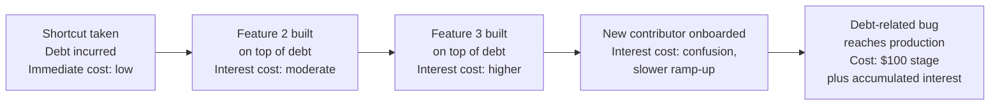

## Technical Debt as Deferred Quality Cost

### Definition and Purpose

Technical debt is a metaphor for the implied future cost of choosing an expedient, lower-quality implementation approach now, in exchange for faster delivery in the present. Unlike the defect-based escalation discussed throughout this chapter — where a specific bug moves through discovery points with increasing cost — technical debt represents a distinct but related phenomenon: a *deliberate or accidental deferral* of quality cost, structured much like a financial loan, complete with an implicit "interest rate" that this topic examines through the lens of the 1-10-100 Rule's cost-escalation logic.

### The Debt Metaphor: Principal and Interest

**Key Points**

- **Principal** — the cost of doing the work properly at the time it was originally needed (the "proper" implementation), which was deferred in favor of a faster, lower-quality alternative.
- **Interest** — the additional cost incurred, on an ongoing basis, as a result of having taken the shortcut: reduced development velocity on related work, increased defect rates in the affected area, and greater difficulty onboarding new contributors to that part of the codebase.
- Unlike a bug (a specific, discrete defect that can be found and fixed), technical debt is a **structural** condition of the codebase — a design or implementation choice that continues to generate cost with every subsequent change made in its vicinity, rather than a single point-in-time cost.

### How Technical Debt Relates to the 1-10-100 Escalation Curve

**Key Points**

- Technical debt can be understood as a *choice* to skip the Prevention Stage's design and architecture review discussed earlier in this curriculum, accepting a known-suboptimal design in exchange for near-term speed — meaning technical debt is often the direct, traceable result of a Prevention Stage shortfall, rather than an entirely separate phenomenon.
- Where a conventional bug's cost escalates as it moves through discrete SDLC phases (as detailed in the Cost of Defects Across the Software Development Lifecycle topic), technical debt's cost escalates as a function of **time and subsequent development activity** in the affected area — every new feature built on top of a debt-laden module inherits and compounds the underlying quality shortfall, echoing the "code built on top of a defect" compounding-cost dynamic discussed in the Core Principle of Exponential Cost Escalation topic.
- [Inference] Because technical debt continues generating interest cost indefinitely until repaid (refactored), rather than being resolved at a single discovery point the way a discrete bug is, its total lifetime cost can exceed even the $100-stage failure costs discussed in the Failure Stage topic if left unaddressed long enough — though unlike a discrete production failure, this cost accrues gradually and is therefore especially susceptible to the coverage bias and interpretation bias pitfalls discussed in the Pitfalls and Biases in Quality Cost Data topic.

### Deliberate versus Accidental Technical Debt

| Type | Description | Relationship to Prevention |
| --- | --- | --- |
| Deliberate, prudent debt | A conscious, documented decision to ship a known-suboptimal solution to meet a deadline, with an explicit plan to address it later | A managed tradeoff, analogous to intentionally deferring some appraisal activity with a documented remediation plan |
| Deliberate, reckless debt | Knowingly shipping a poor solution without any intention or plan to address it later | A Prevention Stage failure compounded by an Appraisal/reporting failure to track the resulting risk |
| Inadvertent, prudent debt | A design that seemed appropriate at the time but is revealed as suboptimal only through later learning (e.g., a design that does not scale to requirements that emerged later) | Not a Prevention Stage failure in the traditional sense — reflects the inherent limits of design-time foresight rather than a skipped review |
| Inadvertent, reckless debt | Poor design resulting from insufficient skill or care, without awareness of the shortfall at the time | A genuine Prevention Stage failure, potentially addressable through the training and review practices discussed in the Prevention Stage and Static Analysis and Code Review topics |

### Visualizing Technical Debt's Compounding Cost Over Time

### Why Technical Debt Is Especially Prone to Underestimation

**Key Points**

- **No single discovery event** — unlike a discrete bug that generates a bug report at a specific moment (as discussed in the Cost of Bugs Found in Requirements versus Testing versus Production topic), technical debt's cost is distributed across many smaller instances of reduced velocity and increased friction, none of which individually stands out as a reportable "incident," making it structurally resistant to the activity-based costing methods covered in the Measuring and Reporting Quality Costs chapter unless those methods are specifically adapted to capture it.
- **Normalization over time** — as discussed in the Illustrative Heuristic versus Literal Cost Multiplier topic's discussion of coverage bias, a persistent condition that everyone on a team has grown accustomed to working around can become invisible as a cost driver, even though the cumulative interest paid remains real.
- **Attribution difficulty** — a slower-than-expected delivery timeline for a new feature might be attributed to the feature's inherent complexity rather than to the technical debt in an adjacent module that made implementation harder than it should have been, echoing the attribution difficulty discussed in the Opportunity Cost of Lost Customer Goodwill topic's discussion of silent, hard-to-trace costs.

### Managing Technical Debt Using Cost of Quality Principles

**Key Points**

- **Tracking debt explicitly, as a backlog item with an estimated interest cost** — rather than leaving technical debt as an informal, undocumented understanding among the team, recording it explicitly (what shortcut was taken, why, and an estimate of its ongoing cost) applies the same measurement discipline discussed in the Methods for Collecting Quality Cost Data topic to a cost category that is otherwise prone to invisibility.
- **Prioritizing debt repayment using the same escalation logic as defect prevention** — debt in a module that many other features depend on (high "interest rate," in the metaphor) should be prioritized for repayment over debt in a rarely-touched, isolated module (low "interest rate"), applying the same cost-benefit logic used elsewhere in this curriculum to prioritize prevention investment where it yields the highest return.
- **Treating debt repayment as a Prevention Stage investment** — refactoring to eliminate technical debt is itself a Prevention Stage activity in the PAF model sense: it does not fix any specific bug, but it reduces the probability of future defects and reduces the cost of future prevention/appraisal activity in the affected area, consistent with the general economic case for prevention investment established in the Prevention Stage and the $1 Cost topic.
- **Distinguishing debt from a simple defect backlog** — because debt is structural rather than a discrete bug, it should not be tracked identically to a conventional bug list; its cost is best expressed in terms of ongoing velocity impact and defect-proneness of the affected area, rather than as a single fixed correction cost.

### When Taking on Technical Debt Is a Reasonable Decision

**Key Points**

- Not all technical debt represents a failure of judgment — the "deliberate, prudent" category in the table above reflects legitimate tradeoffs, particularly when facing a genuine deadline constraint where the alternative to taking on debt is missing a commitment entirely.
- [Inference] Consistent with the broader theme established in the Illustrative Heuristic versus Literal Cost Multiplier topic that the 1-10-100 Rule should inform prioritization rather than dictate every decision rigidly, a reasonable technical debt decision is one made with explicit awareness of the tradeoff and a realistic plan for eventual repayment — the failure mode is not taking on debt itself, but taking it on unknowingly or without any intention of addressing it, which corresponds to the "reckless" categories in the table above.

### Application to Civic/Government Software Development

For a project such as a Local Government Unit document management system, technical debt carries particular considerations given constraints established throughout this curriculum:

- **Smaller teams are especially exposed to debt's interest cost** — given the limited dedicated QA and review capacity discussed in earlier civic-context sections, a small team such as the one developing batac-dms has less slack to absorb the reduced velocity and increased defect-proneness that unaddressed technical debt generates, making explicit debt tracking (as discussed above) disproportionately valuable despite the modest overhead of maintaining it.
- **Contributor turnover amplifies onboarding-related interest cost** — as noted in the Prevention Stage topic's civic-context section regarding contributor turnover (e.g., student developers), undocumented technical debt is a particularly costly form of debt in this context, since new contributors lack the accumulated tacit knowledge that existing team members may have developed for working around it, making explicit documentation of known debt (what shortcut was taken and why) especially valuable for onboarding efficiency.
- **Civic-domain-critical modules warrant debt-repayment priority** — applying the interest-rate-based prioritization logic described above, technical debt in modules governing legally significant functionality (such as document approval workflows referenced throughout this curriculum's civic-context examples) likely warrants earlier repayment priority than debt in less consequential areas, given the audit and public-trust exposure discussed in the Failure Stage topic's civic-context section should a debt-related defect in such a module eventually escape to production.

**Next Steps**

- Technical debt tracking and backlog management practices
- Refactoring prioritization frameworks based on interest-rate estimation
- Documentation practices for reducing onboarding-related debt interest cost
- Distinguishing prudent from reckless technical debt decisions in team practice
- Chapter synthesis: integrating shift-left, static analysis, code review, and debt management into a unified prevention strategy