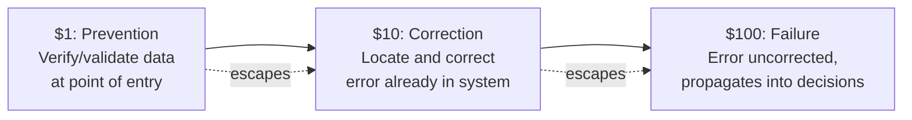

## Thomas Redman's Data Quality Formulation

### Who Thomas Redman Is and Why He Matters to This Chapter

Thomas C. Redman, known professionally as "the Data Doc," is a data quality pioneer who started and led the Data Quality Lab at Bell Labs before founding Navesink Consulting Group (later Data Quality Solutions), and holds a Ph.D. in Statistics. He is widely credited as among the first to extend quality management principles — the same PAF model and cost-of-quality thinking traced to Deming, Juran, and Crosby in the Origin and History of the 1-10-100 Rule topic — specifically into the domain of organizational data.

### Distinguishing Redman's Contribution from the Named "1-10-100 Rule"

**Key Points**

- [Unverified] The specific "1-10-100" terminology and numeric framing is consistently attributed in the sources reviewed for this curriculum to George Labovitz and Yu Sang Chang's 1992 work, as established in the Origin and History of the 1-10-100 Rule topic — this attribution should be treated as the standing account for the named rule itself.
- Redman's own body of work centers on a related but distinct contribution: rather than a single memorable three-number heuristic, he developed comprehensive frameworks, root-cause methodologies, and cost models for understanding *why* bad data is so costly and how organizations should structurally address it — a broader and more detailed treatment of the same underlying phenomenon the 1-10-100 Rule compresses into shorthand.
- This chapter's title, "The 1-10-100 Rule in Data Quality," and this topic's placement within it, reflects that Redman's formulation is best understood as the deeper analytical foundation underlying the data-quality application of the rule, rather than as the rule's original numeric source — a distinction worth holding clearly rather than conflating the two, consistent with this curriculum's general practice of flagging uncertain attributions explicitly.

### Redman's Core Contributions to Data Quality Economics

**Key Points**

- **Root cause elimination over downstream correction** — Redman's approach emphasizes that eliminating the root causes of error is the only sustainable path to data quality improvement, rather than relying on repeated downstream cleansing — a direct data-quality parallel to the Prevention Stage topic's argument that prevention investment yields a categorically better cost profile than correction after the fact.
- **Getting data right the first time** — his practice areas emphasize creating data correctly the first time and addressing the issues that lead to bad data at their source, rather than treating data cleansing as an acceptable ongoing cost of doing business.
- **Reassigning data ownership beyond IT** — a distinctive element of Redman's approach involves getting responsibility for data quality out of IT specifically, and establishing that everyone who touches data has a role to play — a data-quality-specific expression of the cross-functional collaboration principle covered in the Cross Functional Collaboration in Cost Data Gathering topic earlier in this curriculum.
- **Measurement, control, and improvement as a structured discipline** — his frameworks emphasize understanding customer needs for data, measuring data quality systematically, establishing control mechanisms, and pursuing continuous improvement, mirroring the structured PAF-model-based measurement discipline covered throughout the Measuring and Reporting Quality Costs chapter.
- **The scale of the problem** — Redman's work and the broader field he helped establish emphasize that bad data have always cost organizations substantial time and money, and that as organizations increasingly seek to leverage data at scale, the costs become even greater, though often more subtle and harder to trace than in earlier, smaller-scale data environments.

### The Data-Specific Escalation Curve

Applying the general 1-10-100 escalation logic established throughout this curriculum specifically to data, using the terminology most consistently found in data quality literature:

**Key Points**

- The $1 stage corresponds to verifying data accuracy at the point of capture — the cheapest and most effective mechanism for ensuring clean, accurate data, directly paralleling the Prevention Stage topic's emphasis on catching issues before they are introduced.
- The $10 stage corresponds to the cost of locating and correcting an error once it has already entered the system, requiring active remediation effort rather than passive verification — paralleling the Correction and Detection Stage topic's combined detection-and-correction cost structure.
- The $100 stage corresponds to the cost incurred when an error is left uncorrected and propagates downstream into business decisions, communications, or operations — an uncorrected address causing a failed delivery, or flawed data underlying a business decision, both illustrate this terminal stage.

### Why Data Errors Compound Distinctively Compared to Manufacturing or Software Defects

**Key Points**

- **Propagation through derived data** — a single erroneous data point can be copied, aggregated, joined, and transformed into numerous downstream datasets and reports before detection, meaning a data error's "blast radius" can expand far more rapidly than a typical manufacturing or software defect's, since data replication is nearly costless compared to physical or even code duplication.
- **Compounding into decisions, not just artifacts** — where a manufacturing defect corrupts a physical unit and a software bug corrupts a specific code path, a data error can corrupt a business decision itself — a flawed customer segmentation, a mistaken inventory forecast — extending the failure's consequences into domains entirely outside the data system itself.
- **"Garbage in, garbage out" as a compounding principle** — data models, forecasts, and analytical outputs are only as reliable as the data feeding them, meaning a single upstream data quality failure can silently degrade the reliability of every downstream analytical or decision-making process that consumes that data, echoing the coverage bias and silent-failure concerns discussed in the Pitfalls and Biases in Quality Cost Data topic.
- [Inference] This distinctive propagation pattern likely explains why Redman's emphasis on root-cause elimination is particularly pronounced in the data quality domain specifically, relative to manufacturing or software contexts: because a single data error's downstream copies are so difficult to fully trace and correct once dispersed, preventing the error at its point of origin carries even greater relative value than the general Prevention Stage argument established earlier in this curriculum would suggest for other domains.

### Illustrative Example

**Example**

Consider a civic records system where a citizen's address is entered incorrectly at the point of data capture:

- **At the $1 stage**: an address validation check at the point of entry (analogous to the point-of-capture verification discussed above) catches the malformed entry immediately, requiring only that the citizen or clerk re-enter the correct address — negligible cost.
- **At the $10 stage**: if the error escapes entry-point validation, it might later be caught during a periodic data quality audit or when a mailing bounces, requiring a staff member to locate the record, investigate, and correct it — a moderate cost involving active remediation effort.
- **At the $100 stage**: if uncorrected, the erroneous address might propagate into subsequent mailings, be relied upon for a legally significant notice (such as a hearing notification), and result in a failed delivery with downstream consequences — potentially including the civic-specific compliance and public-trust costs discussed in the Failure Stage topic's civic-context section.

### Application to Civic/Government Software Development

For a project such as a Local Government Unit document management system, Redman's data-quality-specific framework offers guidance that extends beyond the general software 1-10-100 principles covered in the preceding chapter:

- **Data ownership beyond the development team** — Redman's emphasis on getting data quality responsibility out of a narrow technical function and distributing it to everyone who touches the data is directly relevant to a civic system where LGU office staff, not just developers, are responsible for data entry and stewardship; establishing clear data quality ownership among the clerks and staff who enter records may be as important as the technical validation logic discussed in the Static Analysis and Code Review as Prevention topic.
- **Point-of-entry validation as the highest-leverage civic data investment** — given the propagation risk described above, and the legal/procedural significance of civic records discussed throughout this curriculum's civic-context sections, investing in robust point-of-entry validation for citizen-submitted or staff-entered data is likely to be one of the highest-leverage prevention investments available to a project like batac-dms, since a single erroneous record could propagate into multiple downstream civic processes and legally significant documents.
- **Root-cause thinking for recurring data quality issues** — consistent with Redman's root-cause-elimination emphasis, a pattern of recurring data entry errors in a specific field (e.g., a particular document type's date field) should prompt investigation into the underlying cause (unclear form design, ambiguous instructions, insufficient training) rather than repeated individual corrections, applying the same root-cause discipline established in the Correction and Detection Stage topic's discussion of feeding findings back into prevention practices.

**Next Steps**

- Data validation and verification techniques at point-of-entry
- Root cause analysis methodologies for recurring data quality issues
- Data ownership and stewardship models distributing responsibility beyond IT
- Data lineage and propagation tracking for civic records systems
- Master Data Management (MDM) principles as applied to government data systems