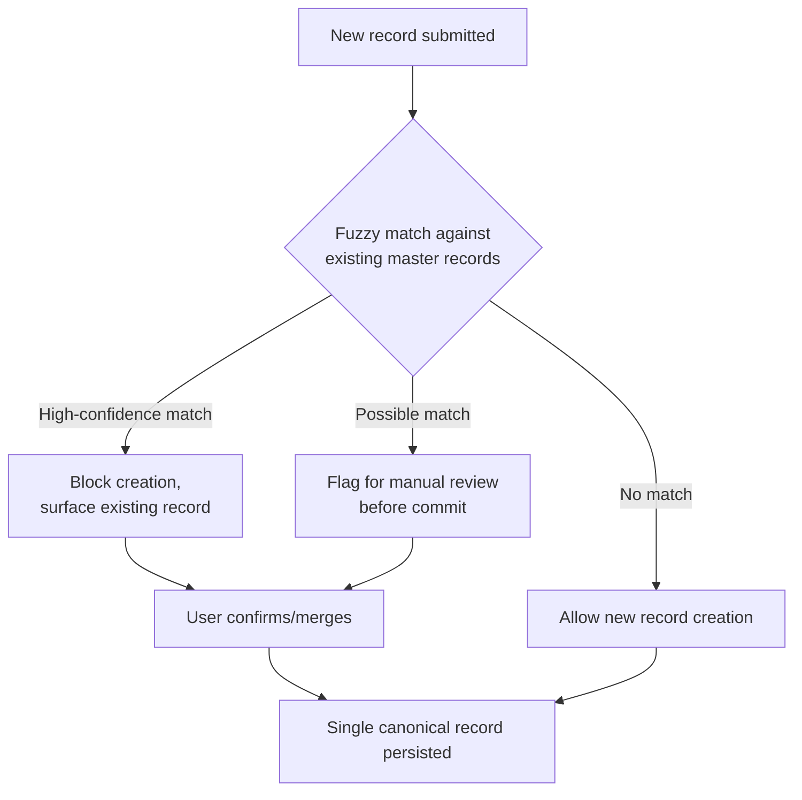

## Cost of Errors at the Point of Data Entry

### Definition and Context

The **1-10-100 Rule** is a cost-escalation model originally articulated in general quality management (traceable to George Labovitz and Yu Sang Chang's work on quality costs, and popularized further in data quality literature by practitioners like Thomas Redman) that quantifies how the cost of correcting an error multiplies at each subsequent stage of a process. In the data quality domain, the rule states:

- **$1** — the cost to *prevent* or *verify* a data error at the point of entry (prevention cost)
- **$10** — the cost to *correct* that same error after it has entered downstream systems (correction cost)
- **$100** — the cost of *failure* if the error is left unaddressed and propagates into decisions, reports, or customer-facing outcomes (failure cost)

This item focuses specifically on the first tier: the **$1 point** — errors at the moment of data entry, why they are the cheapest to address, and the technical mechanisms available to intercept them before they enter a data pipeline.

### Why the Point of Entry Is the Cheapest Intervention Point

At the point of data entry, the error exists in a single, isolated, well-understood context:

1. **Full context availability** — the person or system entering the data has direct access to the source of truth (a customer on the phone, a sensor reading a physical value, an operator reading a physical document). This context is lost almost immediately once the record moves downstream.
2. **No propagation yet** — the value has not been copied, joined, aggregated, cached, or used to derive other values. Zero downstream artifacts depend on it.
3. **No compounding referential dependencies** — no foreign keys, no denormalized copies, no materialized views, no ML training sets have consumed the bad value.
4. **Single correction locus** — fixing the value requires touching exactly one record in one system, as opposed to hunting across N downstream tables, dashboards, or exports.

Formally, the escalation can be modeled as a multiplicative cost function across stages $i = 0, 1, 2, \ldots, n$ (entry, storage, integration, consumption, decision):

$$C_{total} = C_0 \cdot k^{i}$$

Where $C_0$ is the base prevention cost and $k$ is the empirically observed escalation factor per stage (commonly cited as $k \approx 10$, though real-world figures vary by industry and system complexity — this specific multiplier is [Unverified] as a universal constant and should be treated as an illustrative heuristic rather than a measured law).

### Categories of Point-of-Entry Errors

| Category | Description | Example |
| --- | --- | --- |
| **Syntactic errors** | Value violates format/type rules | Email missing `@`, phone number with letters |
| **Semantic errors** | Value is syntactically valid but factually wrong | Valid ZIP code that doesn't match the given city |
| **Completeness errors** | Required field left blank or defaulted incorrectly | Null `customer_id` on an order |
| **Duplication errors** | Same real-world entity entered as a new record | Creating a second customer record for an existing person |
| **Referential errors** | Foreign key references a non-existent or wrong parent | Order entered against a deactivated SKU |
| **Precision/unit errors** | Correct number, wrong scale or unit | Entering `50` (kg) into a field expecting grams |
| **Transcription errors** | Human copy/typing mistakes | Digit transposition: `12345` → `12435` |

### Technical Mechanisms for Point-of-Entry Prevention

#### 1. Schema-Level Constraints (Database Layer)

The cheapest and most durable defense is enforcing constraints directly in the schema, since this guarantees rejection regardless of which application writes to the table.

```sql
CREATE TABLE customer_orders (
    order_id        BIGINT GENERATED ALWAYS AS IDENTITY PRIMARY KEY,
    customer_id     BIGINT NOT NULL REFERENCES customers(customer_id),
    order_email     VARCHAR(255) NOT NULL
        CHECK (order_email ~* '^[A-Za-z0-9._%+-]+@[A-Za-z0-9.-]+\.[A-Za-z]{2,}$'),
    order_quantity  INTEGER NOT NULL CHECK (order_quantity > 0),
    unit_price_cents INTEGER NOT NULL CHECK (unit_price_cents >= 0),
    currency_code   CHAR(3) NOT NULL DEFAULT 'USD'
        CHECK (currency_code IN ('USD','EUR','GBP','JPY')),
    created_at      TIMESTAMPTZ NOT NULL DEFAULT now()
);
```

Key mechanisms:

- `NOT NULL` — enforces completeness
- `CHECK` constraints — enforce syntactic and range validity
- `FOREIGN KEY` — enforces referential integrity
- `UNIQUE` / composite unique indexes — prevent duplication at the record level

#### 2. Application-Layer Validation (Form/API Layer)

Schema constraints alone provide a poor user experience (a raw database rejection). Application-layer validation gives immediate, actionable feedback *before* the write is even attempted.

**Example — JSON Schema validation for an API ingesting entry-point data:**

```json
{
  "$schema": "http://json-schema.org/draft-07/schema#",
  "title": "CustomerEntryPayload",
  "type": "object",
  "required": ["customerId", "email", "orderQuantity", "unitPriceCents"],
  "properties": {
    "customerId": { "type": "integer", "minimum": 1 },
    "email": {
      "type": "string",
      "format": "email",
      "maxLength": 255
    },
    "orderQuantity": { "type": "integer", "minimum": 1, "maximum": 10000 },
    "unitPriceCents": { "type": "integer", "minimum": 0 },
    "currencyCode": {
      "type": "string",
      "enum": ["USD", "EUR", "GBP", "JPY"]
    }
  },
  "additionalProperties": false
}
```

**Example — Pydantic model (Python) enforcing the same rules at the application boundary:**

```python
from pydantic import BaseModel, EmailStr, Field, field_validator

class CustomerOrderEntry(BaseModel):
    customer_id: int = Field(..., gt=0)
    email: EmailStr
    order_quantity: int = Field(..., ge=1, le=10_000)
    unit_price_cents: int = Field(..., ge=0)
    currency_code: str = Field(default="USD")

    @field_validator("currency_code")
    @classmethod
    def validate_currency(cls, v: str) -> str:
        allowed = {"USD", "EUR", "GBP", "JPY"}
        if v not in allowed:
            raise ValueError(f"currency_code must be one of {allowed}")
        return v
```

This pattern rejects malformed payloads with a structured error response, in milliseconds, before any I/O against the persistence layer occurs — this is the literal "$1" moment.

#### 3. UI-Level Guardrails (Human Entry Layer)

For human-entered data, the UI itself is the first line of defense:

- **Constrained inputs**: dropdowns/enums instead of free text wherever the domain is closed (e.g., country, state, currency)
- **Input masks**: phone numbers, dates, credit cards formatted as typed
- **Real-time inline validation**: red/green field states before submission, not after
- **Autocomplete against master data**: typing a customer name suggests existing matching records, reducing duplicate creation
- **Confirmation/double-entry for high-risk fields**: e.g., re-typing an email or bank account number
- **Default-to-blank over default-to-guess**: forcing explicit entry rather than silently defaulting a field to a value that may be wrong

#### 4. Real-Time Reference/Lookup Validation

Some errors are only detectable against an external or master reference source, not by format rules alone:

```python
def validate_zip_matches_city(zip_code: str, city: str, state: str) -> bool:
    """
    Cross-references a submitted ZIP/city/state combination against
    a reference geographic dataset before allowing entry to persist.
    """
    reference_record = geo_lookup_service.get(zip_code=zip_code)
    if reference_record is None:
        return False
    return (
        reference_record.city.lower() == city.lower()
        and reference_record.state.upper() == state.upper()
    )
```

This class of check catches **semantic** errors that syntactic/schema validation cannot — a ZIP code can be perfectly well-formed and still not correspond to the stated city.

#### 5. Entity Resolution at Entry (Duplicate Prevention)

Duplication is one of the most expensive downstream error classes because it doesn't just corrupt one record — it fragments an entity's history across two or more records, breaking every join, aggregate, and analytics query against that entity.



Common techniques: deterministic key matching (exact match on normalized email/phone), probabilistic/fuzzy matching (Levenshtein distance, Jaro-Winkler similarity on name fields), and blocking strategies to keep the candidate-match search space tractable at entry-time latency.

### Quantitative Illustration of the Rule

| Stage | Action | Illustrative Unit Cost | Cumulative Multiplier |
| --- | --- | --- | --- |
| Entry | Field-level validation catches a malformed email | $1 | 1× |
| Storage/ETL | Data quality job in the warehouse flags and manually corrects the same error post-load | $10 | 10× |
| Consumption | Marketing campaign sends to the bad address, bounces, damages sender reputation, and the resulting bad segment skews a downstream model | $100 | 100× |

These figures are illustrative order-of-magnitude anchors popularized in quality-management literature, not derived from a universal empirical constant — actual ratios are [Inference] and vary significantly by industry, data criticality, and system architecture.

### Point-of-Entry Error Cost Diagram

<svg xmlns="http://www.w3.org/2000/svg" viewBox="0 0 760 300" font-family="Arial, sans-serif">
<text x="380" y="24" text-anchor="middle" font-size="16" font-weight="bold">1-10-100 Rule — Cost Escalation by Stage (svg_diagram)</text>

<line x1="80" y1="250" x2="720" y2="250" stroke="#333" stroke-width="2" />
<line x1="80" y1="250" x2="80" y2="50" stroke="#333" stroke-width="2" />
<text x="30" y="255" font-size="12">\$0</text>
<text x="20" y="60" font-size="12">\$100+</text>

<rect x="150" y="235" width="100" height="15" fill="#4CAF50" />
<text x="200" y="270" text-anchor="middle" font-size="13" font-weight="bold">Entry</text>
<text x="200" y="225" text-anchor="middle" font-size="13">\$1</text>

<rect x="350" y="180" width="100" height="70" fill="#FF9800" />
<text x="400" y="270" text-anchor="middle" font-size="13" font-weight="bold">Storage</text>
<text x="400" y="170" text-anchor="middle" font-size="13">\$10</text>

<rect x="550" y="60" width="100" height="190" fill="#F44336" />
<text x="600" y="270" text-anchor="middle" font-size="13" font-weight="bold">Consumption</text>
<text x="600" y="50" text-anchor="middle" font-size="13">\$100</text>
</svg>

### Organizational and Process Considerations

- **Ownership at entry**: assign explicit data stewardship to the role generating the data, not solely to downstream data/analytics teams — the closer accountability sits to the entry point, the earlier errors surface.
- **Feedback loop latency**: the value of entry-point validation degrades sharply if the feedback isn't immediate; batch-mode validation reports delivered days later reintroduce most of the "$10" cost because the entry-time context is already gone.
- **False-positive cost tradeoff**: overly strict entry-point validation can block legitimate edge-case data (e.g., valid international phone formats rejected by a US-centric regex), which shifts cost in the opposite direction — lost transactions or user frustration. Validation rules should be tuned against real-world data distributions, not just theoretical purity.
- **Training and UX design**: a meaningful share of entry errors are transcription/human errors; well-designed forms, autofill, and confirmation steps reduce error rates as effectively as backend constraints, often more cheaply.

**Related Topics**

- The "$10" Tier: Cost of Correction in Downstream Systems and ETL Pipelines
- The "$100" Tier: Cost of Failure in Decision-Making and Customer Impact
- Master Data Management (MDM) and Entity Resolution Strategies
- Data Contracts and Schema Enforcement in Producer-Consumer Pipelines
- Data Quality Dimensions: Accuracy, Completeness, Consistency, Timeliness, Validity, Uniqueness
- Root Cause Analysis for Recurring Data Entry Defects
- Cost-Benefit Modeling for Data Quality Investment (ROI of Prevention vs. Detection)