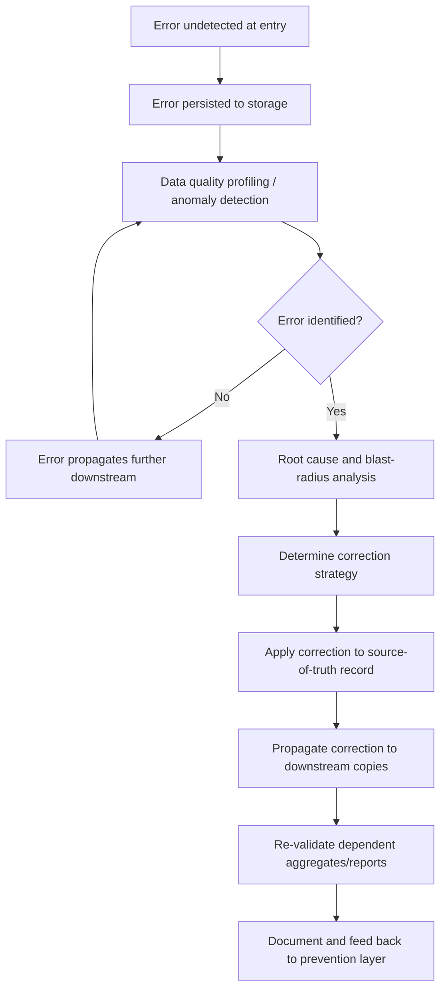
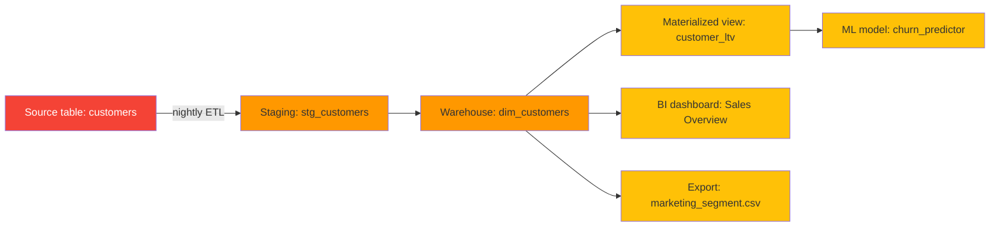

## Cost of Data Cleansing and Correction

### Definition and Context

This item corresponds to the **$10 tier** of the 1-10-100 Rule — the cost incurred when a data error is *not* caught at the point of entry and must instead be detected and corrected after it has already been written to storage and begun propagating through downstream systems (warehouses, integrations, reports, applications). The order-of-magnitude jump from $1 to $10 reflects the shift from a single-record, single-context fix to a multi-system, multi-touch remediation effort.

Where point-of-entry prevention is a *gatekeeping* activity, cleansing and correction is a *remediation* activity: the error already exists, has potentially been copied or joined into other structures, and now requires detection tooling, root-cause tracing, and controlled correction across every location it has spread to.

### Why the Cost Multiplies at This Stage

At the point of entry, an error is isolated and fully contextualized. By the time it reaches the cleansing stage, several cost-inflating conditions have typically emerged:

1. **Loss of original context** — the person or system that produced the value is no longer in the loop; correcting it now requires either inferring the correct value or going back to the source, which is slower and less reliable.
2. **Propagation and duplication** — the bad value may have been copied into staging tables, materialized views, caches, exports, or replicated to other systems via ETL/ELT jobs.
3. **Referential ripple effects** — if the erroneous value was a key or was joined against, downstream aggregates, rollups, and derived tables built on top of it are now also wrong.
4. **Detection overhead** — someone (or some automated process) first has to *notice* the error exists, which itself requires profiling, anomaly detection, or a downstream failure to surface it.
5. **Correction risk** — fixing a value after the fact requires care to avoid corrupting related records, breaking foreign key relationships, or violating idempotency assumptions in downstream jobs that already consumed the bad value.

### The Data Cleansing Lifecycle



### Categories of Cleansing Work

| Category | Description | Typical Technique |
| --- | --- | --- |
| **Standardization** | Normalizing inconsistent representations of the same concept | `"NY"`, `"N.Y."`, `"New York"` → canonical `"NY"` |
| **Deduplication** | Merging multiple records referring to the same entity | Fuzzy matching, survivorship rules |
| **Missing value imputation** | Filling gaps left by incomplete entry | Statistical imputation, lookup-based backfill |
| **Outlier/anomaly correction** | Identifying and correcting statistically implausible values | Z-score, IQR-based flagging, domain rule checks |
| **Referential repair** | Fixing broken or mismatched foreign key relationships | Re-linking orphaned records to correct parent |
| **Format normalization** | Converting inconsistent formats into a single standard | Date formats, phone number formats, units |
| **Cross-system reconciliation** | Resolving conflicting values for the same entity across systems | Golden record / MDM merge logic |

### Technical Detection Mechanisms

#### 1. Statistical Profiling for Anomaly Detection

Before correction can happen, the error must be found. Profiling jobs run against stored data to surface likely defects that entry-point validation missed (or that only became detectable in aggregate).

```python
import pandas as pd

def profile_numeric_column(df: pd.DataFrame, column: str) -> dict:
    """
    Flags likely-erroneous values in a numeric column using IQR-based
    outlier detection — a common first-pass technique for surfacing
    unit/precision errors that slipped past entry-point validation.
    """
    q1 = df[column].quantile(0.25)
    q3 = df[column].quantile(0.75)
    iqr = q3 - q1
    lower_bound = q1 - 1.5 * iqr
    upper_bound = q3 + 1.5 * iqr

    outliers = df[(df[column] < lower_bound) | (df[column] > upper_bound)]

    return {
        "column": column,
        "lower_bound": lower_bound,
        "upper_bound": upper_bound,
        "outlier_count": len(outliers),
        "outlier_row_ids": outliers.index.tolist(),
    }
```

#### 2. Data Quality Rule Engines (Post-Hoc Validation)

Tools such as **Great Expectations**, **dbt tests**, or **Deequ** (Spark) run declarative rule suites against already-persisted data to catch what entry-point checks missed, especially cross-record and cross-table rules that aren't feasible to check per-record at write time.

**Example — Great Expectations style expectation suite:**

```python
import great_expectations as gx

context = gx.get_context()
validator = context.sources.pandas_default.read_csv("orders.csv")

validator.expect_column_values_to_not_be_null("customer_id")
validator.expect_column_values_to_match_regex(
    "email", r"^[A-Za-z0-9._%+-]+@[A-Za-z0-9.-]+\.[A-Za-z]{2,}$"
)
validator.expect_column_values_to_be_between(
    "order_quantity", min_value=1, max_value=10000
)
validator.expect_column_pair_values_A_to_be_greater_than_B(
    "shipped_date", "order_date"
)

results = validator.validate()
```

**Example — dbt test (YAML) for referential and uniqueness checks against a warehouse table:**

```yaml
models:
  - name: fct_orders
    columns:
      - name: customer_id
        tests:
          - not_null
          - relationships:
              to: ref('dim_customers')
              field: customer_id
      - name: order_id
        tests:
          - unique
          - not_null
```

Rule engines like this run on a schedule (e.g., nightly in the pipeline) or on every model build, surfacing failures as tickets/alerts rather than blocking the original write — which is precisely why remediation here costs more: the bad data has already been live for some interval.

#### 3. Root Cause and Blast-Radius Analysis

Before correcting a value, cleansing work requires understanding *where else* the bad value has propagated. This is where data lineage tooling becomes essential.



A single bad `customer` record can silently corrupt a materialized view, a live BI dashboard, an exported marketing segment, and a churn-prediction model's training data — each of which now requires its own correction/re-run once the source is fixed. This fan-out is the concrete mechanism behind the "×10" cost multiplier.

#### 4. Correction Strategies

**Direct correction (source-of-truth update):**

```sql
-- Correct the source record; downstream systems must then be
-- re-synced or re-materialized to pick up the fix.
UPDATE customers
SET email = 'jane.doe@example.com'
WHERE customer_id = 48213
  AND email = 'jane.doe@examplecom';  -- known malformed value

-- Log the correction for auditability and feedback into
-- prevention-layer rule tuning.
INSERT INTO data_quality_corrections (
    table_name, record_id, column_name,
    old_value, new_value, corrected_by, corrected_at
) VALUES (
    'customers', 48213, 'email',
    'jane.doe@examplecom', 'jane.doe@example.com',
    'data_steward_042', now()
);
```

**Deduplication / survivorship merge:**

```python
def merge_duplicate_customers(primary_id: int, duplicate_id: int, conn):
    """
    Merges a duplicate customer record into the canonical (primary)
    record, re-pointing all foreign key references before deleting
    the duplicate. Must run inside a transaction to avoid partial
    re-linking if the process fails midway.
    """
    with conn.begin():
        conn.execute(
            "UPDATE orders SET customer_id = :primary "
            "WHERE customer_id = :dup",
            {"primary": primary_id, "dup": duplicate_id}
        )
        conn.execute(
            "UPDATE support_tickets SET customer_id = :primary "
            "WHERE customer_id = :dup",
            {"primary": primary_id, "dup": duplicate_id}
        )
        conn.execute(
            "DELETE FROM customers WHERE customer_id = :dup",
            {"dup": duplicate_id}
        )
```

Note the transactional wrapping — a partially applied correction (e.g., orders re-pointed but support tickets not) can introduce a *second*, harder-to-detect inconsistency on top of the original one, which is a common failure mode in manual or poorly-orchestrated cleansing work.

### Cost Drivers Specific to This Tier

| Driver | Effect on Cost |
| --- | --- |
| **Number of downstream copies** | Each materialized/replicated copy needing re-sync adds labor and compute cost |
| **Manual vs. automated detection** | Manual profiling/spot-checking is slower and less consistent than scheduled rule engines |
| **Time-to-detection** | The longer an error goes unnoticed, the more downstream artifacts have consumed it |
| **Correction tooling maturity** | Ad hoc `UPDATE` scripts are riskier and slower than governed MDM/stewardship workflows |
| **Audit/compliance requirements** | Regulated domains (finance, healthcare) require documented correction trails, adding process overhead |
| **Re-computation cost** | Correcting a value that feeds aggregates/ML features may require expensive re-runs of pipelines or model retraining |

### Illustrative Cost Comparison

| Stage | Representative Activities | Illustrative Unit Cost |
| --- | --- | --- |
| Entry ($1 tier) | Field validation rejects malformed input immediately | $1 |
| **Cleansing ($10 tier)** | Profiling job flags anomaly → analyst traces lineage → source corrected → 3 downstream copies re-synced | **$10** |
| Failure ($100 tier) | Uncorrected error reaches a decision, report, or customer-facing system | $100 |

As with the entry-point tier, these figures are illustrative anchors from quality-management heuristics rather than a measured universal ratio — the actual multiplier is [Inference] and depends heavily on system architecture, degree of data replication, and organizational process maturity.

### Organizational Practices That Reduce This Tier's Cost

- **Shift-left feedback loops**: feed cleansing findings back into entry-point validation rules so the *same* defect class doesn't recur (turning a recurring $10 cost into a one-time $1 fix going forward).
- **Data observability platforms**: continuous automated monitoring (freshness, volume, schema, distribution checks) reduces time-to-detection, which directly compresses the blast radius before correction.
- **Centralized lineage metadata**: makes blast-radius analysis a lookup rather than a manual investigation.
- **Idempotent, re-runnable pipelines**: allow downstream re-materialization after a source correction without manual reconciliation of partial states.
- **Data stewardship ownership**: assigning clear accountability for specific domains (customer data, product data) shortens the cycle between detection and correction.

**Related Topics**

- The "$1" Tier: Cost of Errors at the Point of Data Entry
- The "$100" Tier: Cost of Failure in Decision-Making and Customer Impact
- Data Lineage and Blast-Radius Analysis
- Data Observability Platforms (Monte Carlo, Soda, Bigeye-style architectures)
- Master Data Management (MDM) and Survivorship Rules
- Data Quality Rule Engines: Great Expectations, dbt Tests, Deequ
- Feedback Loops Between Detection and Prevention Layers