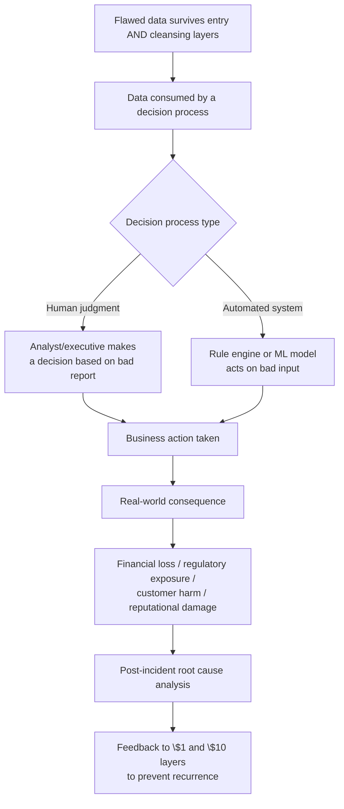
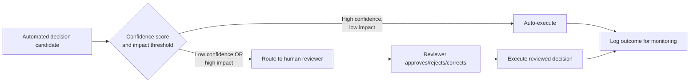

## Cost of Decisions Made on Flawed Data

### Definition and Context

This item corresponds to the **$100 tier** of the 1-10-100 Rule — the terminal and most expensive stage, reached when a data error is neither caught at entry ($1) nor detected and cleansed downstream ($10), and instead survives all the way into a consumed decision: a business decision, an automated action, a customer-facing output, or a regulatory filing. At this point the cost is no longer a data-correction cost at all — it is a **business outcome cost**, and it is frequently irreversible or only partially recoverable.

The qualitative shift at this tier is important: the $1 and $10 tiers deal in *data remediation cost* (engineer-hours, compute, tooling). The $100 tier deals in *consequence cost* — lost revenue, damaged trust, regulatory penalties, misallocated capital, or unsafe outcomes — which is categorically harder to bound and often exceeds the "100×" figure by a wide margin in real incidents.

### Why Cost Escalates Non-Linearly at This Tier

1. **Irreversibility** — a shipped product, a sent communication, an executed trade, or a denied loan cannot be silently "corrected" the way a database row can; the action has already occurred in the real world.
2. **Compounding on top of compounding** — the flawed value has typically already survived propagation (from the $10 tier) *and* been combined with other data in a model, aggregate, or human judgment process, so the output is a compound error, not a direct pass-through of the original defect.
3. **Loss of attribution** — by the time a bad decision surfaces, it is often difficult to trace back to the single originating data error, making root-cause analysis itself expensive.
4. **Second-order effects** — a wrong decision can trigger further downstream decisions (e.g., a wrong inventory count triggers a wrong purchasing decision, which triggers a wrong cash-flow forecast).
5. **Trust and reputational damage** — unlike a corrected database value, damaged customer or stakeholder trust does not fully "revert" once the underlying data is fixed.

### The Decision-Failure Pathway



### Categories of Decision-Layer Failure

| Category | Description | Example |
| --- | --- | --- |
| **Strategic misallocation** | Capital, headcount, or inventory allocated based on wrong aggregate figures | Overstocking a SKU due to a duplicated-sales artifact inflating demand forecasts |
| **Customer-facing harm** | Wrong information or action reaches an end customer | Incorrect billing amount charged due to a bad unit conversion upstream |
| **Regulatory/compliance exposure** | Filings, disclosures, or audits built on flawed data | Incorrect financial figures submitted in a regulatory report |
| **Automated system mis-action** | An ML model or rules engine acts on bad input without human review | Fraud detection model trained on mislabeled transactions approves fraudulent activity |
| **Reputational/trust damage** | Public-facing error erodes stakeholder confidence | Publicly reported statistic later retracted due to a data quality defect |
| **Safety-critical failure** | In domains like healthcare, logistics, or industrial control, decision errors can cause physical harm | Incorrect dosage calculation traced to a unit-of-measure entry error |

### Technical and Organizational Mechanisms Operating at This Tier

#### 1. Decision Provenance and Explainability

Once flawed data has influenced a decision, tracing *which specific inputs* drove that decision is essential both for remediation and for preventing recurrence. This is where model/decision explainability tooling matters.

```python
import shap

def explain_decision(model, input_row, background_data):
    """
    Uses SHAP (SHapley Additive exPlanations) to attribute a model's
    output decision back to individual input features — critical for
    post-incident analysis when a downstream decision (e.g., a credit
    denial or fraud flag) is suspected to have been driven by a
    flawed upstream data field.
    """
    explainer = shap.Explainer(model, background_data)
    shap_values = explainer(input_row)
    return {
        "feature_contributions": dict(
            zip(input_row.columns, shap_values.values[0])
        ),
        "base_value": shap_values.base_values[0],
    }
```

Without this kind of attribution, tracing a bad automated decision back to a single upstream data defect can itself become a costly, multi-week investigation — a secondary cost layered on top of the $100 consequence.

#### 2. Circuit Breakers and Decision Gating

A key architectural pattern for containing $100-tier cost is preventing automated systems from acting on data that fails sanity checks, even if that data passed earlier validation layers (which may not have anticipated every failure mode).

```python
class DecisionGate:
    """
    Wraps an automated decision function with a sanity-check layer.
    Even if data passed upstream schema/cleansing validation, this
    gate applies decision-specific plausibility checks immediately
    before an irreversible action is taken — the last line of
    defense before the \$100 cost is incurred.
    """
    def __init__(self, decision_fn, sanity_checks: list):
        self.decision_fn = decision_fn
        self.sanity_checks = sanity_checks

    def execute(self, input_data: dict):
        for check in self.sanity_checks:
            if not check(input_data):
                raise DecisionBlockedError(
                    f"Sanity check '{check.__name__}' failed; "
                    f"decision blocked pending manual review."
                )
        return self.decision_fn(input_data)


def check_order_value_plausible(data: dict) -> bool:
    # Blocks an automated fulfillment decision if the order value
    # is implausibly large relative to the customer's history —
    # catching e.g. a unit/decimal error that slipped through
    # both entry and cleansing layers.
    return data["order_value"] <= data["customer_avg_order_value"] * 20
```

This pattern is the direct architectural response to the $100 tier: rather than trusting that upstream layers caught everything, high-stakes automated decisions get an additional, narrowly scoped plausibility check immediately before the irreversible action.

#### 3. Human-in-the-Loop Escalation for High-Stakes Decisions

For decisions above a defined risk/impact threshold, routing to human review — rather than full automation — is a deliberate cost-tradeoff: it accepts slower throughput in exchange for avoiding the (much larger and less bounded) cost of an automated bad decision at scale.



#### 4. Post-Incident Root Cause and Feedback Loop

The defining organizational response at this tier is a formal post-incident process that traces the $100-tier failure back through the $10 and $1 layers, and closes the loop by strengthening prevention rules — converting a one-time $100 loss into permanent risk reduction rather than a recurring exposure.

```mermaid
flowchart TD
    A[\$100 incident detected] --> B[Incident review /<br/>postmortem process]
    B --> C[Trace back through lineage<br/>to originating data defect]
    C --> D[Identify which layer failed<br/>to catch the defect]
    D --> E{Which layer failed?}
    E -->|Entry layer| F[Add/strengthen entry-point<br/>validation rule]
    E -->|Cleansing layer| G[Add new profiling/rule-engine<br/>check for this defect class]
    E -->|Decision layer| H[Add new sanity check or<br/>human-review threshold]
    F --> I[Prevention posture improved]
    G --> I
    H --> I
```

### Quantifying and Bounding $100-Tier Cost

Unlike the $1 and $10 tiers, where costs are largely bounded by engineering effort (labor-hours, compute), $100-tier costs are often **open-ended** and domain-specific:

$$C_{decision} = C_{direct} + C_{secondary} + C_{reputational}$$

Where:

- $C_{direct}$ — immediate, quantifiable loss (e.g., refunds issued, regulatory fine, misallocated inventory value)
- $C_{secondary}$ — cascading costs (e.g., customer churn triggered by the incident, cost of the post-incident review itself)
- $C_{reputational}$ — the least quantifiable component; often estimated only indirectly via customer retention metrics or brand-perception studies

Because $C_{reputational}$ in particular resists precise measurement, real-world $100-tier costs are frequently reported as *order-of-magnitude* estimates rather than precise figures — treat any specific multiplier claimed for a given organization or incident as [Unverified] unless sourced from that organization's own disclosed post-incident analysis.

### Illustrative Cost Comparison Across All Three Tiers

| Stage | Representative Activities | Illustrative Unit Cost | Reversibility |
| --- | --- | --- | --- |
| Entry ($1) | Field validation rejects malformed input at submission | $1 | Fully reversible, near-zero effort |
| Cleansing ($10) | Profiling flags anomaly; source corrected; downstream copies re-synced | $10 | Reversible, moderate effort |
| **Decision ($100)** | Flawed data drives a real-world action: shipment, charge, filing, model output | **$100** | Often irreversible or only partially recoverable |

### Organizational Practices That Contain This Tier's Cost

- **Decision-impact tiering**: classify decisions by blast radius/irreversibility and apply proportionally stricter gating (automated sanity checks, human review) to the highest-impact tier.
- **Circuit breakers on automated pipelines**: hard stops that halt an automated decision pipeline when input data deviates from expected statistical bounds, rather than allowing "confidently wrong" execution.
- **Blameless post-incident reviews**: focused on process/tooling gaps rather than individual fault, to maximize the quality and honesty of the root-cause trace back to the $1/$10 layers.
- **Cost-of-quality reporting to leadership**: making $100-tier incidents visible in financial terms secures ongoing investment in the cheaper $1/$10 prevention layers, closing the business case loop that justifies the entire 1-10-100 framework.
- **Scenario/impact simulation**: modeling "what if this specific field were wrong" against critical decision pathways *before* an incident occurs, to proactively identify which entry-point or cleansing gaps carry the highest downstream risk.

**Related Topics**

- The "$1" Tier: Cost of Errors at the Point of Data Entry
- The "$10" Tier: Cost of Data Cleansing and Correction
- Decision Provenance and Model Explainability (SHAP, LIME)
- Circuit Breaker Patterns in Automated Decision Systems
- Human-in-the-Loop Escalation Design for High-Stakes Automation
- Post-Incident Root Cause Analysis and Blameless Postmortems
- Building a Cost-of-Quality Business Case for Data Quality Investment