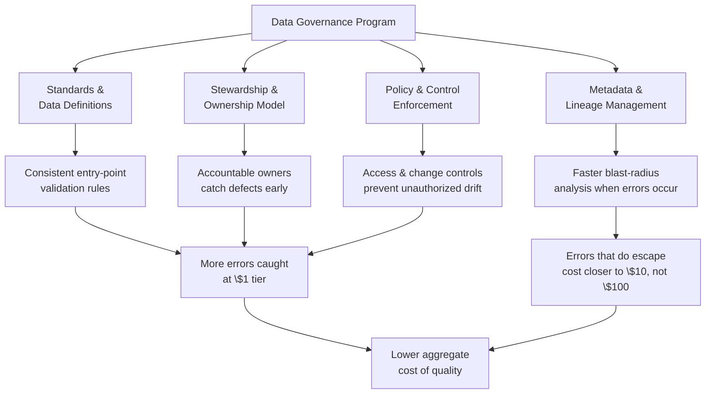
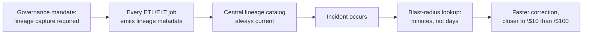
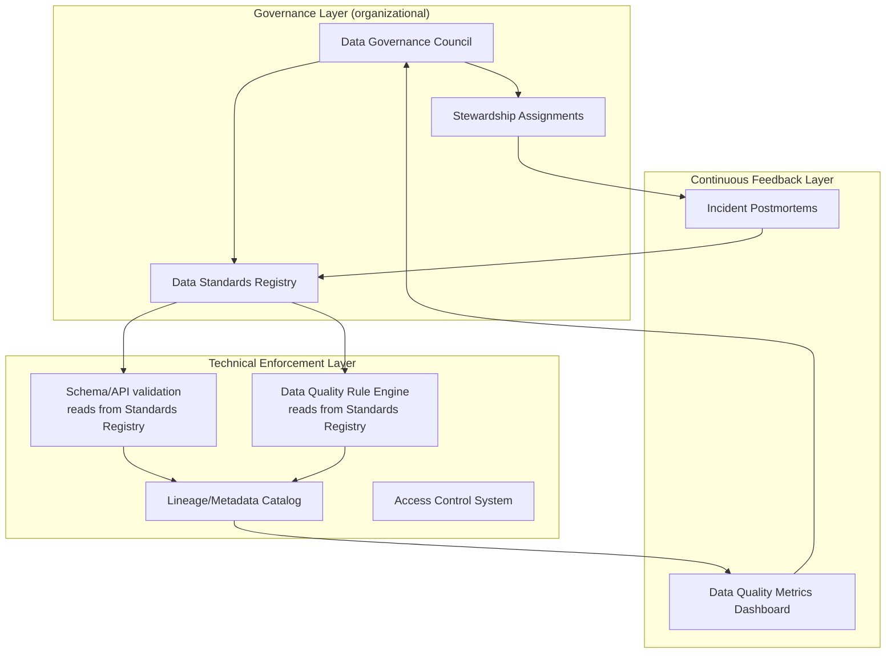

## Data Governance as Prevention Investment


### Definition and Context

Data governance is the system of policies, roles, standards, and technical controls that define how data is created, validated, accessed, and maintained across an organization. Within the 1-10-100 Rule framework, governance is not a fourth cost tier — it is the **structural investment that determines how much volume lands in the $1 tier versus the $10 and $100 tiers**. Where earlier items in this chapter examined the cost of a *single* error at each stage, this item addresses the organizational and architectural layer that determines the *aggregate distribution* of errors across all three stages, at scale, over time.

Framed economically: governance is the fixed/recurring investment cost that shifts the *marginal* cost curve of data quality incidents downward. A mature governance program does not eliminate errors — it changes where in the pipeline they are caught, systematically pushing detection left toward the $1 tier.

### The Governance-as-Prevention Model



### Core Governance Components and Their Cost-Prevention Mechanism

#### 1. Data Standards and Definitions

Without an agreed, documented definition of what a field *means* and what values are valid, entry-point validation (the $1 tier) has nothing authoritative to enforce against — different teams will independently invent different rules, and each will be a partial, inconsistent defense.

**Example — a data element standard, expressed as a machine-readable contract:**

```yaml
data_element: customer_email
owner: customer_data_domain_team
definition: >
  Primary email address used for customer communication and
  authentication. Must be unique within the active customer set.
data_type: string
format_rule: '^[A-Za-z0-9._%+-]+@[A-Za-z0-9.-]+\.[A-Za-z]{2,}$'
nullable: false
uniqueness_scope: active_customers_only
valid_source_systems:
  - crm_signup_form
  - customer_support_portal
  - bulk_import_pipeline
deprecation_policy: soft_delete_on_unsubscribe
last_reviewed: 2026-01-15
```

This artifact, when published centrally and referenced by every team building an entry form, API schema, or ETL job, is what allows the schema-level and application-level validation described in the entry-point tier to be *consistent* across the organization rather than reinvented — and inevitably diverging — team by team.

#### 2. Data Stewardship and Ownership Model

Governance assigns explicit, named accountability for each data domain. This directly affects which tier catches an error: an unowned dataset has no one positioned to catch a defect early, so errors default to surfacing downstream, at higher cost, when they finally break something visible.

| Role | Responsibility | Cost-Prevention Effect |
| --- | --- | --- |
| **Data Owner** | Accountable for a domain's data quality and definitions | Sets the authoritative rules that entry-point validation enforces |
| **Data Steward** | Operationalizes quality rules, triages detected issues | Shortens time-to-detection at the $10 tier |
| **Data Custodian** | Manages the technical systems storing/processing the data | Ensures schema constraints and pipeline validation are actually implemented, not just documented |
| **Data Consumer Representative** | Represents downstream teams' requirements | Surfaces decision-layer ($100 tier) risk back into upstream rule design |

#### 3. Policy and Control Enforcement

Governance translates standards into enforceable technical controls, closing the gap between "a rule is documented" and "a rule is actually applied at the point of entry."

```python
class GovernancePolicyEnforcer:
    """
    Loads centrally-governed data element standards and compiles
    them into enforceable validation rules at the application
    boundary — the technical bridge between a governance program's
    documented standards and actual \$1-tier prevention.
    """
    def __init__(self, policy_registry_client):
        self.registry = policy_registry_client

    def get_validation_rules(self, data_element: str) -> dict:
        policy = self.registry.fetch(data_element)
        return {
            "required": not policy["nullable"],
            "pattern": policy.get("format_rule"),
            "allowed_sources": policy.get("valid_source_systems", []),
        }

    def validate(self, data_element: str, value, source_system: str) -> list:
        rules = self.get_validation_rules(data_element)
        errors = []
        if rules["required"] and value in (None, ""):
            errors.append(f"{data_element} is required")
        if rules.get("pattern") and value:
            import re
            if not re.match(rules["pattern"], str(value)):
                errors.append(f"{data_element} failed format validation")
        if rules["allowed_sources"] and source_system not in rules["allowed_sources"]:
            errors.append(f"{source_system} is not an approved source for {data_element}")
        return errors
```

By centralizing rule *definition* in a governance registry and having every entry point *query* it rather than hard-coding its own copy, an organization avoids the common failure mode where one system's validation is updated after an incident but three others — unaware of the change — continue accepting the same defect.

#### 4. Metadata and Lineage Management

As established in the cleansing-tier discussion, blast-radius analysis is a major cost driver once an error escapes entry-point validation. Governance programs that mandate lineage capture as a standing requirement (rather than reconstructing it ad hoc during an incident) directly compress $10-tier and $100-tier remediation time.



### Governance Maturity and Cost Distribution

A useful way to reason about governance's return on investment is as a shift in the *statistical distribution* of where errors are caught, not a claim that any individual error becomes cheaper in isolation.

| Governance Maturity | Typical Error Distribution Across Tiers | Aggregate Cost Trend |
| --- | --- | --- |
| **Ad hoc / none** | Most errors first caught at $10 or $100 tier | High and volatile |
| **Reactive** | Governance created after incidents; partial $1-tier coverage | Moderate, improving |
| **Managed** | Standards and stewardship in place; most errors caught at $1–$10 | Lower, more predictable |
| **Optimized** | Continuous feedback loop from $100→$10→$1; governance rules updated from every incident | Lowest, with strong downward trend over time |

This maturity progression can be modeled conceptually as minimizing the expected aggregate cost:

$$E[C_{total}] = \sum_{i} p_i \cdot C_i$$

Where $p_i$ is the probability an error is first caught at tier $i \in \{1, 10, 100\}$ and $C_i$ is that tier's cost. Governance investment is the mechanism for shifting probability mass $p_i$ toward the $1 tier. This is a conceptual framing to reason about the tradeoff, not a precisely measurable formula in practice — the underlying probabilities are rarely known with confidence and should be treated as [Inference] guidance rather than a literal calculation an organization can plug numbers into.

### Governance Program Architecture (Reference Pattern)



This pattern makes explicit that governance is not a one-time policy document — it is a closed loop connecting organizational decision-making (the Council, standards) to technical enforcement (validation, rule engines) to continuous feedback (postmortems and metrics feeding back into standards revision).

### Measuring Governance ROI Against the 1-10-100 Framework

Because governance is an upfront and ongoing investment rather than a per-incident cost, its business case is typically built by comparing:

- **Cost avoided**: estimated reduction in $10- and $100-tier incidents attributable to improved $1-tier catch rates (requires baseline incident tracking before/after governance maturity improvements)
- **Cost incurred**: governance program overhead — stewardship time, tooling licenses (data catalogs, lineage platforms, DQ rule engines), council/process overhead
- **Leading indicators**: percentage of critical data elements with documented standards, percentage of entry points enforcing centrally-governed validation rules, mean time-to-detection for data quality incidents

Because $C_{reputational}$ and other $100-tier consequence costs are difficult to measure precisely (as noted in the decision-cost item), governance ROI calculations in practice tend to rely more heavily on **leading indicators and avoided-incident counts** than on precise dollar-for-dollar attribution — treat any specific ROI multiplier claimed for governance investment as [Unverified] and context-dependent rather than a generalizable constant.

### Organizational Practices That Make Governance an Effective Prevention Investment

- **Federated rather than purely centralized governance**: a central council sets standards, but domain-embedded stewards apply them — this avoids governance becoming a bottleneck that teams route around.
- **Governance-as-code**: expressing standards in machine-readable, version-controlled formats (as in the YAML example above) so they can be directly consumed by validation tooling rather than living only in static documents that drift out of sync with actual system behavior.
- **Incident-driven standard revision**: treating every $10- or $100-tier incident as a mandatory input to the standards registry, closing the loop described in the feedback layer of the architecture pattern above.
- **Visible cost-of-quality reporting**: translating governance's preventive effect into the same cost language used elsewhere in the 1-10-100 framework, to sustain executive investment in what is otherwise a hard-to-see, "nothing bad happened" form of value.

**Related Topics**

- The "$1" Tier: Cost of Errors at the Point of Data Entry
- The "$10" Tier: Cost of Data Cleansing and Correction
- The "$100" Tier: Cost of Decisions Made on Flawed Data
- Master Data Management (MDM) as a Governance Discipline
- Data Catalogs and Metadata Management Platforms
- Data Quality Metrics and Scorecards for Executive Reporting
- Federated Governance Operating Models
- Building a Cost-of-Quality Business Case for Data Quality Investment