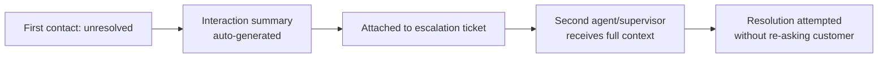
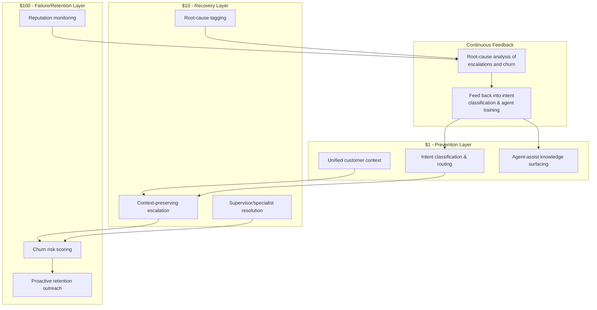

## Customer Service and Experience Applications


### Definition and Context

This item translates the 1-10-100 Rule out of the data-quality domain and into the domain of **customer service and experience**, where the same cost-escalation logic applies: the cost of resolving a customer issue multiplies at each stage it is allowed to progress through without resolution. In this context the three tiers are commonly reframed as:

- **$1** — the cost to **prevent** or resolve a customer issue at first contact / point of interaction
- **$10** — the cost to **correct** the issue after it has escalated (a second contact, a supervisor escalation, a refund process)
- **$100** — the cost of **failure**: customer churn, negative public reviews, chargebacks, or loss of lifetime value

This is the same underlying economic principle as the data-quality chapters — the earlier a defect (in this case, a service failure) is intercepted relative to the customer's journey, the cheaper and more reversible the fix.

### The Service Escalation Pathway

```mermaid
flowchart TD
    A[Customer interaction begins] --> B{Issue resolved<br/>at first contact?}
    B -->|Yes| C[\$1 — Resolved, low cost,<br/>customer satisfaction preserved]
    B -->|No| D[Issue escalates:<br/>callback, ticket reopened,<br/>supervisor involved]
    D --> E{Resolved on<br/>escalation?}
    E -->|Yes| F[\$10 — Resolved, higher cost,<br/>partial trust erosion]
    E -->|No| G[Issue unresolved or<br/>customer gives up]
    G --> H[\$100 — Churn, negative review,<br/>chargeback, lost lifetime value]
```

### Why Cost Escalates in a Service Context

1. **First-contact resolution (FCR) is the cheapest unit of work** — a single agent, single interaction, with full context of the customer's specific issue, at the moment it's freshest.
2. **Escalation multiplies handling cost** — a second contact requires context to be re-established (often imperfectly, via notes or a transfer), consumes a second agent's time, and frequently a supervisor's time as well.
3. **Customer Effort Score (CES) compounds** — each additional contact required to resolve an issue measurably increases customer dissatisfaction independent of whether the issue is eventually resolved; effort itself is a cost driver, not just resolution time.
4. **Churn and reputational cost are open-ended**, similar to the $100 tier in the data-quality framing — the value of a lost customer (lifetime value) and the reach of a negative public review are not bounded the way an escalation-handling cost is.

### Technical and Operational Mechanisms by Tier

#### 1. $1 Tier — First-Contact Resolution Infrastructure

**Unified customer context at point of contact.** The technical prerequisite for first-contact resolution is that the agent (human or AI) has complete context the moment the interaction begins — order history, prior tickets, account status — without needing to ask the customer to repeat information or manually pull data from multiple systems.

```python
class UnifiedCustomerContext:
    """
    Aggregates customer context from multiple backend systems into
    a single view available to an agent (or an AI assistant) at the
    moment of first contact — the technical foundation for first-
    contact resolution, i.e. the '$1' tier of a service interaction.
    """
    def __init__(self, crm_client, order_system_client, ticket_system_client):
        self.crm = crm_client
        self.orders = order_system_client
        self.tickets = ticket_system_client

    def get_context(self, customer_id: str) -> dict:
        return {
            "profile": self.crm.get_profile(customer_id),
            "recent_orders": self.orders.get_recent(customer_id, limit=5),
            "open_tickets": self.tickets.get_open(customer_id),
            "prior_resolutions": self.tickets.get_resolved(customer_id, limit=3),
            "sentiment_history": self.crm.get_sentiment_trend(customer_id),
        }
```

**Intent classification and routing at intake.** Misrouted contacts are one of the most common causes of preventable escalation — the customer reaches an agent or system unequipped to resolve their specific issue type, guaranteeing a second contact.

```python
def route_contact(message_text: str, classifier_model) -> dict:
    """
    Classifies incoming contact intent and routes to the correctly
    skilled queue/agent on the first attempt, reducing misroute-driven
    escalations that would otherwise push the interaction into the
    '$10' tier.
    """
    intent = classifier_model.predict(message_text)
    routing_table = {
        "billing_dispute": "billing_specialist_queue",
        "technical_issue": "tier2_technical_queue",
        "shipping_delay": "logistics_queue",
        "general_inquiry": "general_support_queue",
    }
    return {
        "predicted_intent": intent.label,
        "confidence": intent.confidence,
        "queue": routing_table.get(intent.label, "general_support_queue"),
    }
```

**Agent-assist / knowledge surfacing.** Real-time suggestion of relevant resolution steps or policy information during the live interaction reduces the chance an agent gives an incomplete or incorrect resolution that later requires a follow-up contact.

#### 2. $10 Tier — Escalation and Recovery Infrastructure

Once an issue has not been resolved at first contact, the technical goal shifts from *prevention* to *efficient recovery* — minimizing the added cost of the second (or third) touch.

**Context continuity across escalation.** The core failure mode at this tier is context loss during handoff — a customer forced to re-explain their issue to a new agent. Systems that carry full interaction history and prior attempted resolutions into the escalation directly reduce the marginal cost of the second contact.



```python
def generate_escalation_summary(interaction_transcript: str, llm_client) -> str:
    """
    Auto-summarizes the first-contact interaction and attaches it to
    the escalation record, so the next agent has full context without
    requiring the customer to repeat themselves — reducing the added
    cost and customer effort of the '$10' tier escalation.
    """
    prompt = (
        "Summarize this customer service interaction in 3-4 sentences, "
        "including: the customer's original issue, what was attempted, "
        "and why it was not resolved.\n\n"
        f"Transcript:\n{interaction_transcript}"
    )
    response = llm_client.complete(prompt, max_tokens=200)
    return response.text
```

**Root-cause tagging on escalations.** Recording *why* an issue escalated (not just that it did) is the service-domain equivalent of the data-quality cleansing tier's root-cause analysis — it feeds back into fixing the systemic cause rather than only resolving the individual instance.

#### 3. $100 Tier — Churn, Reputational, and Recovery Cost

At this tier, the issue was not resolved (or was resolved too late/poorly), and the cost shifts from operational handling cost to **customer lifetime value loss** and **reputational exposure**.

**Churn risk scoring from service interaction signals.** Detecting elevated churn risk from service interaction patterns allows intervention (e.g., proactive outreach, retention offers) before the customer actually leaves — an attempt to intercept the $100-tier outcome even after the $1 and $10 tiers have already been missed.

```python
def compute_churn_risk_signal(customer_id: str, interaction_history: list) -> float:
    """
    Produces a churn-risk score from service interaction signals —
    repeated unresolved contacts, rising customer effort, negative
    sentiment trend — used to trigger proactive retention workflows
    before the customer actually churns (the '$100' outcome).
    """
    unresolved_count = sum(1 for i in interaction_history if not i["resolved"])
    avg_effort_score = sum(i["customer_effort_score"] for i in interaction_history) / len(interaction_history)
    sentiment_trend = interaction_history[-1]["sentiment"] - interaction_history[0]["sentiment"]

    # Simple weighted heuristic; production systems typically use a
    # trained classifier against historical churn labels instead.
    risk_score = (
        0.4 * min(unresolved_count / 3, 1.0)
        + 0.4 * min(avg_effort_score / 5, 1.0)
        + 0.2 * max(-sentiment_trend, 0)
    )
    return round(risk_score, 3)
```

**Public reputation monitoring.** Because a churned customer at this tier can also become a source of negative public reviews (with reach and cost that scale independently of the original issue), governance-style monitoring of review platforms and social channels is a common operational control at this tier — closing the loop back to service-quality improvement in the same way the data-quality chapter's postmortem process closes the loop back to prevention.

### Metrics That Track Position Within the 1-10-100 Framework

| Metric | Tier Measured | What It Signals |
| --- | --- | --- |
| **First Contact Resolution (FCR) rate** | $1 | Percentage of issues resolved without escalation — the direct measure of prevention-tier effectiveness |
| **Customer Effort Score (CES)** | $1 → $10 boundary | How much work the customer had to do; a leading indicator of escalation likelihood |
| **Escalation rate** | $10 | Volume of issues requiring second contact or supervisor involvement |
| **Mean Time to Resolution (MTTR) on escalations** | $10 | Efficiency of the recovery process once escalation has occurred |
| **Net Promoter Score (NPS) / CSAT post-resolution** | $10 → $100 boundary | Whether even a "resolved" issue left lasting trust damage |
| **Churn rate correlated with prior unresolved contacts** | $100 | Direct measurement of the terminal failure cost |

### Illustrative Cost Comparison

| Stage | Representative Activities | Illustrative Cost Driver |
| --- | --- | --- |
| First Contact ($1) | Single agent interaction, full context available, issue resolved | Agent time only |
| Escalation ($10) | Second contact, context re-establishment, supervisor involvement, possible refund/credit issued | Multiple agent-hours + goodwill cost (refunds/credits) |
| Churn/Reputational ($100) | Customer leaves, negative public review, reduced referrals, chargeback/dispute | Lost lifetime value + acquisition cost to replace the customer + reputational reach |

As in the data-quality tiers, these figures are illustrative anchors reflecting the *qualitative* escalation in cost, not a precisely measured 1:10:100 ratio for any specific business — actual multipliers are [Inference] and vary substantially by industry, customer lifetime value, and the public visibility of the channel where dissatisfaction is expressed.

### Architectural Pattern: Closed-Loop Service Quality System



### Organizational Practices That Shift Volume Toward the $1 Tier

- **Agent enablement over agent monitoring**: investing in context/knowledge tools that help agents resolve issues correctly the first time has a larger effect on cost distribution than post-hoc quality scoring of already-completed interactions.
- **Closing the loop from escalations to root cause**: treating every escalation as a signal to investigate *why* first contact failed (a knowledge gap, a routing error, a policy ambiguity), analogous to feeding data-quality incidents back into entry-point validation rules.
- **Proactive outreach before churn signals peak**: using churn-risk scoring as an early-warning system rather than only reacting after a cancellation request.
- **Treating CES as a leading indicator**, not just CSAT/NPS as lagging indicators — effort accumulates before dissatisfaction becomes visible in survey scores.

**Related Topics**

- First Contact Resolution (FCR) as a Core Service KPI
- Customer Effort Score (CES) vs. CSAT vs. NPS: Choosing Leading vs. Lagging Metrics
- Churn Prediction Models Using Service Interaction Data
- Root Cause Analysis for Recurring Escalation Patterns
- AI-Assisted Agent Support and Knowledge Surfacing Systems
- The 1-10-100 Rule in Manufacturing and Physical Product Quality
- Building a Cost-of-Quality Business Case Across Non-Data Domains