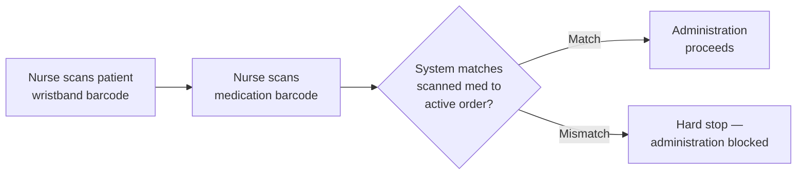
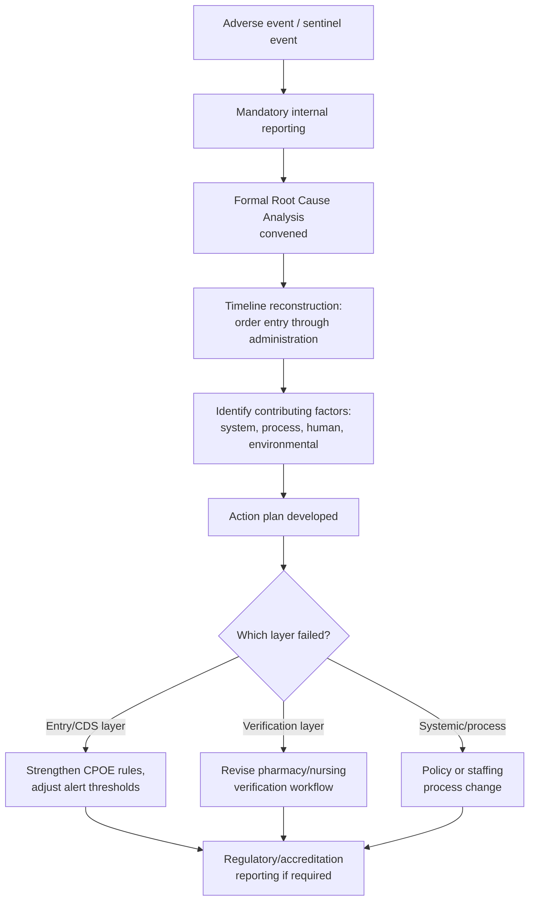
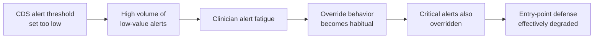

## Healthcare and Patient Safety Applications


### Definition and Context

This item applies the 1-10-100 Rule to the **healthcare and patient safety** domain, where the escalation model carries materially higher stakes than in commercial or data-quality contexts: the terminal tier is not merely financial loss but potential physical harm. The three tiers in this domain are typically framed as:

- **$1** — the cost to **prevent** an error at the point of clinical data entry, order entry, or care coordination (e.g., a nurse catching a transcription error before medication administration)
- **$10** — the cost to **correct** an error after it has entered the clinical workflow but before it reaches the patient (e.g., a pharmacist intercepting a dosing error during order verification)
- **$100** — the cost of **failure**: the error reaches the patient, resulting in an adverse event, patient harm, extended length of stay, litigation, or regulatory sanction

A critical framing distinction for this domain: the "$100" figure is explicitly a **cost proxy**, not a valuation of harm itself. Patient safety literature does not treat human harm as reducible to a dollar figure; the monetary framing here refers strictly to the *institutional* costs that follow an adverse event (litigation, remediation, regulatory penalty, reputational and operational cost) — never to the harm itself. This distinction should be treated as load-bearing throughout this material, and any framing that conflates the two should be read as [Inference]/illustrative rather than a genuine ethical equivalence.

### The Clinical Error Escalation Pathway

```mermaid
flowchart TD
    A[Clinical data/order entered] --> B{Error caught at<br/>point of entry?}
    B -->|Yes| C[\$1 — Caught by entry-point<br/>checks: CDS alert, unit-dose check]
    B -->|No| D[Error enters workflow:<br/>pharmacy verification, nursing review]
    D --> E{Error caught before<br/>reaching patient?}
    E -->|Yes| F[\$10 — Caught by pharmacist<br/>or nurse verification]
    E -->|No| G[Error reaches patient]
    G --> H{Harm occurs?}
    H -->|Near miss, no harm| I[\$10-\$100 boundary —<br/>reportable near-miss]
    H -->|Adverse event| J[\$100 — Patient harm,<br/>institutional consequence cascade]
```

### Why This Domain Warrants Distinct Technical Treatment

1. **Multiple independent verification layers by design** — unlike a typical data pipeline, clinical workflows deliberately build in redundant human checkpoints (prescriber → pharmacist → nurse) precisely because the terminal cost is uniquely severe; this is the domain's own institutional expression of the 1-10-100 logic, developed independently of general data-quality theory.
2. **Time criticality constrains prevention design** — unlike a customer service contact, clinical entry often occurs under time pressure (emergency settings), which raises the design bar for point-of-entry checks that must be fast enough not to be bypassed, but robust enough to catch high-severity errors.
3. **Regulatory and accreditation overlay** — this domain has formal external structures (incident reporting requirements, accreditation standards) that institutionalize the $100-tier feedback loop in a way most other industries do not.
4. **Alert fatigue is a first-class engineering constraint** — over-aggressive entry-point checking in this domain has a well-documented failure mode (clinicians overriding or ignoring alerts due to volume), which is a domain-specific tradeoff distinct from the false-positive cost discussed generically in the data-quality chapters.

### Technical Mechanisms by Tier

#### 1. $1 Tier — Clinical Decision Support at Point of Order Entry

**Computerized Provider Order Entry (CPOE) with embedded Clinical Decision Support (CDS).** This is the direct clinical analog of the schema/application-layer validation discussed in the data-entry chapter — checks run at the moment an order is created, before it ever reaches downstream verification.

```python
class MedicationOrderValidator:
    """
    Represents the class of checks a CPOE/CDS system runs at the
    point of order entry — the clinical '$1' tier. Real systems
    (e.g., Epic, Cerner/Oracle Health) implement equivalents of
    these checks against live formulary, allergy, and patient
    weight/renal-function data; this is a simplified illustration
    of the check categories, not a specific vendor's implementation.
    """
    def __init__(self, patient_record, formulary_db, drug_interaction_db):
        self.patient = patient_record
        self.formulary = formulary_db
        self.interactions = drug_interaction_db

    def validate_order(self, drug_code: str, dose: float, unit: str, route: str) -> list:
        alerts = []

        if drug_code in self.patient.allergies:
            alerts.append({
                "severity": "critical",
                "type": "allergy_conflict",
                "message": f"Patient has documented allergy to {drug_code}"
            })

        max_dose = self.formulary.get_max_safe_dose(drug_code, self.patient.weight_kg)
        if dose > max_dose:
            alerts.append({
                "severity": "critical",
                "type": "dose_range_exceeded",
                "message": f"Ordered dose {dose}{unit} exceeds max safe dose {max_dose}{unit}"
            })

        active_meds = self.patient.get_active_medications()
        for med in active_meds:
            if self.interactions.has_interaction(drug_code, med.drug_code):
                alerts.append({
                    "severity": "warning",
                    "type": "drug_interaction",
                    "message": f"Potential interaction with active medication {med.drug_code}"
                })

        return alerts
```

**Barcode Medication Administration (BCMA) at the bedside.** This extends point-of-entry validation to the final administration step itself, scanning patient wristband, medication, and order to confirm the "five rights" (right patient, drug, dose, route, time) immediately before the action becomes irreversible.



#### 2. $10 Tier — Verification and Interception Workflows

Once an order has passed initial entry, the next line of defense is independent human and system verification before the medication or intervention reaches the patient.

**Pharmacist order verification with structured discrepancy logging.** This is the clinical equivalent of the data quality rule engine described in the cleansing tier — a second, independent check applied post-entry, with findings routed back into the reporting/feedback loop rather than silently corrected and forgotten.

```python
def log_pharmacy_intercept(order_id: str, discrepancy_type: str,
                             original_value, corrected_value, pharmacist_id: str, conn):
    """
    Records a pharmacist-caught discrepancy that would otherwise have
    reached the patient — the clinical '$10' tier intercept. This
    record feeds institutional reporting systems (e.g., for Joint
    Commission / patient safety organization reporting) and closes
    the loop back into CDS rule tuning at the '$1' tier.
    """
    conn.execute(
        """
        INSERT INTO medication_error_intercepts
            (order_id, discrepancy_type, original_value,
             corrected_value, intercepted_by, intercepted_at, tier)
        VALUES (:order_id, :discrepancy_type, :original_value,
                :corrected_value, :pharmacist_id, now(), 'pre_administration')
        """,
        {
            "order_id": order_id,
            "discrepancy_type": discrepancy_type,
            "original_value": str(original_value),
            "corrected_value": str(corrected_value),
            "pharmacist_id": pharmacist_id,
        }
    )
```

**Medication reconciliation at transitions of care.** Errors are disproportionately introduced at handoffs (admission, transfer, discharge), where medication lists from different sources must be reconciled — a domain-specific analog of the "cross-system reconciliation" cleansing technique from the data-quality chapter.

#### 3. $100 Tier — Adverse Event Response and Root Cause Analysis

When an error reaches the patient, the institutional response shifts from prevention/interception to harm mitigation, mandatory reporting, and formal root-cause analysis — structurally similar to the post-incident process described in the decision-cost item, but operating under formal regulatory and accreditation requirements specific to this domain.

**Root Cause Analysis (RCA) using a formal framework.** Unlike the generic postmortem pattern described earlier, clinical RCA typically follows standardized methodologies (e.g., the Joint Commission's Sentinel Event framework in the U.S., or equivalent frameworks in other jurisdictions) — this is domain-specific institutional practice, not a generic engineering postmortem.



**External reporting integration.** Many jurisdictions require or strongly encourage reporting of serious adverse events to external patient safety organizations, which aggregate de-identified data across institutions to identify systemic risk patterns beyond what any single institution's data would reveal — an inter-organizational extension of the feedback loop that has no direct analog in the earlier, single-organization data-quality chapters.

### Domain-Specific Design Constraint: Alert Fatigue

A defining engineering tension in this domain, distinct from generic false-positive cost tradeoffs, is that **over-alerting has a documented, well-studied failure mode**: clinicians facing high alert volume develop habituation and begin overriding alerts — including clinically significant ones — undermining the very entry-point defense the system was built to provide.



This creates a design requirement specific to healthcare CDS that has no strong parallel in the general data-quality chapters: alert *specificity* (precision) must be actively tuned and monitored as an ongoing operational metric, not just alert *coverage* (recall) — an over-broad rule set can paradoxically increase $100-tier risk by eroding trust in the $1-tier system as a whole.

### Illustrative Cost Comparison

| Stage | Representative Activities | Illustrative Cost Driver |
| --- | --- | --- |
| Order Entry ($1) | CDS alert catches allergy conflict or dose error at CPOE | Prescriber time to acknowledge/correct |
| Verification ($10) | Pharmacist intercepts discrepancy during order verification | Pharmacist review time + order clarification cycle with prescriber |
| Adverse Event ($100) | Error reaches patient; harm occurs | Extended length of stay, treatment of harm, formal RCA, regulatory reporting, potential litigation |

As with the general framework, these figures represent an illustrative qualitative escalation, not a measured ratio specific to any institution or error type — and, as emphasized above, the $100 figure in this domain refers strictly to institutional/financial consequence cost, never to a valuation of patient harm itself. Treat any specific multiplier for this domain as [Unverified].

### Organizational Practices That Shift Risk Toward the $1 Tier

- **Human factors-informed CDS design**: alert design reviewed with clinical workflow and human-factors input, not purely by rule coverage, to manage the alert-fatigue tradeoff described above.
- **Closed-loop feedback from RCA to CDS rules**: every formal root cause analysis explicitly reviewed for whether an entry-point or verification-layer control could have intercepted the event earlier, mirroring (in a domain-specific, regulated form) the feedback loops described in the data-quality and decision-cost chapters.
- **Independent double-checks at high-risk steps**: deliberately redundant verification (e.g., two-person verification for high-alert medications) at points identified as high-severity-risk, rather than uniform verification intensity across all order types.
- **Near-miss reporting culture**: capturing intercepted errors (the $10-tier events) as systematically as adverse events, since near-misses are a much higher-volume and earlier signal of systemic risk than adverse events alone.

**Related Topics**

- The 1-10-100 Rule in Customer Service and Experience Applications
- Clinical Decision Support (CDS) System Design and Alert Governance
- Root Cause Analysis Frameworks in Patient Safety (Sentinel Event Methodology)
- Barcode Medication Administration (BCMA) and the "Five Rights" Framework
- Medication Reconciliation at Care Transitions
- Alert Fatigue as a Human Factors Engineering Problem
- Building a Cost-of-Quality Business Case Across Non-Data Domains