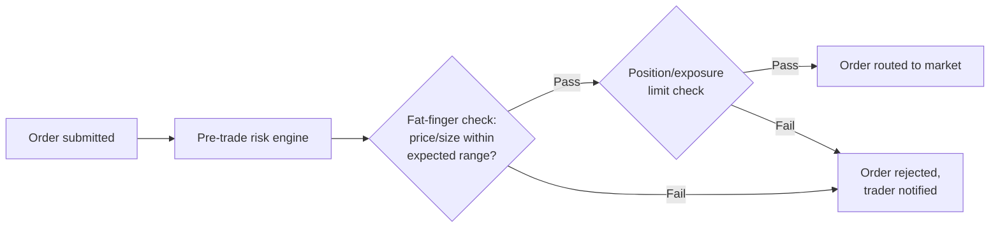
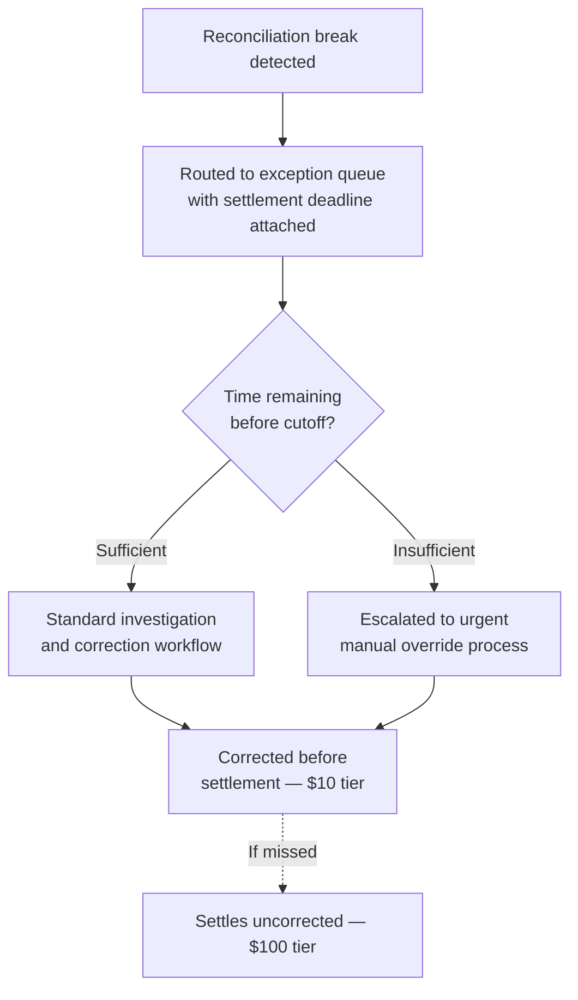
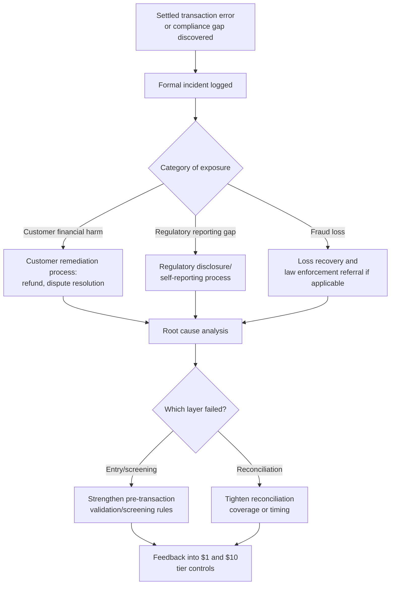
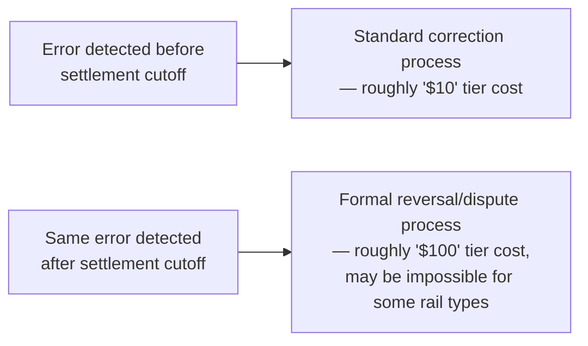

## Financial Services and Transaction Error Applications


### Definition and Context

This item applies the 1-10-100 Rule to **financial services and transaction processing**, where errors in payments, trades, account data, or compliance data escalate through a pipeline with unusually strict correctness requirements (transactions must reconcile to the cent) and unusually severe terminal-tier consequences (regulatory penalties, market impact, and customer financial harm). The three tiers in this domain are typically framed as:

- **$1** — the cost to **prevent** a transaction error at entry: input validation, pre-trade checks, duplicate detection, sanctions/KYC screening at initiation
- **$10** — the cost to **correct** an error after it enters processing but before settlement/finality: reconciliation breaks caught same-day, manual intervention, exception queue resolution
- **$100** — the cost of **failure**: a settled/finalized erroneous transaction, a regulatory reporting breach, a compliance violation, fraud loss, or customer financial harm requiring remediation

A structural feature distinguishing this domain from the earlier chapters is **finality**. Many financial transactions (wire transfers, settled trades, cleared payments) become legally and operationally difficult or impossible to reverse once they cross a settlement boundary — so the $10→$100 transition in this domain is frequently a hard, discrete cutoff (a settlement cycle deadline) rather than a gradual escalation.

### The Transaction Error Escalation Pathway

```mermaid
flowchart TD
    A[Transaction initiated] --> B{Error caught at<br/>entry/pre-trade checks?}
    B -->|Yes| C[\$1 — Caught by input validation,<br/>limit checks, duplicate detection]
    B -->|No| D[Transaction enters processing]
    D --> E{Error caught during<br/>reconciliation, pre-settlement?}
    E -->|Yes| F[\$10 — Exception queue,<br/>manual investigation, same-day correction]
    E -->|No| G[Transaction settles/finalizes]
    G --> H[\$100 — Post-settlement dispute,<br/>regulatory reporting breach,<br/>fraud loss, remediation]
```

### Why This Domain Warrants Distinct Technical Treatment

1. **Hard finality boundaries** — settlement cutoffs (e.g., same-day ACH windows, T+1 securities settlement) create a discrete rather than gradual cost escalation; an error caught at 4:59pm and one caught at 5:01pm can differ enormously in remediation cost and process.
2. **Regulatory reporting overlays the pipeline** — errors don't just need internal correction; many require formal disclosure to regulators (e.g., trade break reporting, suspicious activity reporting), adding a compliance cost dimension absent from most other domains covered in this chapter.
3. **Reconciliation is a first-class, mandatory architectural layer** — unlike other domains where downstream data quality checks are a best practice, multi-way reconciliation (general ledger vs. sub-ledger vs. counterparty confirmation) is often a regulatory *requirement*, not an optional $10-tier control.
4. **Real-time and near-real-time processing compresses the prevention window** — payment rail modernization (real-time payments, instant settlement) is progressively shrinking the $10-tier intervention window that has historically existed in batch-settled systems, raising the relative importance of $1-tier controls.

### Technical Mechanisms by Tier

#### 1. $1 Tier — Pre-Transaction Validation and Screening

**Input validation and limit checks at transaction initiation.** This is the direct financial-services analog of the schema/application-layer validation in the data-entry chapter, with domain-specific rule categories.

```python
class TransactionValidator:
    """
    Represents the class of pre-transaction checks run at initiation —
    the financial-services '$1' tier. Production systems layer many
    more rule categories (velocity limits, geographic risk scoring,
    device fingerprinting); this illustrates the core check types.
    """
    def __init__(self, account_service, sanctions_screening_service, limits_config):
        self.accounts = account_service
        self.sanctions = sanctions_screening_service
        self.limits = limits_config

    def validate_transaction(self, from_account: str, to_account: str,
                               amount_cents: int, currency: str) -> list:
        errors = []

        balance = self.accounts.get_available_balance(from_account)
        if amount_cents > balance:
            errors.append({"code": "INSUFFICIENT_FUNDS", "severity": "blocking"})

        daily_limit = self.limits.get_daily_limit(from_account)
        today_total = self.accounts.get_today_transaction_total(from_account)
        if today_total + amount_cents > daily_limit:
            errors.append({"code": "DAILY_LIMIT_EXCEEDED", "severity": "blocking"})

        screening_result = self.sanctions.screen(to_account)
        if screening_result.is_match:
            errors.append({
                "code": "SANCTIONS_SCREENING_HIT",
                "severity": "blocking",
                "requires_review": True
            })

        if amount_cents <= 0:
            errors.append({"code": "INVALID_AMOUNT", "severity": "blocking"})

        return errors
```

**Duplicate transaction detection.** Duplicate submission (double-clicks, network retries, batch file resubmission) is a disproportionately common source of transaction errors, and is cheap to catch at entry via idempotency keys.

```python
def check_duplicate_submission(idempotency_key: str, cache_client) -> bool:
    """
    Idempotency-key based duplicate detection at the point of
    transaction submission — prevents duplicate processing before
    it ever enters the settlement pipeline, avoiding what would
    otherwise become a '$10'-tier reconciliation break or a
    '$100'-tier duplicate payment requiring recovery.
    """
    existing = cache_client.get(f"idempotency:{idempotency_key}")
    if existing is not None:
        return True
    cache_client.set(f"idempotency:{idempotency_key}", "processing", ttl_seconds=86400)
    return False
```

**Pre-trade risk checks (capital markets context).** In trading systems, entry-point validation takes the form of pre-trade risk checks that run in microseconds before an order reaches the market.



#### 2. $10 Tier — Reconciliation and Exception Management

Once a transaction has entered processing, the next defense layer is reconciliation — comparing independent records of the same transaction across systems to detect breaks before settlement finality.

**Multi-way reconciliation engine.** This is the financial-services equivalent of the cross-system reconciliation technique described in the data-quality cleansing chapter, but typically operating under stricter timing and audit requirements.

```python
def reconcile_transactions(internal_ledger: list, counterparty_confirmations: list) -> dict:
    """
    Matches internal ledger entries against counterparty-confirmed
    records to identify breaks — the financial '$10' tier detection
    mechanism. Breaks identified here go to an exception queue for
    same-day investigation, before the transaction settles.
    """
    internal_by_ref = {t["reference_id"]: t for t in internal_ledger}
    confirmed_by_ref = {c["reference_id"]: c for c in counterparty_confirmations}

    breaks = []
    for ref_id, internal_txn in internal_by_ref.items():
        confirmed = confirmed_by_ref.get(ref_id)
        if confirmed is None:
            breaks.append({"reference_id": ref_id, "break_type": "UNCONFIRMED",
                            "internal_amount": internal_txn["amount_cents"]})
        elif confirmed["amount_cents"] != internal_txn["amount_cents"]:
            breaks.append({
                "reference_id": ref_id, "break_type": "AMOUNT_MISMATCH",
                "internal_amount": internal_txn["amount_cents"],
                "confirmed_amount": confirmed["amount_cents"]
            })

    return {
        "total_reconciled": len(internal_by_ref) - len(breaks),
        "total_breaks": len(breaks),
        "breaks": breaks
    }
```

**Exception queue with settlement-deadline awareness.** Given the hard finality boundary described earlier, exception management in this domain is explicitly time-boxed against the settlement cutoff, not an open-ended queue.



#### 3. $100 Tier — Post-Settlement Remediation and Regulatory Exposure

Once a transaction has settled with an uncorrected error, or a compliance screening gap has gone undetected, the response shifts to formal remediation processes with regulatory dimensions specific to this domain.

**Post-settlement dispute and remediation workflow.**



**Regulatory reporting obligations as a distinct cost category.** A feature specific to this domain (with no strong analog in the earlier chapters) is that certain $100-tier events trigger *mandatory* reporting obligations to regulators independent of the direct financial loss — meaning the institutional cost includes compliance process cost even when the direct dollar loss is small.

### Domain-Specific Design Constraint: The Settlement Finality Cliff

Unlike the gradual cost escalation implied by the general 1-10-100 framing, this domain frequently exhibits a **step function** rather than a smooth curve, because many payment rails and clearing systems have hard, non-negotiable cutoff times.



This creates an engineering priority specific to this domain: reconciliation and exception-resolution systems are typically designed and measured against **cutoff-relative latency** (time remaining before finality) rather than absolute processing time, since the same delay has a dramatically different cost impact depending on proximity to the settlement boundary.

### Illustrative Cost Comparison

| Stage | Representative Activities | Illustrative Cost Driver |
| --- | --- | --- |
| Initiation ($1) | Input validation, duplicate detection, sanctions screening block a bad transaction before processing | Automated check, near-zero marginal cost |
| Pre-Settlement ($10) | Reconciliation break caught same-day, exception queue resolved before cutoff | Analyst investigation time, possible manual correction entry |
| Post-Settlement ($100) | Error settles; customer remediation, regulatory disclosure, fraud loss recovery | Remediation process cost + regulatory/compliance cost + potential penalty |

As with the other domain applications in this chapter, these figures represent an illustrative qualitative escalation rather than a measured ratio for any specific institution, payment rail, or jurisdiction — treat any specific multiplier claimed for this domain as [Unverified], and note that regulatory penalty amounts in particular are governed by specific statutory/regulatory frameworks that vary by jurisdiction and are outside the scope of a general heuristic.

### Organizational Practices That Shift Risk Toward the $1 Tier

- **Idempotency-by-design at every transaction entry point**: treating duplicate-submission protection as a mandatory architectural pattern rather than an optional safeguard, given how disproportionately common and cheap-to-prevent this error class is.
- **Reconciliation coverage aligned to settlement-cutoff timing**: designing exception-detection latency budgets explicitly around the hard finality boundary described above, rather than a generic "as fast as reasonably possible" target.
- **Closed-loop feedback from post-settlement incidents to entry-point rules**: every $100-tier remediation formally reviewed for whether a pre-transaction check or earlier reconciliation pass could have intercepted it, mirroring the feedback patterns in the data-quality and healthcare chapters.
- **Explicit compliance-cost visibility in incident reporting**: tracking regulatory reporting/disclosure effort as its own cost line, since — unlike the other domains in this chapter — this cost can be substantial even when direct financial loss is minimal.

**Related Topics**

- The 1-10-100 Rule in Healthcare and Patient Safety Applications
- The 1-10-100 Rule in Customer Service and Experience Applications
- Idempotency Patterns in Distributed Transaction Systems
- Multi-Way Reconciliation Architecture (Ledger, Sub-Ledger, Counterparty)
- Pre-Trade Risk Controls in Capital Markets Systems
- Sanctions Screening and KYC/AML Compliance Pipelines
- Building a Cost-of-Quality Business Case Across Non-Data Domains