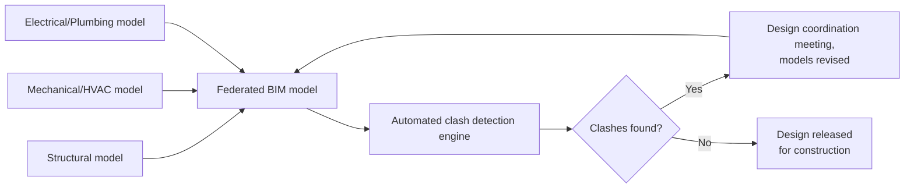
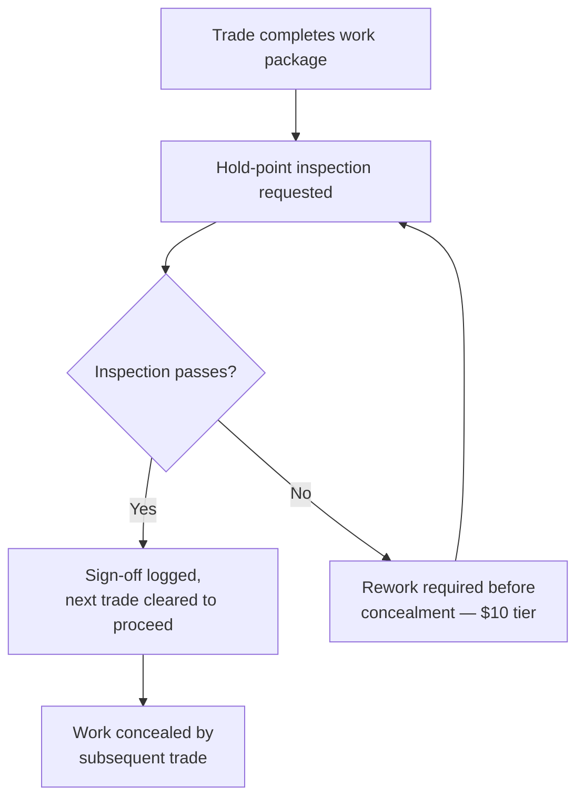
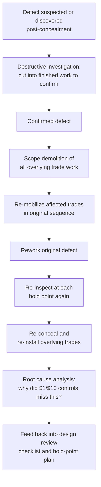

## Construction and Rework Cost Applications


### Definition and Context

This item applies the 1-10-100 Rule to the **construction industry**, one of the domains where the rule originated in practical quality-management usage — construction and manufacturing rework cost is often cited as the archetypal illustration of the 1-10-100 escalation, predating its application to data quality. The three tiers in this domain are typically framed as:

- **$1** — the cost to **prevent** a defect at the point of design or specification (a design review catching a clash, a spec error corrected on paper)
- **$10** — the cost to **correct** a defect during construction, before the affected work is concealed or built upon (rework caught during in-progress inspection)
- **$100** — the cost of **failure**: the defect is discovered after concealment, after occupancy, or after another trade has built on top of the flawed work, requiring demolition and reconstruction

Construction has a structural feature that sharpens this rule more than almost any other domain covered in this chapter: **physical sequencing is largely irreversible without demolition**. Once concrete is poured, drywall is closed, or a subsequent trade has built on top of a defective substrate, correction is not a database update or a re-issued communication — it is literal demolition and reconstruction, with cost, schedule, and safety implications that compound with every layer of work built on top of the original defect.

### The Construction Defect Escalation Pathway

```mermaid
flowchart TD
    A[Design/specification created] --> B{Defect caught at<br/>design review stage?}
    B -->|Yes| C[\$1 — Design revised on paper,<br/>no physical work affected]
    B -->|No| D[Work constructed<br/>per flawed design/spec]
    D --> E{Defect caught during<br/>in-progress inspection,<br/>before concealment?}
    E -->|Yes| F[\$10 — Rework before<br/>next trade builds over it]
    E -->|No| G[Work concealed or<br/>built upon by next trade]
    G --> H[\$100 — Demolition,<br/>multi-trade rework,<br/>schedule delay cascade]
```

### Why Cost Escalates Non-Linearly in This Domain

1. **Concealment creates a hard detection barrier** — once drywall, flooring, or a poured slab covers earlier work, defects become invisible to normal inspection and typically require destructive investigation (cutting into finished work) even to *confirm* a suspected defect, let alone correct it.
2. **Trade sequencing compounds rework scope** — construction is inherently sequential (foundation → framing → MEP rough-in → insulation → drywall → finishes); a defect in an early trade discovered late requires undoing and redoing every subsequent trade's work layered on top of it, not just the original defect.
3. **Schedule cost is multiplicative, not additive** — rework doesn't just cost the direct labor/material to fix; it displaces the subsequent trades' schedule, often triggering contractual delay penalties, idle-crew costs, and re-mobilization costs for trades that had already demobilized from the site.
4. **Safety and code-compliance stakes** — some defects (structural, fire-rated assemblies, life-safety systems) discovered post-occupancy carry regulatory and life-safety cost dimensions beyond simple rework cost, echoing the harm-vs-cost distinction noted in the healthcare chapter.

### Technical Mechanisms by Tier

#### 1. $1 Tier — Design Review and Clash Detection

**Building Information Modeling (BIM) clash detection.** This is the construction-industry equivalent of schema-level validation in the data-entry chapter — automated checking of a design model against geometric and code rules *before* any physical work begins, catching conflicts between disciplines (structural, mechanical, electrical, plumbing) while correction is still a model edit rather than physical rework.



**Structured design review checklists at each discipline handoff.** A design review checklist, analogous to the schema/standards registry in the data-governance chapter, formalizes what must be verified before a design is released for construction — reducing reliance on any individual reviewer's memory.

```python
class DesignReviewCheck:
    """
    Represents a category of check run against a design package
    before release to construction — the construction industry's
    '$1' tier prevention mechanism. Analogous to entry-point schema
    validation in the data-quality domain, but applied to a design
    model/document set rather than a database record.
    """
    def __init__(self, code_compliance_db, clash_detection_engine):
        self.code_db = code_compliance_db
        self.clash_engine = clash_detection_engine

    def review_design_package(self, design_model) -> list:
        findings = []

        clashes = self.clash_engine.detect(design_model)
        for clash in clashes:
            findings.append({
                "type": "geometric_clash",
                "severity": clash.severity,
                "location": clash.location,
                "disciplines_involved": clash.disciplines,
            })

        code_violations = self.code_db.check_compliance(design_model)
        for violation in code_violations:
            findings.append({
                "type": "code_compliance",
                "severity": "blocking",
                "code_section": violation.code_section,
                "description": violation.description,
            })

        return findings
```

#### 2. $10 Tier — In-Progress Inspection Before Concealment

Once construction has begun, the critical defense mechanism is inspection timed specifically to occur *before* the work is concealed by a subsequent trade — the construction-domain equivalent of the reconciliation exception queue in the financial-services chapter, but bound to a physical rather than temporal deadline.

**Hold-point inspection scheduling.** Construction quality plans formally define "hold points" — stages in the sequence where work must be inspected and signed off before the next trade is permitted to proceed and conceal it.

```python
def check_hold_point_clearance(work_package_id: str, inspection_system) -> dict:
    """
    Enforces that a work package cannot proceed to the next trade
    (i.e., become concealed) until required inspections are logged
    as passed — the construction industry's '$10' tier interception
    mechanism, timed against physical concealment rather than a
    data-pipeline stage.
    """
    required_inspections = inspection_system.get_required_inspections(work_package_id)
    completed = inspection_system.get_completed_inspections(work_package_id)

    outstanding = [
        insp for insp in required_inspections
        if insp["inspection_type"] not in [c["inspection_type"] for c in completed]
    ]

    return {
        "cleared_for_next_trade": len(outstanding) == 0,
        "outstanding_inspections": outstanding,
    }
```



**Photo/video documentation before concealment.** A practical mitigation for cases where a hold-point inspection is missed or a defect is only suspected later: systematic photo documentation of in-progress work before concealment reduces (though does not eliminate) the need for destructive investigation if a defect is later suspected — narrowing the gap between the $10 and $100 tiers when the ideal inspection timing was missed.

#### 3. $100 Tier — Post-Concealment Discovery and Demolition Rework

When a defect is discovered after concealment or after occupancy, the response requires destructive investigation, demolition of overlying work, and re-sequencing of the affected trades.



**Root cause analysis feeding back into design and inspection standards.** As in every other domain in this chapter, the terminal-tier incident's greatest long-term value is in closing the loop — identifying whether the miss originated in an inadequate design review checklist, a skipped or poorly-timed hold-point inspection, or a genuine novel failure mode not previously covered by either.

### Domain-Specific Cost Driver: Trade Sequencing Multiplication

Unlike most other domains in this chapter, construction rework cost is strongly a function of **how many subsequent trades built on top of the defect**, not just how long detection took.

| Defect Discovery Point | Trades Requiring Rework | Illustrative Relative Cost |
| --- | --- | --- |
| Design review ($1) | None — design-only correction | 1× |
| In-progress, before next trade ($10) | Only the originating trade | ~10× |
| After 1 subsequent trade concealed it | Originating trade + 1 overlying trade | ~30-50× (illustrative, [Inference]) |
| After occupancy/full build-out | Originating trade + all overlying trades + finishes + potential life-safety recertification | 100×+ (illustrative, [Inference]) |

This "trades-multiplied" cost structure is a domain-specific refinement of the general 1-10-100 heuristic — the actual multiplier in this domain is more directly tied to the physical sequencing depth than to elapsed time alone, distinguishing it from data-quality or service-domain applications where time-to-detection is usually the dominant driver. These relative figures are illustrative and should be treated as [Inference], not a measured industry constant.

### Illustrative Cost Comparison

| Stage | Representative Activities | Illustrative Cost Driver |
| --- | --- | --- |
| Design ($1) | BIM clash detection catches an MEP conflict before construction | Design coordination time |
| In-Progress ($10) | Hold-point inspection catches a defect before the next trade conceals it | Single-trade rework labor/material |
| Post-Concealment ($100) | Defect discovered after occupancy; demolition and multi-trade rework required | Demolition + multi-trade re-mobilization + schedule delay costs + potential life-safety recertification |

### Organizational Practices That Shift Risk Toward the $1 Tier

- **Mandatory BIM clash detection before design release**: treating automated model coordination as a required gate rather than a best-effort practice, given how cheaply a design-stage clash is resolved compared to a field-discovered one.
- **Hold-point plans tied to concealment sequencing, not calendar schedule**: designing inspection timing around *what gets covered next*, not a generic periodic inspection cadence, since the cost driver in this domain is concealment, not elapsed time.
- **Systematic pre-concealment documentation**: photo/video records as a standing requirement for all concealed work, reducing the cost of a $100-tier investigation even when a hold-point inspection was imperfect.
- **Closed-loop feedback from post-occupancy defects to design review checklists**: every demolition-and-rework incident formally reviewed for whether a design-stage or hold-point control could have intercepted it earlier, mirroring the feedback loop pattern seen throughout this chapter.

**Related Topics**

- The 1-10-100 Rule in Financial Services and Transaction Error Applications
- The 1-10-100 Rule in Healthcare and Patient Safety Applications
- Building Information Modeling (BIM) and Clash Detection Workflows
- Quality Control Hold Points and Inspection Test Plans (ITPs)
- Root Cause Analysis for Construction Defects
- Cost-of-Quality Reporting in Capital Project Management
- Building a Cost-of-Quality Business Case Across Non-Data Domains