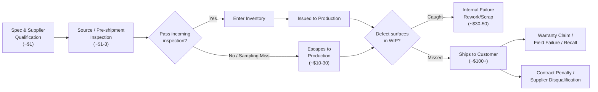

## Supply Chain and Procurement Applications

### Overview

The 1-10-100 Rule — the principle that the cost of resolving a quality defect multiplies roughly by an order of magnitude at each stage it goes undetected — maps directly onto supply chain and procurement processes, where a "defect" is not a code bug but a bad specification, a bad supplier, or a bad purchase order. In this domain, the rule is often called the **cost of poor quality (COPQ) escalation** and is a core justification for investment in supplier quality management (SQM), incoming inspection, and procurement controls.

### Reframing the 1-10-100 Stages for Procurement

| Generic Stage | Manufacturing Analogue | Procurement/Supply Chain Analogue |
| --- | --- | --- |
| $1 — Prevention | Design review, DFM | Supplier qualification, contract clause review, spec sign-off before RFQ |
| $10 — Correction at source | In-process inspection catches a defect on the line | Incoming inspection at receiving dock catches a nonconforming shipment before it enters stock |
| $100 — Correction after release | Defect ships to the customer | Nonconforming material is issued to production, assembled into a finished good, and reaches the end customer or triggers a field recall |

**Key Points**

- In procurement, "prevention" cost is concentrated in **supplier qualification** and **specification clarity** — ambiguous purchase specs are the procurement equivalent of an ambiguous software requirement.
- "Appraisal" cost is concentrated in **incoming inspection**, **source inspection** (at the supplier's site, before shipment), and **certificate of conformance (CoC) review**.
- "Internal failure" cost is triggered when nonconforming material passes receiving and is discovered on the production line — line stoppage, rework, expedited replacement shipping.
- "External failure" cost is triggered when nonconforming material reaches the end customer — warranty claims, recalls, contract penalties, and reputational/relationship damage with the buyer.

### Where in the Procurement Lifecycle Each Multiplier Applies

**1. Specification and RFQ stage ($1 tier)**

- Cost driver: time spent writing precise, testable specifications and acceptance criteria into the purchase order or contract.
- A vague spec ("industrial-grade steel bracket") versus a fully toleranced spec (material grade, dimensional tolerances, finish, applicable standard) determines how much ambiguity downstream inspection has to resolve.
- Supplier qualification (audits, sample lot approval, ISO 9001/AS9100 certification checks) belongs here — it's cheaper to disqualify a bad supplier before the first PO than after ten shipments.

**2. Source inspection / pre-shipment inspection (still low-cost tier)**

- Inspecting at the *supplier's* facility before goods ship is cheaper than inspecting after freight cost has been sunk, because a rejected lot doesn't need to be shipped back.
- Common in international sourcing (e.g., apparel, electronics manufacturing) via third-party inspection agencies.

**3. Incoming/receiving inspection ($10 tier)**

- Cost driver: labor and equipment to sample-inspect or fully inspect incoming shipments against the PO spec before they're put into inventory or issued to production.
- Statistical sampling plans (e.g., ANSI/ASQ Z1.4, formerly MIL-STD-105E) are the standard tool: they define how large a sample to pull from a lot and what defect count triggers lot rejection, balancing inspection cost against escape risk.
- A rejected lot at this stage costs: inspection labor, a hold on production schedule while a replacement is sourced, and supplier corrective action (SCAR) administrative overhead — but not yet any cost of scrapped finished goods or customer exposure.

**4. Work-in-process / production issue ($100 tier begins)**

- If nonconforming material escapes incoming inspection (or inspection was skipped/sampled and missed it) and gets built into a subassembly or finished product, the cost multiplies:
  - Scrapped or reworked finished goods (labor + materials already invested, not just the raw material cost)
  - Production line stoppage while the root cause is traced
  - Potential re-inspection of the *entire* lot or of downstream inventory already built from the same batch

**5. Field failure / customer return ($100+ tier)**

- The most expensive tier: warranty costs, field service dispatch, recall logistics, regulatory reporting (in regulated industries — automotive, aerospace, medical device, or in the LGU/government-adjacent contracting space, compliance audit findings), and contract penalty clauses (liquidated damages) for late or defective delivery to a government buyer.
- Reputational cost is the hardest to quantify but often dominates: loss of preferred-supplier status, disqualification from future bids, negative past-performance ratings in government procurement systems (relevant given past-performance evaluation is a formal scoring criterion in most public procurement frameworks).

### Diagram: Procurement Escalation Path

### Practical Mechanisms Used at Each Tier

**Prevention tier**

- Approved Vendor List (AVL) / Approved Supplier List (ASL) maintenance
- First Article Inspection (FAI) requirements written into contracts for new suppliers or new part numbers
- Statement of Work (SOW) and specification clarity reviews before RFQ release
- Supplier scorecards tracking historical on-time delivery and quality rates, used to weight sourcing decisions

**Appraisal tier**

- Acceptance Sampling Plans (e.g., AQL-based sampling per ANSI/ASQ Z1.4)
- Certificate of Conformance / Certificate of Analysis review against PO requirements
- Dock audits and receiving inspection checklists
- Digital procurement systems with built-in three-way match (PO, receipt, invoice) as a control gate before payment release — a financial-control analogue to quality inspection

**Internal failure tier**

- Supplier Corrective Action Request (SCAR) / 8D problem-solving process
- Material Review Board (MRB) disposition (use-as-is, rework, return-to-supplier, scrap)
- Root Cause and Corrective Action (RCCA) documentation, often required to close out the nonconformance

**External failure tier**

- Recall management and traceability (lot/serial number tracking is the mechanism that makes a recall *possible* to scope correctly rather than requiring a blanket recall of all product)
- Warranty claim processing and cost recovery from supplier (chargebacks)
- Contract remedies: liquidated damages clauses, right-to-terminate-for-default provisions — common in government procurement contracts

### Worked Numerical Example

A government office procures 500 units of a specific archival-grade filing cabinet for records storage (a plausible adjacent procurement to a document management system deployment).

- **Prevention cost:** $800 — two hours of a procurement specialist's time to write a precise material and finish specification, plus review of the supplier's ISO 9001 certification.
- **Appraisal cost:** $1,200 — incoming inspection of a 20-unit sample per ANSI/ASQ Z1.4 at a normal inspection level, checking dimensional tolerance and hardware conformance.
- **If a defect (undersized lock mechanism) escapes inspection** (sampling didn't catch it because it was present in only 8% of the lot, below the sampling plan's detection probability at that AQL) **and is discovered after units are distributed to five different department offices:**
  - Internal failure-equivalent cost: $4,000 — pulling and re-inspecting the remaining 480 units in the warehouse.
  - External failure cost: $18,000+ — site visits to five offices to swap defective units, temporary storage disruption during swap, and administrative cost of documenting a nonconformance against a government contract (which may affect the supplier's past-performance rating and the agency's audit trail).

The ratio here ($800 → $1,200 → $4,000 → $18,000+) is not exactly 1-10-100 in this instance — real-world ratios vary by industry and defect type [Inference — the canonical 1-10-100 ratios are illustrative order-of-magnitude figures, not derived from a universal formula, so actual multipliers in a given procurement context will deviate] — but the qualitative pattern (cost escalates by roughly an order of magnitude at each stage) holds.

### Industry-Specific Notes

- **Automotive (IATF 16949 environment):** Formalizes this escalation explicitly through PPAP (Production Part Approval Process) at the prevention tier and 8D corrective action at the failure tiers; a defect escaping to a vehicle assembly line can trigger stop-ship orders across an entire supply base.
- **Aerospace (AS9100 environment):** First Article Inspection and Source Inspection are mandatory gates precisely because the $100 tier in aerospace can mean grounding aircraft — the multiplier is far steeper than 1-10-100 in safety-critical contexts.
- **Government/public sector procurement:** The "$100" tier often includes non-monetary costs that are procurement-specific: loss of eligibility for future bids, negative CPARS-style past-performance ratings (in U.S. federal contracting) or equivalent local blacklisting mechanisms, and public accountability/audit exposure that private-sector supply chains don't face in the same way.
- **Retail/apparel:** Because margins are thin and lead times long (often overseas manufacturing), the emphasis shifts heavily toward source/pre-shipment inspection, since a failed incoming inspection after ocean freight means the cost of the freight itself is already sunk regardless of disposition.

### Common Pitfalls

- **Treating 100% incoming inspection as the solution.** Full inspection is itself an appraisal cost that can exceed the value it protects for low-risk, low-cost items; sampling plans exist specifically to right-size appraisal cost against risk (this is a cost-of-quality optimization problem, not a "more inspection is always better" problem).
- **Ignoring traceability as a prevention/appraisal investment.** Lot and serial tracking doesn't prevent a defect, but it dramatically reduces the *cost* of the external-failure tier by scoping a recall to the actually-affected units instead of the entire population shipped.
- **Underweighting supplier qualification cost as "administrative overhead."** Qualification is the cheapest of the four CoQ categories per defect prevented, which is exactly the argument the 1-10-100 Rule is used to make when justifying SQM headcount or tooling investment to procurement leadership.

### Related Topics

- Acceptance Sampling and AQL (Acceptable Quality Level) Determination
- Supplier Corrective Action Requests (SCAR) and the 8D Methodology
- First Article Inspection (FAI) and Production Part Approval Process (PPAP)
- Material Review Board (MRB) Disposition Workflows
- Lot Traceability Systems and Recall Scoping
- Total Cost of Ownership (TCO) vs. Purchase Price in Supplier Selection
- Government Procurement Past-Performance Rating Systems (e.g., CPARS)