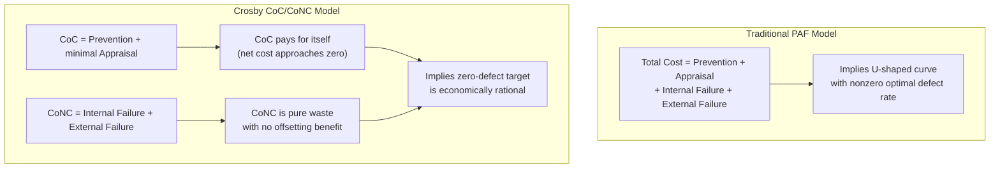

## Crosby's Cost of Quality versus Cost of Nonconformance

### Overview

Philip Crosby's central contribution to quality economics was a reframing of the standard PAF (Prevention-Appraisal-Failure) model into a simpler binary: **Cost of Conformance (CoC)** versus **Cost of Nonconformance (CoNC)**. This is not merely a relabeling — it reflects a distinct philosophical claim Crosby made in *Quality Is Free* (1979): that spending on prevention isn't a "cost of quality" at all in the ordinary economic sense, because it pays for itself. The only real cost is the cost of *not* doing things right the first time.

### Crosby's Reframing of the PAF Model

**Key Points**

- The traditional PAF model (Prevention, Appraisal, Internal Failure, External Failure — originating with Feigenbaum and Juran) treats all four categories as "costs of quality," implying a tradeoff: you spend more on prevention/appraisal to spend less on failure, and an optimal quality level exists where total cost is minimized.
- Crosby rejected the idea that there is an economically optimal *non-zero* defect rate. His famous thesis, "Quality Is Free," argues the cost of achieving quality is more than offset by the cost avoided from nonconformance — so the "optimal" defect level is zero, not some positive tradeoff point.
- Crosby therefore regrouped the four PAF categories into two:
  - **Cost of Conformance (CoC):** what it costs to do things right — prevention activities (training, process design, defect-cause analysis) plus the *necessary minimum* of appraisal (inspection, testing) required to verify conformance.
  - **Cost of Nonconformance (CoNC):** what it costs when things are done wrong — internal failure (scrap, rework) plus external failure (warranty, returns, recalls, lost customers).

### CoC vs. CoNC Mapped to the Traditional PAF Categories

| Traditional PAF Category | Crosby's Reclassification | Crosby's Interpretation |
| --- | --- | --- |
| Prevention | Cost of Conformance | Investment that pays for itself; not truly a "cost" in the net sense |
| Appraisal | Cost of Conformance (partially) | Necessary while processes are still imperfect; should shrink toward zero as prevention matures |
| Internal Failure | Cost of Nonconformance | Pure waste — no offsetting benefit whatsoever |
| External Failure | Cost of Nonconformance | Pure waste, compounded by relationship/reputation damage |

**Note on the appraisal category's placement:** [Inference — Crosby's writing treats appraisal ambiguously] Crosby treated appraisal as a *transitional* cost rather than a permanent fixture: in his model, a mature "zero defects" process should require progressively less appraisal because prevention has already eliminated the defects appraisal would otherwise catch. Some secondary literature places appraisal entirely under CoNC on the logic that "if you needed to inspect for it, something's not yet right." Practitioners applying Crosby's framework should be explicit about which convention they're using, since it changes where the CoC/CoNC line is drawn.

### The Core Philosophical Difference from the Juran/Feigenbaum PAF Model

The standard PAF model assumes an **economic quality equilibrium**: as you increase prevention and appraisal spend, failure cost drops, but at a diminishing rate — eventually the marginal cost of catching one more defect exceeds the marginal cost of just letting it fail and fixing it downstream. This implies a U-shaped total cost curve with a nonzero optimal defect rate.

Crosby's CoC/CoNC model explicitly denies this curve shape for most processes. His claim was that the traditional curve is an artifact of measuring cost incompletely — specifically, undercounting the true cost of external failure (customer defection, reputational damage, and the "hidden factory" of rework) — and that once true nonconformance cost is fully accounted for, the economically rational target is zero defects, not some positive equilibrium.

### Practical Differences in How the Two Models Are Applied

| Aspect | PAF Model (Juran/Feigenbaum) | Crosby CoC/CoNC Model |
| --- | --- | --- |
| Target defect rate | Economically optimal, generally nonzero | Zero defects, framed as the rational target |
| Role of appraisal | Permanent, ongoing cost category | Transitional, should shrink as prevention matures |
| Framing of prevention spend | A cost to be balanced against failure cost | Not a "true cost" — investment that pays for itself |
| Primary metric | Total quality cost as % of sales/revenue | Ratio or trend of CoNC alone (since CoC is framed as self-funding) |
| Management message | "Find the optimal quality investment level" | "Do it right the first time; nonconformance is 100% avoidable waste" |
| Underlying assumption | Diminishing returns to prevention/appraisal spend | Full accounting reveals nonconformance cost dwarfs conformance cost |

### Applying CoC/CoNC in a Software/Systems Context

Mapping Crosby's framework onto software delivery (directly relevant to a project like a document management system with formal specifications and a two-stage dev workflow):

**Cost of Conformance**

- Requirements review and spec sign-off before implementation begins
- Type systems, schema validation (e.g., Zod schemas enforcing shape at the API boundary), and CI linting — these are *prevention*, since they make entire classes of nonconformance structurally impossible rather than catching them after the fact
- Code review against agreed conventions
- The *minimum necessary* automated test suite required to verify conformance to spec

**Cost of Nonconformance**

- Bug-fix cycles discovered in QA (internal failure)
- Hotfixes and rollback procedures for production incidents (external failure)
- Support tickets and user-reported defects (external failure)
- Rework caused by ambiguous or incorrect specifications discovered mid-implementation (arguably internal failure, though Crosby's model would trace this back to a *prevention* gap — the spec review step failed to catch the ambiguity)

**Crosby's implied argument applied here:** money spent tightening the Zod validation schemas or clarifying a tRPC procedure's contract *before* the executor agent implements it is not really a "cost" in Crosby's accounting — it's an investment that eliminates a category of defect entirely, at a fraction of what a production hotfix for the same defect class would cost. This is the direct software-engineering analogue of "quality is free."

### Critiques of Crosby's CoC/CoNC Framing

- **The "zero defects is economically optimal" claim doesn't hold universally.** [Inference — this is a documented critique in the quality management literature, not a settled consensus fact] In domains with very high marginal appraisal cost relative to failure cost (e.g., low-stakes, easily-reversible errors), the traditional PAF equilibrium view is arguably more accurate than Crosby's zero-defect claim. Crosby's framework is most defensible in high-consequence domains (aerospace, medical devices, safety-critical software) where external failure cost genuinely is disproportionate.
- **Appraisal's ambiguous placement creates measurement inconsistency.** Because different practitioners assign appraisal to CoC or CoNC differently, CoC/CoNC figures aren't always comparable across organizations or even across time within the same organization if the convention shifts.
- **"Quality is free" is a motivational framing as much as an accounting one.** Crosby's own writing leans heavily on this thesis as a management persuasion tool — convincing leadership that quality investment isn't a tradeoff against profitability — which is a legitimate and influential contribution, but readers should distinguish the *behavioral/motivational* claim from the *strict cost-accounting* claim when applying the model.
- **Doesn't account for the cost of achieving zero defects in complex, novel systems.** Repetitive manufacturing processes (Crosby's primary domain) allow prevention investment to eliminate defect *classes* permanently. Novel or evolving systems (custom software, first-of-a-kind government platforms) generate genuinely new failure modes over time that no amount of prior prevention spend could have anticipated — the CoC/CoNC model doesn't explicitly address the cost of prevention against unknown-unknowns. [Inference]

### Relationship to the 1-10-100 Rule

Crosby's CoC/CoNC split and the 1-10-100 Rule are complementary, not competing, frameworks:

- The 1-10-100 Rule describes the **temporal escalation** of nonconformance cost — how CoNC grows as a defect moves through the lifecycle undetected.
- Crosby's CoC/CoNC split describes the **structural allocation** of total quality spend — how much goes to conformance-enabling activity versus nonconformance cleanup.
- Read together: 1-10-100 is the empirical justification *for* Crosby's zero-defects philosophy — if nonconformance cost truly multiplies an order of magnitude per stage, then front-loaded conformance investment (Crosby's CoC) becomes the dominant economically rational strategy, which is exactly Crosby's "quality is free" conclusion.

### Related Topics

- Crosby's Four Absolutes of Quality Management
- The "Zero Defects" Philosophy and Its Critics
- PAF Model (Prevention-Appraisal-Failure) in Detail
- The Hidden Factory Concept (Cost of Rework Not Captured in Standard Accounting)
- Juran's Quality Trilogy as a Counterpoint to Crosby
- Cost of Quality as a Percentage of Revenue: Benchmarking Norms by Industry