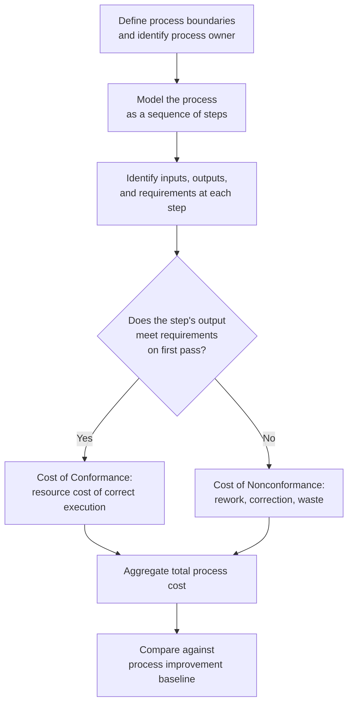

## The Process Cost Model, BS 6143 Part 1

### Overview

BS 6143 is a British Standard covering the economics of quality, published by BSI (the British Standards Institution). It exists in two parts, each proposing a distinct method for quality costing:

- **BS 6143-1 (1992): "Guide to the economics of quality — Process cost model"** — the subject of this section.
- **BS 6143-2 (1990): "Guide to the economics of quality — Prevention, appraisal and failure model"** — the traditional PAF model in standardized form.

BS 6143-1 was published as an extensive revision and expansion of the original BS 6143:1981 standard, and represents a deliberate departure from PAF-style quality costing toward a process-centric approach. [bsigroup](https://accord-checkout.bsigroup.com/products/guide-to-the-economics-of-quality-process-cost-model)

### Core Definition and Purpose

Per BSI's own abstract, BS 6143-1 provides guidance on modeling and determining costs associated within any business process in a manner consistent with continuous improvement and total quality management. Critically, the process cost model sets out a method for applying quality costing to any process or service — not just manufacturing production lines, which was the traditional domain of PAF costing. [bsigroup](https://accord-checkout.bsigroup.com/products/guide-to-the-economics-of-quality-process-cost-model)[bsigroup](https://accord-checkout.bsigroup.com/products/guide-to-the-economics-of-quality-process-cost-model)

**Key Points**

- The model recognizes the importance of process measurement and process ownership — costing is anchored to a defined process and the person/role accountable for that process, not to organization-wide cost categories. [bsigroup](https://accord-checkout.bsigroup.com/products/guide-to-the-economics-of-quality-process-cost-model)
- The categories of quality costs are rationalized down to just two: the cost of conformance and the cost of nonconformance, explicitly stated to simplify classification relative to the four-category PAF model. [bsigroup](https://accord-checkout.bsigroup.com/products/guide-to-the-economics-of-quality-process-cost-model)[bsigroup](https://accord-checkout.bsigroup.com/products/guide-to-the-economics-of-quality-process-cost-model)
- The method depends on the use of process modeling, and the standard provides guidelines on useful techniques for that modeling. [bsigroup](https://accord-checkout.bsigroup.com/products/guide-to-the-economics-of-quality-process-cost-model)

This CoC/CoNC binary is the same conceptual split associated with Crosby's philosophy (covered in the preceding section), but BS 6143-1 formalizes it as a *measurement methodology* — anchored to explicit process modeling — rather than as a management philosophy about zero defects.

### Why the Process Cost Model Was Developed: Limitations of PAF

The Process Cost Model emerged specifically because the PAF model, designed for repetitive manufacturing production lines, translates poorly to services, administrative processes, and non-manufacturing contexts. Academic evaluation of the standard makes this motivation explicit: a Master's thesis evaluating the model at a manufacturing site notes it compares and contrasts the Process Cost Model approach against the traditional Prevention-Appraisal-Failure model used in most manufacturing environments, and found that the Process Cost Model was able to identify a wide range of costs that would not normally be included in a traditional quality cost analysis. [southwales](https://pure.southwales.ac.uk/en/studentTheses/evaluation-of-the-process-cost-model-at-trico-limited-pontypool/)[southwales](https://pure.southwales.ac.uk/en/studentTheses/evaluation-of-the-process-cost-model-at-trico-limited-pontypool/)

**Key limitations of PAF that PCM addresses:**

- PAF categories (prevention/appraisal/failure) are intuitive for a physical production line with discrete inspection points, but map awkwardly onto administrative, service, or knowledge-work processes where there's no obvious "inspection station."
- PAF requires costs to be pre-classified into one of four buckets, which forces judgment calls that are often inconsistent across departments or analysts.
- PAF doesn't naturally account for the cost of a *correctly executed but wasteful* process step — work that conforms to no defect but still represents non-value-adding cost within the process.

### The Two Cost Categories in Detail

**Cost of Conformance**

The cost of running the process as specified, correctly, the first time — includes the "doing it right" work itself, not just prevention/appraisal overhead layered on top of it. This is broader than Crosby's CoC in the sense that it can include the baseline resource cost of executing the process correctly, not solely the *quality-assurance* activities.

**Cost of Nonconformance**

The cost of process failure — costs due to non-compliance, encompassing rework, correction, waste, and any resource consumed because the process output did not meet requirements on the first pass. [mshj](https://mshj.ru/en/nauka/article/74710/view)

A Russian-language academic application of the standard to public utility services summarizes the categorization plainly: quality cost categories are presented as compliance costs and costs due to non-compliance, which serves to simplify the classification — confirming this same two-category structure holds across the standard's applications outside its country of origin. [mshj](https://mshj.ru/en/nauka/article/74710/view)

### Methodology: Process Modeling as the Foundation

Unlike PAF, which can be applied by classifying a chart of accounts' cost line items into four buckets without formally modeling the underlying process, BS 6143-1 requires the analyst to first **model the process** — mapping its steps, inputs, outputs, and ownership — before costs can be meaningfully assigned to conformance or nonconformance. This is the standard's most distinctive methodological requirement and is why it was adaptable to domains far outside manufacturing.

### Documented Real-World Applications

The Process Cost Model's domain-agnostic design has led to documented applications well beyond its original manufacturing context:

**Manufacturing (original domain).** A pilot evaluation at a manufacturing firm conducted the study in both a manufacturing area and an administration area over a three-month period, using a cross-functional team in each area to carry out the study and evaluate results — notably, testing the model in both a shop-floor and an office context within the same evaluation, precisely to assess PCM's claimed cross-domain applicability. [southwales](https://pure.southwales.ac.uk/en/studentTheses/evaluation-of-the-process-cost-model-at-trico-limited-pontypool/)

**Capital plant / nuclear and defence engineering.** A published case study describes the second implementation phase of a quality costing system in a large engineering company providing capital plant for the nuclear and defence industries, where the system is based on an adapted version of the process model outlined in BS 6143 Part 1 (1992), adapted to enable better understanding of business processes and the information the system provided. This study's conclusions are worth noting directly: it found that comparing process model results between different processes is not straightforward, and reached a conclusion aligned with the broader literature — that quality costing does not, by itself, drive improvement, while also indicating the adapted process model could be implemented across different company types, provided generic processes or quality cost measures are identified to make cross-area comparisons possible. [Quality costing: the application of the process model within a manufacturing environment +3](https://www.emerald.com/insight/content/doi/10.1108/01443579710158050/full/html)

**Construction.** Doctoral research proposed a **Construction Process Cost Model (CPCM)**, explicitly based on Part 1 of BS 6143 — the Process Cost Model, developed after industry interviews found that a traditional PAF-style model was impractical in construction because of the existing practice of multi-level contracting and the tremendous resources data collection would require. The resulting CPCM was tested across four projects — three construction projects and one design project — and concluded to be both feasible and practical for measuring the performance and improvement of construction projects, and the researcher noted it was, to their knowledge, the first application of the Process Cost Model to the construction industry. [Please use this identifier to cite or link to this item: http://hdl.handle.net/10397/83950 +3](https://ira.lib.polyu.edu.hk/handle/10397/83950)

**Public utilities / housing services.** The model has also been applied to the processes of a serving organization within housing and public utility services — a service-sector, non-manufacturing context structurally analogous to municipal/LGU service delivery. [mshj](https://mshj.ru/en/nauka/article/74710/view)

**Plastic injection moulding (comparative study).** One action-research study directly compared PAF against the Process Cost Model within the same production environment, noting both models form part of British Standard BS 6143, have received coverage in professional journals, and have been utilised within both manufacturing and service industries to provide quality costing data. Notably, that study's conclusion favored the PAF model for the specific host firm after adaptation, underscoring that PCM's suitability is context-dependent rather than universally superior. [mdx](https://repository.mdx.ac.uk/item/83xq4)

### PCM versus PAF versus Crosby's CoC/CoNC: Where Each Sits

| Model | Category Structure | Anchoring Mechanism | Best Suited For |
| --- | --- | --- | --- |
| PAF (BS 6143-2) | 4 categories: Prevention, Appraisal, Internal Failure, External Failure | Cost-account classification | Repetitive manufacturing with discrete inspection points |
| Crosby CoC/CoNC | 2 categories, philosophically framed | Management persuasion / zero-defects argument | Organization-wide quality culture change |
| Process Cost Model (BS 6143-1) | 2 categories: Conformance, Nonconformance | Explicit process modeling of steps/owners | Services, administration, non-repetitive or cross-functional processes |

A key distinction: Crosby's CoC/CoNC split is primarily a *philosophical/motivational* reframing (see previous section), while BS 6143-1's CoC/CoNC split is a *formal measurement standard* requiring documented process modeling as a methodological prerequisite — the same two-category label is used by both, but BS 6143-1 operationalizes it with a defined modeling procedure that Crosby's original writing did not specify.

### Applicability to Government / Municipal Service Processes

Given the Process Cost Model's demonstrated use in public utility and housing-service contexts, it is structurally well-suited to processes like municipal document workflows — sequential, cross-departmental service processes with clear process ownership at each stage (e.g., document intake → review → approval routing → archival) but no natural "inspection station" of the kind PAF assumes. Applying PCM would mean: (1) explicitly modeling each stage of the document lifecycle as a process step, (2) assigning cost of conformance to correctly-routed, correctly-approved documents processed on the first pass, and (3) assigning cost of nonconformance to rework — documents returned for correction, re-routed due to missing co-signatures, or reprocessed due to misclassification.

### Common Pitfalls and Critiques

- **Process modeling overhead can itself become disproportionate.** Because PCM requires formal process modeling before costing can begin, the up-front methodological cost is higher than PAF's simpler account-classification approach — a real tradeoff for smaller organizations or processes.
- **Cross-process comparability is weak without standardized generic processes.** As the nuclear/defence case study found, comparing results between different processes is not straightforward — a documented, recurring limitation across multiple independent applications of the standard. [emerald](https://www.emerald.com/insight/content/doi/10.1108/01443579710158050/full/html)
- **Quality costing alone does not drive improvement.** Multiple independent studies converge on the same finding: quality costing does not provide for improvement per se — PCM (like PAF) is a measurement tool, not an improvement methodology in itself, and must be paired with an actual improvement process (e.g., root-cause analysis, Kaizen, Six Sigma DMAIC) to translate cost visibility into cost reduction. [emerald](https://www.emerald.com/insight/content/doi/10.1108/01443579710158050/full/html)

### Related Topics

- BS 6143-2: The Prevention, Appraisal and Failure (PAF) Model as a British Standard
- Process Mapping and Modeling Techniques for Quality Costing
- The Construction Process Cost Model (CPCM) as a Domain Adaptation of PCM
- Crosby's Cost of Conformance vs. Cost of Nonconformance (Philosophical Model)
- ISO 9000 Quality Management Systems and Their Relationship to Quality Costing Standards
- Quality Costing in Service Industries: Challenges of Non-Manufacturing Contexts