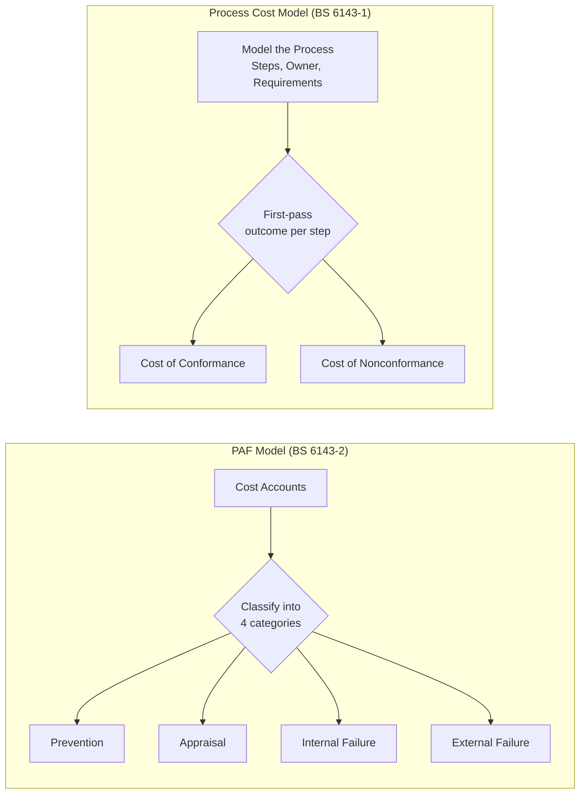

## Comparing the PAF Model and the Process Cost Model

### Overview

The Prevention-Appraisal-Failure (PAF) model and the Process Cost Model (PCM) are the two quality-costing methodologies formalized as separate parts of the same British Standard — BS 6143-2 (1990) and BS 6143-1 (1992) respectively. Their coexistence within a single standard series is itself informative: BSI did not deprecate PAF in favor of PCM, but published both as legitimate, coexisting approaches suited to different organizational contexts. This section compares them directly across structure, methodology, applicability, and documented empirical findings.

### Structural Comparison

| Dimension | PAF Model (BS 6143-2) | Process Cost Model (BS 6143-1) |
| --- | --- | --- |
| Number of cost categories | 4: Prevention, Appraisal, Internal Failure, External Failure | 2: Cost of Conformance, Cost of Nonconformance |
| Anchoring unit | The organization's cost accounts / cost centers | A modeled business process with a defined owner |
| Prerequisite methodology | None beyond a chart of accounts | Formal process modeling (steps, inputs, outputs, requirements) |
| Origin domain | Repetitive manufacturing production lines | Explicitly domain-agnostic; developed to also serve administration and services |
| Classification approach | Costs pre-assigned to one of four buckets | Costs assigned to conformance/nonconformance based on first-pass process outcome |
| Conceptual lineage | Feigenbaum / Juran quality-cost tradition | A rationalization/simplification of the PAF categories into two |

### Core Philosophical Difference

**PAF's implicit assumption:** quality cost has four functionally distinct categories, each requiring separate tracking because they represent different management levers (invest more in prevention to reduce failure; invest more in appraisal to catch what prevention missed). This structure assumes a production-line-like process where discrete inspection points naturally exist.

**PCM's implicit critique of PAF:** the four-way PAF split, while intuitive for a factory floor, is difficult to apply consistently outside manufacturing, and forcing every cost into one of four predefined buckets creates classification ambiguity — particularly around appraisal, which straddles conformance and nonconformance depending on interpretation. PCM's answer is to collapse the categories to two and instead invest the methodological effort *upstream*, in explicitly modeling the process before any costing occurs.

### Methodological Comparison

**PAF workflow:**

1. Identify cost line items across the organization (inspection labor, scrap, warranty claims, training spend, etc.)
2. Classify each line item into one of the four PAF categories
3. Aggregate by category and track trends over time (typically as a percentage of sales or production cost)
4. Use the category breakdown to argue for reallocating spend (e.g., shift budget from failure toward prevention)

**PCM workflow:**

1. Define the process boundary and identify the process owner
2. Model the process as an explicit sequence of steps with defined inputs, outputs, and requirements at each step
3. For each step, determine whether output met requirements on the first pass
4. Assign resource cost of correctly-executed steps to Cost of Conformance; assign rework/correction/waste cost to Cost of Nonconformance
5. Aggregate to a total process cost, usable as a baseline for process improvement comparison

The PCM workflow's dependency on step 2 (formal process modeling) is its most significant methodological departure from PAF — and its most significant additional up-front cost.

### Empirical Findings from Direct Comparative Studies

Several documented studies applied both models to the same organizational context, producing directly comparable findings rather than theoretical comparison alone.

**Manufacturing and administration pilot study.** A Master's thesis evaluation explicitly compares and contrasts the Process Cost Model approach against the traditional Prevention-Appraisal-Failure model used in most manufacturing environments, conducting a pilot study across both a manufacturing area and an administration area over a three-month period with cross-functional teams in each. The study found that PCM was able to identify a wide range of costs that would not normally be included in a traditional quality cost analysis — a direct empirical point in PCM's favor for cost visibility, though the study does not establish that this additional visibility translated into better improvement outcomes.

**Plastic injection moulding comparative study.** An action-research investigation deliberately selected PAF and PCM as the two models to test side-by-side specifically because both models form part of British Standard BS 6143, have had some publicity in professional journals, and have been utilised within both manufacturing and service industries. After detailed analysis and adaptation to the host firm's specific industry, that study's key conclusions favored careful development of a specific cost model — in that instance the P.A.F. model — together with a methodology for employing it within a larger framework, treating this as essential; this suggests that, for that particular high-volume production environment, adapted PAF was judged more practical than PCM. This is a notable counterpoint to any assumption that PCM is a strict, universal upgrade over PAF.

**Nuclear/defence capital plant engineering.** A quality costing system based on an adapted version of the BS 6143-1 process model, in a firm providing capital plant for the nuclear and defence industries, found that comparing process model results between different processes is not straightforward, arriving at a conclusion aligned with the broader literature: that quality costing does not provide for improvement per se. This finding applies to quality costing generally (both models), but was specifically surfaced through a PCM implementation, and adds the caveat that generic processes or quality cost measures must be identified to enable comparison between different areas of the same organization.

### Summary of When Each Model Tends to Be Favored

| Factor Favoring PAF | Factor Favoring PCM |
| --- | --- |
| Repetitive manufacturing with clear, discrete inspection points | Administrative, service, or cross-functional processes without natural inspection stations |
| Existing cost-accounting infrastructure already organized by category | Willingness to invest in explicit process modeling up front |
| Need to compare quality cost trends against industry PAF benchmarks | Need for high-fidelity visibility into costs a coarse 4-category scheme would miss |
| Simpler implementation with lower methodological overhead | Non-manufacturing domain (construction, public utilities, capital-plant engineering) where PAF categories don't map cleanly |
| Organization already fluent in PAF terminology/reporting | Desire to simplify quality-cost reporting to leadership into a single CoC/CoNC ratio |

### Common Conclusions Across Both Models

Independent studies applying either model converge on findings that are model-agnostic and worth treating as a general caution when adopting *either* framework:

- **Quality costing alone does not drive improvement.** This finding recurs explicitly in at least one comparative case study and is echoed in the broader literature it cites — both PAF and PCM are measurement tools; neither is an improvement methodology by itself. Pairing either model with a dedicated improvement process (root-cause analysis, Kaizen, Six Sigma DMAIC, or similar) is necessary to convert cost visibility into cost reduction.
- **Cross-area/cross-process comparison is difficult under both models** unless generic, standardized processes or cost measures are deliberately defined in advance — this was flagged as a limitation specifically encountered when applying PCM across different business areas within one organization, and is a structural challenge for any quality-costing rollout spanning heterogeneous processes.
- **Adaptation to the host organization's specific industry is typically necessary** for either model — none of the documented case studies applied BS 6143-1 or BS 6143-2 without modification; both the plastic injection moulding study and the nuclear/defence engineering study explicitly describe adapting the standard's base model to their context.

### Practical Guidance for Choosing Between Them

- If the organization's core deliverable is produced through a repetitive, high-volume production process with existing discrete quality-control checkpoints (classic manufacturing), PAF's four-category structure typically requires less new infrastructure and aligns with existing shop-floor QC practice.
- If the organization's core deliverable is a service or administrative process — legislative document routing, permit approval, housing/utility service delivery, or similar — PAF's categories will feel forced, and PCM's requirement to explicitly model the process (which such organizations often need to do anyway for other reasons, e.g., BPM or workflow-automation initiatives) makes the additional quality-costing layer cheaper to add on top of that modeling work.
- Regardless of which model is chosen, plan a separate, explicit improvement initiative to act on the cost data — the documented literature consistently warns that the costing exercise itself does not produce improvement.

### Related Topics

- BS 6143-2: The PAF Model as a Formal British Standard
- BS 6143-1: The Process Cost Model in Detail
- Process Modeling Techniques for Quality Costing (Flowcharting, SIPOC, Value Stream Mapping)
- Quality Costing in Non-Manufacturing Domains: Construction, Utilities, and Government Services
- From Cost Measurement to Cost Reduction: Pairing Quality Costing with Improvement Methodologies
- Crosby's CoC/CoNC Philosophy versus BS 6143-1's Formal CoC/CoNC Methodology