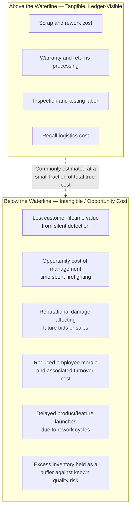

## Intangible and Opportunity Cost Models

### Overview

Both the PAF model and the Process Cost Model share a common limitation acknowledged even within their originating literature: they capture costs that appear in an organization's accounting system reasonably cleanly, but they systematically undercount — or omit entirely — costs that don't have a direct ledger entry. Intangible and opportunity cost models are extensions to standard Cost of Quality (CoQ) frameworks that attempt to bring these hidden costs into the analysis, on the argument that omitting them causes organizations to chronically underinvest in prevention because the true cost of nonconformance is understated.

### Why Standard CoQ Models Undercount True Cost

**Key Points**

- Traditional PAF and PCM costing draws primarily from existing cost-accounting data — labor hours, materials, scrap value, warranty payouts — because these figures are already tracked and auditable.
- Costs that never generate a discrete transaction (a lost customer who simply never orders again, a delayed decision because a manager was firefighting instead of planning, reputational erosion) have no natural home in a general ledger and are therefore invisible to a purely accounting-driven CoQ exercise.
- This creates a systematic bias: visible, tangible failure costs (scrap, rework, warranty) get measured and managed; invisible costs (lost future revenue, opportunity cost of diverted management attention) do not, even though quality-management literature broadly agrees the invisible costs are frequently larger.

### The "Iceberg" Model of Quality Cost

The most common conceptual framing for this gap is the quality cost iceberg — visible costs sit above the waterline and are readily measured; a much larger mass of hidden costs sits below it and is rarely quantified, though its existence is widely acknowledged in quality-management practice.

### Categories of Intangible and Opportunity Cost

**1. Lost customer / market-share cost**

- Most customers who experience a quality failure do not file a complaint or a warranty claim — they simply reduce future purchasing or switch suppliers, leaving no transaction record tying the lost revenue back to the original defect.
- This is the single most frequently cited "invisible" cost category in quality-cost literature, precisely because it can dwarf the visible failure cost (a $50 warranty claim can precede the loss of a customer relationship worth many multiples of that in lifetime value) while never appearing as a line item anywhere.
- In a government/institutional procurement context, the analogue is loss of preferred-bidder or trusted-vendor status — a citizen or partner agency's diminished confidence in a platform doesn't generate an invoice, but it can affect future funding, adoption rates, or political support for continued investment.

**2. Opportunity cost of diverted resources**

- Time spent by engineers, managers, or support staff fixing a quality problem is time *not* spent on planned, value-adding work — new features, process improvements, or other priorities.
- Standard CoQ accounting typically captures the labor cost of the fix (hours × wage rate) but not the value of what would otherwise have been produced with that time — the true opportunity cost is the forgone output, which is generally larger than the labor cost alone, particularly for high-value work like architecture or design.
- This is directly relevant to any team operating a fixed-capacity, prioritized backlog: every hour spent on an unplanned hotfix has a displaced opportunity cost equal to whatever backlog item would otherwise have been worked instead.

**3. Reputational and relationship cost**

- Damage to brand trust, partner confidence, or — in regulated/public-sector contexts — audit standing and past-performance ratings, tends to compound rather than resolve in a single period, making it resistant to the kind of single-incident costing that PAF/PCM apply well to discrete scrap or rework events.
- Reputational cost is asymmetric: it accumulates slowly through consistent quality and can be destroyed quickly by a single high-visibility failure, which standard CoQ trend analysis (typically measuring cost as a smooth percentage of revenue over time) is poorly suited to capture.

**4. Morale, turnover, and organizational cost**

- Chronic quality problems that force repeated firefighting are associated in general management literature with elevated staff frustration and turnover; turnover itself carries a substantial, well-documented replacement and ramp-up cost that is rarely attributed back to the quality failures that contributed to it.
- Sustained crisis-mode operation also degrades an organization's capacity for planned improvement work — a second-order opportunity cost, since fixing today's fire consumes the same capacity that would otherwise prevent tomorrow's.

**5. Cost of delayed time-to-market / time-to-value**

- Rework cycles consume calendar time as well as labor cost; a feature or system delayed by quality-driven rework has an opportunity cost equal to the value that would have been realized had it shipped on the original schedule — foregone efficiency gains, foregone user adoption, or in public-sector contexts, foregone service delivery to the population the system was meant to serve.

### Attempts to Formally Model These Costs

Because these costs largely resist direct ledger measurement, the quality-management field has developed several partial approaches rather than a single dominant formal model:

- **Customer Lifetime Value (CLV) adjustment models** — estimate lost future revenue by applying churn-rate assumptions derived from customer satisfaction or defect-exposure data to an existing CLV model, converting "a customer experienced a defect" into an estimated revenue-at-risk figure. [Inference — this is a standard technique borrowed from marketing/CRM analytics rather than a codified quality-costing standard]
- **Shadow pricing / opportunity-cost allocation** — assigns an internal "price" to scarce resources (senior engineering time, executive attention) above their raw wage cost, reflecting the value of the next-best use of that resource, then applies that shadow price to time consumed by quality failures rather than the resource's nominal cost.
- **Taguchi's Quality Loss Function** — a related but distinct formal model (from Genichi Taguchi) that quantifies the cost to society of *any* deviation from a target value, not just outright nonconformance to a tolerance band — treating loss as a continuous quadratic function of deviation rather than the binary pass/fail framing PAF and PCM both use. This reframes "cost of quality" to include costs imposed even on units that technically pass inspection but are not exactly on-target.
- **Survey- and proxy-based estimation** — since direct measurement is often infeasible, many organizations substitute proxy metrics (customer satisfaction scores, Net Promoter Score trends following known incidents, employee engagement survey deltas) as directional indicators of intangible cost, acknowledging these are estimates rather than audited figures.

### Comparison: Standard CoQ Models vs. Intangible/Opportunity Cost Extensions

| Aspect | PAF / Process Cost Model (Standard) | Intangible/Opportunity Cost Extension |
| --- | --- | --- |
| Data source | Existing cost-accounting records | Estimation, proxy metrics, survey data |
| Precision | High — auditable, reproducible figures | Low-to-moderate — inherently an estimate |
| Coverage | Tangible failure and prevention/appraisal cost | Lost revenue, opportunity cost, reputational/morale cost |
| Standardization | Formalized as British Standards (BS 6143-1/-2) | No single dominant standard; multiple partial techniques |
| Primary use | Operational tracking, trend reporting | Strategic argument-building for investment in prevention |
| Risk of misuse | Understates true cost of poor quality | Overstates cost via unfalsifiable, cherry-picked assumptions |

### Practical Guidance on Applying Intangible Cost Reasoning

- **Use intangible cost estimation to build the investment case, not as an audited KPI.** Because these figures are inherently estimates, they're most defensible when used to argue *directionally* for prevention investment (e.g., "even a conservative estimate of customer-defection cost dwarfs the visible warranty cost, so the true CoNC is understated") rather than reported as a precise trend metric alongside audited PAF/PCM figures.
- **Be explicit about assumptions and keep them separately labeled.** Blending estimated intangible costs into the same total as audited tangible costs (without labeling which is which) undermines the credibility of both — best practice is to report them as two distinct figures with intangible cost assumptions documented and available for scrutiny.
- **Prioritize the categories most measurable via proxy data first.** Opportunity cost of diverted engineering time (measurable via time-tracking or sprint-capacity data) is typically far more tractable to estimate credibly than reputational cost (which usually has no clean proxy at all) — extend the model incrementally rather than attempting comprehensive intangible costing in one pass.
- **Revisit intangible cost estimates when a high-visibility failure occurs.** A single significant incident (a public-facing outage, a high-profile defect affecting a government stakeholder) is often the most credible moment to estimate reputational and relationship cost, since the counterfactual (what would have happened without the failure) is at least partially observable through before/after metrics.

### Relationship to the 1-10-100 Rule

The 1-10-100 Rule, as conventionally illustrated, generally uses tangible cost figures (rework labor, replacement shipping, warranty payout) to demonstrate escalation across lifecycle stages. Incorporating intangible and opportunity cost into the "100" tier typically increases the multiplier well beyond a literal 100x, since the tangible failure cost used in most 1-10-100 illustrations is only the visible portion of the true external-failure cost — the reputational, customer-defection, and opportunity-cost components sitting below the waterline are, by the iceberg framing above, often the larger share of the real total. [Inference — the exact multiplier increase is context-dependent and not derivable from a fixed formula; this is a qualitative, directional claim consistent with the broader quality-cost literature rather than a precise, universally-cited figure]

### Related Topics

- The Quality Cost Iceberg: Origins and Critiques of the Metaphor
- Taguchi's Quality Loss Function as an Alternative to Pass/Fail Costing
- Customer Lifetime Value (CLV) and Churn Modeling as Quality-Cost Proxies
- Shadow Pricing and Opportunity-Cost Allocation in Resource-Constrained Teams
- Reputational Risk Quantification in Regulated and Public-Sector Contexts
- Building an Investment Case for Prevention Spend Using Intangible Cost Estimates