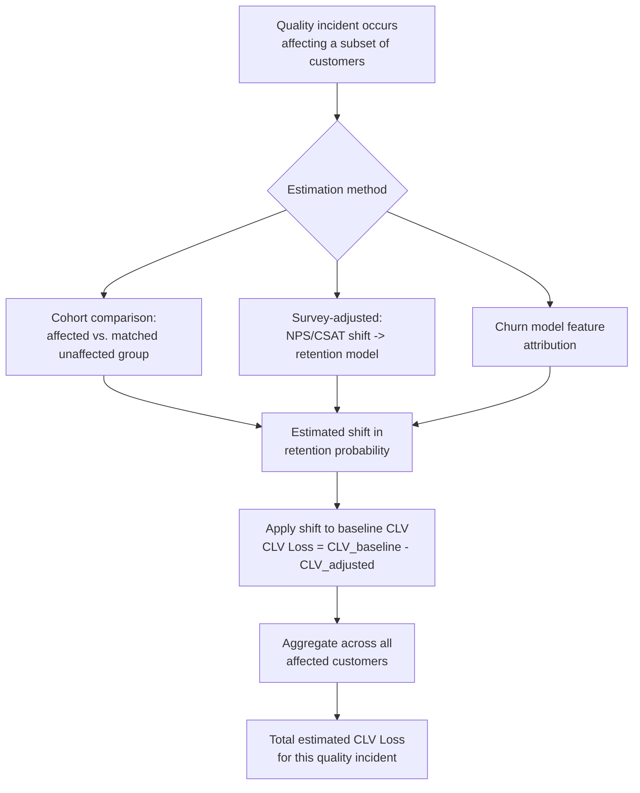

## Customer Lifetime Value Loss as a Quality Cost

### Overview

Customer Lifetime Value (CLV) loss is one specific, more formally modelable instance of the intangible/opportunity cost category discussed previously — it addresses the largest single component of the "hidden" cost of quality: revenue that disappears not through a refund or chargeback, but through a customer's quiet decision to reduce or end their relationship with the organization after a quality failure. Unlike most other intangible cost categories, CLV loss has a well-established quantitative methodology borrowed directly from marketing and CRM analytics, making it one of the more tractable intangible costs to actually estimate.

### Why CLV Loss Belongs in a Cost of Quality Framework

**Key Points**

- Standard PAF and Process Cost Model accounting captures external failure cost through transactions that generate a ledger entry: a warranty claim paid, a return processed, a refund issued.
- Most customers who experience a quality problem do not generate any such transaction — they simply purchase less, renew less often, or churn entirely, and this behavior change is invisible to transaction-based accounting because there's no single event to attribute it to.
- CLV modeling exists specifically to translate a *behavioral* signal (reduced future purchasing probability) into a *monetary* estimate, which is what makes it possible to fold into a quality-cost framework at all.
- The core argument for including CLV loss in CoQ analysis: if a $50 warranty claim precedes the loss of a customer relationship worth $2,000 in future lifetime value, the "true" external failure cost of that defect is not $50 — it's closer to $2,050 — and any CoQ model that stops at the $50 figure is understating the actual cost of nonconformance by roughly 40x in that instance.

### Core CLV Methodology

**Basic CLV formula (before any quality adjustment):**

$$CLV = \sum_{t=1}^{T} \frac{R_t \times M_t}{(1+d)^t}$$

Where:

- $R_t$ = expected retention probability at period $t$
- $M_t$ = expected margin or contribution from the customer at period $t$
- $d$ = discount rate
- $T$ = time horizon considered

**Key Points**

- CLV is fundamentally a *probabilistic revenue forecast* — it estimates the expected value of a customer relationship going forward, not a historical or guaranteed figure.
- The retention probability term $R_t$ is the variable most directly affected by a quality failure — a defect or poor-quality experience lowers the probability the customer renews, reorders, or continues the relationship in subsequent periods.
- Different CLV models weight historical purchase frequency, recency, and monetary value (the "RFM" framework) differently, and organizations typically already maintain some version of a CLV model for marketing/retention purposes — quality-cost CLV loss estimation borrows this existing infrastructure rather than building a new model from scratch.

### Modeling CLV Loss From a Quality Event

The quality-cost-specific extension is to compare *baseline* CLV (expected value absent the quality incident) against *adjusted* CLV (expected value incorporating the churn-probability impact of the incident):

$$\text{CLV Loss} = CLV_{\text{baseline}} - CLV_{\text{post-incident}}$$

**Practical estimation approaches**

1. **Cohort comparison method.** Compare the retention/renewal behavior of customers who experienced a specific defect or incident against a matched cohort of customers who did not, over the same subsequent period. The difference in observed retention rate, applied to the average CLV of an unaffected customer, yields an estimated CLV loss per affected customer.
2. **Survey-adjusted probability method.** Use post-incident customer satisfaction or Net Promoter Score (NPS) surveys to estimate a shift in stated repurchase/renewal intent, then apply published or internally-validated correlations between stated intent and actual retention behavior to translate the survey shift into a retention-probability adjustment.
3. **Churn-model feature attribution.** If the organization maintains a predictive churn model (e.g., a classifier using account/usage features), quality-incident exposure can be added as a feature; the model's estimated coefficient or feature importance for that variable provides a data-driven estimate of its marginal effect on churn probability.

### Worked Example

A document management platform serving multiple municipal department users experiences a defect: documents routed for approval intermittently fail to notify the assigned approver, causing visible delays in a subset of departments over a two-month period.

- **Directly measurable (tangible) cost:** 40 support tickets handled, 15 engineering hours to diagnose and fix, no direct financial refund since it's an internally-provisioned government system — visible cost under a standard PAF/PCM accounting might total a modest, easily-computed labor figure.
- **CLV-loss estimation:**
  - Baseline assumption: each department's continued use/renewal of the platform (versus reverting to paper-based or ad hoc digital workflows) represents an implicit "lifetime value" in terms of the system's long-run adoption and the platform team's continued budget justification.
  - Post-incident survey of affected department heads shows a measurable drop in stated confidence in the system relative to unaffected departments (a proxy for retention/adoption probability).
  - If even 2 of the 12 total departments materially reduce their reliance on the platform as a result (reverting select workflows to manual processes), the estimated CLV loss — measured as the value of future efficiency gains and administrative cost savings the platform was projected to deliver to those two departments over its planned multi-year lifespan — could be an order of magnitude larger than the visible support/engineering cost.

[Inference — this worked example is illustrative to demonstrate the methodology's application; actual CLV loss figures require organization-specific baseline data and cannot be derived generically]

### Adapting CLV Loss Modeling to Non-Revenue Contexts

CLV was originally developed for commercial, revenue-generating customer relationships, and its direct application assumes a monetizable future revenue stream. In non-commercial or internal-platform contexts (government systems, internal tooling, B2B relationships without per-transaction pricing), the concept requires adaptation:

| Commercial CLV Concept | Non-Revenue / Institutional Analogue |
| --- | --- |
| Future purchase/renewal revenue | Continued adoption, budget allocation, or renewed institutional support |
| Churn (customer stops buying) | Reversion to legacy/manual processes, reduced feature usage, non-renewal of internal funding |
| Margin per period | Efficiency gains or cost savings the system was projected to deliver |
| Customer acquisition cost (CAC) | Onboarding/training cost sunk into getting a department or user group to adopt the system |
| NPS / satisfaction surveys | Stakeholder confidence surveys, usage analytics, renewed-budget-request outcomes |

This reframing is what makes "CLV loss" applicable as a quality-cost concept even for platforms without a direct commercial pricing model — the underlying logic (a quality failure reduces the probability of continued, valuable engagement) transfers even when "value" is measured in efficiency gains or institutional trust rather than direct revenue.

### Limitations and Critiques

- **High sensitivity to underlying assumptions.** CLV estimates are only as reliable as the retention-probability model feeding them; small changes in assumed churn-probability shift can produce large swings in the final CLV-loss figure, making the number easy to manipulate (intentionally or not) to support a predetermined conclusion.
- **Attribution difficulty.** Isolating the CLV impact of *one specific* quality incident from all the other factors influencing customer retention (competing products, pricing changes, unrelated service issues) is methodologically difficult; cohort-comparison methods partially address this but require a genuinely comparable control group, which is often unavailable in practice.
- **Survey-based methods carry stated-vs-revealed-preference risk.** Customers' stated intent on a satisfaction survey does not always predict actual future behavior reliably — the gap between what people say and what they do is a well-documented issue in behavioral research generally, and CLV-loss estimates built purely on survey data inherit this risk. [Inference — this is a general critique of survey-based behavioral prediction, not specific to CLV methodology]
- **Risk of double-counting with other intangible cost categories.** CLV loss overlaps conceptually with reputational cost (discussed in the broader intangible-cost category) — a rigorous CoQ extension needs to define clear boundaries between "value lost from this specific customer relationship" and "reputational damage affecting future, not-yet-acquired customers" to avoid counting the same underlying phenomenon twice under two different labels.
- **Best treated as a range estimate, not a point figure.** Given the compounding assumptions involved, presenting CLV loss with an explicit confidence range (or at minimum, low/base/high scenarios) is more defensible than a single precise number, and helps prevent the estimate from being treated with false precision alongside audited tangible-cost figures.

### Practical Recommendations

- **Anchor to existing CLV infrastructure where it exists.** If the organization (or its marketing/product analytics function) already maintains a CLV model for other purposes, extend that model with a quality-incident feature rather than building a parallel model solely for quality-cost purposes.
- **Use cohort comparison as the primary method when a genuine control group is available**, since it relies on observed behavior rather than stated intent, and reserve survey-based estimation for situations where a clean cohort comparison isn't feasible (e.g., an incident affecting the entire customer base simultaneously, leaving no unaffected control group).
- **Report CLV loss alongside — never blended into — tangible CoQ figures**, explicitly labeled as an estimate with stated assumptions, consistent with the broader guidance for intangible cost categories: it strengthens the investment case for prevention spend without compromising the auditability of the tangible PAF/PCM figures it sits beside.
- **Revisit and recalibrate the underlying retention model periodically.** Customer behavior patterns, competitive context, and — in institutional settings — budget and political cycles shift over time; a CLV model calibrated once and never revisited will drift out of alignment with actual retention dynamics.

### Related Topics

- Customer Churn Prediction Models and Feature Engineering
- Net Promoter Score (NPS) and Customer Satisfaction as Retention Proxies
- RFM (Recency, Frequency, Monetary) Analysis in Customer Value Modeling
- Cohort Analysis Methodology for Isolating Incident Impact
- The Quality Cost Iceberg and the Broader Intangible/Opportunity Cost Category
- Adapting Commercial Customer-Value Models to Institutional and Government Contexts