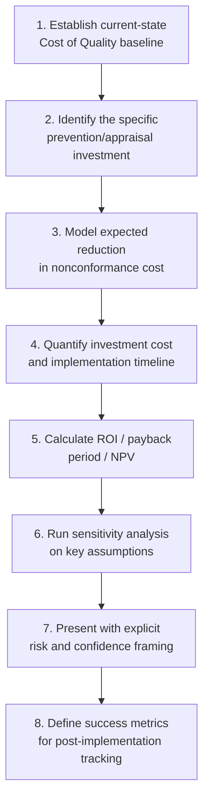

## Building the Business Case for Quality Investment

### Overview

A business case for quality investment translates the descriptive cost-of-quality models covered previously (PAF, Process Cost Model, the 1-10-100 Rule, intangible/CLV-loss extensions) into a decision-grade financial argument aimed at securing budget, headcount, or process change. The distinction matters: a CoQ *model* measures and categorizes cost; a *business case* uses that measurement to make an explicit, comparative argument for a specific investment decision, typically competing against other claims on the same budget.

### Why Quality Investment Business Cases Fail

**Key Points**

- The most common failure mode is presenting cost-of-quality data as an *observation* ("our failure cost is $X") rather than as a *decision argument* ("investing $Y in prevention reduces expected failure cost by $Z, yielding an ROI of N%, within T months").
- A second common failure is relying entirely on tangible, easily-audited failure costs while omitting the intangible/opportunity costs covered in the prior sections — this systematically understates the return on prevention investment, since (per the iceberg framing) the visible cost is typically the smaller share of the true cost.
- A third failure is presenting a single point estimate without sensitivity analysis, making the case fragile to a single skeptical question about the underlying assumptions.
- Quality-costing literature itself warns that costing alone does not drive improvement — a business case exists specifically to bridge that gap, converting a costing exercise into a funded action.

### Core Structure of a Quality Investment Business Case

### Step 1: Establish the Current-State Baseline

Before arguing for change, establish a defensible, auditable baseline of current quality cost using whichever model fits the organizational context (PAF for a manufacturing-style process, Process Cost Model for a service/administrative workflow). This baseline should:

- Separate tangible costs (fully auditable against existing records) from any intangible/opportunity cost estimates (clearly labeled as estimates, per the guidance in the prior section).
- Cover a long enough period to smooth out noise — a single bad month inflates urgency but weakens credibility if the underlying trend doesn't hold.
- Be presented as a trend, not a single snapshot, since a trend shows whether the problem is worsening, stable, or already improving under current practice — directly relevant to how urgent the proposed investment is.

### Step 2: Define the Specific Investment Precisely

**Key Points**

- Vague investment asks ("we need better quality processes") are far harder to cost and to hold accountable than specific asks ("adding automated contract-schema validation at the API boundary, requiring approximately N engineering-weeks").
- The investment should be traceable to a specific point in the process-cost or PAF model — e.g., "this closes a gap currently in the Appraisal category by shifting detection from post-deployment (External Failure) to pre-deployment (Prevention)."
- Where the investment maps cleanly onto the 1-10-100 Rule's stages (moving detection from stage 3 to stage 1, for instance), stating that shift explicitly makes the argument intuitive to a non-specialist audience without requiring them to follow detailed cost-accounting mechanics.

### Step 3: Model Expected Cost Reduction

This is typically the step requiring the most rigor and the most exposure to challenge, since it requires a causal claim (this investment will reduce failure cost by this amount) rather than a purely descriptive one.

**Approaches, roughly in order of increasing rigor:**

1. **Historical defect-class elimination.** If the investment specifically targets a defect class visible in historical data (e.g., "80% of production incidents last year trace to missing input validation"), estimate the reduction as the historical cost attributable to that defect class, discounted for the probability the intervention fully addresses it — rarely 100%.
2. **Escalation-avoidance modeling using the 1-10-100 Rule.** Estimate how many defects are expected to occur regardless of the investment, but model the cost reduction as shifting detection from a later, more expensive stage to an earlier, cheaper one — the marginal savings per defect is the *difference* between the two stages' costs, not the full elimination of cost.
3. **Comparable/benchmark-based estimation.** Where internal historical data is sparse (a new system, a novel defect category), reference published industry benchmarks or documented case studies (such as those cited in the PAF/PCM comparison) for plausible reduction magnitudes, explicitly flagged as externally-sourced assumptions rather than internally-validated figures.
4. **Pilot-based estimation.** Where feasible, run a limited-scope pilot of the proposed investment (e.g., apply stricter schema validation to one module rather than the whole system) and measure the actual defect-rate change before committing to a full rollout — this converts an estimate into an observed result, substantially strengthening the business case.

### Step 4: Quantify Investment Cost

Include the full cost of the investment, not just the most visible line item:

- Direct implementation cost (engineering time, tooling licenses, training)
- Ongoing maintenance cost of the new prevention/appraisal mechanism itself (a new automated check has a nonzero maintenance burden; omitting this overstates net ROI)
- Opportunity cost of the team's time — per the intangible-cost discussion, the true cost of diverting engineering capacity includes the value of what else that capacity would have produced, not just its wage cost
- Transition/change-management cost if the investment requires a process or workflow change for the people executing it

### Step 5: Calculate Financial Return Metrics

**Return on Investment (simple):**

$$ROI = \frac{\text{Estimated Cost Reduction} - \text{Investment Cost}}{\text{Investment Cost}} \times 100\%$$

**Payback period:**

$$\text{Payback Period} = \frac{\text{Investment Cost}}{\text{Estimated Annual Cost Reduction}}$$

**Net Present Value (for multi-period returns, accounting for the time value of money):**

$$NPV = \sum_{t=0}^{T} \frac{CF_t}{(1+r)^t}$$

Where $CF_t$ is the net cash flow (cost reduction minus ongoing cost) in period $t$, and $r$ is the discount rate.

**Key Points**

- ROI and payback period are more intuitive for non-financial stakeholders and are usually sufficient for smaller, tactical investments.
- NPV is more appropriate for larger, multi-year investments where the timing of returns matters — a return realized in year one is worth more than the same nominal return realized in year three, and NPV captures that difference explicitly.
- Whichever metric is used, present it alongside the underlying assumptions feeding it, not as a bare number — a decision-maker evaluating competing budget requests needs to assess assumption quality, not just compare final figures.

### Step 6: Sensitivity Analysis

Because the cost-reduction estimate (Step 3) is the most assumption-dependent part of the case, present a range rather than a single point estimate:

| Scenario | Key Assumption | Estimated Annual Savings | Payback Period |
| --- | --- | --- | --- |
| Conservative | Investment addresses 40% of targeted defect class | $X | Y months |
| Base case | Investment addresses 65% of targeted defect class (historical average for similar interventions) | $X × ~1.6 | Y × ~0.6 months |
| Optimistic | Investment addresses 85% of targeted defect class | $X × ~2.1 | Y × ~0.45 months |

Presenting even a conservative-scenario payback period that remains attractive is a stronger argument than presenting only a single optimistic figure, because it demonstrates the case holds up under skepticism rather than depending on best-case assumptions.

### Step 7: Frame Risk and Confidence Explicitly

- State plainly which inputs are audited/high-confidence (tangible historical failure cost) versus estimated/lower-confidence (intangible cost, projected defect-reduction percentage) — conflating the two, as noted in the prior intangible-cost section, undermines the credibility of the entire case if a skeptical reviewer identifies the blend.
- Identify the largest single assumption the conclusion depends on, and address it directly rather than letting a reviewer discover it unaddressed — this is generally more persuasive than an unqualified, confident presentation, since it demonstrates the analysis has already been stress-tested.
- Where the investment has a low-cost pilot or phased option (Step 3's pilot-based approach), presenting that as the *initial* ask — rather than requesting full-scope investment up front — substantially de-risks the decision for the approver and is often the more successful framing.

### Step 8: Define Post-Implementation Success Metrics

A business case that doesn't specify how success will be measured after implementation loses credibility for future asks — and forfeits the opportunity to convert this investment into evidence supporting the next one.

- Tie metrics directly back to the same CoQ categories used in the baseline (Step 1), so the before/after comparison is apples-to-apples.
- Set a specific review checkpoint (e.g., "reassess at 6 months against the payback-period projection") rather than leaving the timeline open-ended.
- Where the original estimate used a range (Step 6), track which scenario the actual result tracks closest to — this improves the calibration of future business cases within the same organization.

### Worked Example Summary

Applying this structure to a concrete prevention investment — adding stricter runtime schema validation (e.g., tightened Zod schemas) at API boundaries in a document-management platform, to catch malformed document-routing requests before they reach the database layer:

- **Baseline (Step 1):** historical incident data shows a measurable share of production hotfixes over the past two quarters trace to malformed or unexpected request payloads reaching business logic unvalidated.
- **Investment (Step 2):** a defined, scoped engineering effort to add exhaustive schema validation at all mutation endpoints, positioned explicitly as shifting these defects from External Failure (Step 5, post-deployment hotfix) to Prevention (pre-deployment, compile/request-time rejection).
- **Expected reduction (Step 3):** pilot-based — apply the stricter validation to the highest-incident module first, measure the reduction in that module's defect rate over a defined window, then extrapolate to the remaining modules with an explicit discount for modules with different risk profiles.
- **Investment cost (Step 4):** engineering time to define and implement schemas across endpoints, plus ongoing maintenance cost of keeping schemas synchronized with evolving business requirements as the platform grows.
- **Return metrics (Step 5–6):** payback period presented as a range, anchored to the pilot module's measured result as the base case rather than a purely theoretical estimate.

### Related Topics

- Applying the 1-10-100 Rule to Frame Investment Timing Arguments
- Sensitivity Analysis and Scenario Modeling Techniques
- Net Present Value and Discounted Cash Flow Basics for Non-Financial Stakeholders
- Pilot Program Design for De-Risking Process Investment Decisions
- Post-Implementation Review and Continuous Cost-of-Quality Tracking
- Communicating Technical Investment Cases to Non-Technical Budget Approvers