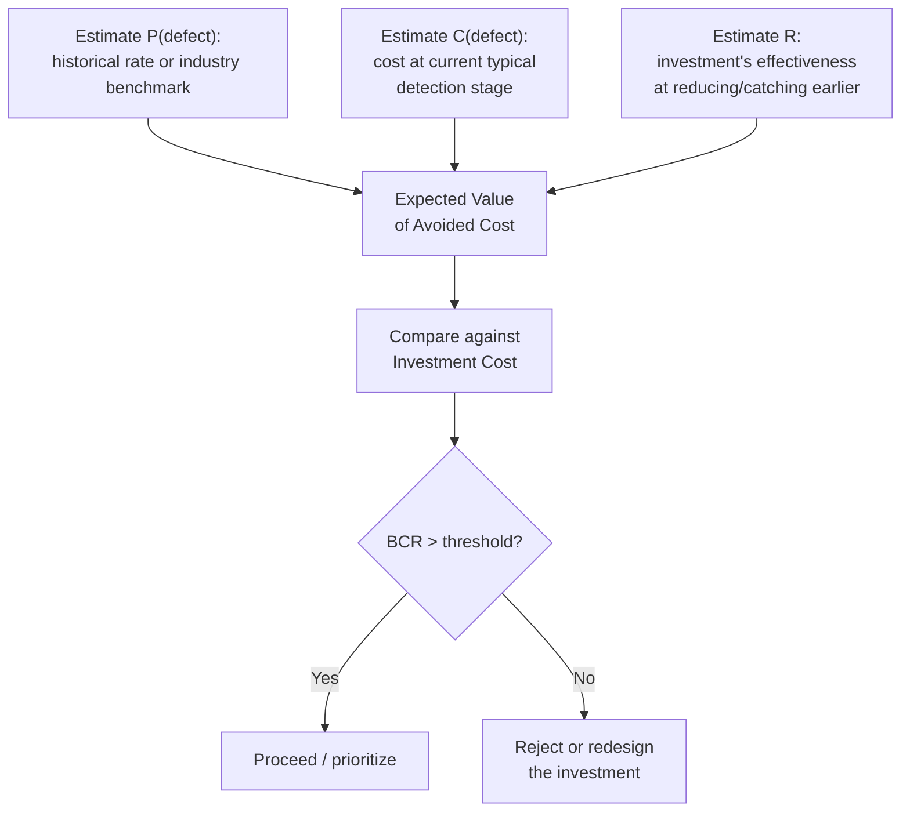
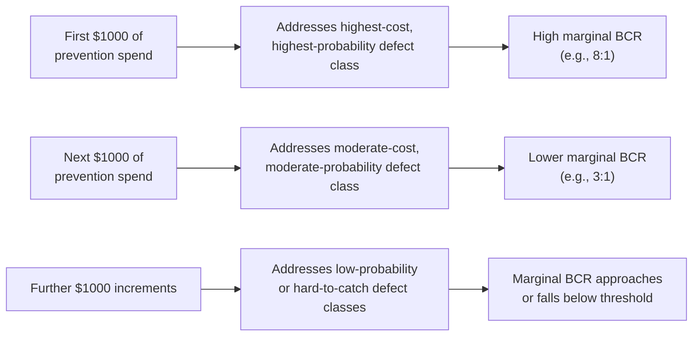

## Cost Benefit Analysis of Prevention Spending

### Overview

Cost-benefit analysis (CBA) of prevention spending is the analytical core that a quality-investment business case (covered in the previous section) relies on to justify a specific decision. Where the business case is the *presentation* — structuring an argument for stakeholders — CBA is the underlying *calculation*: a formal comparison of the costs and benefits of a prevention investment, typically expressed as a ratio, net figure, or decision threshold. This section covers the quantitative methodology in depth, including the specific challenges of applying standard CBA technique to prevention spending as a category.

### Why Prevention Spending Requires a Distinct CBA Approach

**Key Points**

- Standard capital-investment CBA compares an upfront cost against a stream of *known or reasonably forecastable* future benefits (e.g., a new machine that increases output by a measurable, contracted rate).
- Prevention spending's benefit is the *avoidance* of a cost that has not yet occurred and is inherently probabilistic — the CBA is comparing an investment against a reduction in *expected value* of future failure cost, not a certain future gain.
- This probabilistic character means prevention-spending CBA leans more heavily on expected-value calculation, risk-adjustment, and sensitivity analysis than does CBA for a straightforward revenue-generating investment.
- The 1-10-100 Rule provides the underlying justification for why prevention CBA so often yields a favorable ratio: because avoided cost is being compared against the *later-stage, multiplied* cost it prevents, not the smaller cost that stage would have carried under earlier detection.

### The Core CBA Framework for Prevention Spending

**Basic Benefit-Cost Ratio:**

$$BCR = \frac{\text{Expected Value of Avoided Failure Cost}}{\text{Cost of Prevention Investment}}$$

A BCR greater than 1 indicates the investment is expected to return more value than it costs; conventionally, organizations set a minimum threshold above 1 (e.g., 1.5 or 2) to account for estimation uncertainty and to prioritize among competing prevention investments with limited budget.

**Expected Value of Avoided Failure Cost**, expanded:

$$EV_{\text{avoided}} = \sum_{i} P(\text{defect}_i) \times C(\text{defect}_i) \times R_i$$

Where:

- $P(\text{defect}_i)$ = probability of defect type $i$ occurring in the absence of the prevention investment
- $C(\text{defect}_i)$ = cost of defect type $i$ if it reaches its expected detection stage (per the 1-10-100 escalation)
- $R_i$ = the prevention investment's effectiveness at reducing defect $i$'s probability or catching it earlier (expressed as a percentage reduction)

This formulation makes explicit that prevention CBA has three separately-estimated components — probability, cost-if-it-occurs, and the investment's actual effectiveness — each of which carries its own estimation uncertainty and should be sourced and justified independently rather than folded into a single guessed figure.

### Estimating Each Component

**1. Probability of defect ($P$)**

- Best sourced from internal historical defect-rate data where available (incident tracking, bug-tracker tagging by root cause, historical rework logs).
- Where internal history is sparse (a new system or a novel defect category), industry benchmarks or comparable-system data can substitute, explicitly flagged as externally sourced.
- Should be expressed as a rate over a defined time window (e.g., "N defects of this class per quarter under current practice") so it can be projected forward over the investment's expected useful life.

**2. Cost if the defect occurs ($C$)**

- This is where the 1-10-100 Rule and the intangible/CLV-loss frameworks from earlier sections feed directly into the calculation — $C$ should reflect the *actual current* typical detection stage for this defect class (not an idealized best case), and should include both tangible cost (support, engineering rework) and, where estimable, intangible cost (CLV loss, opportunity cost of diverted capacity).
- Presenting $C$ as a range (tangible-only low bound, tangible-plus-intangible high bound) is more defensible than a single blended figure, consistent with the labeling guidance from the intangible-cost and business-case sections.

**3. Investment effectiveness ($R$)**

- The most commonly underestimated or overestimated component — organizations frequently assume a new prevention mechanism will eliminate a defect class entirely ($R = 100\%$), which is rarely realistic.
- Pilot data (per the business-case section's Step 3) is the strongest source for this figure; absent a pilot, a conservative discount (e.g., assuming 50–70% effectiveness even for a mechanism expected to be highly effective) is standard practice to avoid overstating the benefit side of the ratio.

### Worked Numerical Example

Consider evaluating whether to invest in automated end-to-end contract testing between a Fastify/tRPC backend and its React frontend, to catch API contract mismatches before deployment (a Prevention-tier investment).

- **Historical data:** over the past year, contract-mismatch defects (a frontend expecting a shape the backend no longer returns, or vice versa) occurred roughly once per month, each requiring a hotfix after reaching a staging or production environment.
- **Cost if occurs ($C$):** each incident historically consumed engineering diagnosis time, a hotfix deployment cycle, and in two instances required rolling back a release — averaging out to a cost figure per incident once tangible cost alone is counted (intangible cost, such as delayed feature delivery from the rollback, would push this higher but is harder to estimate confidently for this defect class).
- **Investment cost:** engineering time to set up automated contract tests integrated into the CI pipeline, plus modest ongoing maintenance cost as the API surface evolves.
- **Effectiveness ($R$):** conservatively assumed at 70%, since contract testing catches shape/type mismatches reliably but wouldn't catch every category of integration defect (e.g., a correct-shape response with incorrect business logic).
- **Resulting BCR:** expected avoided cost (12 incidents/year × cost-per-incident × 70% effectiveness) compared against investment cost typically yields a BCR well above 1 for this class of investment, because the *cost-per-incident* already includes the multiplier from being caught at the External/Internal Failure stage rather than at commit time — this is the 1-10-100 Rule operating directly inside the calculation.

[Inference — this example illustrates the calculation method; the specific numeric BCR depends entirely on organization-specific defect rates and cost figures not available generically]

### Marginal Analysis: Diminishing Returns to Prevention Spending

**Key Points**

- A common and important refinement: prevention spending does not have a constant BCR as investment scales — the first prevention dollar spent typically addresses the highest-probability, highest-cost, easiest-to-catch defect class, while each additional dollar addresses progressively lower-probability or harder-to-catch classes.
- This produces a declining marginal BCR curve, meaning a full CBA of a prevention *program* (rather than a single discrete investment) should ideally be evaluated incrementally — the case for the first tranche of investment can be very strong (BCR well above 1) while the case for extending that same investment further weakens.
- This marginal-return dynamic is the more rigorous, quantified counterpart to the qualitative debate between Crosby's "zero defects is economically rational" claim and the traditional PAF model's assumption of a U-shaped, nonzero-optimal cost curve (covered in the earlier comparison of those models) — a declining marginal BCR is exactly the mechanism that could produce a nonzero optimal defect rate in practice, contrary to Crosby's stronger claim, though the point at which marginal BCR falls below the organization's threshold is itself an empirical question specific to each defect class rather than a fixed number.

### Common Pitfalls in Prevention Spending CBA

- **Ignoring the effectiveness discount ($R$).** Treating a new prevention mechanism as eliminating 100% of the targeted defect class overstates the benefit side and is the single most common source of an inflated BCR.
- **Double-counting across overlapping investments.** If two proposed prevention investments both partially address the same defect class, evaluating them independently (each claiming the full avoided cost) overstates the combined benefit — a portfolio-level CBA should account for overlap.
- **Static probability assumptions.** Using a historical defect rate without accounting for how the system's risk profile is changing (growing user base, growing codebase complexity, or conversely, prior prevention investments already having reduced the rate) can mis-price both over- and under-investment.
- **Omitting the ongoing maintenance cost of the prevention mechanism itself.** A newly added validation layer, test suite, or inspection step has an ongoing cost of upkeep as the underlying system evolves — treating the investment as a one-time cost understates the true cost side of the ratio over a multi-year horizon.
- **Ignoring marginal returns when justifying an expanded scope.** Using the BCR calculated for an initial, high-value tranche of prevention spending to justify a much larger program addressing progressively lower-value defect classes, without recalculating BCR for the expanded scope.

### Relationship to the Other Frameworks in This Chapter

| Framework | Role in Prevention Spending CBA |
| --- | --- |
| 1-10-100 Rule | Supplies the $C$ estimate — the cost-if-it-occurs figure, scaled to the defect's *actual* current detection stage |
| PAF / Process Cost Model | Supplies the baseline $P$ (historical defect rate) via existing cost-of-quality tracking |
| Intangible/CLV-loss models | Extend $C$ beyond tangible cost, producing a more complete (if less certain) benefit estimate |
| Business case structure (previous section) | The presentation layer wrapping this CBA calculation — sensitivity analysis, risk framing, and success metrics all build directly on the CBA's components |

### Related Topics

- Expected Value Calculation Under Uncertainty
- Marginal Analysis and Diminishing Returns in Quality Investment
- Portfolio-Level Prioritization of Competing Prevention Investments
- Risk-Adjusted Discount Rates for Probabilistic Benefit Streams
- Historical Defect-Rate Tracking as CBA Input Infrastructure
- Crosby's Zero-Defects Claim Revisited Through Marginal BCR Analysis