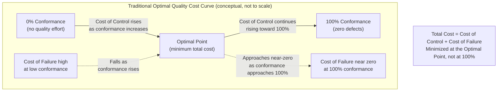
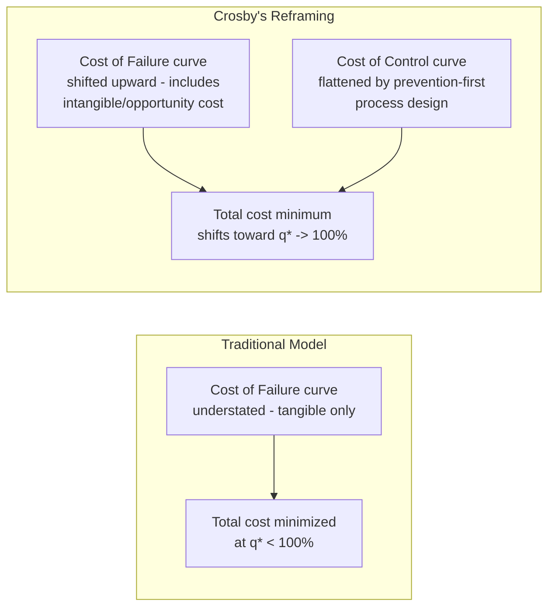

## The Traditional Optimal Quality Cost Curve

### Overview

The Traditional Optimal Quality Cost Curve is the classical economic model underlying the PAF (Prevention-Appraisal-Failure) approach to quality costing, and represents the analytical framework that Crosby's "Quality Is Free" thesis explicitly argued against. It models total quality cost as the sum of two cost curves moving in opposite directions as conformance quality increases, producing a U-shaped total cost curve with a nonzero, economically "optimal" defect rate — the point that minimizes total cost, rather than the point of zero defects.

### The Two Opposing Cost Curves

**Key Points**

- **Cost of Control** (Prevention + Appraisal): rises as the organization invests more in preventing and detecting defects. Intuitively, achieving each additional percentage point of conformance quality requires progressively more investment — the last few defects are the hardest and most expensive to eliminate.
- **Cost of Failure of Control** (Internal + External Failure): falls as conformance quality rises, since fewer defects escape to become failure costs. This curve is steep at low quality levels (many defects, high failure cost) and flattens as quality approaches 100% (few defects remain to fail).
- **Total Quality Cost** is the sum of these two curves at each quality level, producing a U-shape: high at very low quality (failure cost dominates), high at very high quality (control cost dominates), with a minimum somewhere in between.
- The **optimal quality level** is defined as the point on the horizontal axis (percent conformance, or equivalently, defect rate) where total cost is minimized — critically, this point is **not** 100% conformance under the traditional model's assumptions.

### The Classical Curve Shape

**Reading the curve:**

- Moving right along the horizontal axis represents increasing conformance quality (fewer defects escaping).
- The Cost of Control curve starts low (near zero investment, near-zero conformance) and rises, typically depicted as accelerating steeply as it approaches 100% conformance — reflecting the assumption that eliminating the last remaining defects is disproportionately expensive relative to eliminating the first, easiest ones.
- The Cost of Failure curve starts high (poor quality, many failures) and falls, typically depicted as flattening near 100% conformance since there is little failure cost left to eliminate.
- The Total Cost curve, being the vertical sum of the two, is U-shaped, and its minimum — the "optimal" point — sits at less than 100% conformance under this model's standard assumptions.

### The Mathematical Formulation

Total Quality Cost as a function of conformance level $q$ (where $q \in [0, 1]$, with $q=1$ representing 100% conformance):

$$TQC(q) = CoC(q) + CoNC(q)$$

Where, under the traditional model's typical assumptions:

- $CoC(q)$ (Cost of Control) is monotonically increasing and convex in $q$ — rising at an increasing rate as $q \to 1$.
- $CoNC(q)$ (Cost of Failure) is monotonically decreasing and convex in $q$ — falling at a decreasing rate as $q \to 1$.

The optimal conformance level $q^*$ is found where the marginal cost of additional control equals the marginal reduction in failure cost:

$$\frac{d(CoC)}{dq}\bigg|_{q^*} = -\frac{d(CoNC)}{dq}\bigg|_{q^*}$$

This is the standard marginal-cost-equals-marginal-benefit condition from microeconomics, applied to quality investment — additional prevention/appraisal spend is worthwhile only up to the point where its marginal cost still exceeds the marginal failure cost it avoids; beyond that point, the traditional model holds that further investment is not economically justified.

### Origins and Context

**Key Points**

- This curve is closely associated with the classical quality-cost literature from Feigenbaum and Juran, who established the PAF categorization this curve is built on.
- The curve reflects assumptions rooted heavily in mid-20th-century mass-manufacturing contexts, where achieving very high (let alone perfect) conformance genuinely did require steeply escalating investment in tooling precision, inspection intensity, and process control — the convexity assumption for $CoC(q)$ was empirically grounded in that production environment.
- The model implicitly treats defect probability as a continuous, controllable dial — investment "buys" conformance at a defined, if rising, marginal price — which is a reasonable approximation for many repetitive manufacturing processes but translates less cleanly to domains like software or services, where defect causes are often discrete and heterogeneous rather than governed by a single smooth cost-of-precision relationship. [Inference — this is a widely noted limitation in quality-management literature comparing manufacturing-derived cost curves against software/service contexts]

### Crosby's Direct Challenge to This Model

As covered in the earlier comparison of Crosby's CoC/CoNC framework, Crosby's central argument in *Quality Is Free* was a direct rejection of this curve's implied conclusion. Crosby argued that:

- The traditional curve **undercounts the true cost of failure** — specifically by omitting the intangible and opportunity costs (customer defection, reputational damage, the "hidden factory" of undocumented rework) covered in the intangible-cost sections of this chapter.
- Once failure cost is fully and honestly accounted for, the Cost of Failure curve in the diagram above sits substantially higher across its entire range than the traditional model assumes — which shifts the total-cost minimum rightward, toward (in Crosby's view) 100% conformance itself.
- Additionally, Crosby argued the Cost of Control curve's assumed steep upward convexity near 100% is itself often an artifact of *poor process design* rather than an inherent economic law — that a well-designed, prevention-focused process (versus one relying on heavy late-stage inspection) can achieve very high conformance without the dramatic cost escalation the traditional curve assumes.

### Reconciling the Traditional Curve With the Marginal BCR Analysis

The marginal cost-benefit analysis covered in the previous section (declining marginal BCR as prevention spending scales) is, in effect, a modern re-derivation of exactly the traditional curve's core insight — that prevention spending faces diminishing returns, so *some* prevention investments have strong economic justification while others (addressing progressively rarer or cheaper-to-fix defects) do not.

The distinction is where the debate actually lies:

- **Traditional PAF-curve view:** the optimal defect rate is nonzero because the *marginal cost of further prevention* eventually exceeds the *marginal failure cost avoided* — a claim about the shape of the Cost of Control curve.
- **Crosby's view:** the optimal defect rate approaches zero because the *marginal failure cost avoided*, once fully counted (including intangible cost), remains higher than commonly assumed even at high conformance levels — a claim primarily about the Cost of Failure curve being systematically underestimated, not a claim that the Cost of Control curve's shape is wrong.
- Both views agree that *some* point of diminishing marginal returns to prevention spending exists in principle; they disagree on where that point falls in practice, largely because they disagree on how completely failure cost should be measured.

This reframes the "Crosby vs. traditional PAF" debate (introduced earlier in this chapter) as fundamentally an *empirical measurement* disagreement rather than a disagreement about the underlying economic logic — both sides accept marginal analysis as the correct framework; they diverge on the inputs fed into it.

### Practical Implications for Applying This Model

- **Use the curve as a conceptual framework, not a literal formula to solve.** In practice, neither $CoC(q)$ nor $CoNC(q)$ is typically known as a precise continuous function — the curve is most useful as a mental model for framing *why* a declining marginal BCR is expected, rather than as an equation to be numerically solved for $q^*$.
- **Treat the "optimal defect rate" conclusion as domain-dependent, not universal.** In safety-critical or high-consequence domains (aerospace, medical devices, or contexts with substantial reputational/institutional stakes such as government service platforms), the Cost of Failure curve is typically steep and remains elevated even at high conformance levels — pushing the practical optimum much closer to Crosby's zero-defects position than the classical manufacturing-derived curve would suggest.
- **Revisit the assumed curve shapes when the underlying process changes.** A process redesign that shifts detection earlier (consistent with the 1-10-100 Rule's core argument) can genuinely flatten the Cost of Control curve near high conformance, exactly as Crosby argued — meaning the "optimal" point is not a fixed feature of a domain, but a property of the current process design that deliberate investment can shift.

### Related Topics

- Crosby's Cost of Conformance vs. Cost of Nonconformance (Detailed Comparison)
- Marginal Cost-Benefit Analysis of Prevention Spending
- The 1-10-100 Rule as Empirical Support for Shifting the Cost of Failure Curve
- Economic Order Quantity and Analogous U-Shaped Cost Models in Operations Management
- Taguchi's Quality Loss Function as an Alternative Continuous Cost Model
- Zero Defects Philosophy: Origins, Adoption, and Critique