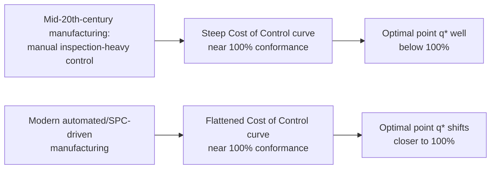
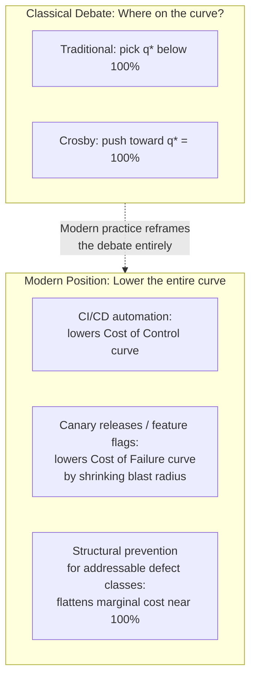

## The Modern Zero Defects Cost Curve Debate

### Overview

The Traditional Optimal Quality Cost Curve (previous section) and Crosby's zero-defects challenge to it represent the classical 20th-century framing of a debate that has continued to evolve. The "modern" debate is less a single resolved answer and more a set of refinements — from statistical process control theory, software engineering, and Lean/Six Sigma practice — that each shift where and how the classical U-shaped curve applies, without fully vindicating either the traditional PAF-curve position or Crosby's zero-defects position as universally correct. This section surveys the major modern positions and reconciles them against the 1-10-100 Rule and cost-benefit frameworks covered earlier in this chapter.

### Recap: The Two Classical Positions

| Position | Core Claim | Primary Mechanism |
| --- | --- | --- |
| Traditional PAF curve | Optimal defect rate is nonzero | Cost of Control rises steeply near 100% conformance |
| Crosby's zero-defects | Optimal defect rate approaches zero | Cost of Failure is systematically undercounted; true failure cost stays high even near 100% |

### Modern Position 1: The Curve Has Shifted, Not Disappeared

**Key Points**

- A significant body of modern quality-management thought holds that both classical positions were correct *for their time and domain*, and that technological and methodological change has shifted the curves rather than settling the debate philosophically.
- Automation, statistical process control (SPC), and design-for-manufacturability techniques have measurably flattened the Cost of Control curve in many modern manufacturing contexts relative to the mid-20th-century baseline the classical curve was built on — achieving near-zero defect rates via automated, in-process control is now often *cheaper* than the heavy manual inspection regimes the classical curve implicitly assumed.
- This flattening is consistent with Crosby's argument that the Cost of Control curve's steep upward convexity was partly an artifact of poor (inspection-heavy, prevention-light) process design rather than an inherent economic law — modern SPC-driven manufacturing is closer to the prevention-first process Crosby advocated for.
- The practical implication: in many contemporary high-automation manufacturing contexts, the "optimal" point on the classical curve has moved substantially closer to 100% conformance than it was when the curve was first formalized, without this requiring a wholesale rejection of the curve's underlying economic logic.

### Modern Position 2: Software Changes the Curve's Fundamental Shape

**Key Points**

- Software engineering practice has introduced a distinct modern wrinkle: unlike physical manufacturing, software defects are not governed by physical tolerance/precision tradeoffs, so the classical curve's convexity assumptions (grounded in manufacturing precision economics) don't transfer cleanly. [Inference — this is a well-established observation in software-quality literature contrasting software defect economics with manufacturing defect economics, though the degree of divergence is debated]
- Certain categories of software defect prevention — static typing, schema validation, automated linting, property-based testing — exhibit close to **constant or even declining marginal cost** as coverage increases, because the mechanism (a type system, a validation schema) applies uniformly across the codebase once established, rather than requiring proportionally more manual effort per unit of additional conformance the way manual inspection does.
- This suggests that for defect classes addressable by *structural* prevention (mechanisms that make a defect class impossible by construction, rather than merely less likely), the classical convex Cost of Control curve may not apply at all — the curve for these mechanisms can be closer to a one-time fixed cost with near-zero marginal cost thereafter, which unambiguously favors pushing conformance toward 100% for that defect class specifically.
- However, other software defect categories — those requiring human judgment (ambiguous requirements, edge-case business logic, complex integration scenarios) — still exhibit the classical rising-marginal-cost pattern, since catching progressively rarer or subtler instances of these defect types does require proportionally more manual review, testing, or user feedback effort.
- The modern refinement is therefore not "software eliminates the U-shaped curve" but "software defect classes are heterogeneous, and the curve shape must be assessed *per defect class* rather than applied as one uniform curve across an entire system" — directly reinforcing the marginal cost-benefit analysis principle from the earlier CBA section, that prevention investment should be evaluated defect-class by defect-class rather than as an undifferentiated whole.

### Modern Position 3: Six Sigma and the "Near-Zero" Compromise

**Key Points**

- The Six Sigma quality methodology (originating at Motorola, popularized by General Electric) represents a practical, widely-adopted middle position in this debate: rather than debating whether *true* zero defects is the economic optimum, Six Sigma targets a specific, very low but explicitly nonzero defect rate (conventionally 3.4 defects per million opportunities) as a pragmatic operational standard.
- This reflects an implicit acknowledgment that literal zero defects is not achievable or provably optimal in most real-world processes, while simultaneously rejecting the classical curve's implication that a *meaningfully higher* defect rate could be economically optimal — Six Sigma's target sits close enough to zero that, for most practical decision-making purposes, the debate between "zero" and "near-zero" becomes less economically consequential than the debate between "near-zero" and the classical curve's more permissive optimum.
- Six Sigma's DMAIC (Define-Measure-Analyze-Improve-Control) methodology institutionalizes continuous incremental movement toward lower defect rates, implicitly treating the "optimal" point as something to be continuously re-discovered and pushed lower over time as process capability improves, rather than as a fixed point on a static curve — a dynamic reframing of the classical debate's essentially static original formulation.

### Modern Position 4: Agile/DevOps and the Cost of Control Curve's Reshaping

**Key Points**

- Modern software delivery practices — continuous integration/continuous deployment (CI/CD), automated testing pipelines, feature flags, and progressive rollout strategies — directly attack the classical curve from a different angle than Six Sigma: rather than debating the optimal defect rate, they reduce the *cost* of both control and failure simultaneously.
- CI/CD reduces the marginal Cost of Control by automating what was previously manual inspection effort (the classical curve's main driver of steep convexity), consistent with Modern Position 1's automation argument, applied specifically to software delivery.
- Progressive rollout and feature-flag strategies reduce the Cost of Failure by shrinking the blast radius of an escaped defect — a defect that reaches only 1% of users via a canary release carries a fraction of the cost the same defect would carry reaching 100% of users immediately, directly softening the 1-10-100 Rule's later-stage cost multiplier rather than trying to prevent the defect from occurring at all.
- This represents a genuinely distinct modern strategy from both classical positions: rather than arguing about where on the curve to sit, it argues for *lowering the entire curve* — both curves, simultaneously — through process and architecture choices, which is a different lever than either "spend more on prevention" (traditional) or "achieve zero defects" (Crosby).

### Synthesizing the Modern View

The contemporary, practitioner-oriented synthesis across quality-management, manufacturing, and software-engineering literature tends toward several converging conclusions:

1. **The classical curve's shape is not universal — it is a function of process design, not an inherent economic law.** Both Crosby's original argument and the modern automation/CI-CD evidence support this: a poorly designed, inspection-heavy process genuinely does face a steep Cost of Control curve near 100% conformance, but that steepness is largely a property of the *process*, and can be reduced through deliberate architectural investment (automation, structural prevention, blast-radius reduction).
2. **The debate should be conducted per defect class, not as a single system-wide curve.** This is the most significant genuinely modern refinement — the classical debate implicitly treated "quality" as a single dial, while modern practice (informed by software engineering's heterogeneous defect categories) recognizes that different defect classes have genuinely different cost curves, and the marginal cost-benefit analysis from the earlier section should be applied separately to each.
3. **Reducing the cost of failure (via blast-radius containment, faster rollback, better observability) is often a higher-leverage modern strategy than either "spend more on prevention" or "achieve zero defects."** This sidesteps the classical debate's framing entirely by attacking the multiplier in the 1-10-100 Rule directly rather than arguing about which side of the curve is correct.
4. **Neither classical position should be treated as settled or universally correct.** The traditional curve remains a reasonable default assumption for defect classes genuinely requiring human judgment and manual review; Crosby's near-zero-defects position remains a reasonable default for defect classes addressable through structural, automatable prevention — the modern debate has largely dissolved into "it depends on the defect class and the available prevention mechanism," rather than resolving in favor of either original position.

### Practical Application

When evaluating where to target conformance quality for a specific defect class or investment (directly extending the CBA methodology from the earlier section):

- Ask whether the defect class is addressable by **structural prevention** (type systems, schema validation, automated tests) — if so, the classical convex Cost of Control curve likely does not apply, and pushing toward near-zero defects for that specific class is likely to remain economically favorable even at high conformance levels.
- Ask whether the defect class fundamentally requires **human judgment** (ambiguous requirements, subtle business logic, novel edge cases) — if so, the classical curve's rising marginal cost near 100% conformance likely still applies, and a Six-Sigma-style "near-zero but not zero" target, combined with blast-radius reduction strategies, is likely the more defensible economic position than pursuing literal zero defects for that class.
- In either case, invest in reducing the *cost of failure* (faster detection, smaller blast radius, better rollback capability) as a complementary strategy that improves the economics of the curve regardless of which classical position applies to the specific defect class in question.

### Related Topics

- Six Sigma Methodology and DMAIC in Detail
- Statistical Process Control (SPC) and Its Role in Flattening the Cost of Control Curve
- CI/CD, Canary Releases, and Blast-Radius Reduction as Quality-Cost Strategies
- Structural Prevention: Type Systems and Schema Validation as Zero-Marginal-Cost Defect Prevention
- Applying Defect-Class-Specific Marginal Analysis to Prevention Investment Decisions
- The 1-10-100 Rule Revisited Through the Lens of Blast-Radius Containment