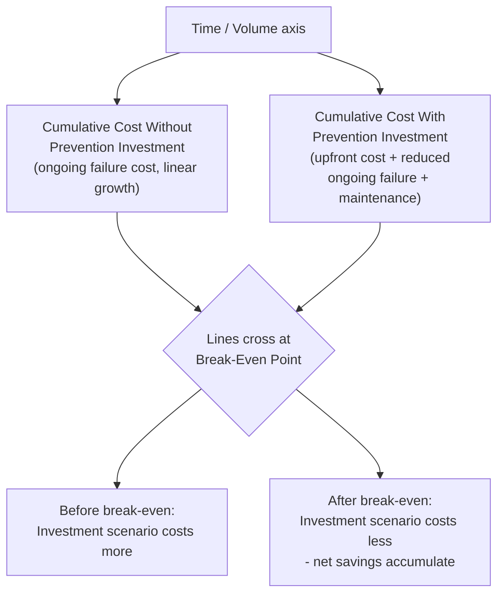
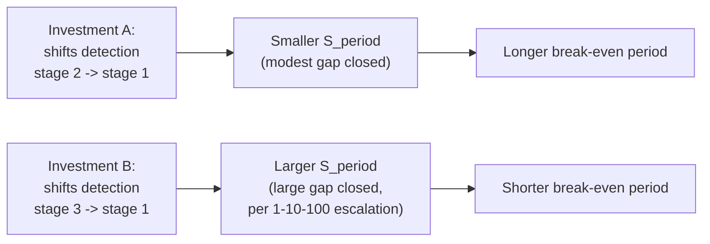

## Break Even Analysis Between Prevention and Failure Costs

### Overview

Break-even analysis between prevention and failure costs answers a narrower, more operational question than the broader cost-benefit analysis (CBA) covered earlier in this chapter: not "is this prevention investment worthwhile overall," but "at what specific point — in volume, time, or defect rate — does the prevention investment's cumulative cost equal the cumulative failure cost it avoids." This is the specific analytical technique that produces the "payback period" figure referenced in the business-case section, developed here in full detail as a standalone method.

### Core Concept

**Key Points**

- Prevention spending is typically front-loaded: most of the cost is incurred at or near implementation (engineering time, tooling, training), while the benefit (avoided failure cost) accrues gradually over the investment's useful life as defects that would have occurred are instead prevented.
- Failure cost, in the absence of the prevention investment, is typically ongoing and ideally trending flat or worsening — each period without the investment continues to incur the same expected failure cost.
- The break-even point is where the cumulative avoided-failure-cost line crosses the cumulative prevention-investment-cost line — before that point, the investment has not yet "paid for itself"; after that point, every additional period represents net positive value.

### The Break-Even Formula

**Simple break-even point (in time):**

$$t_{BE} = \frac{C_{\text{prevention}}}{S_{\text{period}}}$$

Where:

- $C_{\text{prevention}}$ = total upfront cost of the prevention investment
- $S_{\text{period}}$ = expected failure cost avoided per period (e.g., per month or per quarter)

**Break-even point in volume/units** (for process-level investments tied to production or transaction volume rather than calendar time):

$$V_{BE} = \frac{C_{\text{prevention}}}{s_{\text{unit}}}$$

Where $s_{\text{unit}}$ is the expected failure-cost savings per unit produced, processed, or transacted.

**Accounting for ongoing maintenance cost of the prevention mechanism** (a refinement flagged as commonly omitted in the earlier CBA section):

$$t_{BE} = \frac{C_{\text{prevention}}}{S_{\text{period}} - M_{\text{period}}}$$

Where $M_{\text{period}}$ is the ongoing per-period maintenance cost of the prevention mechanism itself — this lengthens the break-even period relative to the simple formula whenever the mechanism has nonzero upkeep cost, which per the CBA section's common-pitfalls discussion, it typically does.

### Graphical Break-Even Model

**Reading this model:** the "without investment" line starts at zero and rises steadily (steep slope = high ongoing failure cost). The "with investment" line starts higher (the upfront prevention cost) but rises more slowly (reduced failure cost plus modest maintenance cost). The break-even point is where these two lines intersect — every period beyond that point, the investment scenario's cumulative cost is lower than the no-investment scenario's, and the gap between them represents accumulating net savings.

### Worked Example

Extending the contract-testing example from the earlier cost-benefit-analysis section: automated end-to-end contract testing between the tRPC backend and React frontend, targeting API contract-mismatch defects.

- **Prevention investment cost ($C_{\text{prevention}}$):** a defined engineering effort to build out the initial contract-test suite and CI integration.
- **Ongoing maintenance cost ($M_{\text{period}}$):** modest per-month cost of updating test fixtures as the API surface evolves.
- **Avoided failure cost per period ($S_{\text{period}}$):** based on the historical rate of roughly one contract-mismatch incident per month, each previously requiring a hotfix cycle — the expected monthly savings once the investment is 70% effective (per the effectiveness discount discussed in the CBA section) is the historical monthly incident cost × 0.7.
- **Break-even calculation:** dividing the upfront investment cost by the net monthly savings (avoided cost minus maintenance cost) yields a break-even point expressed in months — if, for instance, net monthly savings represent roughly 15–20% of the upfront investment cost, break-even falls in the 5–7 month range, a figure that would then feed directly into the "payback period" line of the business case structure covered earlier in this chapter.

[Inference — this example illustrates the calculation structure; deriving an actual month figure requires organization-specific cost data not available generically]

### Break-Even Sensitivity to Key Assumptions

Because break-even analysis is a direct function of the same estimated inputs discussed in the CBA section ($P$, $C$, $R$), it inherits the same sensitivity concerns, and should similarly be presented as a range rather than a single figure:

| Assumption Varied | Effect on Break-Even Point |
| --- | --- |
| Higher defect probability/rate than assumed | Break-even point moves earlier (investment pays back faster) |
| Lower investment effectiveness ($R$) than assumed | Break-even point moves later (investment takes longer to pay back) |
| Higher intangible/CLV-loss cost included in $S_{\text{period}}$ | Break-even point moves substantially earlier, since $S_{\text{period}}$ grows |
| Higher ongoing maintenance cost than assumed | Break-even point moves later, and in the extreme, may never be reached if maintenance cost approaches or exceeds avoided cost per period |
| Investment addresses a defect class that itself is shrinking over time (independent of this investment) | Break-even point moves later than a static-rate calculation would suggest, since $S_{\text{period}}$ effectively declines over the investment's life |

### Break-Even Analysis and the 1-10-100 Rule

Break-even analysis becomes substantially more favorable — reaching break-even sooner — when the prevention investment shifts detection across a larger gap in the 1-10-100 escalation, since $S_{\text{period}}$ (avoided cost per period) scales with *how late* the defect was previously being caught, not merely *whether* it's now prevented. A prevention investment that shifts detection from stage 3 (post-release, "100" tier) to stage 1 (pre-commit, "1" tier) produces a much larger $S_{\text{period}}$, and therefore a much earlier break-even point, than an investment shifting detection from stage 2 to stage 1 (a smaller gap in the escalation).

This gives a direct, practical prioritization heuristic when multiple candidate prevention investments are competing for the same budget: **all else equal, prioritize investments targeting defect classes currently being caught at the latest (most expensive) stage of the lifecycle**, since these produce the shortest break-even period and the strongest case under the broader CBA framework from the previous section.

### Common Pitfalls in Break-Even Analysis

- **Omitting maintenance cost, producing an artificially early break-even point.** As shown in the formula above, ignoring $M_{\text{period}}$ overstates net periodic savings and understates the true break-even timeline — this is the same pitfall flagged in the broader CBA section, specifically manifesting here as a too-optimistic payback period.
- **Assuming a constant $S_{\text{period}}$ over the full analysis horizon.** If the underlying defect rate is itself declining (due to other unrelated process improvements, a maturing codebase, or a shrinking legacy surface area) or growing (due to increasing system complexity or user base), a constant-rate assumption will mis-time the actual break-even point.
- **Treating break-even as the only relevant metric and ignoring total return beyond it.** Break-even establishes *when* an investment stops being a net cost, but says nothing about the *magnitude* of ongoing benefit afterward — a full NPV calculation (from the business-case section) remains necessary to compare investments with different break-even timelines but different post-break-even value accumulation rates.
- **Applying volume-based break-even to a time-sensitive investment, or vice versa.** A prevention mechanism tied to transaction/production volume (e.g., per-document validation cost avoided) should be modeled with the volume-based formula; a mechanism whose benefit accrues on a calendar basis regardless of volume (e.g., reduced on-call burden) should use the time-based formula — mismatching the two produces a misleading break-even figure.

### Relationship to Other Frameworks in This Chapter

| Framework | Relationship to Break-Even Analysis |
| --- | --- |
| Business Case Structure | Break-even point is the specific calculation underlying the business case's "payback period" step |
| Cost-Benefit Analysis (BCR) | BCR evaluates total return over the investment's life; break-even identifies the specific point within that life where cumulative return turns positive — the two are complementary, not competing, metrics |
| 1-10-100 Rule | Determines the magnitude of $S_{\text{period}}$ based on which lifecycle stage detection is being shifted from |
| Marginal Analysis / Diminishing Returns | Each successive tranche of prevention investment (addressing progressively lower-value defect classes) will have a progressively later break-even point, mirroring the declining marginal BCR discussed earlier |

### Related Topics

- Payback Period as a Business-Case Decision Metric
- Net Present Value and Multi-Period Return Comparison
- Prioritizing Prevention Investments by Lifecycle-Stage Gap Closed
- Sensitivity Analysis Techniques for Break-Even Modeling
- Maintenance Cost Estimation for Automated Prevention Mechanisms
- Volume-Based versus Time-Based Financial Modeling for Process Investments