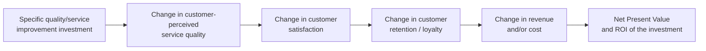

## The Return on Quality Concept

### Overview

Return on Quality (ROQ) is a formal quality-economics model developed by Roland T. Rust, Timothy Keiningham, and Anthony Zahorik, proposed as a method to evaluate the financial impact of efforts to improve service quality, first published in their 1994 book and subsequently developed across multiple academic papers. Unlike the PAF and Process Cost Model frameworks (which are primarily *cost-measurement* tools), ROQ is explicitly framed from the outset as an *investment-evaluation* tool — it treats quality improvement spending the same way a firm would treat any capital investment decision, with an explicit financial return calculation, rather than as a cost category to be minimized or tracked. [repec](https://ideas.repec.org/a/inm/orinte/v29y1999i2p62-72.html)

### Core Premise

**Key Points**

- ROQ's foundational claim, as one summary puts it, is that quality improvement spending is an investment, and its financial benefits should be evaluated before the investment is made — reframing quality spend from an operational cost center to a capital allocation decision subject to the same rigor as any other investment. [nycu](https://ir.lib.nycu.edu.tw/handle/11536/77063)
- This directly operationalizes the business-case and cost-benefit-analysis structures covered earlier in this chapter, but ROQ specifically originated in the *services marketing* literature, with its earliest and most extensive validation in service industries (banking, healthcare, transportation) rather than manufacturing.
- The method, as described in its formal treatment, quantifies the projected net present value of an improvement project and calculates return on investment — explicitly using NPV and ROI, the same financial metrics introduced in the business-case section of this chapter, applied specifically to quality/service-improvement initiatives. [repec](https://ideas.repec.org/a/inm/orinte/v29y1999i2p62-72.html)
- A key differentiator from classical Cost of Quality models: ROQ is oriented toward **revenue impact**, not merely cost avoidance. Later work by Rust and colleagues explicitly frames this as a central open question in the field — financial benefits from quality may be derived from revenue expansion, cost reduction, or both simultaneously, and their research found the literature on market orientation and customer satisfaction provides considerable support for the effectiveness of the revenue expansion perspective, while the literature on quality and operations provides equally strong support for the cost reduction perspective — meaning ROQ was developed partly to reconcile these two traditions rather than assume quality investment pays off only through failure-cost avoidance (the traditional CoQ framing) or only through revenue growth (the pure marketing framing). [duke](https://people.duke.edu/~moorman/Publications/JM2002.pdf)[duke](https://people.duke.edu/~moorman/Publications/JM2002.pdf)

### How ROQ Differs from Traditional Cost of Quality Models

| Dimension | Traditional CoQ (PAF/PCM) | Return on Quality (ROQ) |
| --- | --- | --- |
| Primary lens | Cost avoidance / cost minimization | Investment return, including revenue growth |
| Origin discipline | Manufacturing quality management, accounting | Services marketing, customer satisfaction research |
| Core financial metric | Cost category totals, cost as % of revenue | Net present value, ROI on the specific improvement |
| Underlying causal chain | Defect → failure cost → avoided by prevention | Service quality → customer satisfaction → retention/revenue → financial return |
| Decision framing | "How much does poor quality cost us?" | "Which quality investment yields the best financial return?" |
| Relationship to CLV | Implicit / add-on (per the earlier CLV-loss section) | Explicit and central — customer retention/satisfaction is the core causal mechanism |

### The ROQ Causal Chain

ROQ's methodology rests on an explicit, testable causal chain connecting a specific quality-improvement action to financial outcomes, rather than treating "quality investment reduces cost" as a given:

**Key Points**

- Each link in this chain is, in ROQ's original methodology, meant to be empirically measured rather than assumed — the model does not simply assert that "better quality equals more revenue," but requires evidence at each stage (does this specific investment actually move the satisfaction needle? does the satisfaction change actually predict retention? does the retention change translate to measurable revenue impact?).
- This chain structurally resembles — and substantially predates the popularization of — the Customer Lifetime Value loss methodology covered earlier in this chapter; ROQ can be read as an early formalization of exactly the "quality failure → reduced retention → CLV loss" logic, applied in the *positive* direction (quality investment → improved retention → CLV gain) rather than only as a loss-avoidance calculation.
- Not every link in the chain holds with equal strength for every improvement — a key finding attributed to Rust and colleagues' broader body of work is captured in an earlier related paper's title itself, "Why improving quality doesn't improve quality (or whatever happened to marketing?)" — signaling that ROQ's methodology was partly developed as a corrective to organizations investing in quality improvements that customers did not actually perceive or value, breaking the chain at the first link (investment → perceived quality change). [informs](https://pubsonline.informs.org/doi/references/10.1287/inte.29.2.62)

### The Chase Manhattan Bank Case Study

The most extensively documented real-world application of ROQ is a controlled field experiment at Chase Manhattan Bank. As described in the published account: during 1995 and 1996, Chase Manhattan Bank applied the ROQ method in a controlled experiment with four test branches and four control branches within the retail banking network, using a two-day training program aimed at enhancing service delivery and customer satisfaction. Its primary purpose was to assess the usefulness of the ROQ approach in improving customer service. [repec](https://ideas.repec.org/a/inm/orinte/v29y1999i2p62-72.html)[repec](https://ideas.repec.org/a/inm/orinte/v29y1999i2p62-72.html)

**Key Points from the case study:**

- The study used a genuine experimental design (test branches versus control branches) — a methodological rigor beyond what most internal quality-cost analyses attempt, and directly analogous to the pilot-based estimation approach recommended in the earlier business-case and CBA sections of this chapter.
- Largely because of the bank's merger with Chemical Bank, the study was not executed exactly as originally planned, though the study nonetheless showed favorable results from the training effort. [repec](https://ideas.repec.org/a/inm/orinte/v29y1999i2p62-72.html)[repec](https://ideas.repec.org/a/inm/orinte/v29y1999i2p62-72.html)
- The published conclusion states that the ROQ model facilitated interpretation of the study and appears useful for estimating the financial returns arising from service-quality initiatives — notably a qualified, practitioner-grounded conclusion rather than an unqualified endorsement, consistent with the broader literature's caution (echoed throughout this chapter) against overstating the precision of quality-investment financial estimates. [repec](https://ideas.repec.org/a/inm/orinte/v29y1999i2p62-72.html)

### ROQ Applied: A Worked Example Pattern

A separate academic application of the ROQ model to intercity bus transportation illustrates the method's practical mechanics: the study used customer satisfaction surveys and Importance-Performance Analysis to understand customer needs and identify the decisive factors affecting overall customer satisfaction, then applied the ROQ model to estimate the rate of return of specific service-quality improvement proposals, explicitly aimed at helping bus-industry managers evaluate and decide on quality improvements, reducing investment risk and increasing profit opportunity. [nycu](https://ir.lib.nycu.edu.tw/handle/11536/77063)[nycu](https://ir.lib.nycu.edu.tw/handle/11536/77063)

Notably, this application produced a genuinely *negative* result for one candidate investment: for a specific waiting-station facility and interior-design improvement, evaluated only estimating the benefit from improved customer retention, the calculated ROQ was -27.66%, a negative return on investment, meaning the investment was judged not worthwhile. This is methodologically important — it demonstrates ROQ functioning as intended: a genuine decision filter capable of *rejecting* a quality investment on financial grounds, not merely a tool for retroactively justifying quality spend that has already been decided upon. [nycu](https://ir.lib.nycu.edu.tw/handle/11536/77063?mode=full)

### Segmentation and Prioritization Within ROQ

A key refinement in the applied ROQ literature involves customer segmentation rather than treating quality investment as uniform across the customer base. The bus-transportation study's approach — using Importance-Performance Analysis to separately identify the factors causing customer dissatisfaction versus customer delight, in order to manage customers by segment and prioritize the improvement factors, focusing investment on what matters most to customers to maximize investment returns — mirrors the marginal-analysis principle from the earlier cost-benefit-analysis section: not all quality investments have equal return, and ROQ's methodology explicitly incorporates prioritization logic rather than treating "improve quality" as an undifferentiated single action. [nycu](https://ir.lib.nycu.edu.tw/handle/11536/77063)

### ROQ's Place in the Broader Quality-Economics Literature

ROQ is explicitly positioned in later academic work as building on, while extending beyond, classical cost-of-quality studies: one paper describes its own methodology as a step beyond classical studies on cost of quality, such as the PIMS studies from the Boston Strategic Planning Institute or the work of Dale and Plunkett, aimed at setting up an index to measure Return on Quality, understood as the operating revenue from quality investments, functioning as a "ROI of Quality". [uniroma1](https://iris.uniroma1.it/handle/11573/233948)[uniroma1](https://iris.uniroma1.it/handle/11573/233948)

Its academic impact has been substantial: the original "Return on Quality" paper was ranked 7th in impact on the practice of marketing among all marketing science papers published over a 25-year period, and introduced the first scientifically vetted system for linking customer satisfaction to financial outcomes, with its overriding message being that efforts to improve satisfaction should be treated as investment decisions — the same reframing this chapter's business-case section applies specifically to quality/prevention spend. [ipsos](https://www.ipsos.com/en-us/node/142621)[ipsos](https://www.ipsos.com/en-us/node/142621)

### Relationship to Frameworks Covered Earlier in This Chapter

| Framework | Relationship to ROQ |
| --- | --- |
| Business Case Structure | ROQ is a fully worked-out, empirically-validated instance of exactly this chapter's business-case methodology, specialized for service-quality/customer-satisfaction investments |
| Cost-Benefit Analysis / BCR | ROQ's NPV-and-ROI approach is methodologically consistent with the CBA framework, but anchors the "benefit" side in customer retention/revenue rather than solely avoided failure cost |
| Customer Lifetime Value Loss | ROQ's causal chain (quality → satisfaction → retention → revenue) is the same underlying mechanism as CLV-loss modeling, applied prospectively (evaluating a proposed investment) rather than retrospectively (estimating loss from an incident already occurred) |
| Traditional PAF / Process Cost Model | ROQ does not replace these — it operates one level up, using PAF/PCM-style cost data as one input (the cost side) while adding an explicit, empirically-tested revenue-impact model as the benefit side |

### Practical Application and Limitations

- **ROQ requires genuine measurement infrastructure.** Its methodology depends on being able to measure customer satisfaction, correlate it with retention, and correlate retention with revenue — organizations without existing customer-satisfaction tracking or retention analytics face a substantial infrastructure investment before ROQ can be applied rigorously, rather than being a lightweight technique that can be bolted onto an existing accounting system the way PAF often can.
- **The causal chain can break at any link, and often does.** The "why improving quality doesn't improve quality" finding referenced above is a direct caution: an organization can genuinely improve a quality metric without that improvement being perceived by customers, or perceived without translating to retention, or retained without translating to revenue — ROQ's discipline is precisely in testing each link rather than assuming the full chain holds.
- **Best suited to service and customer-facing quality investments specifically.** ROQ's origin and strongest evidence base are in services marketing (banking, healthcare, transportation); its applicability to purely internal, non-customer-facing quality investments (e.g., an internal engineering process improvement with no direct customer perception component) is less direct, and such investments are likely better evaluated with the more general CBA/break-even frameworks covered earlier in this chapter.
- **Negative results are a legitimate and valuable outcome.** As the bus-transportation case demonstrated, ROQ should be expected to sometimes reject a proposed quality investment — treating every application of the model as though it must produce a positive-return justification would defeat its purpose as a genuine decision filter.

### Related Topics

- Customer Satisfaction, Retention, and Market Share: The Rust-Zahorik Research Program
- Importance-Performance Analysis (IPA) for Prioritizing Quality Investments
- Customer Lifetime Value Loss as a Quality Cost (Prospective vs. Retrospective Application)
- PIMS (Profit Impact of Market Strategy) Studies and Their Relationship to Quality Economics
- Designing Controlled Experiments to Validate Quality-Investment Causal Chains
- Revenue Expansion versus Cost Reduction as Competing Justifications for Quality Spend