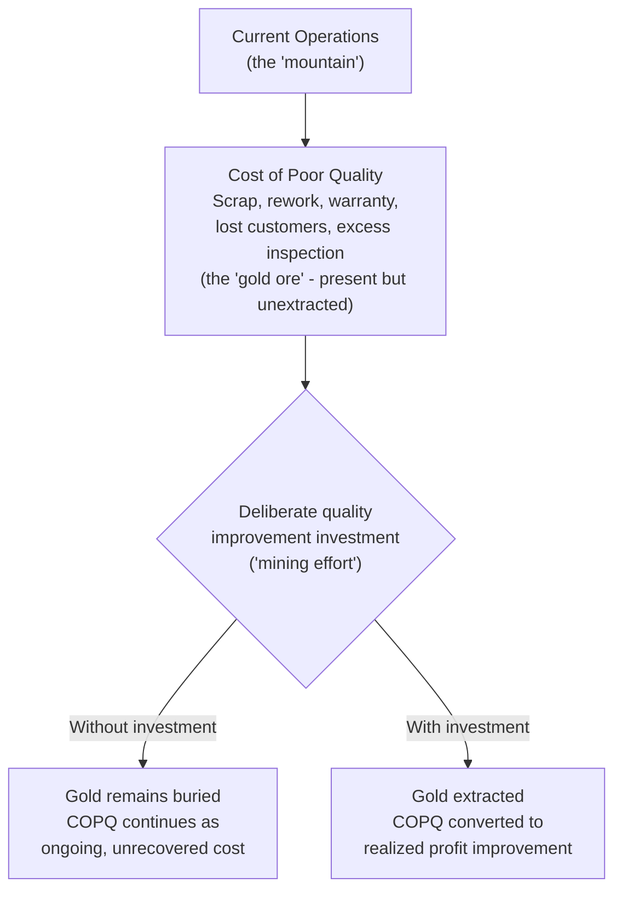

## Juran's Gold in the Mine Concept

### Overview

"Gold in the Mine" is Joseph Juran's metaphor for the cost of poor quality: a substantial, recoverable value that exists within an organization's operations but remains uncaptured until deliberately extracted through quality improvement effort — analogous to a valuable mineral deposit that yields nothing until someone invests in mining it. The metaphor appears in Juran's foundational quality-management writing (notably associated with his editorship of *Juran's Quality Control Handbook* and his broader Quality Trilogy work) and serves a specific rhetorical and strategic function distinct from the accounting-oriented PAF and Process Cost Models covered earlier in this chapter: it is fundamentally a *management-persuasion device*, aimed at convincing organizational leadership that quality cost is not merely an operational metric to track, but an untapped source of profit improvement comparable in scale to a genuine capital asset waiting to be developed.

### The Core Metaphor

**Key Points**

- Juran's framing casts the cost of poor quality (COPQ) — scrap, rework, warranty claims, lost customers, inspection overhead, and the full range of failure and appraisal costs covered throughout this chapter — as "ore" containing recoverable value, rather than as a fixed, unavoidable operating expense.
- The metaphor's persuasive power lies in reframing quality improvement from a *cost center activity* (spending money to reduce defects) into a *value-extraction activity* (investing effort to recover value that already exists, hidden, within current operations) — a subtle but strategically important shift in how the investment is perceived by financially-oriented decision-makers.
- Unlike ore in an actual mine, which requires geological discovery, Juran's point was that the "gold" — the cost of poor quality — is typically **already measurable** within existing operations; the barrier to extracting it is not discovery but organizational will, prioritization, and the application of a systematic improvement methodology (Juran's Quality Trilogy: Quality Planning, Quality Control, Quality Improvement).

### Why Juran Chose This Framing

**Key Points**

- Juran's broader career-long concern, documented across his writing, was that quality was too often treated by senior management as a technical or operational matter delegated entirely to quality-assurance specialists, rather than as a strategic, financially consequential concern deserving direct executive attention.
- The "gold in the mine" metaphor was specifically designed to translate quality-cost data into language that resonates with financially-oriented executives — framing quality improvement not as "reducing defects" (a technical, QA-department concern) but as "capturing available profit" (a strategic, CFO/CEO-level concern), directly paralleling how the Return on Quality concept (previous section) later formalized this same reframing with explicit NPV/ROI calculation.
- This metaphor sits conceptually adjacent to, but distinct from, Crosby's "Quality Is Free" framing (covered earlier in this chapter): where Crosby argued prevention spending nets out to zero true cost because it pays for itself, Juran's gold-in-the-mine framing emphasizes that failure cost *already exists* as a sunk, ongoing drain — the "mining" (improvement effort) is what converts that existing drain into recovered value, a subtly different emphasis on the *existing* cost being real and substantial rather than primarily on prevention being costless.

### The Iceberg and the Mine: Related but Distinct Metaphors

The "gold in the mine" concept is frequently discussed alongside — and sometimes conflated with — the quality cost iceberg metaphor covered earlier in the intangible/opportunity-cost section of this chapter. They serve related but distinguishable purposes:

| Aspect | Quality Cost Iceberg | Gold in the Mine |
| --- | --- | --- |
| Core message | Visible cost is only a small fraction of total true cost; most cost is hidden below the surface | Substantial value/cost exists within current operations and is recoverable through deliberate effort |
| Primary audience | Analysts and quality practitioners building a complete cost picture | Senior executives being persuaded to prioritize and fund quality improvement |
| Emphasis | Measurement completeness — don't undercount cost | Actionability and opportunity — this cost is recoverable, not merely regrettable |
| Typical use | Justifying inclusion of intangible/opportunity cost categories in CoQ analysis | Framing the overall quality-improvement investment case at a strategic level |

Both metaphors ultimately support the same underlying argument (used throughout this chapter's business-case and CBA sections) that the true cost of poor quality is larger than commonly recognized and that closing that gap is a legitimate financial priority — but the iceberg emphasizes *measurement* while the mine emphasizes *action and opportunity*.

### Practical Translation Into the Frameworks Covered in This Chapter

Juran's metaphor is not itself a calculation methodology — unlike PAF, the Process Cost Model, or ROQ, "gold in the mine" does not specify a formula or measurement procedure. Its practical value lies in how it reframes the *presentation* of quality-cost data developed through those other methods:

- **As an opener for the business case (earlier section).** Presenting the current-state COPQ baseline explicitly as "unrecovered value available for extraction" rather than as "our defect cost this quarter" sets a more strategically compelling frame for the investment ask that follows.
- **As a lens for prioritization.** Just as a mining operation prioritizes the richest, most accessible ore deposits first, quality-improvement prioritization should target the largest, most tractable sources of COPQ first — directly consistent with the marginal cost-benefit analysis principle from the earlier CBA section, that the highest-value, easiest-to-address defect classes should be tackled before progressively lower-value ones.
- **As a persuasion tool distinct from a measurement tool.** Where PAF/PCM answer "how much does poor quality cost us," and ROQ/CBA answer "is this specific investment worthwhile," the gold-in-the-mine metaphor answers a prior, more fundamental question: "why should leadership care about this at all" — it operates one level above the quantitative frameworks, at the level of organizational attention and buy-in.

### Limitations of the Metaphor

- **It can overstate how easily the "gold" is extracted.** A real mining operation faces significant extraction cost, technical difficulty, and the risk of the ore proving less valuable than initially estimated — the metaphor, used carelessly, can imply quality improvement is a straightforward value-capture exercise, understating the genuine organizational change management, process redesign, and sustained investment quality improvement typically requires. [Inference — this is a commonly noted practical caveat when the metaphor is applied uncritically, rather than a criticism found explicitly in Juran's own writing]
- **It does not, by itself, address the marginal-returns problem.** As covered in the earlier cost-benefit-analysis and optimal-quality-cost-curve sections, quality improvement investment faces diminishing marginal returns — the metaphor's implication that COPQ is straightforwardly "gold waiting to be mined" doesn't inherently convey that some COPQ may be economically uneconomical to fully eliminate, a nuance the more rigorous marginal-BCR and cost-curve frameworks address explicitly.
- **Best used as a complement to, not a substitute for, quantitative analysis.** The metaphor's value is rhetorical and motivational; the actual investment decision should still rest on the quantitative business-case, CBA, break-even, and (where applicable) ROQ methodologies covered earlier in this chapter — using the metaphor alone, without the underlying numbers, risks the same credibility problem flagged throughout this chapter regarding unsubstantiated or overstated quality-cost claims.

### Applying the Concept in Practice

For a team evaluating quality investment (e.g., reducing rework in a document-processing workflow), Juran's framing suggests a specific narrative sequence when presenting to leadership, building directly on this chapter's business-case structure:

1. Establish the current-state COPQ baseline (Step 1 of the business case) and explicitly reframe it as unrecovered, recoverable value rather than as an accepted cost of doing business.
2. Identify the largest, most tractable "deposits" first — the defect classes or process steps contributing the most to COPQ, prioritized using the marginal-analysis logic from the CBA section.
3. Present the proposed investment as the "mining effort" required to extract that specific value, with the quantitative ROI/payback/NPV case (Steps 5–6 of the business case) as the concrete extraction plan, rather than relying on the metaphor alone to carry the argument.
4. Track post-implementation results (Step 8 of the business case) as evidence of "gold successfully extracted," strengthening the credibility of future prioritization within the same "mine."

### Related Topics

- Juran's Quality Trilogy: Quality Planning, Quality Control, Quality Improvement
- The Quality Cost Iceberg and Its Relationship to the Gold-in-the-Mine Metaphor
- Building the Business Case for Quality Investment (Narrative Framing Techniques)
- Marginal Cost-Benefit Analysis and Prioritization of Improvement Targets
- Juran's Quality Control Handbook and Its Influence on Modern Quality Management
- Crosby's "Quality Is Free" versus Juran's "Gold in the Mine": Comparing Persuasion Strategies