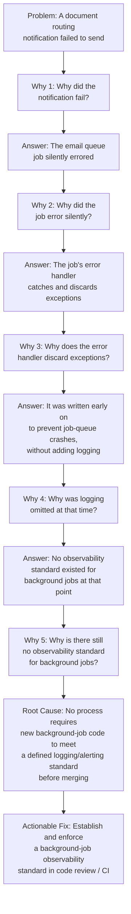

## Root Cause Analysis and the Five Whys

### Overview

Root Cause Analysis (RCA) is the umbrella discipline of identifying the underlying, originating cause of a defect or failure rather than its immediate symptom, and the Five Whys is its most widely known and simplest technique. Where the frameworks covered in the preceding chapter (PAF, Process Cost Model, ROQ, break-even analysis) measure and financially justify quality investment, RCA is the operational tool that determines *what to actually fix* — it is the mechanism that converts a detected defect into an actionable prevention investment, directly feeding the "Step 2: Define the Specific Investment Precisely" stage of the business-case structure from the previous chapter.

### Core Concept

**Key Points**

- RCA is founded on the distinction between a **symptom** (the observable manifestation of a problem) and a **root cause** (the originating condition or action that, if corrected, prevents the symptom and all its downstream effects from recurring).
- Fixing a symptom without addressing its root cause produces only temporary relief — the defect, or a close variant of it, tends to recur, generating repeated failure cost each time. In terms of this course's cost frameworks, symptom-only fixes keep an organization trapped paying the "10" or "100" tier of the 1-10-100 Rule repeatedly, rather than investing once in the "1" tier (prevention) to eliminate the underlying cause.
- The Five Whys technique, most closely associated with the Toyota Production System and credited to Sakichi Toyoda, operationalizes root-cause discovery through a deceptively simple method: repeatedly asking "why" in response to each answer, until the chain of causation reaches a true root cause rather than stopping at a superficial or convenient explanation.

### The Five Whys Method

**Key Points**

- The technique begins with a clearly stated problem, then asks "why did this happen?" The answer to that question becomes the subject of the next "why" — and the process repeats, typically five times (though the number is a heuristic, not a strict rule — some root causes surface in three iterations, others require more than five).
- The method's power lies in its simplicity and its resistance to accepting the first plausible-sounding explanation — each successive "why" pushes past organizational, technical, or process-level causes toward the systemic condition that ultimately permitted the defect.
- A well-executed Five Whys analysis typically terminates at a cause that is: (a) within the organization's control to change, (b) if changed, would have prevented this specific instance and plausibly prevents the broader defect class, and (c) is not itself merely a restatement of an earlier "why" in different words (a common failure mode, covered below).

### Applying Five Whys to a Software Engineering Context

Extending the worked example above to a concrete engineering workflow (relevant to a Fastify/tRPC-based backend with background job processing):

- **Symptom-level fix (insufficient):** simply adding a try/catch with a log statement to this one specific job. This addresses the *instance* of the defect but not the *class* of defect — the same silent-failure pattern likely exists in other background jobs written under the same historical absence of a standard.
- **Root-cause-level fix (sufficient):** establishing an organization-wide standard (enforced via a lint rule, code review checklist item, or shared job-wrapper utility) requiring all background jobs to implement structured error logging and alerting — this is a **structural prevention** mechanism in the terms introduced in the earlier "Modern Zero Defects Cost Curve Debate" section, addressing an entire defect class rather than a single instance, and exhibiting the flatter marginal-cost profile discussed there.
- This distinction — fixing the instance versus fixing the class — is precisely what separates a genuine root-cause fix from a superficial patch, and is the primary reason RCA is positioned in this chapter as a *cost-reduction tool*: a correctly-identified root cause, once addressed, prevents an entire future stream of failure cost, not just the cost of the single incident that triggered the analysis.

### Common Pitfalls in Applying the Five Whys

**Key Points**

- **Stopping too early at a convenient or blame-assigning answer.** A frequent failure mode is halting the chain at "why 2" or "why 3" when the answer identifies an individual's action ("the developer forgot to add a null check") rather than continuing to ask why the *system* allowed that omission to reach production undetected — the individual action is rarely the true root cause; the absence of a systemic safeguard (a type system, a code review checklist, a required test) usually is.
- **Following a single linear chain when the true causation is branching.** Real defects frequently have multiple contributing causes rather than one clean linear chain; a rigid single-path Five Whys can miss contributing factors that a broader cause-and-effect technique (such as a fishbone/Ishikawa diagram) would surface. Practitioners often supplement Five Whys with such techniques specifically to address this limitation, rather than treating Five Whys as sufficient on its own for complex, multi-factor failures.
- **Restating the same cause in different words at each step**, creating an illusion of depth without genuine progression toward an actionable systemic cause — a sign this has occurred is when the proposed "fix" at the end is essentially a rephrasing of "someone should have been more careful," which is rarely a durable, structural solution.
- **Treating the technique as suited to every problem type.** Five Whys works best for problems with a reasonably traceable, mechanical causal chain (a specific defect, a specific process failure); it is less suited to problems with genuinely distributed, systemic, or probabilistic causes (e.g., "why did overall customer satisfaction decline this quarter") where multiple independent factors likely contributed simultaneously rather than through a single chain.

### Root Cause Analysis Beyond Five Whys

Five Whys is the simplest and most widely taught RCA technique, but the broader discipline includes complementary methods suited to different problem structures:

| Technique | Best Suited For | Relationship to Five Whys |
| --- | --- | --- |
| Five Whys | Single, mechanically traceable causal chains | The baseline, simplest technique |
| Fishbone / Ishikawa Diagram | Problems with multiple, parallel contributing factor categories (people, process, technology, environment) | Complements Five Whys by mapping branching causes before drilling down each branch |
| Fault Tree Analysis | Safety-critical or highly complex systems with combinatorial failure paths | More rigorous, probabilistic extension used where consequences are severe |
| 8D Problem Solving | Formal, documented corrective-action processes (common in supplier quality management, referenced in the earlier procurement/supply-chain section) | Incorporates root-cause identification (often via Five Whys or fishbone) as one structured step within a larger containment-and-prevention process |

### Connecting Root Cause Analysis to the Cost Frameworks in This Course

RCA is the operational bridge between defect *detection* (covered implicitly throughout the CoQ models) and prevention *investment* (covered explicitly in the business-case, CBA, and break-even sections):

- **Feeds directly into the business case's Step 2** (defining the specific investment precisely) — a properly conducted Five Whys analysis produces exactly the kind of specific, scoped investment definition ("establish a background-job observability standard") that the business-case framework requires, rather than a vague aspiration ("reduce bugs").
- **Determines which defect class an investment addresses**, which in turn determines the $P$ (probability) and $R$ (effectiveness) inputs to the cost-benefit-analysis formula from the earlier CBA section — a root cause correctly identified at the systemic level typically yields a higher $R$ (the fix addresses the true cause, not a proxy for it) than a fix aimed at a misdiagnosed or overly narrow cause.
- **Determines how large a gap in the 1-10-100 escalation a fix closes.** A root-cause fix that prevents an entire defect class from occurring at all shifts detection conceptually all the way to the "1" tier (the defect never manifests), producing the largest possible $S_{\text{period}}$ (avoided cost per period) in the break-even formula from the earlier section — this is the mechanism by which genuine root-cause fixes tend to produce the strongest cost-benefit and break-even cases among competing prevention investments.

### Practical Guidance for Running a Five Whys Session

- **Convene the people closest to the actual work**, not solely management — the people who directly interact with the failing process typically have the most accurate answers to each successive "why," and excluding them risks the session converging on a plausible-sounding but inaccurate causal chain.
- **Document each "why" and answer explicitly**, rather than conducting the exercise conversationally without a written record — a documented chain is auditable, can be revisited if the proposed fix later proves insufficient, and serves as input to the business-case and RCCA (root cause and corrective action) documentation referenced in the earlier procurement section.
- **Test the proposed root cause against the counterfactual**: would addressing this specific cause have actually prevented this specific incident, and plausibly prevent the broader defect class? If the answer to either question is unclear or "maybe," the chain likely hasn't reached a sufficiently fundamental cause yet.
- **Distinguish between contributing factors and the root cause** when the analysis reveals multiple plausible causes — not every contributing factor warrants its own prevention investment; apply the marginal cost-benefit reasoning from the earlier CBA section to prioritize which identified cause(s) justify dedicated investment.

### Related Topics

- Fishbone (Ishikawa) Diagrams for Multi-Factor Problem Analysis
- The 8D Problem-Solving Methodology and Supplier Corrective Action Requests (SCAR)
- Fault Tree Analysis for Safety-Critical and Complex Systems
- Structural Prevention versus Instance-Level Fixes (Revisited from the Zero-Defects Curve Debate)
- Documenting Root Cause and Corrective Action (RCCA) for Audit and Traceability
- Applying Root Cause Findings to the Cost-Benefit-Analysis Investment Formula