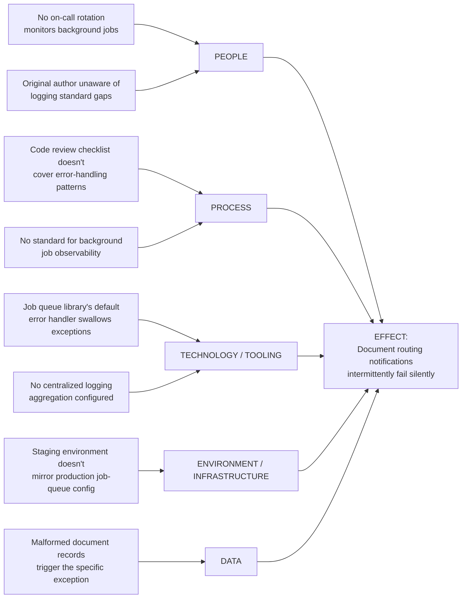

## Fishbone and Ishikawa Diagrams


### Overview

The Fishbone Diagram — also known as the Ishikawa Diagram (after its creator, Kaoru Ishikawa) or the Cause-and-Effect Diagram — is a structured visual technique for mapping the multiple, potentially parallel contributing causes of a problem before drilling into any single one. Where the Five Whys (previous section) excels at tracing a single linear causal chain, the fishbone diagram addresses that technique's most significant limitation: real defects frequently have several independent or interacting contributing factors, and a fishbone diagram surfaces the full landscape of candidate causes across standard categories before root-cause analysis narrows in on which are most significant.

### Core Structure

**Key Points**

- The diagram takes its "fishbone" name from its visual shape: a horizontal spine leading to the problem statement (the "head" of the fish), with diagonal "bones" branching off the spine, each representing a major category of potential cause.
- Each major category branch can itself have smaller sub-branches representing more specific candidate causes within that category — allowing the diagram to represent both broad categories and granular contributing factors simultaneously.
- Ishikawa developed the technique in the 1960s as part of Japan's broader quality-management movement, and it remains one of the seven basic quality tools widely taught alongside control charts, Pareto charts, and histograms in Total Quality Management (TQM) and Six Sigma practice.

### The Standard Category Frameworks

Two conventional sets of major-branch categories are most commonly used, chosen based on whether the problem originates in a manufacturing or a service/administrative context:

**Manufacturing context — the "6 Ms":**

- **Man (People):** human factors — training gaps, fatigue, miscommunication, skill mismatches
- **Machine (Equipment):** tooling, equipment malfunction, calibration drift, capacity limitations
- **Material:** raw material quality, supplier variability, storage/handling issues
- **Method (Process):** procedure design, work instructions, sequencing, standard operating procedures
- **Measurement:** inspection accuracy, gauge calibration, sampling methodology
- **Mother Nature (Environment):** temperature, humidity, physical workspace conditions

**Service/administrative context — the "4 Ps" (or similar variants):**

- **People:** staffing, training, communication
- **Process:** workflow design, handoffs, approval steps
- **Policies:** rules, standards, compliance requirements governing the process
- **Procedures:** specific documented steps within the broader process

**Software/systems context (a common practitioner adaptation, not a standardized "official" category set):** categories are frequently adapted to something like People, Process, Technology/Tooling, Environment/Infrastructure, and Data — reflecting the distinct failure surfaces of a software system relative to a physical production line. [Inference — this adaptation is a widely used practitioner convention rather than a formally standardized category set in the original Ishikawa literature]

### Worked Example: Applying a Fishbone Diagram to a Software Defect

Extending the recurring worked example from the previous Root Cause Analysis section — the silently-failing document-routing notification job — a fishbone diagram would map the full landscape of candidate contributing factors *before* the Five Whys technique drills into any single branch:



**Key Points on interpreting this diagram:**

- Notice that the Five Whys chain worked through in the previous section (job error handler swallows exceptions → no logging standard → no process requiring one) maps onto just two of the five branches here (Technology and Process) — the fishbone diagram reveals that People, Environment, and Data branches also contain plausible contributing factors that a single linear Five Whys chain, starting from a different initial "why," might never have surfaced.
- The fishbone diagram's purpose at this stage is **breadth**, not depth — it is not meant to identify the single root cause, but to ensure no major contributing-factor category is overlooked before the team commits to investigating one branch in depth (typically via Five Whys applied to the most promising branch or branches).

### The Combined Fishbone-Plus-Five-Whys Workflow

The two techniques are frequently used together, sequentially, rather than as competing alternatives — directly addressing the "single linear chain" limitation of Five Whys flagged in the previous section:

```mermaid
flowchart TD
    A[State the problem
clearly at the fish's head] --> B[Brainstorm candidate causes
across standard categories
People/Process/Technology/etc.]
    B --> C[Populate each branch with
specific candidate causes
from team knowledge]
    C --> D[Identify the most
plausible or highest-impact
branch(es)]
    D --> E[Apply Five Whys to drill
down into the selected
branch(es) for root cause]
    E --> F[Validate the identified
root cause against the
original problem statement]
    F --> G[Define the specific,
actionable prevention
investment]
```

This sequence directly feeds the same downstream step referenced in the previous section: "Step 2" of the business-case structure from the earlier chapter (defining the specific investment precisely), but with the added confidence that the breadth-first fishbone exercise reduces the risk of committing investment to a narrow, prematurely-selected causal branch.

### When to Use a Fishbone Diagram vs. Five Whys Alone

| Situation | Recommended Approach |
| --- | --- |
| A single, clearly mechanical failure chain (e.g., "this specific function threw this specific exception") | Five Whys alone is usually sufficient |
| A recurring or persistent problem with no obvious single trigger (e.g., "our deployment pipeline fails intermittently, for varying reasons") | Fishbone first, to map the landscape, then Five Whys on the most promising branch(es) |
| A cross-functional problem spanning multiple teams or disciplines (e.g., a quality issue touching both engineering and a client-facing department) | Fishbone diagram, since it structurally encourages input from each represented category/discipline rather than following one team's linear narrative |
| A problem where an initial Five Whys session has stalled or produced an unconvincing chain | Fall back to a fishbone diagram to check whether the stalled chain missed a contributing factor in a different category |

### Facilitation Guidance

**Key Points**

- **State the problem precisely at the "head" of the fish** — a vague or overly broad problem statement (e.g., "the system has bugs" rather than "document routing notifications intermittently fail silently") produces a diagram cluttered with unfocused, low-value candidate causes.
- **Brainstorm broadly before evaluating** — the diagram-construction phase should prioritize capturing every plausible candidate cause across all categories without immediately judging their likelihood or significance; premature filtering during brainstorming tends to suppress less-obvious but potentially important causes.
- **Include participants representing each category where possible.** A fishbone session run entirely by engineers, for instance, is likely to populate the Technology and Process branches thoroughly while underpopulating a People or Environment branch that a different participant (e.g., someone closer to on-call operations or infrastructure) might have surfaced.
- **Use the completed diagram to prioritize, not to conclude.** The fishbone diagram itself does not identify a root cause — it identifies *candidates*. The team must still apply judgment (often via subsequent Five Whys, or via data analysis where available) to determine which branch(es) most plausibly explain the actual observed problem, ideally validated against real evidence rather than intuition alone.

### Common Pitfalls

- **Treating every populated branch as equally significant.** A fishbone diagram often produces far more candidate causes than can realistically be investigated or addressed — without a subsequent prioritization step (informed by the marginal cost-benefit reasoning from the earlier CBA section), teams risk spreading investigative effort too thinly across low-value branches.
- **Conflating a fishbone diagram with a finished root-cause analysis.** Because the technique produces a visually complete-looking artifact, it can create a false sense that root-cause analysis is "done" once the diagram is populated — the diagram is an input to root-cause analysis, not its output.
- **Using generic, one-size-fits-all category labels that don't fit the actual domain.** Applying the manufacturing "6 Ms" verbatim to a software-context problem (forcing "Material" and "Mother Nature" branches where they don't naturally apply) produces a strained, low-value diagram — adapting the category set to the actual domain (as in the software-context example above) generally produces more useful results than rigid adherence to the traditional categories.
- **Skipping validation of the selected cause against actual evidence.** A branch that seems intuitively compelling during brainstorming is not necessarily the actual cause — where feasible, validate the selected candidate cause(s) against logs, historical incident data, or a targeted test before committing prevention investment, consistent with the pilot-based validation approach recommended in the earlier cost-benefit-analysis section.

### Relationship to Other Tools in This Course

| Tool | Relationship to Fishbone Diagrams |
| --- | --- |
| Five Whys | Complementary — fishbone maps breadth of candidate causes; Five Whys drills depth into a selected branch |
| Root Cause and Corrective Action (RCCA) documentation | The completed fishbone diagram and subsequent Five Whys analysis together typically form the documented evidence base for formal RCCA records (referenced in the earlier supply-chain/procurement section) |
| 8D Problem Solving | Fishbone diagrams are commonly used within the "root cause identification" step of the broader 8D methodology |
| Cost-Benefit Analysis of Prevention Spending | The prioritization step (selecting which fishbone branch(es) to act on) should be informed by the marginal-BCR reasoning from that earlier section, rather than by intuitive appeal alone |

### Related Topics

- The Seven Basic Quality Tools (Control Charts, Pareto Charts, Histograms, and Others)
- Root Cause Analysis and the Five Whys (Sequential Use With Fishbone Diagrams)
- The 8D Problem-Solving Methodology
- Total Quality Management (TQM) Origins and Ishikawa's Broader Contributions
- Adapting Manufacturing-Origin Quality Tools to Software and Service Contexts
- Facilitating Effective Cross-Functional Root-Cause Analysis Sessions