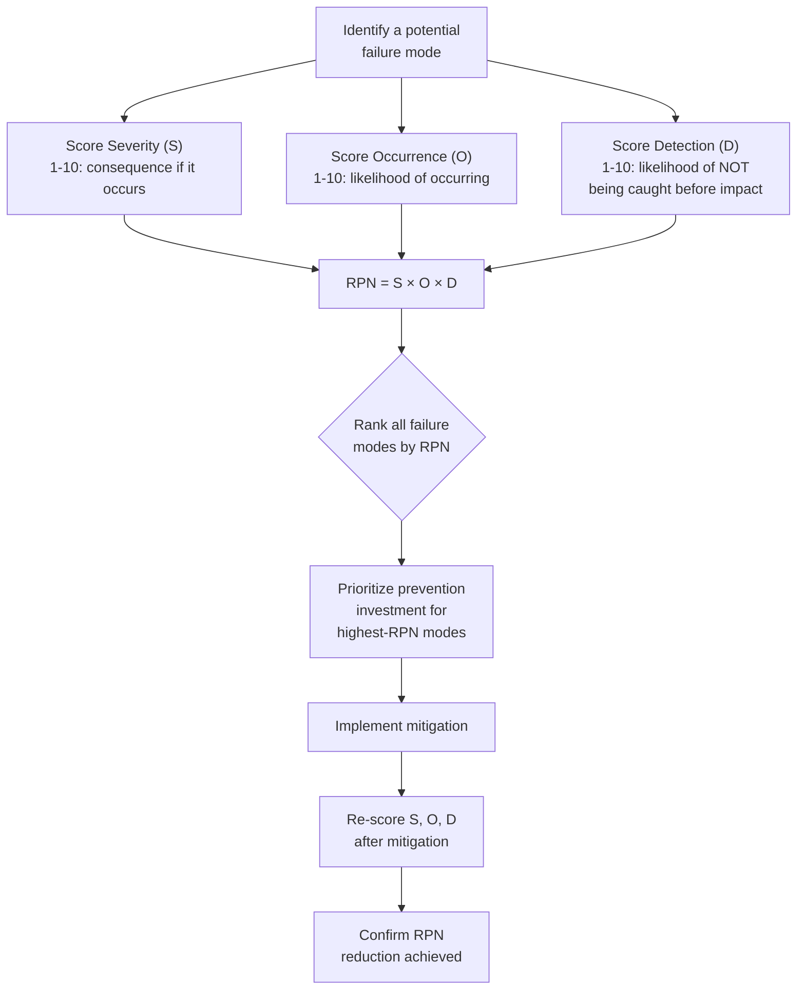

## Failure Mode and Effects Analysis

### Overview

Failure Mode and Effects Analysis (FMEA) is a structured, proactive technique for identifying potential ways a process, product, or system could fail, before those failures actually occur, and prioritizing them for prevention based on a quantified risk score. Where Root Cause Analysis and the Five Whys/Fishbone techniques (previous two sections) are fundamentally **reactive** — applied after a defect has already occurred to understand why — FMEA is fundamentally **proactive**, applied during design or process planning to anticipate failure modes before any defect has manifested. This makes FMEA one of the clearest practical embodiments of the 1-10-100 Rule's core argument from earlier in this course: it is explicitly a "$1 tier" activity, designed to catch and prevent defects before they are ever built into a system.

### Origins and Standardization

**Key Points**

- FMEA originated in the U.S. military and aerospace sectors in the 1940s–1960s, was subsequently adopted widely in automotive manufacturing (notably by Ford in the 1970s following widely publicized quality issues), and is now formalized within quality-management standards including AS9100 (aerospace) and IATF 16949 (automotive) — both referenced in the earlier supply-chain/procurement section of this course.
- Several standardized variants exist for different application contexts: **Design FMEA (DFMEA)**, applied to a product or system's design before it is built; **Process FMEA (PFMEA)**, applied to a manufacturing or business process; and **System FMEA**, applied to interactions between subsystems.
- The technique is deliberately structured and quantitative, distinguishing it from the more qualitative, brainstorming-driven fishbone diagram — FMEA produces a ranked, numerical prioritization of failure modes rather than a broad, unranked landscape of candidate causes.

### The Core FMEA Structure

For each potential failure mode under consideration, an FMEA analysis captures and scores three independent dimensions:

| Dimension | Question It Answers | Typical Scale |
| --- | --- | --- |
| **Severity (S)** | How serious are the consequences if this failure occurs? | 1 (negligible) to 10 (catastrophic) |
| **Occurrence (O)** | How likely is this failure to occur? | 1 (extremely unlikely) to 10 (near-certain) |
| **Detection (D)** | How likely is the failure to be detected *before* it reaches the point of impact? | 1 (almost certain to be detected) to 10 (almost certainly undetected) |

These three scores are multiplied to produce a **Risk Priority Number (RPN):**

$$RPN = S \times O \times D$$

**Key Points**

- The RPN ranges from 1 (lowest risk — severe, likely, and undetectable failures score high; mild, rare, and easily-detected failures score low) to 1000 (highest possible risk).
- Failure modes are then ranked by RPN, and the highest-scoring modes receive prioritized prevention investment — directly mirroring the marginal cost-benefit prioritization principle from the earlier CBA section of this course, but applied *before* any failure has occurred rather than retrospectively.
- Note the inverted scale for Detection: a *high* Detection score means the failure is *unlikely* to be caught before impact — this is a common source of confusion for newcomers to FMEA, since it runs opposite to the intuitive "higher score = better" pattern of the other two dimensions.

### Worked Example: Applying FMEA to a Software System

Extending the document-management-platform context used throughout this course, consider applying a Process FMEA to the document approval workflow before it is deployed, rather than waiting to discover failure modes reactively (as in the RCA/Five-Whys worked example from two sections prior):

| Potential Failure Mode | Severity (S) | Occurrence (O) | Detection (D) | RPN |
| --- | --- | --- | --- | --- |
| Approval notification job silently fails to send | 7 (delays approval; no direct data loss) | 4 (plausible under load or edge-case inputs) | 8 (no logging/alerting in place — hard to detect) | 224 |
| Document routed to a departed employee's account | 8 (workflow stalls indefinitely) | 3 (requires stale account data) | 6 (would eventually surface via user complaint) | 144 |
| Duplicate approval notification sent | 2 (minor annoyance, no functional harm) | 5 (plausible retry-logic edge case) | 3 (easily noticed by the recipient) | 30 |
| Database write conflict on concurrent approvals | 9 (data corruption or lost approval record) | 2 (requires simultaneous action, rare) | 7 (no concurrency safeguard or alerting) | 126 |

**Key Points on interpreting this table:**

- Ranked by RPN, the silent-notification-failure mode (224) — precisely the defect worked through reactively in the earlier Root Cause Analysis section — would have been identified as the **highest-priority failure mode to address proactively**, before it ever occurred, had an FMEA been conducted during the design phase.
- Note that the database write conflict (126), despite having the highest severity score (9) of any row, ranks *below* the notification failure in overall RPN, because its occurrence probability is low — this illustrates FMEA's core value: it prevents organizations from over-indexing on severity alone (a common intuitive bias) by forcing an explicit, multiplicative accounting of likelihood and detectability as well.
- This is a directly quantified instance of the "shift detection earlier in the lifecycle" argument underlying the 1-10-100 Rule: conducting this FMEA during design, and addressing the top-ranked item with a logging/alerting mechanism before deployment, is a "$1 tier" investment avoiding what the RCA section demonstrated was a real, reactively-discovered "$10–$100 tier" defect.

### FMEA's Relationship to Other Tools Covered in This Chapter

| Tool | Timing | Primary Output | Relationship to FMEA |
| --- | --- | --- | --- |
| Five Whys | Reactive (after a defect occurs) | A single causal chain to a root cause | FMEA is the proactive counterpart — Five Whys explains why something *did* fail; FMEA anticipates what *could* fail |
| Fishbone Diagram | Reactive, breadth-first | A landscape of candidate contributing factors | FMEA's "Occurrence" scoring can draw on the same category thinking (People/Process/Technology/etc.) fishbone diagrams use, applied prospectively rather than to an already-occurred incident |
| Cost-Benefit Analysis of Prevention Spending | Either — but typically applied after a candidate investment is identified | ROI/BCR for a specific prevention investment | FMEA's RPN ranking directly determines *which* failure modes are worth running a full CBA on — high-RPN modes are the natural candidates for the CBA methodology from the earlier chapter |

### Practical Guidance for Conducting an FMEA

- **Assemble a cross-functional team**, mirroring the fishbone-diagram guidance from the previous section — engineers, operators, and (where relevant) end-users or support staff each surface different candidate failure modes and have different intuitions about occurrence and detection likelihood.
- **Score consistently across the full analysis.** Because S, O, and D scores are inherently somewhat subjective, establishing shared scoring anchors before beginning (e.g., "a Severity of 8 means X category of consequence") improves consistency and makes RPN comparisons across failure modes meaningful.
- **Re-score after implementing mitigations**, as shown in the workflow diagram above — FMEA is intended to be iterative: a mitigation that reduces Occurrence or improves Detection should produce a measurably lower RPN, which serves as a concrete, quantified confirmation that the investment achieved its intended risk-reduction effect, directly analogous to the "define post-implementation success metrics" step from the earlier business-case framework.
- **Set an explicit RPN threshold for action**, rather than attempting to address every identified failure mode — consistent with the marginal cost-benefit and diminishing-returns principles covered earlier in this course, addressing every low-RPN mode is rarely an efficient use of prevention investment; a defined cutoff (e.g., "address all modes with RPN above 100") keeps prioritization disciplined.
- **Revisit the FMEA periodically, not just once at design time.** As a system evolves — new features, changed usage patterns, discovered edge cases — occurrence and detection likelihoods shift, and failure modes not anticipated in the original analysis may emerge; treating FMEA as a living document rather than a one-time exercise keeps it aligned with the system's actual current risk profile.

### Limitations and Critiques

- **RPN's multiplicative structure can produce counterintuitive or misleading rankings.** Because RPN is a simple product of three ordinal (1–10) scales, different combinations of S, O, and D can produce identical RPN values despite representing meaningfully different risk profiles (e.g., a high-severity/low-occurrence failure and a low-severity/high-occurrence failure can share the same RPN) — some practitioners and later standards revisions recommend considering S, O, and D as a profile rather than relying solely on the single blended RPN figure. [Inference — this is a documented critique in quality-engineering literature, reflected in later FMEA standard revisions that introduced alternative prioritization approaches, though FMEA in its classic multiplicative-RPN form remains widely taught and used]
- **Scoring subjectivity limits cross-team or cross-project comparability.** Because S, O, and D scores depend on the specific team's judgment and shared context, RPN values are most reliably compared *within* a single FMEA exercise, and less reliably compared *across* different FMEAs conducted by different teams or at different times, unless scoring anchors are rigorously standardized organization-wide.
- **FMEA's effectiveness depends heavily on the team's ability to anticipate failure modes in the first place.** A failure mode that no team member imagines will not appear in the analysis at all — FMEA structures and prioritizes *known or anticipated* risks; it does not guarantee comprehensive coverage of every possible failure mode, particularly genuinely novel ones. [Inference — this is a standard, widely acknowledged limitation of any proactive risk-identification technique, not specific to FMEA's particular methodology]

### Related Topics

- Design FMEA (DFMEA) versus Process FMEA (PFMEA): Application Differences
- Fault Tree Analysis as a Complementary Proactive Technique for Complex Systems
- Applying FMEA Rankings as Input to Cost-Benefit-Analysis Prioritization
- AS9100 and IATF 16949: FMEA Requirements in Formal Quality Standards
- The Seven Basic Quality Tools and Where FMEA Fits Among Them
- Iterative Risk Reassessment and Living-Document Practices for Evolving Systems