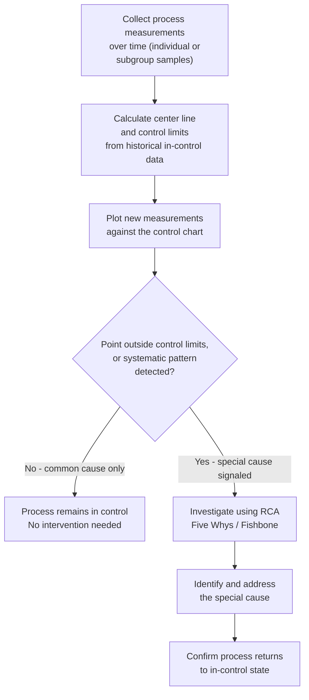

## Statistical Process Control

### Overview

Statistical Process Control (SPC) is a methodology for monitoring and controlling a process using statistical methods, distinguishing normal, expected process variation from abnormal variation signaling an emerging problem — before that problem produces defective output. Developed by Walter Shewhart at Bell Labs in the 1920s and later championed extensively by W. Edwards Deming, SPC is the quantitative, ongoing-monitoring counterpart to the proactive, point-in-time techniques covered earlier in this chapter (FMEA) and the reactive, after-the-fact techniques (Five Whys, Fishbone diagrams). Where FMEA anticipates failure modes before a process runs, and RCA investigates a specific failure after it occurs, SPC continuously watches a running process to catch a developing problem in the narrow window between "process is still in control" and "process has begun producing defects" — making it one of the clearest practical mechanisms for realizing the earliest, cheapest tier of the 1-10-100 Rule.

### Core Concept: Common Cause vs. Special Cause Variation

**Key Points**

- Shewhart's foundational insight was that all processes exhibit variation, but that variation falls into two fundamentally different categories requiring fundamentally different responses.
- **Common cause variation** (also called "natural" or "chance" variation) is the inherent, expected variability present in any stable process — small, random fluctuations from many minor factors that are not economically worth chasing individually. A process exhibiting only common cause variation is considered **"in control"** — stable and predictable, even though individual outputs vary somewhat.
- **Special cause variation** (also called "assignable cause" variation) is variation from an identifiable, specific source outside the process's normal operation — a broken tool, a new batch of defective material, an untrained operator, a software deployment that introduced a regression. A process exhibiting special cause variation is **"out of control"** — its behavior has shifted, and left unaddressed, it will very likely begin producing nonconforming output.
- The critical management implication: attempting to "fix" common cause variation by adjusting the process in response to every individual fluctuation (a phenomenon Deming called "tampering") actually *increases* variation and cost rather than reducing it, because it treats normal statistical noise as a signal requiring a response. SPC's core discipline is distinguishing genuine signals (special causes) from noise (common causes) so that intervention is applied only when actually warranted.

### The Control Chart

The primary tool of SPC is the **control chart**, a time-series plot of a process measurement with statistically-derived control limits overlaid, distinguishing normal fluctuation from a genuine out-of-control signal.

**Key Points**

- A control chart plots individual measurements (or sample statistics, such as a subgroup mean) over time, along with three reference lines: the **center line** (typically the process mean), the **Upper Control Limit (UCL)**, and the **Lower Control Limit (LCL)**.
- Control limits are conventionally set at ±3 standard deviations from the center line, derived from the process's own historical data — **not** from an externally imposed specification or customer requirement. This is a frequently misunderstood distinction: control limits describe what the process is statistically *capable of* doing when stable; specification limits describe what the customer or downstream process *requires* — the two can, and often do, differ, and conflating them is a common and significant SPC error.
- A point falling outside the control limits, or certain systematic patterns within the limits (discussed below), signals a likely special cause requiring investigation — typically via the root-cause techniques (Five Whys, Fishbone) covered earlier in this chapter, applied specifically to the process behavior that triggered the signal.

### Common Control Chart Types

| Chart Type | Data Type Monitored | Typical Use Case |
| --- | --- | --- |
| X-bar and R chart | Subgroup mean and range of a continuous measurement | Manufacturing dimensional measurements (e.g., part diameter) |
| Individuals (I-MR) chart | Single continuous measurements, no natural subgrouping | Low-volume processes, or measurements taken one at a time |
| p-chart | Proportion of defective units in a sample of varying size | Pass/fail inspection results across variable batch sizes |
| c-chart | Count of defects per unit (unit size fixed) | Number of defects found per inspected unit |
| u-chart | Count of defects per unit (unit size varies) | Defect counts per unit when sample/unit size is not constant |

### Detecting Out-of-Control Signals Beyond a Single Out-of-Limits Point

**Key Points**

- A single point beyond the ±3-sigma control limits is the most obvious out-of-control signal, but SPC methodology (formalized in rule sets such as the Western Electric Rules, developed at the company of the same name) also identifies systematic *patterns* of points that, while individually within the control limits, are statistically unlikely to occur under pure common-cause variation and therefore also signal a likely special cause.
- Common pattern-based rules include: several consecutive points on the same side of the center line (suggesting a process shift rather than random variation), a run of points steadily trending in one direction (suggesting gradual drift, such as tool wear or a slowly degrading resource), or points showing unusually low variation clustered tightly around the center line (which, counterintuitively, can itself indicate a problem — such as a measurement system that has stopped discriminating properly, or an unintentional and undocumented change to the process).
- These pattern-based rules extend SPC's detection sensitivity beyond simple threshold-crossing, allowing emerging problems to be caught even before any single measurement exceeds the formal control limits — directly reinforcing the "catch it as early as possible" logic underlying the 1-10-100 Rule.

### Applying SPC to Software and Service Contexts

While SPC originated in physical manufacturing, its core logic — distinguishing normal variation from a genuine signal in an ongoing, repeated process — transfers to any process generating a continuous or repeated measurable output, including software delivery and service operations:

**Software/DevOps applications:**

- **Deployment pipeline metrics:** build duration, test suite pass rate, or deployment failure rate, tracked over time on a control chart, can distinguish normal day-to-day variation from a genuine regression (e.g., a specific commit that introduced a systematic slowdown or new flakiness) — directly analogous to the Modern Zero-Defects Cost Curve Debate's earlier discussion of CI/CD as a quality-cost-reduction lever, but applied here as an ongoing monitoring discipline rather than a one-time architectural choice.
- **API response latency or error rate:** monitored via control-chart-style statistical thresholds (a technique underlying many modern observability and alerting platforms, even when not explicitly labeled "SPC"), distinguishing routine load-driven fluctuation from a genuine service degradation warranting investigation.
- **Support ticket volume or category distribution:** tracked over time to distinguish normal week-to-week variation from a genuine, statistically significant shift suggesting a new or worsening underlying problem — directly useful as an early-warning signal feeding into the root-cause techniques from earlier in this chapter, potentially catching a systemic issue before it accumulates into the kind of significant failure cost discussed in the CBA and break-even sections.

**Key caution:** [Inference — this is a widely noted adaptation challenge, not a formally documented limitation from Shewhart's original work] Software and service metrics often violate the classical statistical assumptions (independence, stable underlying distribution) that formal control-chart limit calculations rely on more cleanly than physical manufacturing measurements typically do — practitioners applying SPC-style monitoring to software metrics should treat the resulting control limits as a useful heuristic for flagging anomalies worth investigating, rather than as a rigorously validated statistical guarantee in the way a mature manufacturing SPC program would be.

### SPC's Relationship to the Cost of Quality Framework

SPC operates specifically within the **Appraisal** category of the PAF model (covered earlier in this course) but with a distinctive character relative to traditional post-production inspection appraisal:

| Traditional Post-Production Inspection | Statistical Process Control |
| --- | --- |
| Inspects finished output after production, catching defects that have already occurred | Monitors the *process* during production, catching signals that defects are about to begin occurring |
| A pure appraisal-category cost — detects, but does not prevent | Functions partially as prevention — enables intervention before nonconformance actually happens |
| Detects defects at a later, more expensive stage per the 1-10-100 Rule | Detects developing problems at an earlier stage, closer to the "1" tier |
| Cost scales with inspection volume/thoroughness | Cost is largely fixed (measurement infrastructure) once established, with low marginal cost per additional monitored period — consistent with the "structural prevention" cost profile discussed in the earlier Zero-Defects Curve Debate section |

This reframing is why SPC is often discussed as blurring the traditional PAF boundary between Appraisal and Prevention — it is technically a measurement/detection activity (appraisal), but because it detects a developing special cause *before* nonconforming output is produced, its practical effect and cost profile resemble prevention more closely than traditional after-the-fact inspection.

### Process Capability: Connecting SPC to Specification Requirements

**Key Points**

- Once a process is confirmed to be in statistical control (exhibiting only common cause variation), a separate question can be meaningfully asked: is the process, as it currently behaves, actually capable of consistently meeting the customer's specification limits?
- This is assessed via **process capability indices**, most commonly $C_p$ and $C_{pk}$, which compare the process's natural variation (control limits) against the externally imposed specification limits.
- A process can be perfectly "in control" (stable, predictable, only common-cause variation) while still being **incapable** of meeting specification — meaning it will reliably produce some proportion of nonconforming output even while behaving exactly as expected. This is the precise mechanism by which SPC connects back to this course's Conformance versus Fitness for Use distinction (covered in the first chapter): a process can conform perfectly to its own statistical behavior while still failing the external specification that defines actual conformance.
- Improving process capability (narrowing the process's natural variation, or shifting its center closer to the specification target) typically requires the kind of deliberate prevention investment covered in the Cost-Benefit-Analysis and Break-Even sections earlier in this course — SPC identifies *that* a capability gap exists and *how large* it is, but closing it is a separate investment decision.

### Practical Guidance for Implementing SPC

- **Establish control limits from genuinely stable, representative historical data**, not from a brief or atypical period — control limits calculated from too short or unrepresentative a baseline will produce unreliable signals (either excessive false alarms or missed genuine special causes).
- **Distinguish investigation from immediate process adjustment.** An out-of-control signal warrants investigation (via the RCA techniques from earlier in this chapter) before any process change is made — adjusting the process reactively to every signal without first confirming a genuine special cause risks the "tampering" problem Deming specifically warned against.
- **Recalculate control limits deliberately, not automatically, after a confirmed and addressed process change.** Once a special cause has been identified and genuinely corrected, or once a deliberate, validated process improvement has been implemented, control limits should be recalculated to reflect the new, improved process baseline — but this recalculation should follow confirmed evidence of a genuine, stable change, not be performed reflexively after every signal.
- **Pair SPC with the process capability analysis** described above where an external specification exists — a stable process is necessary but not sufficient for meeting requirements; capability analysis closes that gap in the overall quality-cost picture.

### Related Topics

- Process Capability Analysis: $C_p$, $C_{pk}$, and Their Interpretation
- The Western Electric Rules and Pattern-Based Control Chart Signals
- Deming's Concept of Tampering and Its Cost Implications
- Applying Control-Chart Logic to Software Observability and Alerting Systems
- Conformance versus Fitness for Use, Revisited Through Process Capability
- Six Sigma's Use of SPC Within the DMAIC Methodology