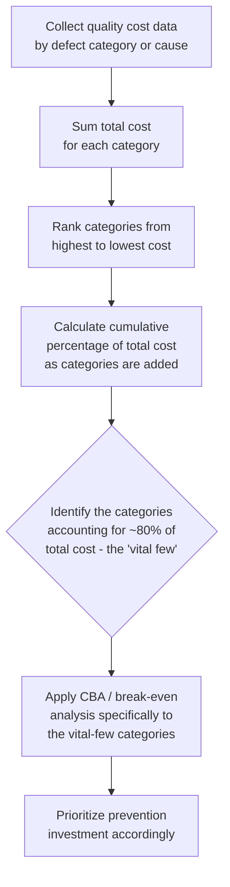
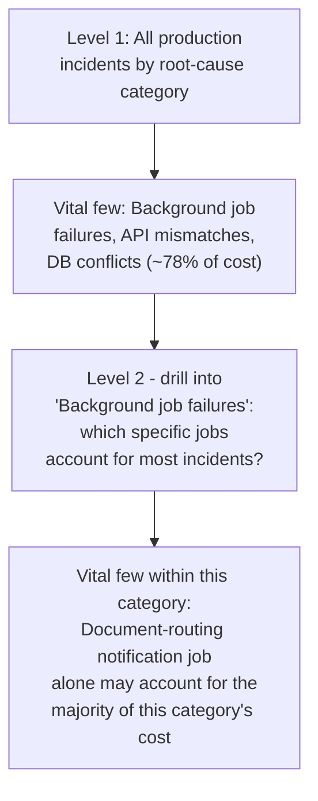

## Pareto Analysis of Quality Costs

### Overview

Pareto Analysis is a prioritization technique that identifies which small subset of causes accounts for the large majority of a given problem's total cost or frequency, enabling improvement effort to be concentrated where it will have the greatest impact. Named after economist Vilfredo Pareto (whose observation about wealth distribution in Italy inspired the "80/20" heuristic), and popularized within quality management by Joseph Juran — the same figure behind the Quality Trilogy and "Gold in the Mine" concept covered earlier in this course — Pareto Analysis serves as the essential *prioritization bridge* between the diagnostic tools of this chapter (Five Whys, Fishbone, FMEA, SPC, each of which can surface many candidate problems) and the financial-justification tools of the previous chapter (CBA, break-even analysis), which require a specific, scoped target before they can be usefully applied.

### The Pareto Principle in Quality Costing

**Key Points**

- The core empirical observation, commonly summarized as the "80/20 rule," holds that in many real-world distributions of cause and effect, roughly 80% of the total effect (cost, defect count, customer complaints) is attributable to roughly 20% of the possible causes — though the exact ratio varies by context and should be treated as an illustrative heuristic rather than a precise universal law. [Inference — the specific 80/20 split is a commonly cited approximation; actual distributions in any given dataset may differ meaningfully from that exact ratio while still exhibiting the same qualitative "few causes dominate" pattern]
- Juran applied this observation specifically to quality costs, distinguishing what he termed the **"vital few"** — the small number of defect categories or causes responsible for the majority of total quality cost — from the **"trivial many"** — the larger number of remaining categories, each individually contributing only a small fraction of total cost.
- The practical implication directly extends the marginal cost-benefit-analysis principle from the earlier chapter: since a small number of causes drive most of the cost, prevention investment targeted at the vital few will generally produce a far higher return than investment spread evenly across all identified defect categories — Pareto Analysis is the technique that identifies *which* categories qualify as the vital few for a given dataset.

### Constructing a Pareto Chart

A Pareto chart combines a bar chart (showing individual category frequency or cost, ranked from largest to smallest) with a cumulative-percentage line overlay, making the "vital few" visually apparent at a glance.

**Key Points**

- Categories are ordered from highest to lowest cost/frequency along the horizontal axis — unlike a typical bar chart, the ordering itself is analytically meaningful, not arbitrary or alphabetical.
- A cumulative percentage line, plotted against a secondary vertical axis, shows what proportion of the total is accounted for as each successive category is added — the point at which this line crosses a chosen threshold (commonly 80%) marks the boundary of the "vital few."
- The chart's visual signature — a small number of tall bars on the left, followed by a long tail of progressively shorter bars — is itself diagnostic: a Pareto chart with a pronounced steep drop-off strongly supports concentrated prioritization, while a chart with a flatter, more even distribution across categories suggests the underlying causes are more genuinely dispersed and may require a broader improvement effort rather than a narrowly targeted one.

### Worked Example: Pareto Analysis of Quality Cost Data

Extending the document-management-platform context used throughout this course, consider a Pareto analysis of the past two quarters' production incidents, categorized by root cause (drawing on the kind of categorization a fishbone-diagram exercise, covered earlier in this chapter, would typically produce):

| Root Cause Category | Incident Count | Estimated Cost (engineering hours + downstream impact) | Cumulative % of Total Cost |
| --- | --- | --- | --- |
| Background job silent failures (notification/routing) | 14 | Largest single category | ~38% |
| API contract mismatches (frontend/backend) | 9 | Second largest | ~63% |
| Database concurrency conflicts | 4 | Third largest | ~78% |
| Malformed input from legacy data migration | 3 | Fourth | ~87% |
| Misconfigured environment variables | 2 | Fifth | ~93% |
| Third-party service timeout handling | 2 | Sixth | ~97% |
| Miscellaneous / one-off causes | 3 | Smallest individually, several categories | 100% |

**Key Points on interpreting this table:**

- The first three categories — background job silent failures, API contract mismatches, and database concurrency conflicts — together account for roughly 78% of total incident cost, while comprising only 3 of 7 total categories identified (well under half) — a distribution consistent with the vital-few/trivial-many pattern, even if not landing on the exact 80/20 ratio.
- Notably, this ranking directly validates the prioritization implied by earlier worked examples in this course: the background-job silent-failure category (addressed via Root Cause Analysis two sections prior, and identified as the highest-RPN failure mode in the FMEA worked example) is confirmed here as genuinely the single largest cost driver — Pareto Analysis provides the aggregate, data-driven confirmation that the earlier qualitative prioritization (via FMEA's RPN ranking) was well-founded.
- The API contract-mismatch category directly corresponds to the automated contract-testing investment evaluated in the earlier Cost-Benefit-Analysis and Break-Even sections — this Pareto table demonstrates, in a single consolidated view, why that investment was a reasonable prioritization choice: it targets the second-largest cost category in the actual data.

### Pareto Analysis Applied at Different Levels of Granularity

Pareto Analysis is not limited to a single top-level categorization — it can be applied recursively, drilling into a "vital few" category to identify the vital few *within* it:

This recursive application directly supports the specific, scoped investment definition required by the business-case structure from the earlier chapter ("Step 2: Define the specific investment precisely") — a top-level Pareto analysis identifies *which category* to prioritize; a second-level analysis within that category identifies the *specific* defect or process step to target, avoiding the vague, overly broad investment asks the business-case section flagged as a common failure mode.

### Pareto Analysis and Cost of Quality Category Allocation

Pareto Analysis can also be applied *across* the PAF or Process Cost Model categories themselves (covered in the earlier chapter on alternative CoQ models), rather than only within a single failure-cost category, to assess whether current quality-cost allocation is well-balanced:

| Application | What It Reveals |
| --- | --- |
| Pareto of failure costs by root-cause category (as above) | Which specific defect classes to prioritize for prevention investment |
| Pareto of total CoQ spend across Prevention/Appraisal/Internal Failure/External Failure | Whether current spend allocation itself is imbalanced — e.g., if External Failure dominates total CoQ, this is itself a strong quantitative signal supporting Crosby's and Juran's arguments (covered earlier) for shifting investment toward Prevention |
| Pareto of customer complaints by category | Which fitness-for-use gaps (revisiting the first chapter's Conformance vs. Fitness for Use distinction) are most consequential to address |

### Common Pitfalls in Pareto Analysis

- **Using frequency alone without cost weighting.** A defect category with a high incident *count* is not necessarily the highest-*cost* category — a frequent but cheap-to-resolve defect can rank below a rarer but far more expensive one when cost, rather than raw count, is the ranking basis. Because this course's broader framework is fundamentally about *cost*, cost-weighted Pareto analysis (as in the worked example above) is generally the more decision-relevant version, even though frequency-based Pareto charts are also common and useful for other purposes (e.g., prioritizing by customer-visible incident volume).
- **Treating the "trivial many" as genuinely unimportant.** The trivial-many categories, while individually small, are not necessarily safe to ignore entirely — particularly where a currently-small category is growing rapidly, or where a low-cost-but-high-severity outlier (echoing the FMEA severity-scoring caution from earlier in this chapter) sits within the "trivial many" by average cost but carries disproportionate tail risk.
- **Applying Pareto Analysis to too short or unrepresentative a data window**, mirroring the SPC caution from the previous section about calculating control limits from atypical baselines — a Pareto ranking calculated from a brief or unusual period may not reflect the genuinely dominant cost drivers over a longer, more representative timeframe.
- **Failing to recompute the Pareto analysis after addressing the vital few.** Once the highest-cost categories are addressed, the ranking of remaining categories shifts — a category previously in the "trivial many" may become relatively more significant once the former vital-few categories are reduced, and periodic recalculation keeps prioritization aligned with the current, evolving cost landscape rather than a stale historical snapshot.

### Relationship to Other Frameworks in This Course

| Framework | Relationship to Pareto Analysis |
| --- | --- |
| Fishbone Diagram (this chapter) | Fishbone identifies the *categories* of candidate causes; Pareto Analysis, once cost/frequency data is available, ranks those categories by actual impact |
| FMEA (this chapter) | FMEA's RPN ranking is a proactive, judgment-based prioritization; Pareto Analysis is a reactive, data-based prioritization — the two can validate or challenge each other, as shown in the worked example above |
| Cost-Benefit Analysis / Break-Even Analysis (previous chapter) | Pareto Analysis identifies *which* defect category most warrants a full CBA/break-even evaluation; it is the triage step preceding detailed financial analysis |
| Juran's "Gold in the Mine" and Quality Trilogy | Pareto's "vital few" concept is directly attributed to Juran's application of the broader Pareto principle to quality management, and is a foundational technique within his Quality Improvement phase of the Trilogy |
| The 1-10-100 Rule | A Pareto analysis weighted by *actual realized cost* (rather than raw incident count) inherently reflects the 1-10-100 escalation, since a defect class habitually caught late will show disproportionately high cost per incident relative to a class habitually caught early, even at similar incident counts |

### Related Topics

- Juran's Quality Trilogy: Where Pareto Analysis Fits Within Quality Improvement
- The Seven Basic Quality Tools and Pareto Charts' Place Among Them
- Recursive/Drill-Down Pareto Analysis Techniques
- Cost-Weighted versus Frequency-Weighted Prioritization Approaches
- Applying Pareto Analysis to Cost-of-Quality Category Balance (Prevention vs. Failure Spend)
- Tail-Risk Categories and the Limits of Vital-Few Prioritization