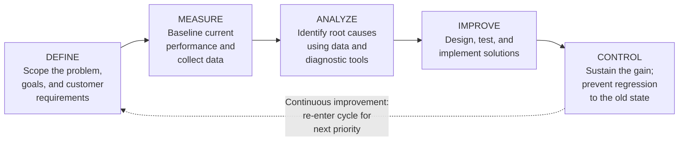
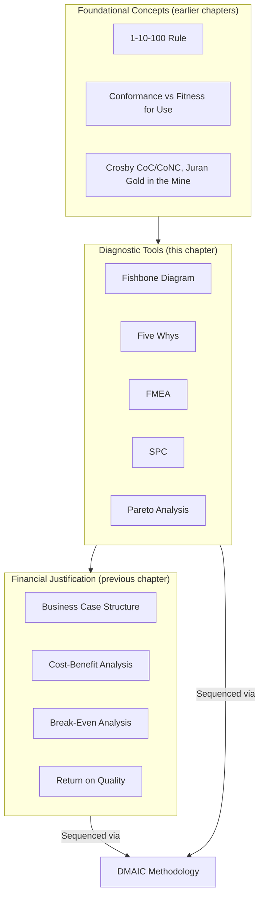

## Six Sigma DMAIC Methodology

<syllabot_broad_topic/>

### Overview

DMAIC (Define, Measure, Analyze, Improve, Control) is the core structured problem-solving methodology of Six Sigma, providing the overarching procedural framework into which nearly every tool covered so far in this chapter — Root Cause Analysis, Fishbone Diagrams, FMEA, Statistical Process Control, and Pareto Analysis — slots as a component technique applied at a specific phase. Where the previous sections each covered a standalone tool, DMAIC is the sequencing discipline that determines *when* to apply each tool within a complete quality-improvement project, from initial problem definition through to sustained, controlled improvement. Six Sigma itself, introduced briefly in the earlier "Modern Zero Defects Cost Curve Debate" section, originated at Motorola in the 1980s and was popularized industry-wide by General Electric in the 1990s.

### The Five DMAIC Phases

**Key Points**

- Each phase has defined objectives, a characteristic set of tools, and (in formal Six Sigma programs) a "tollgate" review before the project proceeds to the next phase — ensuring a project doesn't jump to implementing a solution before the problem is properly defined and measured, a common failure mode DMAIC's structure is explicitly designed to prevent.
- The methodology is cyclical at the program level even though linear within a single project: the Control phase's output — a stabilized, monitored process — becomes the new baseline from which the next Pareto-prioritized improvement target (per the previous section) is selected, embodying the continuous-improvement principle central to Six Sigma and the broader Total Quality Management tradition it descends from.

### Phase 1: Define

**Key Points**

- Establishes the project's scope, the specific problem being addressed, the customer requirements at stake (directly invoking the Conformance versus Fitness for Use distinction from the first chapter of this course — Define phase work should clarify which of the two, or both, the project addresses), and the goals/success metrics the project will be judged against.
- Typically produces a formal **project charter**: a concise document stating the business case (directly drawing on the business-case structure from the earlier chapter), the problem statement, the goal statement, project scope boundaries, and the team's roles.
- A well-executed Define phase should already indicate, at least provisionally, *why* this particular problem was selected for a DMAIC project — ideally traceable to a Pareto Analysis (previous section) identifying it as part of the "vital few," or to an FMEA ranking (two sections prior) identifying it as a high-RPN risk.

### Phase 2: Measure

**Key Points**

- Establishes a quantitative baseline of current process performance, ensuring the team has objective data before attempting to analyze or improve anything — directly consistent with the "establish current-state baseline" guidance from the earlier business-case section.
- Frequently involves a **Measurement System Analysis (MSA)** — verifying that the data-collection method itself is accurate and reliable before trusting the data it produces; a flawed measurement system can make a stable process appear unstable, or vice versa, undermining every subsequent phase.
- Often draws directly on Statistical Process Control (previous section) — establishing control charts for the relevant process metrics is a standard Measure-phase activity, distinguishing the process's current common-cause variation from any existing special-cause signals before analysis begins.

### Phase 3: Analyze

**Key Points**

- This phase is where the diagnostic tools covered earlier in this chapter are most directly and intensively applied: Fishbone Diagrams to map the landscape of candidate causes, Five Whys to drill into the most promising branches, and Pareto Analysis to confirm which causes actually account for the majority of the measured problem.
- The Analyze phase's discipline is to move from *hypothesized* causes (generated via Fishbone/Five Whys) to *statistically validated* causes, using the Measure-phase data — a hypothesis about a root cause should ideally be tested against actual process data (e.g., via correlation analysis, hypothesis testing, or regression) rather than accepted purely on the strength of team consensus or intuition, distinguishing rigorous DMAIC practice from a less disciplined root-cause exercise.
- Output of this phase is a validated, prioritized list of root causes — directly feeding the "Step 2: Define the specific investment precisely" requirement from the earlier business-case framework.

### Phase 4: Improve

**Key Points**

- Design, test, and implement solutions addressing the validated root causes from the Analyze phase — this is where FMEA (earlier in this chapter) is frequently applied prospectively, to a *proposed* solution rather than an existing process, anticipating new failure modes the solution itself might introduce before it is fully rolled out.
- Pilot-based validation, per the guidance in the earlier Cost-Benefit-Analysis section, is a standard Improve-phase practice — testing a proposed change on a limited scale before full implementation, both to confirm the expected improvement materializes and to refine the effectiveness estimate ($R$ in the CBA formula from that earlier section) with actual data rather than assumption alone.
- The financial justification frameworks from the earlier chapter — CBA, break-even analysis, and where applicable, Return on Quality — are typically formalized during this phase to justify the specific solution selected, particularly in formal Six Sigma programs where a project's financial impact is tracked and reported as a core success metric.

### Phase 5: Control

**Key Points**

- Ensures the improvement is sustained rather than eroding back to the prior state over time — a documented risk in any process-improvement effort, since the conditions that originally produced the problem (absent deliberate, structural change) tend to reassert themselves without an active mechanism holding the gain in place.
- Statistical Process Control (previous section) is the primary tool of this phase: establishing new control charts and limits reflecting the improved process, with defined response procedures if the process begins drifting out of control again.
- Frequently produces a **Control Plan** — formal documentation of the new process standard, monitoring procedures, and escalation steps if the process shows signs of regression — analogous in spirit to the RCCA (Root Cause and Corrective Action) documentation referenced in the earlier supply-chain/procurement section, but focused on sustaining a gain rather than closing out a single incident.
- This phase directly corresponds to "Step 8: Define post-implementation success metrics" from the earlier business-case structure, but extends it into an ongoing, institutionalized monitoring discipline rather than a one-time checkpoint.

### Worked Example: A Complete DMAIC Cycle

Consolidating the recurring worked example used throughout this chapter — the document-routing notification failures — into a single DMAIC project narrative:

| Phase | Applied to the Worked Example |
| --- | --- |
| **Define** | Project charter: "Reduce production incidents caused by silent background-job failures in the document-routing workflow." Business case draws on the Pareto Analysis (previous section) showing this category accounts for ~38% of total incident cost. |
| **Measure** | Baseline incident rate and cost established from two quarters of historical data (as used in the Pareto worked example); SPC control chart established for weekly incident counts in this category. |
| **Analyze** | Fishbone Diagram maps candidate causes across People/Process/Technology/Environment/Data branches (as constructed in the earlier Fishbone section); Five Whys drills into the Technology and Process branches, reaching the root cause: no organizational standard requires background-job observability. |
| **Improve** | Proposed solution: establish and enforce a background-job observability standard via code review checklist and a shared job-wrapper utility. FMEA applied prospectively to the new wrapper utility itself, to anticipate any failure modes the fix might introduce. Pilot rollout to the highest-incident job first, consistent with the CBA section's pilot-based effectiveness estimation. Break-even analysis (per the earlier section) confirms a favorable payback period based on pilot results. |
| **Control** | New control chart established for background-job incident rate post-fix; code review checklist item and CI lint rule institutionalize the observability standard going forward, preventing regression as new jobs are added to the codebase. |

### DMAIC's Relationship to the Broader Course Framework

**Key Points**

- DMAIC is best understood not as a competing framework to the tools and concepts covered elsewhere in this course, but as the **procedural scaffolding** that sequences them into a coherent, repeatable project structure — the Define phase draws on the foundational concepts and business-case framing; the Measure and Analyze phases deploy the diagnostic tools; the Improve phase applies the financial-justification frameworks to select and validate a specific solution; and the Control phase institutionalizes SPC-based monitoring to sustain the result.
- This integration is precisely why DMAIC is typically taught as the capstone methodology in a quality-cost curriculum — it demonstrates how the individually-covered tools and financial frameworks combine into an actual, executable improvement process, rather than remaining a collection of disconnected techniques.

### Common Pitfalls in DMAIC Execution

- **Skipping or rushing the Measure phase**, moving from an intuitive problem statement directly to proposed solutions without establishing an objective baseline — this undermines the ability to later demonstrate (Control phase) that the improvement genuinely occurred, and risks the same "why improving quality doesn't improve quality" failure mode referenced in the earlier Return on Quality section, where an unmeasured, unvalidated change may not have addressed the actual problem at all.
- **Treating the Analyze phase's causal hypotheses as conclusions without validation against Measure-phase data** — a Fishbone/Five-Whys exercise generates *candidate* causes; DMAIC's discipline specifically requires testing those candidates against actual data before committing Improve-phase investment, a rigor beyond what a standalone RCA exercise (outside a formal DMAIC structure) might otherwise apply.
- **Neglecting the Control phase**, treating a successful Improve-phase pilot or rollout as the project's natural endpoint — without institutionalized monitoring, gains from process-improvement projects are well-documented to erode over time as the original conditions reassert themselves, making Control the phase most often shortchanged despite being essential to realizing the project's full financial return as projected in the Improve-phase business case.

### Related Topics

- Six Sigma Belt Certification Levels and Organizational Roles (Green Belt, Black Belt, Master Black Belt)
- Design for Six Sigma (DFSS) as a Proactive Counterpart to DMAIC
- Measurement System Analysis (MSA) and Gage R&R Studies
- Lean Six Sigma: Integrating Waste-Reduction Principles With DMAIC
- Project Charters and Tollgate Reviews in Formal Six Sigma Programs
- Sustaining Process Improvements: Control Plans and Regression Prevention