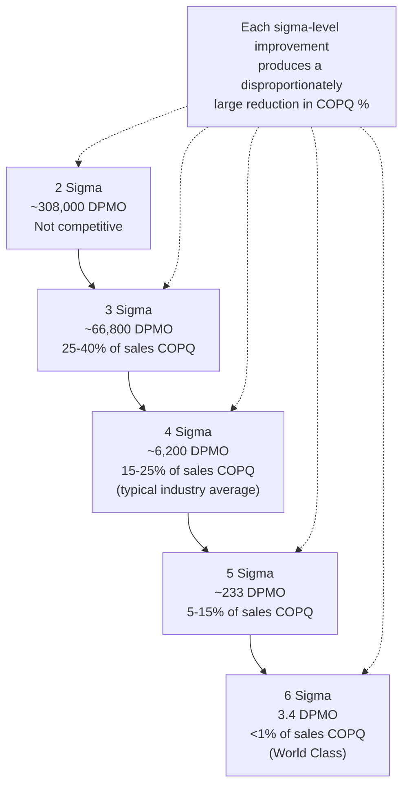

## Sigma Level and Cost of Poor Quality Correlation

### Overview

The relationship between an organization's "sigma level" — a statistical measure of process capability, expressed in Defects Per Million Opportunities (DPMO) — and its Cost of Poor Quality (COPQ) as a percentage of sales revenue is one of the most widely cited quantitative arguments in the Six Sigma literature for prioritizing quality investment. This correlation table converts the abstract, statistical concept of "sigma level" into a directly financially meaningful figure, functioning as a concrete, numerically anchored instance of the business-case and cost-benefit-analysis arguments developed across earlier chapters of this course.

### What Sigma Level Measures

**Key Points**

- Sigma level is a statistical measure of how far a process's natural variation sits from its specification limits, expressed via the standard normal distribution — a higher sigma level indicates a process capable of consistently producing fewer defects.
- Sigma level is most commonly expressed via its corresponding **Defects Per Million Opportunities (DPMO)** figure — the number of defects expected per one million opportunities for a defect to occur, which translates the abstract statistical measure into an intuitive, countable quantity.
- This directly extends the process capability concept ($C_p$/$C_{pk}$) introduced in the earlier Statistical Process Control section — sigma level is, in effect, a standardized way of communicating process capability using a common, industry-comparable scale, rather than each organization reporting capability using its own arbitrary units.
- The commonly cited Six Sigma DPMO figures incorporate a conventional **1.5-sigma long-term process shift** — an adjustment accounting for the reality that a process's mean tends to drift over long periods even when short-term variation remains stable, which is why "six sigma" corresponds to 3.4 DPMO rather than the much smaller figure a naive ±6-standard-deviation calculation would suggest without that shift adjustment.

### The Sigma Level / COPQ Correlation Table

The following table represents the figures most consistently cited across the Six Sigma practitioner literature:

| Sigma Level | DPMO | Cost of Poor Quality (% of Sales) |
| --- | --- | --- |
| 2 | ~308,000 | Not competitive / not applicable (commonly cited as >40% or "noncompetitive") |
| 3 | ~66,800 | 25–40% |
| 4 | ~6,200 | 15–25% |
| 5 | ~233 | 5–15% |
| 6 | 3.4 | Less than 1% |

**Key Points**

- Multiple independent sources in the Six Sigma literature converge on this same general table structure and roughly the same percentage ranges, though the precise boundary figures (e.g., whether 3-sigma is "25–40%" or "20–30%") vary somewhat by source — the table should be read as an illustrative, order-of-magnitude industry heuristic rather than a precise, universally standardized figure. [Inference — the exact percentage ranges shown vary meaningfully across the sources that cite this table; the qualitative pattern of steep decline is consistent, but treating any single source's exact percentage boundaries as authoritative would overstate the precision of what is fundamentally an illustrative teaching aid]
- A commonly cited industry benchmark places the **average manufacturing company's process capability at roughly 3 to 4 sigma**, which — per the table — corresponds to a substantial 15–40% of sales revenue being consumed by the cost of poor quality, a figure frequently invoked to argue that even modest sigma-level improvement (e.g., one full sigma level) can produce very large financial impact.
- The **6-sigma benchmark of <1% of sales** is explicitly framed in this literature as "world class" performance — a level few organizations achieve in practice, and one requiring sustained, structural investment of the kind covered throughout the DMAIC methodology (previous section) rather than incremental appraisal effort alone.

### Why the Relationship Is Steeply Nonlinear

**Key Points**

- The relationship between sigma level and DPMO is inherently nonlinear because sigma level is a measure of standard deviations from a specification limit under a normal (or near-normal) distribution — moving from 2 to 3 sigma reduces DPMO by roughly a factor of 4–5, while moving from 5 to 6 sigma reduces DPMO by nearly a factor of 70, reflecting the compounding nature of the tails of a normal distribution.
- Because failure cost scales with defect volume (directly per the PAF and Process Cost Model frameworks covered earlier in this course), and DPMO declines nonlinearly and steeply with each additional sigma level, COPQ as a percentage of sales declines correspondingly steeply — this is the underlying statistical mechanism producing the dramatic table above, not an arbitrary or purely empirical business observation.
- This nonlinearity has a direct strategic implication echoing the marginal cost-benefit-analysis and diminishing-returns discussion from earlier in this course: the *financial* return to moving from 3 to 4 sigma is typically much larger than intuition based on the modest-sounding DPMO change would suggest, precisely because that DPMO reduction sits on a steep part of the underlying distribution's tail.

### Documented Real-World Case: DuPont

A widely cited real-world application of this framework comes from DuPont's Six Sigma implementation: prior to adopting Six Sigma, the company's total cost of poor quality was estimated at roughly 20–30% of revenue, corresponding to a process capability of approximately 3 sigma. Following a pilot Six Sigma project on specialty chemicals, initial results showed measurable revenue-percentage savings corresponding to a shift toward 4 sigma capability, with subsequent results attributed to reaching approximately 5 sigma capability and a further reduction in COPQ as a percentage of revenue.

**Key Points on this case:**

- This example demonstrates the sigma-level/COPQ table functioning as a **before-and-after tracking metric** for an actual improvement program, directly analogous to the "Control phase" success-metric tracking described in the previous DMAIC section — the sigma level shift and the corresponding COPQ percentage reduction serve as the project's headline financial result.
- The scale of financial impact reported in this and similar documented Six Sigma case studies (including General Electric's widely publicized results in the 1990s) is a primary reason the sigma-level/COPQ correlation table remains one of the most frequently cited pieces of quantitative evidence in Six Sigma training materials and business cases.

### Connecting This Table to the Broader Cost-of-Quality Framework

| Course Concept | Relationship to Sigma Level / COPQ Table |
| --- | --- |
| PAF Model / Process Cost Model | The table's COPQ figures are, in effect, a standardized way of expressing the Internal + External Failure cost categories from those models as a percentage of revenue, benchmarked against industry-comparable sigma levels |
| The 1-10-100 Rule | A lower sigma level implies more defects escaping to later, more expensive detection stages — the steep COPQ decline at higher sigma levels reflects fewer defects reaching the "10" and "100" cost tiers in the first place |
| Traditional Optimal Quality Cost Curve | The table provides empirical, industry-level data points that can be read as one practical attempt to locate where organizations typically sit on that theoretical U-shaped curve — though, notably, the table's implication (COPQ keeps falling all the way to 6 sigma) leans toward supporting Crosby's zero-defects argument over the traditional curve's nonzero-optimum assumption |
| Return on Quality | The table provides a ready-made, industry-benchmarked estimate of $S_{\text{period}}$ (expected savings) for a break-even or CBA calculation when an organization knows its current approximate sigma level and revenue |
| Cost-Benefit Analysis of Prevention Spending | This table is frequently used directly as the $C$ (cost-if-it-occurs) input at an aggregate, organization-wide level, when a more granular, defect-class-specific cost figure is not yet available |

### Practical Application and Important Caveats

- **Use the table for order-of-magnitude business-case framing, not for precise financial modeling.** Given the meaningful variation in exact percentage boundaries across different published sources of this table, it is best used to establish the general scale of potential opportunity (e.g., "even our current 3–4 sigma capability suggests COPQ in the range of 15–40% of revenue, which is a wide enough range to strongly justify investigation") rather than as a precise figure to be plugged directly into the CBA formulas from the earlier chapter without further, organization-specific validation.
- **Verify with organization-specific PAF/Process Cost Model data where possible.** The generic industry table is most useful as a starting hypothesis or sanity check; an organization's own measured COPQ (via the frameworks covered earlier in this course) will always be more reliable than an industry-average benchmark, and discrepancies between the two are themselves informative (e.g., if actual measured COPQ is far below the industry-typical figure for the organization's apparent sigma level, this may indicate underreporting of intangible/opportunity costs, per the earlier intangible-cost section).
- **Apply the DPMO concept at the appropriate granularity.** Sigma level and DPMO are most meaningfully calculated per specific process or defect opportunity type — applying a single, blended sigma-level figure across an entire, heterogeneous organization can obscure which specific processes are driving the aggregate COPQ, reinforcing the value of the Pareto Analysis technique (earlier in this chapter) for identifying where sigma-level improvement effort should actually be targeted.
- **Remember the 1.5-sigma shift convention when comparing figures across sources.** Because conventional Six Sigma DPMO tables incorporate a long-term process-shift adjustment, comparing a DPMO or sigma-level figure calculated without this convention against the standard table can produce a misleading, non-comparable result.

### Related Topics

- Calculating DPMO and Sigma Level for a Specific Process
- The 1.5-Sigma Shift Convention: Origins and Statistical Justification
- Process Capability Indices ($C_p$, $C_{pk}$) and Their Relationship to Sigma Level
- Benchmarking COPQ Against Industry-Typical Sigma Levels
- DuPont, General Electric, and Motorola: Documented Six Sigma Financial Case Studies
- Applying Sigma-Level Benchmarks Within the DMAIC Measure Phase