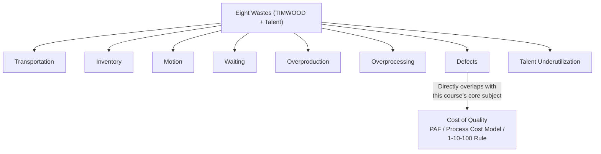
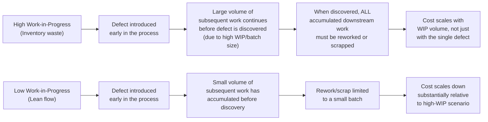

## Lean Manufacturing and Waste Elimination

### Overview

Lean Manufacturing is a management philosophy and set of techniques, originating primarily from the Toyota Production System (TPS), centered on the systematic identification and elimination of **waste** — any activity that consumes resources without creating value for the customer. Where Six Sigma and DMAIC (previous section) focus primarily on reducing *variation* and *defects*, Lean focuses primarily on reducing *waste* and *flow inefficiency* — a related but distinct lens on cost of quality, and the two are frequently combined in practice as "Lean Six Sigma." This section covers Lean's core waste taxonomy and its direct relationship to the cost-of-quality frameworks developed throughout this course.

### The Core Lean Concept: Value vs. Waste

**Key Points**

- Lean defines **value** strictly from the customer's perspective — an activity is value-adding only if the customer would be willing to pay for it, directly if asked. Any activity that does not meet this test is, by Lean's definition, **waste** (in Japanese, "muda") — regardless of how necessary that activity might currently seem within existing organizational processes.
- This framing connects directly back to the Conformance versus Fitness for Use distinction from the first chapter of this course: Lean's customer-value lens is fundamentally a Fitness-for-Use concept — an activity can conform perfectly to an internal specification while still being pure waste from the customer's actual-value perspective, if that specification itself encodes non-value-adding work.
- Lean additionally distinguishes **necessary non-value-adding work** (activities the customer would not pay for directly, but which are currently required given existing constraints — e.g., regulatory compliance documentation, certain quality inspections) from **pure waste** (activities with no value and no necessity at all) — the practical improvement priority is eliminating pure waste first, then working to reduce or redesign necessary non-value-adding work over time.

### The Eight Wastes (Traditional Seven Plus a Modern Addition)

The original Toyota Production System, developed primarily by Taiichi Ohno, identified seven categories of waste (traditionally remembered via the acronym **TIMWOOD**), with an eighth — underutilized talent — commonly added in modern Lean practice:

| Waste Category | Definition | Manufacturing Example | Software/Knowledge-Work Example |
| --- | --- | --- | --- |
| **T**ransportation | Unnecessary movement of materials or products | Moving parts between distant work stations | Handoffs between teams/systems that require re-explaining context |
| **I**nventory | Excess materials or work-in-progress sitting idle | Unused raw material stockpiles | A large backlog of unreviewed pull requests or unmerged branches |
| **M**otion | Unnecessary movement of people | Workers walking long distances to retrieve tools | Excessive context-switching between unrelated tasks |
| **W**aiting | Idle time while work is blocked | A machine idle awaiting the next part | A developer blocked waiting on a code review or a deployment approval |
| **O**verproduction | Producing more than currently needed | Manufacturing units beyond current demand | Building speculative features with no confirmed user need |
| **O**verprocessing | Doing more work than the customer requires | Excessive polishing beyond spec requirements | Gold-plating a feature with unrequested complexity |
| **D**efects | Errors requiring correction, rework, or scrap | A part failing dimensional tolerance | A production bug requiring a hotfix — directly the subject of this course's 1-10-100 Rule |
| **Talent** (the modern eighth waste) | Underutilizing people's skills, knowledge, and ideas | Skilled workers assigned only to repetitive tasks with no input into process improvement | Senior engineers spending disproportionate time on low-value, easily-automatable tasks |

### The Defects Category: Lean's Direct Overlap With Cost of Quality

**Key Points**

- The "Defects" waste category is the most direct point of overlap between Lean and the cost-of-quality frameworks covered throughout this course — a defect, in Lean terms, is waste precisely because it requires additional, non-value-adding work (inspection, rework, scrap, replacement) that the customer never wanted and would not have paid for if given the choice.
- This reframes the entire Cost of Quality discipline covered in this course as, from a Lean perspective, a specialized deep-dive into just one of Lean's eight waste categories — Lean's broader contribution is recognizing that defects rarely occur in isolation from the other seven waste categories, and that addressing only the Defects category while ignoring Waiting, Overproduction, or Motion waste in the surrounding process leaves substantial additional cost-reduction opportunity unaddressed.
- Critically, Lean's waste taxonomy also reveals **indirect drivers of defect cost** that a pure Cost-of-Quality analysis might miss: excess Inventory (work-in-progress) increases the *cost* of a defect when discovered, because more units or work have accumulated behind the defective one before it's caught — directly amplifying the 1-10-100 Rule's escalation mechanism. Similarly, Waiting (e.g., a long queue before code review) increases the *time* a defect sits undetected, again pushing it toward a later, more expensive detection stage.

### The Relationship Between Inventory/WIP and the 1-10-100 Rule

This is one of Lean's most consequential contributions to cost-of-quality thinking, worth developing explicitly:

**Key Points**

- This mechanism is why Lean places such heavy emphasis on **small batch sizes** and **limiting work-in-progress (WIP)** — not purely as a throughput-efficiency concern, but specifically because large batches and high WIP dramatically amplify the cost of any defect discovered within them, by increasing how much downstream work has accumulated on top of the flawed unit before detection.
- This directly parallels the **canary release / blast-radius reduction** strategy discussed in the earlier "Modern Zero Defects Cost Curve Debate" section — both are, at their core, the same underlying principle: reducing the *volume* exposed to an undetected defect before it's caught reduces the defect's total cost, independent of whether the defect's root cause has been eliminated.
- In software delivery specifically, this is the direct justification for practices like small, frequent commits and short-lived feature branches over large, infrequent merges — a defect introduced in a small, quickly-integrated change is both easier to isolate (fewer confounding changes to sift through) and cheaper to fix (less accumulated downstream work built on top of it) than the same defect buried in a large, long-lived branch.

### Lean Tools for Waste Identification

**Value Stream Mapping (VSM):** a technique for visually mapping every step in a process from raw input to customer delivery, explicitly classifying each step as value-adding, necessary non-value-adding, or pure waste — directly analogous in spirit to the Process Cost Model's requirement (covered in the earlier chapter on alternative CoQ models) for explicit process modeling before costs can be meaningfully categorized, but applied through a waste lens rather than a conformance/nonconformance lens.

**5S (Sort, Set in Order, Shine, Standardize, Sustain):** a workplace-organization methodology aimed at reducing Motion and Waiting waste by ensuring tools, materials, and information are readily accessible and consistently located — in a software context, this maps loosely onto practices like standardized project structure, consistent tooling configuration, and well-organized documentation, reducing the "motion" cost of developers searching for information or context.

**Kanban:** a visual workflow-management system limiting WIP at each stage of a process, directly implementing the WIP-limitation principle discussed above — widely adopted in software development as a project-management technique, and directly relevant to reducing the defect-cost-amplification mechanism described earlier.

### Lean Six Sigma: Combining the Two Frameworks

**Key Points**

- Because Lean's waste-reduction focus and Six Sigma's variation/defect-reduction focus address genuinely complementary aspects of process cost, the two are frequently integrated into a single methodology — **Lean Six Sigma** — applying Lean's waste-elimination tools alongside the DMAIC structure (previous section) rather than treating them as separate, competing programs.
- In a combined Lean Six Sigma DMAIC project, the **Define** phase might use Value Stream Mapping to identify where in a process the greatest combination of waste and defect cost accumulates; the **Measure** and **Analyze** phases draw on both Lean waste categories and the diagnostic tools from earlier in this chapter (Fishbone, Pareto Analysis); and the **Improve** phase might combine a Six-Sigma-style defect-prevention mechanism (e.g., the structural prevention techniques discussed in the earlier Zero-Defects Curve Debate) with a Lean flow-improvement change (e.g., reducing batch size or WIP limits) simultaneously.
- This integration reflects the broader insight, developed at the end of the earlier "Modern Zero Defects Cost Curve Debate" section, that reducing the *cost of failure* (via blast-radius/batch-size reduction, a Lean-native concept) is often as high-leverage a strategy as reducing the *probability* of failure (Six Sigma's traditional focus) — Lean Six Sigma is the formal methodology that treats both levers as part of a single, coordinated improvement program.

### Practical Application to a Software Development Context

Applying Lean's eight-waste framework to the batac-dms-style development workflow used in worked examples throughout this course:

| Waste Category | Software Development Manifestation | Mitigation Approach |
| --- | --- | --- |
| Waiting | PRs sitting unreviewed; CI pipeline queue delays | Faster review SLAs; parallel CI execution |
| Inventory (WIP) | Large, long-lived feature branches; big backlogs of unmerged work | Smaller, more frequent commits and merges; WIP limits on in-progress tickets |
| Overproduction | Building speculative features without validated user need | Validate demand before building (directly analogous to the Return on Quality section's causal-chain validation discipline) |
| Overprocessing | Excessive abstraction or configurability beyond actual requirements | Build to the actual specified requirement first; extend only when a genuine need arises |
| Defects | Production bugs, hotfixes, rollback cycles | The full suite of Cost-of-Quality tools covered throughout this course |
| Motion/Transportation | Excessive context-switching; scattered documentation requiring search | Consolidated documentation; reduced task-switching via focused work blocks |
| Talent | Senior engineers spending time on rote, automatable tasks instead of design/architecture work | Automate repetitive tasks (directly connecting to the two-agent workflow pattern of delegating executable, well-specified work) |

### Related Topics

- Value Stream Mapping: Detailed Methodology and Symbols
- Kanban and WIP Limits in Software Development Workflows
- The Toyota Production System: Jidoka, Just-in-Time, and Their Relationship to Quality
- Batch Size Reduction and Its Effect on Defect Cost (Extending the 1-10-100 Rule)
- Lean Six Sigma DMAIC: Integrating Waste and Defect Reduction
- 5S Methodology Adapted for Knowledge-Work and Software Environments