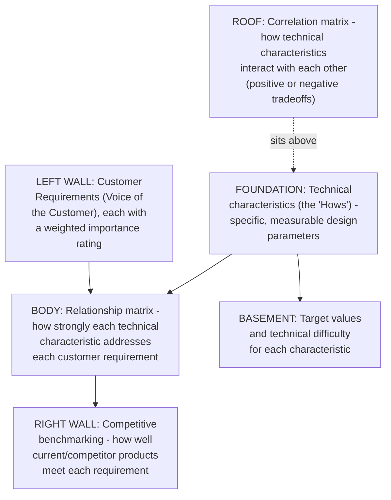
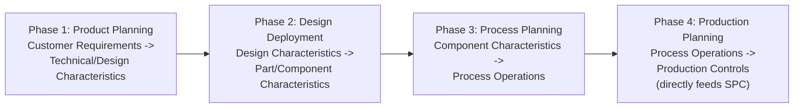

## Quality Function Deployment

### Overview

Quality Function Deployment (QFD) is a structured methodology for translating customer requirements into specific technical design characteristics, ensuring that what an organization builds is actually driven by what customers need and value, rather than by internal assumptions about what customers need. Developed in Japan in the late 1960s by Yoji Akao and Shigeru Mizuno, QFD is best understood in this course's framework as the most fully developed practical technique for operationalizing the **Fitness for Use** side of the Conformance versus Fitness for Use distinction established in the very first chapter — where conformance testing verifies a product matches its specification, QFD is the methodology for ensuring the specification itself is correctly derived from genuine customer requirements in the first place.

### Core Concept: The "Voice of the Customer"

**Key Points**

- QFD's foundational principle is capturing the **Voice of the Customer (VOC)** — customer requirements expressed in the customer's own language and priorities — and systematically translating that voice through successive stages into concrete engineering specifications, process controls, and production requirements, preserving traceability back to the original customer need at every stage.
- This directly addresses the core failure mode identified in the very first chapter's discussion of Conformance versus Fitness for Use: a system can conform perfectly to its written specification while still failing fitness for use, if the specification itself never accurately captured what customers actually needed. QFD exists specifically to close that gap at the earliest possible point in the development lifecycle — the "$1 tier" of the 1-10-100 Rule, before any design or implementation work has even begun.
- QFD distinguishes between requirements customers can articulate directly (**stated requirements**) and requirements customers assume will be met without explicitly mentioning them (**implied** or **latent requirements**) — a defect in the latter category is often the most costly to discover late, precisely because no explicit specification ever captured it, making it invisible to conformance-based testing entirely.

### The House of Quality

The primary tool of QFD is the **House of Quality**, a structured matrix (named for its house-like shape when fully diagrammed) that maps customer requirements against technical characteristics, revealing relationships, priorities, and potential design tradeoffs in a single integrated view.

**Key Points**

- The matrix structure forces explicit, documented answers to two critical questions simultaneously: "what do customers actually want" (the rows) and "how will we technically deliver it" (the columns) — with the relationship matrix in the body making explicit which technical characteristics actually address which customer requirements, and to what degree.
- The "roof" correlation matrix is particularly valuable for surfacing **design tradeoffs early** — where improving one technical characteristic would degrade another (e.g., increasing a document management system's search flexibility might increase query latency) — allowing these tensions to be resolved deliberately during design rather than discovered as an unplanned consequence during implementation or, worse, in production.
- Competitive benchmarking (the right wall) connects QFD directly to market positioning — revealing not just whether a requirement is being met, but whether it is being met *better or worse than alternatives* the customer could choose instead, a dimension neither PAF/Process-Cost-Model costing nor pure conformance testing addresses at all.

### The Four Phases of QFD

Classical QFD extends the House of Quality concept through four cascading phases, each translating the previous phase's outputs into the next level of specificity — from customer requirements all the way down to production process controls:

**Key Points**

- Each phase's outputs become the next phase's inputs, using the same House of Quality matrix structure at each stage — this cascading traceability is QFD's central methodological contribution: a specific production-floor control parameter in Phase 4 can be traced, through three intermediate translation steps, back to a specific customer requirement stated in Phase 1's original Voice of the Customer data.
- Phase 4's output — production process controls — connects directly to the Statistical Process Control methodology covered earlier in this chapter: QFD determines *which* process parameters are worth monitoring via SPC in the first place, because those parameters have been explicitly traced back to genuine customer requirements, rather than being monitored simply because they happen to be easy to measure.
- In practice, many modern QFD applications — particularly in software and fast-moving industries — use only the first phase (or a simplified single House of Quality) rather than the full four-phase cascade, given the substantial time and documentation investment the complete classical methodology requires. [Inference — this is a widely observed practitioner adaptation reflecting time and resource constraints, rather than a formally endorsed simplification within the original QFD literature]

### Applying QFD to a Software Development Context

Extending this course's recurring document-management-platform example, a simplified House of Quality for a document approval workflow feature might look like:

| Customer Requirement (VOC) | Importance | Technical Characteristic: Notification Latency | Technical Characteristic: Approval Dashboard | Technical Characteristic: Multi-Signatory Support |
| --- | --- | --- | --- | --- |
| "I need to know immediately when something needs my approval" | High | Strong relationship | Moderate relationship | Weak relationship |
| "I have too many pending items to check email for each one" | High | Weak relationship | Strong relationship | Weak relationship |
| "Some documents need two department heads to sign off" | Medium | Weak relationship | Weak relationship | Strong relationship |
| "I need to reassign approvals when I'm on leave" | Medium | Weak relationship | Moderate relationship | Moderate relationship |

**Key Points on this application:**

- This table directly demonstrates the exact fitness-for-use gap identified in the very first chapter's worked example (the document-approval feature that conformed to spec but failed real municipal clerks' needs): the row "I have too many pending items to check email for each one" would, if captured through a genuine QFD exercise *before* implementation, have revealed that a dashboard-based approach was needed rather than the individual-email-notification approach the original specification assumed — precisely the fitness-for-use failure that, in the earlier worked example, was only discovered reactively during pilot deployment.
- Had this QFD analysis been conducted during the Define/requirements phase, this fitness-for-use gap would have been caught at the "$1 tier" of the 1-10-100 Rule, rather than the far more expensive post-pilot-deployment discovery described in the earlier chapter — this is precisely QFD's value proposition made concrete.
- The relationship matrix also reveals that "Notification Latency" alone (the original, narrow specification from the earlier example) has only a strong relationship to *one* of the four customer requirements — a clear, structured signal that a specification centered solely on notification latency was incomplete relative to the actual Voice of the Customer, well before any code was written.

### QFD's Relationship to Other Frameworks in This Course

| Framework | Relationship to QFD |
| --- | --- |
| Conformance vs. Fitness for Use (Chapter 1) | QFD is the primary structured methodology for operationalizing the Fitness-for-Use side of this distinction — ensuring the specification itself, which conformance testing later verifies against, is correctly derived |
| The 1-10-100 Rule | QFD is explicitly a "$1 tier" activity — the earliest possible point at which a fitness-for-use gap can be caught, before design or implementation investment has occurred |
| FMEA | Both are proactive, pre-implementation techniques; FMEA anticipates *failure modes* within a given design, while QFD ensures the design itself targets the *right requirements* in the first place — complementary, sequential applications (QFD to define what to build, FMEA to anticipate how the resulting design could fail) |
| Statistical Process Control | QFD's Phase 4 output (production process controls) directly determines which parameters SPC should monitor, giving SPC's monitoring effort explicit traceability back to genuine customer requirements |
| Return on Quality | Both center the customer's actual perception and requirements as the mechanism connecting quality investment to financial outcome — ROQ validates this connection financially and retrospectively for a proposed investment; QFD structures it methodologically and prospectively during design |

### Practical Guidance for Conducting a QFD Exercise

- **Invest genuine effort in capturing authentic Voice of the Customer data**, rather than substituting internal assumptions about what customers want — direct customer interviews, surveys, or (per the guidance from the earlier Root Cause Analysis section) including participants closest to actual usage are essential; a QFD exercise built on an engineering team's own assumptions about customer needs defeats its core purpose and risks simply formalizing the same specification gap it's meant to prevent.
- **Weight requirements by genuine importance, not by ease of technical implementation.** A common failure mode is implicitly prioritizing customer requirements that are technically convenient to address over those the customer actually weighted as most important — the House of Quality's explicit importance-weighting column exists specifically to make this prioritization visible and deliberate rather than an unexamined default.
- **Use the roof's correlation matrix to surface tradeoffs before committing to a design direction**, consistent with the marginal cost-benefit-analysis discipline from earlier chapters — a technical characteristic that strongly satisfies one high-importance requirement while degrading another may still be the right choice, but that tradeoff should be made consciously and documented, not discovered as a surprise after implementation.
- **Scale the methodology's rigor to the decision's stakes.** A full four-phase QFD cascade with complete House of Quality matrices at each stage represents substantial documentation investment — reserving the complete methodology for genuinely significant, high-uncertainty, or high-consequence design decisions, while using a lighter single-House-of-Quality exercise for smaller features, keeps the technique's overhead proportionate to the value it protects (directly echoing the marginal cost-benefit reasoning applied throughout this course to other prevention investments).

### Related Topics

- The House of Quality Matrix: Detailed Construction Methodology
- Kano Model: Categorizing Customer Requirements as Basic, Performance, and Delight
- Voice of the Customer (VOC) Data Collection Techniques
- Connecting QFD Phase 4 Outputs to Statistical Process Control Parameters
- Simplified/Lightweight QFD Adaptations for Agile Software Development
- Conformance versus Fitness for Use, Revisited Through QFD's Traceability Structure