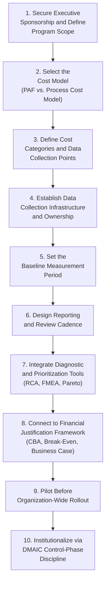
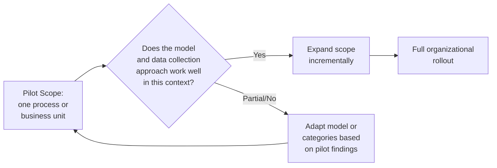

## Steps to Design a Quality Cost System

### Overview

Designing a Cost of Quality (CoQ) system is the practical, organizational culmination of every framework covered in this course — it is the process of selecting, adapting, and institutionalizing a specific measurement and improvement infrastructure from among the many models and tools already developed (PAF, Process Cost Model, the diagnostic and prevention tools, and the financial-justification frameworks) into a working, sustained program. This section provides a structured, sequential guide to that design process, synthesizing the course's prior content into an actionable implementation path.

### Why a Deliberate Design Process Matters

**Key Points**

- Several documented case studies referenced earlier in this course — the nuclear/defence engineering Process Cost Model implementation and the plastic-injection-moulding comparative study — converge on the same caution: quality costing does not provide for improvement per se. A poorly designed CoQ system risks becoming exactly this: an elaborate measurement exercise generating reports nobody acts on.
- A deliberately designed system, by contrast, is built from the outset with a clear line from measurement (Chapters 1–3 of this course) through diagnosis (the tools chapter) to financial justification (the strategic-analysis chapter) and into sustained action (DMAIC's Control phase) — avoiding the disconnected, measurement-only failure mode the literature repeatedly warns against.
- This section assumes the reader has already encountered the individual components; its purpose is to sequence them into a coherent implementation roadmap.

### The Design Sequence

### Step 1: Secure Executive Sponsorship and Define Program Scope

**Key Points**

- Because a CoQ system's core value proposition is fundamentally financial — reframing quality as an investment decision rather than a technical/QA-department concern, precisely the argument underlying Juran's "Gold in the Mine" metaphor and the Return on Quality methodology from the earlier strategic-analysis chapter — genuine executive sponsorship is a prerequisite, not an afterthought, since the system's outputs are meant to drive resource-allocation decisions that require leadership buy-in to act upon.
- Scope should be explicitly bounded at the outset: which processes, products, or business units the system will initially cover. Attempting comprehensive, organization-wide coverage from day one risks the same "comparing process model results between different processes is not straightforward" finding documented in the earlier nuclear/defence case study — a narrower, well-defined initial scope produces more reliable, actionable results than an overly broad, diffuse rollout.
- Document explicit success criteria for the program itself at this stage (e.g., "reduce COPQ as a percentage of relevant costs by X% within Y months," informed by the sigma-level/COPQ benchmarks from the earlier chapter) — this gives the program itself a business case, mirroring the structure recommended for individual quality investments in the earlier Business Case chapter.

### Step 2: Select the Cost Model

Drawing directly on the earlier comparative analysis of the PAF Model versus the Process Cost Model:

| If the primary domain is... | Consider... |
| --- | --- |
| Repetitive manufacturing with existing discrete inspection points | PAF Model (BS 6143-2) — lower implementation overhead, familiar categories |
| Services, administration, or cross-functional processes (e.g., a municipal document workflow) | Process Cost Model (BS 6143-1) — requires explicit process modeling but adapts better to non-manufacturing contexts |
| A mixed environment with both manufacturing and service/administrative components | Consider running both models in parallel for their respective domains, as the manufacturing/administration pilot study referenced earlier demonstrated is a viable evaluation approach |

**Key Points**

- This selection should not be treated as permanent or irreversible — the plastic-injection-moulding comparative study referenced earlier found that direct side-by-side evaluation within the same organization can produce a clear preference, and revisiting the model choice after an initial pilot period (Step 9) is reasonable practice.
- Whichever model is selected, plan from the outset to extend it with the intangible/opportunity-cost considerations covered earlier in this course (CLV loss, opportunity cost of diverted capacity) — but as a clearly labeled supplementary estimate, not blended into the core auditable figures, per the guidance established in that earlier chapter.

### Step 3: Define Cost Categories and Data Collection Points

**Key Points**

- Translate the selected model's abstract categories (Prevention/Appraisal/Internal Failure/External Failure for PAF, or Conformance/Nonconformance for the Process Cost Model) into the organization's *specific*, concrete cost line items — this is where the model becomes operational rather than theoretical.
- For each category, identify where the underlying data already exists (time-tracking systems, incident/bug trackers, support-ticket systems, financial/accounting records) versus where new data collection must be established — reusing existing data sources wherever possible substantially reduces the implementation burden and improves long-term data reliability.
- Explicitly define what does *not* count in each category, not just what does — ambiguous category boundaries (flagged earlier in this course as a specific weakness of Crosby's CoC/CoNC appraisal-placement ambiguity) undermine comparability over time if left implicit rather than documented.

### Step 4: Establish Data Collection Infrastructure and Ownership

**Key Points**

- Assign clear ownership for each data source — consistent with the Process Cost Model's emphasis on process ownership (covered in the earlier chapter), every cost category should have a named owner responsible for the accuracy and timeliness of the underlying data, not merely a generic "finance" or "quality department" catch-all.
- Where feasible, automate data collection rather than relying on manual reporting — this directly parallels the Statistical Process Control principle of building measurement into the process itself rather than relying on periodic manual inspection, and reduces both the ongoing labor cost of the CoQ system and the risk of inconsistent or incomplete manual data entry.
- Establish a Measurement System Analysis discipline (referenced in the earlier DMAIC Measure-phase discussion) even for a CoQ system's own data collection — verifying that the categorization and recording methodology itself is applied consistently is as important for CoQ data as for any other process measurement.

### Step 5: Set the Baseline Measurement Period

**Key Points**

- Establish an initial baseline period long enough to smooth out short-term noise but not so long that it delays the program's ability to demonstrate value — directly echoing the guidance from the earlier Business Case chapter's "establish current-state baseline" step.
- Where historical data already exists (e.g., past incident records, support tickets), consider a retrospective baseline reconstruction to accelerate the program's ability to show a trend, rather than waiting exclusively for new data collection to accumulate from a zero starting point.
- Document known limitations or gaps in the baseline explicitly — an imperfect but transparently-caveated baseline is more useful and more credible than an artificially precise-looking figure that obscures genuine data-quality limitations.

### Step 6: Design Reporting and Review Cadence

**Key Points**

- Establish a regular reporting cadence (commonly monthly or quarterly) presenting CoQ trends to the executive sponsors identified in Step 1 — consistent trend reporting, rather than one-off analyses, is what allows the program to demonstrate the kind of before/after impact documented in case studies like DuPont's sigma-level improvement (covered in the earlier chapter).
- Reports should distinguish tangible, audited figures from intangible/opportunity-cost estimates, per the labeling discipline established throughout the earlier strategic-analysis chapter — blending the two without clear labeling risks undermining the credibility of the entire report if a reviewer identifies the blend.
- Build in an explicit review-and-act step, not merely a reporting step — a report without a corresponding decision-making forum where prioritization and investment decisions actually get made (drawing on the business-case, CBA, and Pareto-Analysis techniques from earlier chapters) risks becoming exactly the "measurement without improvement" failure mode flagged at the start of this section.

### Step 7: Integrate Diagnostic and Prioritization Tools

**Key Points**

- A functioning CoQ system should have a defined, standard workflow for moving from "a cost category shows an unexpected increase" to "a specific, scoped improvement investment is proposed" — this is where the diagnostic tools from the earlier chapter (Fishbone Diagrams, Five Whys, FMEA) and the prioritization technique (Pareto Analysis) become institutionalized components of the system rather than ad hoc, one-off exercises.
- Establish clear triggers for when these tools are deployed — for example, a defined threshold (informed by the sigma-level/COPQ benchmarks or simply a percentage increase over baseline) that automatically initiates a root-cause investigation, rather than leaving this decision to inconsistent, case-by-case judgment.

### Step 8: Connect to Financial Justification Framework

**Key Points**

- Ensure the CoQ system's output data feeds directly and cleanly into the Cost-Benefit-Analysis and Break-Even-Analysis formulas from the earlier strategic-analysis chapter — specifically, the system should be capable of producing the $P$ (defect probability), $C$ (cost-if-occurs), and historical-trend inputs those formulas require, without requiring a separate, disconnected data-gathering exercise each time a new investment case is built.
- Where the organization's context supports it (customer-facing services, measurable satisfaction/retention data), consider extending the system toward a Return on Quality capability, per the earlier chapter — though, as that chapter cautioned, this requires more substantial measurement infrastructure (satisfaction tracking, retention analytics) than the core PAF/Process-Cost-Model data alone provides.

### Step 9: Pilot Before Organization-Wide Rollout

**Key Points**

- Consistent with the pilot-based validation principle emphasized throughout the strategic-analysis chapter (in the Business Case, CBA, and DMAIC Improve-phase sections), the CoQ system itself should be piloted on a limited scope before full rollout — the same logic applied to individual prevention investments applies to the measurement system meant to justify them.
- A pilot serves two purposes simultaneously: validating that the chosen cost model and data-collection approach actually work in this organization's specific context (addressing the "adaptation to the host organization's specific industry" finding that recurred across the case studies in the earlier PAF/PCM comparison), and generating early, credible results that strengthen the case for the broader rollout described in Step 1's executive sponsorship.

### Step 10: Institutionalize via DMAIC Control-Phase Discipline

**Key Points**

- The final design step is ensuring the CoQ system itself does not erode over time — applying the same Control-phase discipline from the earlier DMAIC section to the measurement program itself, not only to the individual improvement projects it generates.
- This includes periodic recalibration of baselines (as processes improve, what counted as "normal" cost shifts, mirroring the SPC principle of recalculating control limits after a confirmed process change), periodic re-validation that data collection remains accurate (a recurring Measurement System Analysis discipline), and periodic reassessment of whether the originally selected cost model and category structure still fit the organization's evolving needs.

### Common Pitfalls Across the Design Process

- **Treating measurement as the end goal rather than the means.** As repeatedly emphasized across this course's coverage of PAF, Process Cost Model, and DMAIC, a CoQ system's value is realized only when its output data drives actual investment and improvement decisions — Steps 7 and 8 above exist specifically to prevent the system from becoming measurement-for-its-own-sake.
- **Underinvesting in Step 4's data infrastructure and ownership.** A CoQ system is only as reliable as its underlying data — a system built on inconsistent, manually-reported, unowned data will produce unreliable trend figures, undermining every downstream use of that data in Steps 7 through 10.
- **Skipping the pilot step to accelerate organization-wide impact.** Given the repeated finding across multiple case studies referenced throughout this course that quality-costing models require adaptation to each organization's specific context, attempting a full-scale rollout without a validating pilot substantially increases the risk of building a system poorly matched to the organization's actual needs.
- **Failing to connect the system to the financial-justification frameworks from the outset.** A CoQ system that only produces descriptive cost reports, without a defined pathway (Step 8) into the CBA/break-even/business-case machinery covered in the earlier strategic-analysis chapter, will struggle to translate its findings into funded action — precisely the gap this entire design sequence is intended to close.

### Related Topics

- Building the Business Case for Quality Investment (Revisited as Program-Level Justification)
- Measurement System Analysis and Data Quality for Quality Cost Systems
- Pilot Program Design Principles (Revisited From the Cost-Benefit-Analysis Chapter)
- Institutionalizing Continuous Improvement via DMAIC Control-Phase Discipline
- Selecting Between PAF and the Process Cost Model for a Specific Organizational Context
- Change Management and Executive Sponsorship for Quality Program Rollouts