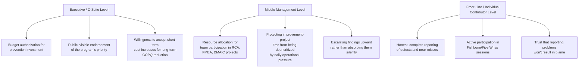

## Securing Leadership and Organizational Commitment

### Overview

Securing leadership and organizational commitment is the change-management discipline underlying Step 1 of the Quality Cost System design sequence covered in the previous section, developed here as a standalone topic because — across nearly every framework and case study referenced throughout this course — it is the single factor most consistently identified as separating a Cost of Quality program that produces genuine, sustained improvement from one that produces reports nobody acts on. This section addresses the human, organizational, and communication dimensions of that commitment, complementing the technical and methodological content covered elsewhere in this course.

### Why Commitment Is the Limiting Factor, Not the Methodology

**Key Points**

- The recurring finding across multiple independent studies referenced in earlier chapters — that quality costing does not provide for improvement per se — is fundamentally an organizational-commitment finding as much as a methodological one: the PAF model, Process Cost Model, and every diagnostic tool covered in this course are technically sound and well-documented, yet their real-world impact depends entirely on whether an organization actually acts on what they reveal.
- Juran's "Gold in the Mine" metaphor (covered earlier in this course) was specifically designed to address this gap — it is not a measurement technique but a persuasion device, existing precisely because Juran recognized that technically correct cost-of-quality data does not, by itself, secure the organizational will to act on it.
- This reframes leadership commitment not as a soft, peripheral concern alongside the "real" technical work of this course, but as the necessary precondition without which every other framework covered — PAF, DMAIC, FMEA, SPC — remains latent, unexercised capability.

### Levels of Organizational Commitment Required

**Key Points**

- Commitment is required at all three levels simultaneously — a program with strong executive sponsorship but no middle-management follow-through will see initiatives announced but never resourced; a program with front-line participation but no executive backing will surface problems that never receive funded solutions; and a program lacking front-line trust will produce incomplete or distorted underlying data, undermining every downstream analysis covered in this course.
- The front-line trust dimension connects directly to the psychological-safety principle implicit in the Root Cause Analysis guidance from earlier in this course — the Five Whys pitfall of "stopping too early at a blame-assigning answer" is far more likely to occur in an organizational culture where front-line staff have learned that honest reporting leads to individual blame rather than systemic investigation.

### The Executive Business Case for Commitment

Securing executive-level commitment specifically requires translating the frameworks covered throughout this course into the language of organizational priority and resource allocation — directly extending the Business Case structure from the earlier strategic-analysis chapter, but applied to the CoQ program itself rather than to a single prevention investment.

**Key Points**

- Lead with the financial scale of the opportunity, using the sigma-level/COPQ benchmarks from the earlier chapter as an accessible entry point — even a rough estimate that current process capability corresponds to 15–40% of relevant costs being consumed by poor quality is typically a more attention-getting opening than a purely technical description of the proposed measurement methodology.
- Anticipate and directly address the most common executive objection: that quality investment competes with, rather than supports, near-term financial performance. This is precisely the objection Crosby's "Quality Is Free" framing (covered earlier in this course) and the Return on Quality methodology's explicit NPV/ROI calculations were developed to counter — leading with these financially-native framings, rather than with the more technical PAF/Process-Cost-Model categorization detail, is generally more persuasive to a financially-oriented audience.
- Where available, cite documented external case studies with credible, quantified outcomes — the DuPont sigma-level improvement case and the Chase Manhattan Bank Return on Quality field experiment, both covered in earlier chapters, provide concrete, externally-validated precedent that a proposed internal program is following an established, credible path rather than an speculative or unproven approach.

### Addressing the "Quality vs. Speed" Tension

**Key Points**

- A common and legitimate organizational concern, particularly in software development contexts operating under delivery pressure, is that quality investment (structural prevention, thorough testing, FMEA exercises, QFD requirements-gathering) appears to trade off directly against delivery speed — this tension deserves direct, honest engagement rather than dismissal.
- The strongest response, grounded in this course's own frameworks, is the 1-10-100 Rule itself: framing prevention investment not as *slower* delivery, but as *avoiding a much larger, unplanned delay later* — a defect caught during requirements-gathering (QFD) or design (FMEA) costs a fraction of the calendar time that the same defect, discovered post-deployment, would cost via an unplanned hotfix cycle, incident response, and potential rollback.
- The Modern Zero-Defects Cost Curve Debate's "structural prevention" insight (covered earlier) is also directly relevant here: prevention mechanisms with near-zero marginal cost once established (type systems, schema validation, automated testing) largely dissolve the quality-versus-speed tradeoff for the specific defect classes they address — communicating this distinction (some prevention investment genuinely does trade off against speed; some, once built, does not) is more credible than an unqualified claim that quality investment never costs any time at all.

### Common Organizational Resistance Patterns and Responses

| Resistance Pattern | Underlying Concern | Response Grounded in This Course's Frameworks |
| --- | --- | --- |
| "We don't have time to measure this on top of our existing work" | Perceived additional burden with unclear payoff | Emphasize Step 4 of the system-design process (automating data collection from existing sources) to minimize new manual burden; cite the break-even analysis framework to show measurement investment typically pays back quickly |
| "Quality is the QA team's job, not mine" | Quality seen as a delegated technical function, not a shared responsibility | Reference Juran's original motivation for the Quality Trilogy and the Gold-in-the-Mine metaphor — both explicitly aimed at moving quality from a delegated technical concern to a shared strategic priority |
| "We tried something like this before and it didn't change anything" | Prior negative experience with a measurement-only, non-actionable program | Directly acknowledge the documented "quality costing does not provide for improvement per se" finding, and explain how Steps 7–8 of the system-design process (connecting to diagnostic tools and financial justification) are specifically designed to avoid repeating that failure mode |
| "This will just be used to assign blame for defects" | Fear that root-cause investigation becomes a disciplinary exercise | Directly address the front-line psychological-safety requirement described above; make explicit, in policy and in practice, that RCA findings are used for systemic improvement, not individual blame |
| "Our defect rate isn't that bad, this isn't worth the investment" | Underestimation of actual COPQ, often due to intangible/opportunity costs being invisible | Reference the Quality Cost Iceberg and CLV-loss frameworks from the earlier chapter, illustrating that visible, ledger-tracked defect cost is typically only a fraction of true total cost |

### Sustaining Commitment Over Time

**Key Points**

- Initial enthusiasm for a new CoQ program commonly exceeds sustained, long-term commitment — the DMAIC Control-phase discipline covered earlier in this course, and Step 10 of the system-design process from the previous section, exist specifically to counter this natural erosion, but institutionalizing that discipline itself requires ongoing leadership reinforcement, not a one-time launch announcement.
- Regularly reporting concrete, attributable results — ideally using the same before/after, sigma-level-style framing as the DuPont case study referenced earlier — is the most effective mechanism for sustaining commitment, since it converts an abstract, ongoing organizational ask into a track record of demonstrated, credible return.
- Where a specific investment produces a negative or underwhelming result (as the bus-transportation Return on Quality case study from the earlier chapter demonstrated is a legitimate and expected outcome, not a program failure), communicating this transparently — framed as the CoQ system correctly filtering out a low-value investment — actually strengthens long-term credibility more than suppressing or downplaying unfavorable findings would.
- Rotate visible ownership and participation across the organization over time, particularly at the middle-management and front-line levels — a program perceived as belonging exclusively to a single champion or department is more vulnerable to losing momentum if that champion moves on, while broader distributed ownership (consistent with Juran's original argument against quality being solely a delegated QA-department concern) builds more durable, self-sustaining commitment.

### Related Topics

- Change Management Principles for Process Improvement Initiatives
- Psychological Safety and Its Role in Honest Defect and Near-Miss Reporting
- Juran's Broader Argument for Quality as a Strategic, Not Delegated, Concern
- Communicating Quality-Investment Business Cases to Financially-Oriented Executives
- Sustaining DMAIC Control-Phase Discipline Beyond Initial Program Launch
- Distributed versus Centralized Ownership Models for Quality Improvement Programs