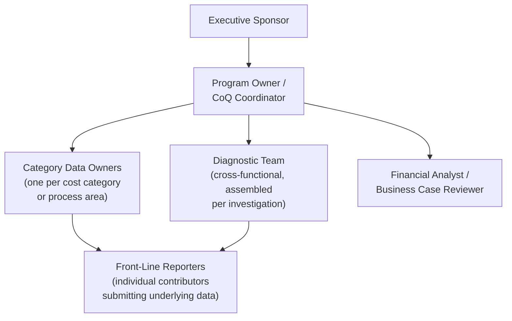
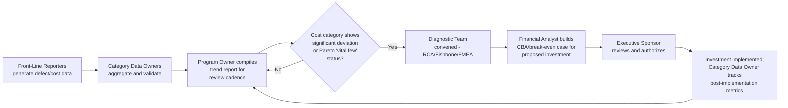

## Assigning Ownership and Cross Functional Roles

### Overview

Assigning ownership and cross-functional roles is the organizational-structure discipline that operationalizes the leadership commitment covered in the previous section into specific, accountable positions within a Cost of Quality program. Where the previous section addressed *why* commitment is needed and how to secure it, this section addresses *who* specifically holds responsibility for which parts of the system — translating the Process Cost Model's emphasis on process ownership (covered earlier in this course) from a general principle into a concrete organizational design, and addressing the cross-functional nature that distinguishes a well-functioning CoQ program from a siloed, single-department exercise.

### Why Cross-Functional Ownership Is Structurally Necessary

**Key Points**

- A Cost of Quality program touches, by its nature, data and decisions that live across multiple traditional organizational functions: finance (cost accounting), quality/engineering (defect data, root-cause investigation), operations or product (process ownership, prioritization decisions), and executive leadership (resource allocation) — no single existing department typically owns all of these simultaneously.
- This structural reality is precisely why the earlier Fishbone Diagram section emphasized including participants representing each candidate-cause category, and why the earlier Leadership Commitment section identified three distinct organizational levels (executive, middle management, front-line) each requiring genuine buy-in — cross-functional ownership is not an optional enhancement to a CoQ program but a structural requirement flowing directly from the multi-domain nature of the data and decisions involved.
- Programs that default to a single-department ownership model (most commonly, placing the entire program under an existing QA or Quality Assurance department) risk recreating the exact problem Juran's "Gold in the Mine" metaphor and broader career argument (covered earlier in this course) were specifically developed to counter: quality treated as a delegated technical concern rather than a shared strategic priority.

### Core Roles in a Cost of Quality Program

**Executive Sponsor**

- Provides the budget authorization and visible endorsement described in the previous section's leadership-commitment discussion; typically a senior leader (CFO, COO, VP of Engineering, or equivalent) with genuine authority over resource allocation across the functions the program touches.
- Reviews program-level results at the reporting cadence established in Step 6 of the system-design sequence (previous chapter section), and makes or ratifies major prioritization decisions when competing prevention investments require executive-level tradeoffs.

**Program Owner / CoQ Coordinator**

- The single point of accountability for the CoQ system's overall functioning — day-to-day coordination across the category data owners, diagnostic teams, and financial analysis function, ensuring the system operates as a coherent whole rather than as disconnected departmental efforts.
- This role's existence directly addresses the risk, flagged in the previous section, of a program losing momentum if ownership is perceived as belonging to a single existing department — the Program Owner role should be explicitly defined as cross-functional and, ideally, should not report solely through the traditional QA/Quality department reporting line, to reinforce that the program is not "QA's project."
- Responsible for maintaining the system-design artifacts described in the earlier chapter (cost category definitions, data collection infrastructure, baseline documentation) and for periodically executing Step 10's institutionalization discipline (recalibrating baselines, re-validating data quality).

**Category Data Owners**

- Directly implements the Process Cost Model's process-ownership principle (covered in the earlier chapter comparing PAF and PCM) at the level of individual cost categories or process areas — each Prevention/Appraisal/Internal-Failure/External-Failure category (or, under the Process Cost Model, each modeled process) has one named, accountable owner responsible for that category's data accuracy and timeliness.
- In a software-development context (extending the recurring document-management-platform example used throughout this course), category data owners might include: an engineering lead owning "Internal Failure" data (bug counts, hotfix frequency, rework hours from issue-tracker data), a support/customer-success lead owning "External Failure" data (support tickets, incident reports), and an engineering-practices lead owning "Prevention" data (time invested in code review, automated testing infrastructure, QFD/requirements exercises).

**Diagnostic Team**

- Not a fixed, standing team but a cross-functionally assembled group convened per investigation, directly mirroring the Fishbone Diagram and Root Cause Analysis facilitation guidance from earlier in this course — "include participants representing each category" and "convene the people closest to the actual work."
- Membership varies by the specific problem under investigation: a defect traced to the Technology branch of a fishbone diagram might draw primarily from engineering, while one traced to the Process or People branches might require broader participation from operations or front-line staff.

**Financial Analyst / Business Case Reviewer**

- Applies the quantitative frameworks from the earlier strategic-analysis chapter (Cost-Benefit Analysis, Break-Even Analysis, and where applicable, Return on Quality) to proposed prevention investments surfaced by the diagnostic process, ensuring proposals reaching the Executive Sponsor arrive with the rigor (sensitivity analysis, explicit assumption labeling) that chapter recommended.
- This role provides the connective tissue explicitly required by Step 8 of the system-design sequence (connecting the CoQ system's data to the financial-justification framework) — without a role explicitly responsible for this translation, the connection between measurement and funded action (the gap repeatedly flagged throughout this course as the central risk to program value) is unlikely to happen reliably.

**Front-Line Reporters**

- Every individual contributor whose work generates the underlying data feeding the category data owners — their honest, complete participation depends directly on the psychological-safety conditions discussed in the previous section, and their role, while not a formal "position" in the organizational chart, is nonetheless a necessary and explicitly acknowledged part of the overall structure.

### Mapping Roles to This Course's Frameworks

| Role | Primary Frameworks/Tools Applied |
| --- | --- |
| Executive Sponsor | Business Case structure, sigma-level/COPQ benchmarks, program-level ROI |
| Program Owner / CoQ Coordinator | System-design sequence (Steps 1–10, previous chapter section), DMAIC Control-phase discipline |
| Category Data Owners | PAF/Process Cost Model category definitions, data collection infrastructure (Step 4) |
| Diagnostic Team | Fishbone Diagrams, Five Whys, FMEA, Pareto Analysis |
| Financial Analyst | Cost-Benefit Analysis, Break-Even Analysis, Return on Quality |
| Front-Line Reporters | Underlying data generation for every category above |

### Governance Structure: How Roles Interact Over a Program Cycle

**Key Points**

- This governance loop directly operationalizes the full sequence of frameworks covered across this entire course: front-line data feeds category ownership, which feeds program-level reporting, which triggers diagnostic investigation when warranted, which feeds financial justification, which feeds executive decision-making, which feeds implementation and renewed measurement — closing the loop identified in the previous section as the critical gap between measurement and action.
- Each arrow in this diagram represents a specific handoff where role clarity matters — an undefined handoff (for example, no clear process for how a diagnostic team's findings actually reach the financial analyst) is precisely where a program risks stalling into the "measurement without improvement" failure mode this course has repeatedly cautioned against.

### Practical Guidance for Assigning Roles

- **Avoid assigning the Program Owner role as an unfunded addition to an already-full-time position.** Given the coordination burden this role carries across every other role in the structure, treating it as a token responsibility layered onto someone's existing full workload significantly increases the risk of the program losing momentum, echoing the sustained-commitment concerns raised in the previous section.
- **Select category data owners based on proximity to the data, not organizational seniority.** Consistent with the RCA and Fishbone facilitation guidance from earlier in this course, the people closest to the actual work — not necessarily the most senior — typically have the most accurate visibility into a category's true underlying data.
- **Keep the Diagnostic Team genuinely flexible and cross-functional rather than a fixed committee.** A standing, unchanging diagnostic team risks converging on the same limited category perspectives repeatedly (the exact failure mode the Fishbone Diagram guidance warned against — an engineering-only team underpopulating People or Environment branches) — reassembling the team's composition based on each specific problem's likely contributing-factor categories produces more reliable diagnostic breadth.
- **Ensure the Financial Analyst role has genuine access to category data owners and diagnostic team findings**, rather than operating as a downstream function that receives only finished, summarized proposals — direct access allows the financial analyst to apply the sensitivity-analysis and assumption-labeling discipline from the earlier CBA chapter with genuine, first-hand data rather than secondhand summaries that may have lost important nuance in translation.
- **Revisit role assignments during the periodic institutionalization review (Step 10 of the system-design sequence).** As the organization's processes evolve, category boundaries shift, or key individuals change roles, the ownership structure itself requires the same periodic reassessment this course recommends for baselines, data collection methods, and the underlying cost model selection.

### Related Topics

- Securing Leadership and Organizational Commitment (Preceding Section)
- The Process Cost Model's Process-Ownership Principle, Revisited at the Role Level
- Designing Effective Cross-Functional Diagnostic Teams
- RACI Matrices and Other Role-Clarity Frameworks for Quality Programs
- Avoiding Single-Department Ownership Failure Modes in Quality Initiatives
- Institutionalizing Role Review Within DMAIC Control-Phase Discipline